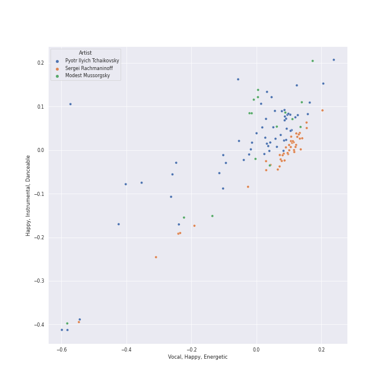
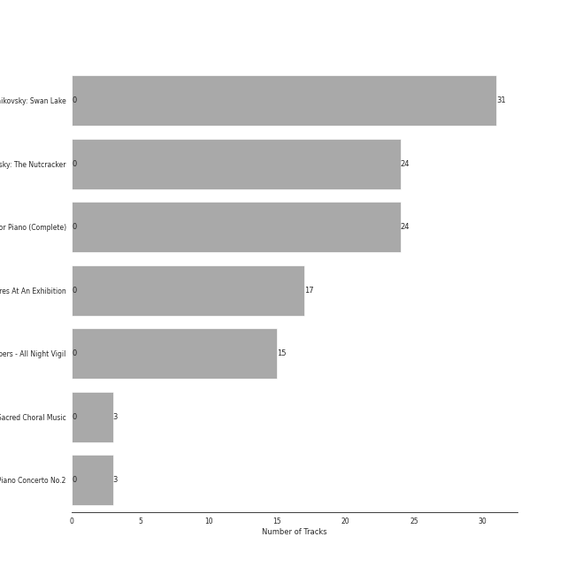

# russian romanticism

[117 songs](russian_romanticism_tracks.md)

## Top Artists

See all 19 artists

|   Number of Tracks | Art                                                                                              | Artist                                                                   | 🔗                                                           |
|-------------------:|:-------------------------------------------------------------------------------------------------|:-------------------------------------------------------------------------|:------------------------------------------------------------|
|                 59 |  | [Pyotr Ilyich Tchaikovsky](../artists/pyotr_ilyich_tchaikovsky.md)       | [🔗](https://open.spotify.com/artist/3MKCzCnpzw3TjUYs2v7vDA) |
|                 42 |  | [Sergei Rachmaninoff](../artists/sergei_rachmaninoff.md)                 | [🔗](https://open.spotify.com/artist/0Kekt6CKSo0m5mivKcoH51) |
|                 34 |  | [London Symphony Orchestra](../artists/london_symphony_orchestra.md)     | [🔗](https://open.spotify.com/artist/5yxyJsFanEAuwSM5kOuZKc) |
|                 31 |  | [André Previn](../artists/andr__previn.md)                               | [🔗](https://open.spotify.com/artist/2tfWguHr2nj4e8KXLKciVq) |
|                 24 |  | [Berliner Philharmoniker](../artists/berliner_philharmoniker.md)         | [🔗](https://open.spotify.com/artist/6uRJnvQ3f8whVnmeoecv5Z) |
|                 24 |  | [Sir Simon Rattle](../artists/sir_simon_rattle.md)                       | [🔗](https://open.spotify.com/artist/4GQwgdcDQwqtcHICjUNndp) |
|                 24 |  | [Eldar Nebolsin](../artists/eldar_nebolsin.md)                           | [🔗](https://open.spotify.com/artist/45ts2AJTWlzJ9JrQlCGxpX) |
|                 17 |  | [Gustavo Dudamel](../artists/gustavo_dudamel.md)                         | [🔗](https://open.spotify.com/artist/0cxXnDhpgxcMMkKddhORHY) |
|                 17 |  | [Wiener Philharmoniker](../artists/wiener_philharmoniker.md)             | [🔗](https://open.spotify.com/artist/003f4bk13c6Q3gAUXv7dGJ) |
|                 16 |  | [Modest Mussorgsky](../artists/modest_mussorgsky.md)                     | [🔗](https://open.spotify.com/artist/284mnx33IWcymQEpMxyfHl) |
|                 15 |  | [Nikolai Korniev](../artists/nikolai_korniev.md)                         | [🔗](https://open.spotify.com/artist/70hS9SnJefkZo2QJwS2VXi) |
|                 15 |  | [St.Petersburg Chamber Choir](../artists/st_petersburg_chamber_choir.md) | [🔗](https://open.spotify.com/artist/46WjEugfIF0rKOewvFiby2) |
|                  3 |  | NDR Chor                                                                 | [🔗](https://open.spotify.com/artist/7hMAA1N5j1Ynb49NIWO7HV) |
|                  3 |  | Michael Francis                                                          | [🔗](https://open.spotify.com/artist/4znpeZQkiPbcXtHlRbfTqF) |
|                  3 |  | Philipp Ahmann                                                           | [🔗](https://open.spotify.com/artist/309coOGhdzqXdIRwJH1xUo) |
|                  3 |  | Valentina Lisitsa                                                        | [🔗](https://open.spotify.com/artist/0gOrXuu1vCBXe3pwTyb5Ca) |
|                  1 |  | Vladimir Mostovoy                                                        | [🔗](https://open.spotify.com/artist/4BTanscTBWJOSpvceZSVSi) |
|                  1 |  | Olga Borodina                                                            | [🔗](https://open.spotify.com/artist/47XbXbNzwqcWStfsjzFlKb) |
|                  1 |  | Libera                                                                   | [🔗](https://open.spotify.com/artist/235C4ktJ2aGIyqaBlXyg7e) |

## Top Albums

See all 7 albums

|   Number of Tracks | Art                                                                                              | Album                                      | Release Date   | 🔗                                                          |
|-------------------:|:-------------------------------------------------------------------------------------------------|:-------------------------------------------|:---------------|:-----------------------------------------------------------|
|                 31 |  | Tchaikovsky: Swan Lake                     | 1976           | [🔗](https://open.spotify.com/album/7dVA06E7AP7P7VzPyNxQVO) |
|                 24 |  | Tchaikovsky: The Nutcracker                | 2010-10-11     | [🔗](https://open.spotify.com/album/54Awn36ryf55PkZyOR4iwQ) |
|                 24 |  | Rachmaninov: Preludes for Piano (Complete) | 2007-05-29     | [🔗](https://open.spotify.com/album/1vlnwUAidj7bEmRhsq4zTv) |
|                 17 |  | Mussorgsky: Pictures At An Exhibition      | 2016-12-02     | [🔗](https://open.spotify.com/album/1b2aoeaYZZBWmJoavOQhnd) |
|                 15 |  | Rachmaninov: Vespers - All Night Vigil     | 1994           | [🔗](https://open.spotify.com/album/7hqotgNjEJt09XiggaMI1v) |
|                  3 |  | Tchaikovsky: Sacred Choral Music           | 2016-07-01     | [🔗](https://open.spotify.com/album/4udN7bCLaa8zCnaIvoxzOB) |
|                  3 |  | Rachmaninov: Piano Concerto No.2           | 2012-01-01     | [🔗](https://open.spotify.com/album/5lVqgXqdoIH3W1wUM2hzPx) |

## Top Record Labels

See all 5 labels

|   Number of Tracks | Label                                                             |
|-------------------:|:------------------------------------------------------------------|
|                 55 | [Warner Classics](../labels/warner_classics.md)                   |
|                 24 | [Naxos](../labels/naxos.md)                                       |
|                 18 | [Decca Music Group Ltd.](../labels/decca_music_group_ltd_.md)     |
|                 17 | [Deutsche Grammophon (DG)](../labels/deutsche_grammophon__dg_.md) |
|                  3 | Carus                                                             |

## Audio Features

| 10 most Danceable tracks                                                                       | 10 least Danceable tracks                                                                                           |
|:-----------------------------------------------------------------------------------------------|:--------------------------------------------------------------------------------------------------------------------|
| Pictures at an Exhibition (Orch. Ravel): V. Ballet of the Unhatched Chicks                     | Vespers, Op. 37: XII. "Slava v vyshnikh Bogu"                                                                       |
| Pictures at an Exhibition (Orch. Ravel): Promenade III                                         | Pictures at an Exhibition (Orch. Ravel): II. The Old Castle                                                         |
| Tchaikovsky: Swan Lake, Op. 20, Act I: No. 8, Dance with Goblets                               | Vespers, Op. 37: V. "Nyne otpushchayeshi"                                                                           |
| Pictures at an Exhibition (Orch. Ravel): VII. The Market at Limoges                            | Tchaikovsky: Swan Lake, Op. 20, Act II: No. 14, Scene. Moderato                                                     |
| Tchaikovsky: Swan Lake, Op. 20, Act IV: No. 26, Scene. Allegro ma non troppo                   | Vespers, Op. 37: IV. "Svete tikhyi"                                                                                 |
| Tchaikovsky: The Nutcracker, Op. 71, Act II: No. 12e, Divertissement. Dance of the Reed-Flutes | Vespers, Op. 37: XIV. "Voskrez iz groba"                                                                            |
| Tchaikovsky: The Nutcracker, Op. 71, Act II: No. 12c, Divertissement. Tea, Chinese Dance       | Vespers, Op. 37: II. "Blagoslovi dushe moya"                                                                        |
| Tchaikovsky: The Nutcracker, Op. 71, Act I, Scene 1: No. 2, March                              | Tchaikovsky: The Nutcracker, Op. 71, Act II: No. 10, The Enchanted Palace of Confiturembourg, the Kingdom of Sweets |
| 13 Preludes, Op. 32: No. 3 in E Major: Allegro vivace                                          | Vespers, Op. 37: VI. "Bogoroditse Devo"                                                                             |
| 13 Preludes, Op. 32: No. 8 in A Minor: Vivo                                                    | Tchaikovsky: The Nutcracker, Op. 71, Act II: No. 12b, Divertissement. Coffee, Arabian Dance                         |

| 10 most Energetic tracks                                                                            | 10 least Energetic tracks                                                                   |
|:----------------------------------------------------------------------------------------------------|:--------------------------------------------------------------------------------------------|
| Tchaikovsky: The Nutcracker, Op. 71, Act II: No. 12d, Divertissement. Trepak, Russian Dance         | Pictures at an Exhibition (Orch. Ravel): VIIIa. Catacombae (Sepulchrum Romanum)             |
| Vespers, Op. 37: XV. "Vzbrannoy voevode"                                                            | Pictures at an Exhibition (Orch. Ravel): Promenade II                                       |
| Tchaikovsky: Swan Lake, Op. 20, Act III: No. 15, Scene. March - Allegro giusto                      | Tchaikovsky: The Nutcracker, Op. 71, Act II: No. 12b, Divertissement. Coffee, Arabian Dance |
| Tchaikovsky: Swan Lake, Op. 20, Act I: No. 8, Dance with Goblets                                    | Tchaikovsky: Swan Lake, Op. 20, Act IV: No. 25, Entr'acte                                   |
| Tchaikovsky: The Nutcracker, Op. 71, Act I, Scene 1: No. 7, The Battle                              | 10 Preludes, Op. 23: No. 10 in G-Flat Major: Largo                                          |
| Tchaikovsky: Swan Lake, Op. 20, Act IV: No. 29, Finale                                              | Pictures at an Exhibition (Orch. Ravel): II. The Old Castle                                 |
| Tchaikovsky: The Nutcracker, Op. 71, Act II: No. 12f, Divertissement. Mother Gigogne and the Clowns | Pictures at an Exhibition (Orch. Ravel): VIIIb. Cum mortuis in lingua mortua                |
| Pictures at an Exhibition (Orch. Ravel): VII. The Market at Limoges                                 | 13 Preludes, Op. 32: No. 5 in G Major: Moderato                                             |
| Tchaikovsky: Swan Lake, Op. 20, Act III: No. 23, Mazurka                                            | Tchaikovsky: Swan Lake, Op. 20, Act I: No. 7, Sujet                                         |
| Tchaikovsky: Swan Lake, Op. 20, Act I: Introduction - No. 1, Scene. Allegro giusto                  | 13 Preludes, Op. 32: No. 7 in F Major: Moderato                                             |

| 10 most Speechy tracks                                                         | 10 least Speechy tracks                                                                     |
|:-------------------------------------------------------------------------------|:--------------------------------------------------------------------------------------------|
| Tchaikovsky: Swan Lake, Op. 20, Act III: No. 22, Neapolitan Dance              | 13 Preludes, Op. 32: No. 6 in F Minor: Allegro appassionato                                 |
| Tchaikovsky: The Nutcracker, Op. 71, Act I, Scene 1: No. 7, The Battle         | Pictures at an Exhibition (Orch. Ravel): IV. Bydlo                                          |
| 10 Preludes, Op. 23: No. 1 in F-Sharp Minor: Largo                             | 10 Preludes, Op. 23: No. 7 in C Minor: Allegro                                              |
| Morceaux de fantaisie, Op. 3: No. 2, Prelude in C-Sharp Minor                  | 10 Preludes, Op. 23: No. 2 in B-Flat Major: Maestoso                                        |
| 13 Preludes, Op. 32: No. 11 in B Major: Allegretto                             | Tchaikovsky: The Nutcracker, Op. 71, Act II: No. 14b, Pas de deux. Variation I "Tarantella" |
| Tchaikovsky: Swan Lake, Op. 20, Act I: No. 3, Scene. Allegro moderato          | 10 Preludes, Op. 23: No. 6 in E-Flat Major: Andante                                         |
| Pictures at an Exhibition (Orch. Ravel): I. Gnomus                             | Piano Concerto No. 2 in C Minor, Op. 18: 3. Allegro scherzando                              |
| Tchaikovsky: Swan Lake, Op. 20, Act I: No. 5, Pas de deux for Two Merry-Makers | Tchaikovsky: The Nutcracker, Op. 71, Act II: No. 12c, Divertissement. Tea, Chinese Dance    |
| 13 Preludes, Op. 32: No. 10 in B Minor: Lento                                  | 10 Preludes, Op. 23: No. 3 in D Minor: Tempo di minuetto                                    |
| Pictures at an Exhibition (Orch. Ravel): V. Ballet of the Unhatched Chicks     | Tchaikovsky: Swan Lake, Op. 20, Act III: No. 18, Scene. Allegro - Allegro giusto            |

| 10 most Acoustic tracks                                | 10 least Acoustic tracks                                                                              |
|:-------------------------------------------------------|:------------------------------------------------------------------------------------------------------|
| 9 Sacred Pieces, TH 78: No. 3, Cherubic Hymn No. 3     | Tchaikovsky: The Nutcracker, Op. 71, Act II: No. 12a, Divertissement. Chocolate, Spanish Dance        |
| 13 Preludes, Op. 32: No. 10 in B Minor: Lento          | Tchaikovsky: Swan Lake, Op. 20, Act I: No. 8, Dance with Goblets                                      |
| Vespers, Op. 37: VIII. "Kvalite imya Gospodne"         | Tchaikovsky: Swan Lake, Op. 20, Act III: No. 23, Mazurka                                              |
| Vespers, Op. 37: XV. "Vzbrannoy voevode"               | Tchaikovsky: The Nutcracker, Op. 71, Act II: No. 14d, Pas de deux. Coda                               |
| 10 Preludes, Op. 23: No. 10 in G-Flat Major: Largo     | Tchaikovsky: The Nutcracker, Op. 71, Act II: No. 12f, Divertissement. Mother Gigogne and the Clowns   |
| Vespers, Op. 37: I. "Priidite, poklonimsya"            | Tchaikovsky: The Nutcracker, Op. 71, Act II: No. 15, Final Waltz and Apotheosis                       |
| 13 Preludes, Op. 32: No. 2 in B-Flat Minor: Allegretto | Tchaikovsky: Swan Lake, Op. 20, Act I: No. 9, Finale. Andante                                         |
| 13 Preludes, Op. 32: No. 5 in G Major: Moderato        | Tchaikovsky: Swan Lake, Op. 20, Act IV: No. 29, Finale                                                |
| 10 Preludes, Op. 23: No. 1 in F-Sharp Minor: Largo     | Tchaikovsky: Swan Lake, Op. 20, Act III: No. 21, Spanish Dance                                        |
| 13 Preludes, Op. 32: No. 7 in F Major: Moderato        | Tchaikovsky: The Nutcracker, Op. 71, Act I, Scene 1: No. 3, Children's Galop and Entry of the Parents |

| 10 most Instrumental tracks                                                         | 10 least Instrumental tracks                                                                          |
|:------------------------------------------------------------------------------------|:------------------------------------------------------------------------------------------------------|
| Pictures at an Exhibition (Orch. Ravel): IV. Bydlo                                  | 9 Sacred Pieces, TH 78: No. 1, Cherubic Hymn No. 1                                                    |
| Vespers, Op. 37: XIV. "Voskrez iz groba"                                            | 9 Sacred Pieces, TH 78: No. 2, Cherubic Hymn No. 2                                                    |
| Vespers, Op. 37: VI. "Bogoroditse Devo"                                             | 9 Sacred Pieces, TH 78: No. 3, Cherubic Hymn No. 3                                                    |
| Tchaikovsky: Swan Lake, Op. 20, Act IV: No. 26, Scene. Allegro ma non troppo        | Pictures at an Exhibition (Orch. Ravel): VIIIa. Catacombae (Sepulchrum Romanum)                       |
| Pictures at an Exhibition (Orch. Ravel): Promenade I                                | Vespers, Op. 37: II. "Blagoslovi dushe moya"                                                          |
| Tchaikovsky: The Nutcracker, Op. 71, Act II: No. 14a, Pas de deux. Andante maestoso | Tchaikovsky: The Nutcracker, Op. 71, Act II: No. 12a, Divertissement. Chocolate, Spanish Dance        |
| Pictures at an Exhibition (Orch. Ravel): VIIIb. Cum mortuis in lingua mortua        | Tchaikovsky: Swan Lake, Op. 20, Act III: No. 21, Spanish Dance                                        |
| Pictures at an Exhibition (Orch. Ravel): VII. The Market at Limoges                 | Vespers, Op. 37: XV. "Vzbrannoy voevode"                                                              |
| Piano Concerto No. 2 in C Minor, Op. 18: 2. Adagio sostenuto                        | Tchaikovsky: Swan Lake, Op. 20, Act III: No. 23, Mazurka                                              |
| 13 Preludes, Op. 32: No. 5 in G Major: Moderato                                     | Tchaikovsky: The Nutcracker, Op. 71, Act I, Scene 1: No. 3, Children's Galop and Entry of the Parents |

| 10 most Live tracks                                                                                   | 10 least Live tracks                                         |
|:------------------------------------------------------------------------------------------------------|:-------------------------------------------------------------|
| Pictures at an Exhibition (Orch. Ravel): VIIIb. Cum mortuis in lingua mortua                          | 13 Preludes, Op. 32: No. 7 in F Major: Moderato              |
| Pictures at an Exhibition (Orch. Ravel): IX. The Hut on Chicken's Legs                                | Piano Concerto No. 2 in C Minor, Op. 18: 2. Adagio sostenuto |
| Pictures at an Exhibition (Orch. Ravel): VII. The Market at Limoges                                   | Tchaikovsky: The Nutcracker, Op. 71: Miniature Overture      |
| Pictures at an Exhibition (Orch. Ravel): I. Gnomus                                                    | 9 Sacred Pieces, TH 78: No. 2, Cherubic Hymn No. 2           |
| Night on Bald Mountain                                                                                | Tchaikovsky: Swan Lake, Op. 20, Act I: No. 4, Pas de trois   |
| Tchaikovsky: The Nutcracker, Op. 71, Act I, Scene 1: No. 3, Children's Galop and Entry of the Parents | 13 Preludes, Op. 32: No. 8 in A Minor: Vivo                  |
| Tchaikovsky: Swan Lake, Op. 20, Act III: No. 18, Scene. Allegro - Allegro giusto                      | Pictures at an Exhibition (Orch. Ravel): Promenade IV        |
| Tchaikovsky: Swan Lake, Op. 20, Act II: No. 11, Scene. Allegro moderato - Moderato - Allegro vivo     | Piano Concerto No. 2 in C Minor, Op. 18: 1. Moderato         |
| Tchaikovsky: Swan Lake, Op. 20, Act III, Appendix II: No. 20a, Russian Dance                          | Vespers, Op. 37: II. "Blagoslovi dushe moya"                 |
| Pictures at an Exhibition (Orch. Ravel): VI. Samuel Goldenberg und Schmuÿle                           | Vespers, Op. 37: XII. "Slava v vyshnikh Bogu"                |

| 10 most Happy tracks                                                                                  | 10 least Happy tracks                                                                       |
|:------------------------------------------------------------------------------------------------------|:--------------------------------------------------------------------------------------------|
| Tchaikovsky: The Nutcracker, Op. 71, Act II: No. 12a, Divertissement. Chocolate, Spanish Dance        | Vespers, Op. 37: IV. "Svete tikhyi"                                                         |
| Pictures at an Exhibition (Orch. Ravel): V. Ballet of the Unhatched Chicks                            | Pictures at an Exhibition (Orch. Ravel): II. The Old Castle                                 |
| Tchaikovsky: The Nutcracker, Op. 71, Act II: No. 12d, Divertissement. Trepak, Russian Dance           | Vespers, Op. 37: VI. "Bogoroditse Devo"                                                     |
| Tchaikovsky: The Nutcracker, Op. 71, Act II: No. 12c, Divertissement. Tea, Chinese Dance              | Vespers, Op. 37: II. "Blagoslovi dushe moya"                                                |
| Tchaikovsky: Swan Lake, Op. 20, Act III: No. 22, Neapolitan Dance                                     | Vespers, Op. 37: XIV. "Voskrez iz groba"                                                    |
| Tchaikovsky: The Nutcracker, Op. 71, Act I, Scene 1: No. 3, Children's Galop and Entry of the Parents | Tchaikovsky: The Nutcracker, Op. 71, Act II: No. 12b, Divertissement. Coffee, Arabian Dance |
| Tchaikovsky: The Nutcracker, Op. 71, Act II: No. 12f, Divertissement. Mother Gigogne and the Clowns   | 9 Sacred Pieces, TH 78: No. 3, Cherubic Hymn No. 3                                          |
| Tchaikovsky: Swan Lake, Op. 20, Act III: No. 15, Scene. March - Allegro giusto                        | 9 Sacred Pieces, TH 78: No. 2, Cherubic Hymn No. 2                                          |
| Pictures at an Exhibition (Orch. Ravel): VII. The Market at Limoges                                   | Vespers, Op. 37: XIII. "Dnes spaseniye"                                                     |
| Tchaikovsky: The Nutcracker, Op. 71, Act II: No. 14b, Pas de deux. Variation I "Tarantella"           | 13 Preludes, Op. 32: No. 10 in B Minor: Lento                                               |
