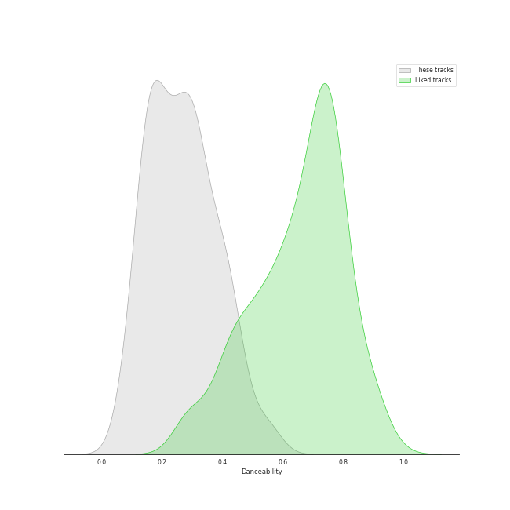
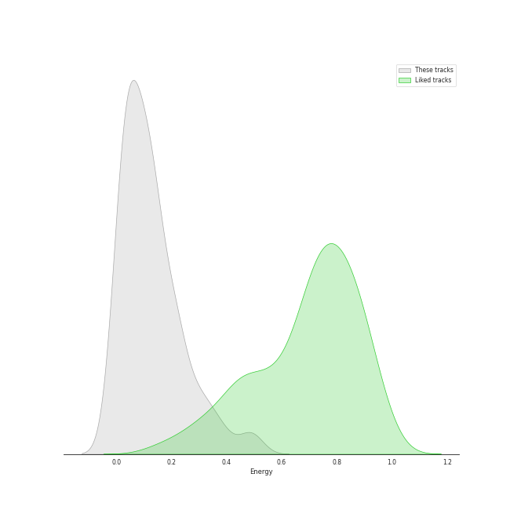
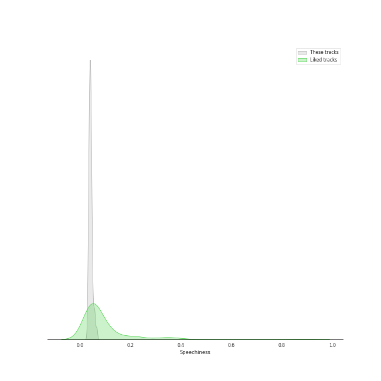
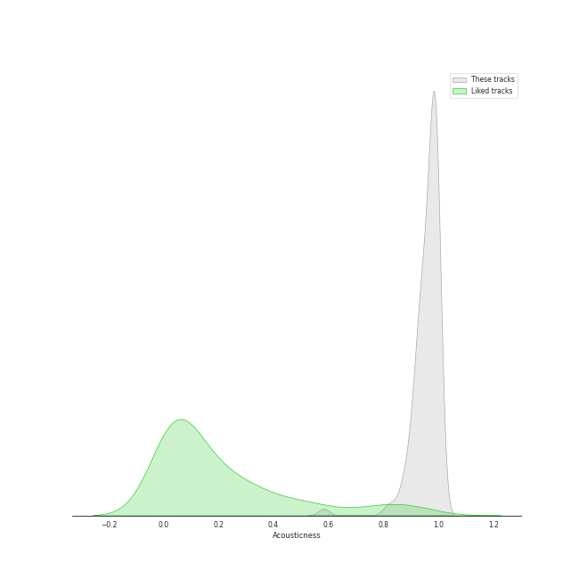
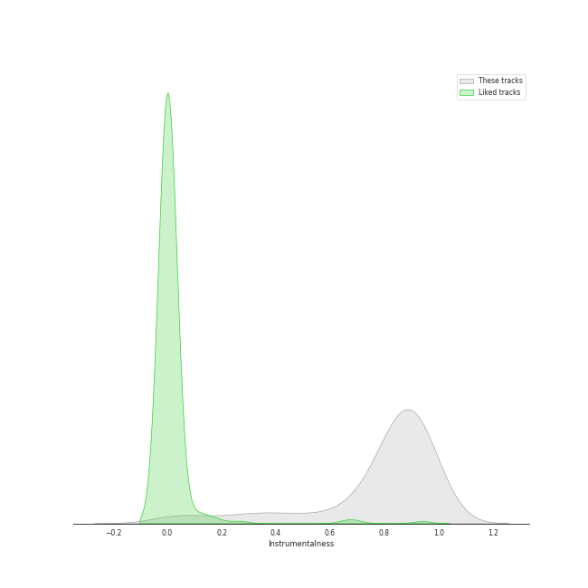
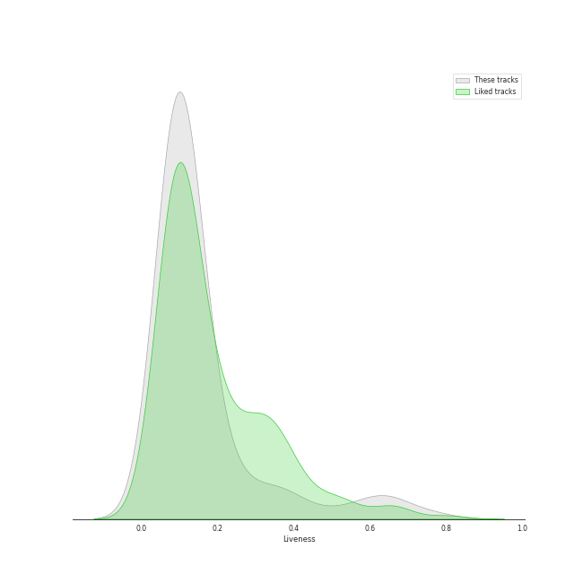
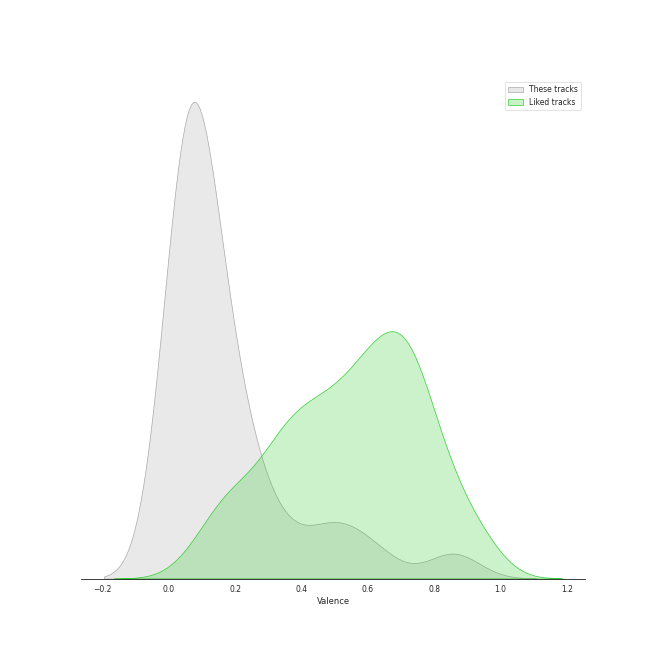
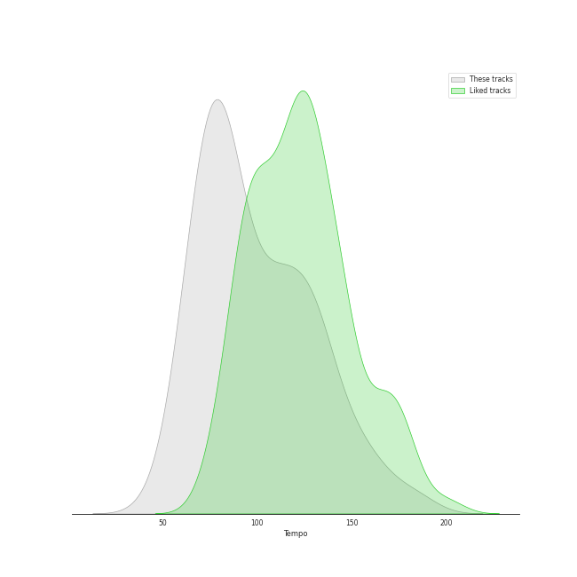

# Track Features for russian romanticism

## Danceability

| ​ | 10 most Danceable tracks | ​​ | 10 least Danceable tracks |
|:---|:---|:---|:---|
|  | Pictures at an Exhibition (Orch. Ravel): V. Ballet of the Unhatched Chicks (0.571) |  | Vespers, Op. 37: XII. "Slava v vyshnikh Bogu" (0.0636) |
|  | Pictures at an Exhibition (Orch. Ravel): Promenade III (0.543) |  | Pictures at an Exhibition (Orch. Ravel): II. The Old Castle (0.0799) |
|  | Tchaikovsky: Swan Lake, Op. 20, Act 1: No. 8, Dance with Goblets (0.534) |  | Vespers, Op. 37: V. "Nyne otpushchayeshi" (0.0806) |
|  | Pictures at an Exhibition (Orch. Ravel): VII. The Market at Limoges (0.48) |  | Tchaikovsky: Swan Lake, Op. 20, Act 2: No. 14, Scene. Moderato (0.0958) |
|  | Tchaikovsky: Swan Lake, Op. 20, Act 4: No. 26, Scene. Allegro ma non troppo (0.472) |  | Vespers, Op. 37: IV. "Svete tikhyi" (0.103) |
|  | Tchaikovsky: The Nutcracker, Op. 71, Act II: No. 12e, Divertissement. Dance of the Reed-Flutes (0.462) |  | Vespers, Op. 37: XIV. "Voskrez iz groba" (0.104) |
|  | Tchaikovsky: The Nutcracker, Op. 71, Act II: No. 12c, Divertissement. Tea, Chinese Dance (0.451) |  | Vespers, Op. 37: II. "Blagoslovi dushe moya" (0.108) |
|  | Tchaikovsky: The Nutcracker, Op. 71, Act I, Scene 1: No. 2, March (0.444) |  | Tchaikovsky: The Nutcracker, Op. 71, Act II: No. 10, The Enchanted Palace of Confiturembourg, the Kingdom of Sweets (0.124) |
|  | 13 Preludes, Op. 32: No. 3 in E Major: Allegro vivace (0.437) |  | Vespers, Op. 37: VI. "Bogoroditse Devo" (0.129) |
|  | 13 Preludes, Op. 32: No. 8 in A Minor: Vivo (0.428) |  | Tchaikovsky: The Nutcracker, Op. 71, Act II: No. 12b, Divertissement. Coffee, Arabian Dance (0.13) |

## Energy

| ​ | 10 most Energetic tracks | ​​ | 10 least Energetic tracks |
|:---|:---|:---|:---|
|  | Tchaikovsky: The Nutcracker, Op. 71, Act II: No. 12d, Divertissement. Trepak, Russian Dance (0.5) |  | Pictures at an Exhibition (Orch. Ravel): VIIIa. Catacombae (Sepulchrum Romanum) (0.000845) |
|  | Vespers, Op. 37: XV. "Vzbrannoy voevode" (0.488) |  | Pictures at an Exhibition (Orch. Ravel): Promenade II (0.00371) |
|  | Tchaikovsky: Swan Lake, Op. 20, Act 3: No. 15, Scene. March - Allegro giusto (0.474) |  | Tchaikovsky: The Nutcracker, Op. 71, Act II: No. 12b, Divertissement. Coffee, Arabian Dance (0.00478) |
|  | Tchaikovsky: Swan Lake, Op. 20, Act 1: No. 8, Dance with Goblets (0.391) |  | Tchaikovsky: Swan Lake, Op. 20, Act 4: No. 25, Entr'acte (0.00606) |
|  | Tchaikovsky: The Nutcracker, Op. 71, Act I, Scene 1: No. 7, The Battle (0.386) |  | 10 Preludes, Op. 23: No. 10 in G-Flat Major: Largo (0.00644) |
|  | Tchaikovsky: Swan Lake, Op. 20, Act 4: No. 29, Finale (0.35) |  | Pictures at an Exhibition (Orch. Ravel): II. The Old Castle (0.00788) |
|  | Tchaikovsky: The Nutcracker, Op. 71, Act II: No. 12f, Divertissement. Mother Gigogne and the Clowns (0.348) |  | Pictures at an Exhibition (Orch. Ravel): VIIIb. Cum mortuis in lingua mortua (0.00794) |
|  | Pictures at an Exhibition (Orch. Ravel): VII. The Market at Limoges (0.322) |  | 13 Preludes, Op. 32: No. 5 in G Major: Moderato (0.00941) |
|  | Tchaikovsky: Swan Lake, Op. 20, Act 3: No. 23, Mazurka (0.315) |  | Tchaikovsky: Swan Lake, Op. 20, Act 1: No. 7, Sujet (0.00979) |
|  | Tchaikovsky: Swan Lake, Op. 20, Act 1: Introduction - No. 1, Scene. Allegro giusto (0.298) |  | 13 Preludes, Op. 32: No. 7 in F Major: Moderato (0.0106) |

## Speechiness

| ​ | 10 most Speechy tracks | ​​ | 10 least Speechy tracks |
|:---|:---|:---|:---|
|  | Tchaikovsky: Swan Lake, Op. 20, Act 3: No. 22, Neapolitan Dance (0.0675) |  | 13 Preludes, Op. 32: No. 6 in F Minor: Allegro appassionato (0.0304) |
|  | Tchaikovsky: The Nutcracker, Op. 71, Act I, Scene 1: No. 7, The Battle (0.0664) |  | Pictures at an Exhibition (Orch. Ravel): IV. Bydlo (0.0311) |
|  | 10 Preludes, Op. 23: No. 1 in F-Sharp Minor: Largo (0.0614) |  | 10 Preludes, Op. 23: No. 7 in C Minor: Allegro (0.0312) |
|  | Morceaux de fantaisie, Op. 3: No. 2, Prelude in C-Sharp Minor (0.0594) |  | 10 Preludes, Op. 23: No. 2 in B-Flat Major: Maestoso (0.0327) |
|  | 13 Preludes, Op. 32: No. 11 in B Major: Allegretto (0.0592) |  | Tchaikovsky: The Nutcracker, Op. 71, Act II: No. 14b, Pas de deux. Variation I "Tarantella" (0.0332) |
|  | Tchaikovsky: Swan Lake, Op. 20, Act 1: No. 3, Scene. Allegro moderato (0.0573) |  | 10 Preludes, Op. 23: No. 6 in E-Flat Major: Andante (0.0333) |
|  | Pictures at an Exhibition (Orch. Ravel): I. Gnomus (0.0571) |  | Piano Concerto No. 2 in C Minor, Op. 18: 3. Allegro scherzando (0.0336) |
|  | Tchaikovsky: Swan Lake, Op. 20, Act 1: No. 5, Pas de deux for Two Merry-Makers (0.0555) |  | Tchaikovsky: The Nutcracker, Op. 71, Act II: No. 12c, Divertissement. Tea, Chinese Dance (0.0338) |
|  | 13 Preludes, Op. 32: No. 10 in B Minor: Lento (0.0535) |  | 10 Preludes, Op. 23: No. 3 in D Minor: Tempo di minuetto (0.034) |
|  | Pictures at an Exhibition (Orch. Ravel): V. Ballet of the Unhatched Chicks (0.0532) |  | Tchaikovsky: Swan Lake, Op. 20, Act 3: No. 18, Scene. Allegro - Allegro giusto (0.034) |

## Acousticness

| ​ | 10 most Acoustic tracks | ​​ | 10 least Acoustic tracks |
|:---|:---|:---|:---|
|  | Vespers, Op. 37: VIII. "Kvalite imya Gospodne" (0.995) |  | Tchaikovsky: The Nutcracker, Op. 71, Act II: No. 12a, Divertissement. Chocolate, Spanish Dance (0.583) |
|  | 13 Preludes, Op. 32: No. 10 in B Minor: Lento (0.995) |  | Tchaikovsky: Swan Lake, Op. 20, Act 1: No. 8, Dance with Goblets (0.813) |
|  | 9 Sacred Pieces, TH 78: No. 3, Cherubic Hymn No. 3 (0.995) |  | Tchaikovsky: Swan Lake, Op. 20, Act 3: No. 23, Mazurka (0.834) |
|  | Vespers, Op. 37: XV. "Vzbrannoy voevode" (0.995) |  | Tchaikovsky: The Nutcracker, Op. 71, Act II: No. 14d, Pas de deux. Coda (0.864) |
|  | 13 Preludes, Op. 32: No. 7 in F Major: Moderato (0.995) |  | Tchaikovsky: The Nutcracker, Op. 71, Act II: No. 12f, Divertissement. Mother Gigogne and the Clowns (0.869) |
|  | Vespers, Op. 37: I. "Priidite, poklonimsya" (0.995) |  | Tchaikovsky: The Nutcracker, Op. 71, Act II: No. 15, Final Waltz and Apotheosis (0.88) |
|  | 10 Preludes, Op. 23: No. 1 in F-Sharp Minor: Largo (0.995) |  | Tchaikovsky: Swan Lake, Op. 20, Act 1: No. 9, Finale. Andante (0.887) |
|  | 13 Preludes, Op. 32: No. 5 in G Major: Moderato (0.995) |  | Tchaikovsky: Swan Lake, Op. 20, Act 4: No. 29, Finale (0.888) |
|  | 13 Preludes, Op. 32: No. 2 in B-Flat Minor: Allegretto (0.995) |  | Tchaikovsky: Swan Lake, Op. 20, Act 3: No. 21, Spanish Dance (0.89) |
|  | 10 Preludes, Op. 23: No. 10 in G-Flat Major: Largo (0.995) |  | Tchaikovsky: The Nutcracker, Op. 71, Act I, Scene 1: No. 3, Children's Galop and Entry of the Parents (0.901) |

## Instrumentalness

| ​ | 10 most Instrumental tracks | ​​ | 10 least Instrumental tracks |
|:---|:---|:---|:---|
|  | Pictures at an Exhibition (Orch. Ravel): IV. Bydlo (0.983) |  | 9 Sacred Pieces, TH 78: No. 1, Cherubic Hymn No. 1 (0.00449) |
|  | Vespers, Op. 37: XIV. "Voskrez iz groba" (0.98) |  | 9 Sacred Pieces, TH 78: No. 2, Cherubic Hymn No. 2 (0.00769) |
|  | Vespers, Op. 37: VI. "Bogoroditse Devo" (0.979) |  | 9 Sacred Pieces, TH 78: No. 3, Cherubic Hymn No. 3 (0.0469) |
|  | Tchaikovsky: Swan Lake, Op. 20, Act 4: No. 26, Scene. Allegro ma non troppo (0.978) |  | Pictures at an Exhibition (Orch. Ravel): VIIIa. Catacombae (Sepulchrum Romanum) (0.0557) |
|  | Pictures at an Exhibition (Orch. Ravel): Promenade I (0.962) |  | Vespers, Op. 37: II. "Blagoslovi dushe moya" (0.0731) |
|  | Tchaikovsky: The Nutcracker, Op. 71, Act II: No. 14a, Pas de deux. Andante maestoso (0.954) |  | Tchaikovsky: The Nutcracker, Op. 71, Act II: No. 12a, Divertissement. Chocolate, Spanish Dance (0.154) |
|  | Pictures at an Exhibition (Orch. Ravel): VIIIb. Cum mortuis in lingua mortua (0.95) |  | Tchaikovsky: Swan Lake, Op. 20, Act 3: No. 21, Spanish Dance (0.213) |
|  | Pictures at an Exhibition (Orch. Ravel): VII. The Market at Limoges (0.948) |  | Vespers, Op. 37: XV. "Vzbrannoy voevode" (0.26) |
|  | Piano Concerto No. 2 in C Minor, Op. 18: 2. Adagio sostenuto (0.945) |  | Tchaikovsky: Swan Lake, Op. 20, Act 3: No. 23, Mazurka (0.282) |
|  | Tchaikovsky: The Nutcracker, Op. 71, Act II: No. 15, Final Waltz and Apotheosis (0.944) |  | Tchaikovsky: The Nutcracker, Op. 71, Act I, Scene 1: No. 3, Children's Galop and Entry of the Parents (0.297) |

## Liveness

| ​ | 10 most Live tracks | ​​ | 10 least Live tracks |
|:---|:---|:---|:---|
|  | Pictures at an Exhibition (Orch. Ravel): VIIIb. Cum mortuis in lingua mortua (0.767) |  | 13 Preludes, Op. 32: No. 7 in F Major: Moderato (0.0533) |
|  | Pictures at an Exhibition (Orch. Ravel): IX. The Hut on Chicken's Legs (0.689) |  | Piano Concerto No. 2 in C Minor, Op. 18: 2. Adagio sostenuto (0.0551) |
|  | Pictures at an Exhibition (Orch. Ravel): VII. The Market at Limoges (0.65) |  | Tchaikovsky: The Nutcracker, Op. 71: Miniature Overture (0.0557) |
|  | Pictures at an Exhibition (Orch. Ravel): I. Gnomus (0.648) |  | 9 Sacred Pieces, TH 78: No. 2, Cherubic Hymn No. 2 (0.0575) |
|  | Night on Bald Mountain (0.628) |  | Tchaikovsky: Swan Lake, Op. 20, Act 1: No. 4, Pas de trois (0.0595) |
|  | Tchaikovsky: The Nutcracker, Op. 71, Act I, Scene 1: No. 3, Children's Galop and Entry of the Parents (0.578) |  | 13 Preludes, Op. 32: No. 8 in A Minor: Vivo (0.0631) |
|  | Tchaikovsky: Swan Lake, Op. 20, Act 3: No. 18, Scene. Allegro - Allegro giusto (0.565) |  | Pictures at an Exhibition (Orch. Ravel): Promenade IV (0.0644) |
|  | Tchaikovsky: Swan Lake, Op. 20, Act 2: No. 11, Scene. Allegro moderato - Moderato - Allegro vivo (0.486) |  | Piano Concerto No. 2 in C Minor, Op. 18: 1. Moderato (0.0646) |
|  | Tchaikovsky: Swan Lake, Op. 20, Act 3, Appendix II: No. 20a, Russian Dance (0.421) |  | Vespers, Op. 37: II. "Blagoslovi dushe moya" (0.0651) |
|  | Pictures at an Exhibition (Orch. Ravel): VI. Samuel Goldenberg und Schmuÿle (0.386) |  | Vespers, Op. 37: XII. "Slava v vyshnikh Bogu" (0.0666) |

## Valence

| ​ | 10 most Happy tracks | ​​ | 10 least Happy tracks |
|:---|:---|:---|:---|
|  | Tchaikovsky: The Nutcracker, Op. 71, Act II: No. 12a, Divertissement. Chocolate, Spanish Dance (0.879) |  | Vespers, Op. 37: IV. "Svete tikhyi" (0.0331) |
|  | Pictures at an Exhibition (Orch. Ravel): V. Ballet of the Unhatched Chicks (0.869) |  | Pictures at an Exhibition (Orch. Ravel): II. The Old Castle (0.0345) |
|  | Tchaikovsky: The Nutcracker, Op. 71, Act II: No. 12d, Divertissement. Trepak, Russian Dance (0.851) |  | Vespers, Op. 37: VI. "Bogoroditse Devo" (0.035) |
|  | Tchaikovsky: The Nutcracker, Op. 71, Act II: No. 12c, Divertissement. Tea, Chinese Dance (0.832) |  | Vespers, Op. 37: II. "Blagoslovi dushe moya" (0.0359) |
|  | Tchaikovsky: Swan Lake, Op. 20, Act 3: No. 22, Neapolitan Dance (0.641) |  | Vespers, Op. 37: XIV. "Voskrez iz groba" (0.0368) |
|  | Tchaikovsky: The Nutcracker, Op. 71, Act I, Scene 1: No. 3, Children's Galop and Entry of the Parents (0.639) |  | Tchaikovsky: The Nutcracker, Op. 71, Act II: No. 12b, Divertissement. Coffee, Arabian Dance (0.037) |
|  | Tchaikovsky: The Nutcracker, Op. 71, Act II: No. 12f, Divertissement. Mother Gigogne and the Clowns (0.597) |  | 9 Sacred Pieces, TH 78: No. 3, Cherubic Hymn No. 3 (0.0372) |
|  | Tchaikovsky: Swan Lake, Op. 20, Act 3: No. 15, Scene. March - Allegro giusto (0.579) |  | 9 Sacred Pieces, TH 78: No. 2, Cherubic Hymn No. 2 (0.0373) |
|  | Pictures at an Exhibition (Orch. Ravel): VII. The Market at Limoges (0.536) |  | Vespers, Op. 37: XIII. "Dnes spaseniye" (0.0374) |
|  | Tchaikovsky: The Nutcracker, Op. 71, Act II: No. 14b, Pas de deux. Variation I "Tarantella" (0.524) |  | 13 Preludes, Op. 32: No. 10 in B Minor: Lento (0.0374) |

## Tempo

| ​ | 10 most Fast tracks | ​​ | 10 least Fast tracks |
|:---|:---|:---|:---|
|  | Tchaikovsky: Swan Lake, Op. 20, Act 3: No. 23, Mazurka (184.562) |  | Tchaikovsky: The Nutcracker, Op. 71, Act II: No. 13, Waltz of the Flowers (47.362) |
|  | Tchaikovsky: Swan Lake, Op. 20, Act 1: No. 7, Sujet (181.794) |  | Piano Concerto No. 2 in C Minor, Op. 18: 1. Moderato (54.898) |
|  | Pictures at an Exhibition (Orch. Ravel): IX. The Hut on Chicken's Legs (165.944) |  | Tchaikovsky: Swan Lake, Op. 20, Act 2: No. 10, Scene. Moderato (58.303) |
|  | 10 Preludes, Op. 23: No. 8 in A-Flat Major: Allegro vivace (165.488) |  | Vespers, Op. 37: XII. "Slava v vyshnikh Bogu" (59.288) |
|  | Tchaikovsky: Swan Lake, Op. 20, Act 3: No. 22, Neapolitan Dance (159.829) |  | Pictures at an Exhibition (Orch. Ravel): I. Gnomus (60.214) |
|  | Tchaikovsky: The Nutcracker, Op. 71, Act II: No. 12d, Divertissement. Trepak, Russian Dance (157.195) |  | Tchaikovsky: The Nutcracker, Op. 71, Act I, Scene 1: No. 3, Children's Galop and Entry of the Parents (62.102) |
|  | Tchaikovsky: Swan Lake, Op. 20, Act 3, Appendix I: Pas de deux (152.712) |  | Tchaikovsky: Swan Lake, Op. 20, Act 1: No. 6, Pas d'action. Andantino, quasi moderato - Allegro (62.261) |
|  | Tchaikovsky: The Nutcracker, Op. 71, Act I, Scene 1: No. 2, March (150.319) |  | 13 Preludes, Op. 32: No. 13 in D-Flat Major: Grave - Allegro (63.387) |
|  | Tchaikovsky: Swan Lake, Op. 20, Act 3: No. 15, Scene. March - Allegro giusto (148.003) |  | Tchaikovsky: Swan Lake, Op. 20, Act 1: No. 3, Scene. Allegro moderato (65.136) |
|  | Tchaikovsky: The Nutcracker, Op. 71, Act I, Scene 1: No. 4, Dancing Scene. Arrival of Drosselmeyer (145.487) |  | Vespers, Op. 37: IX. "Blagosloven esi, Gospodi" (65.552) |
