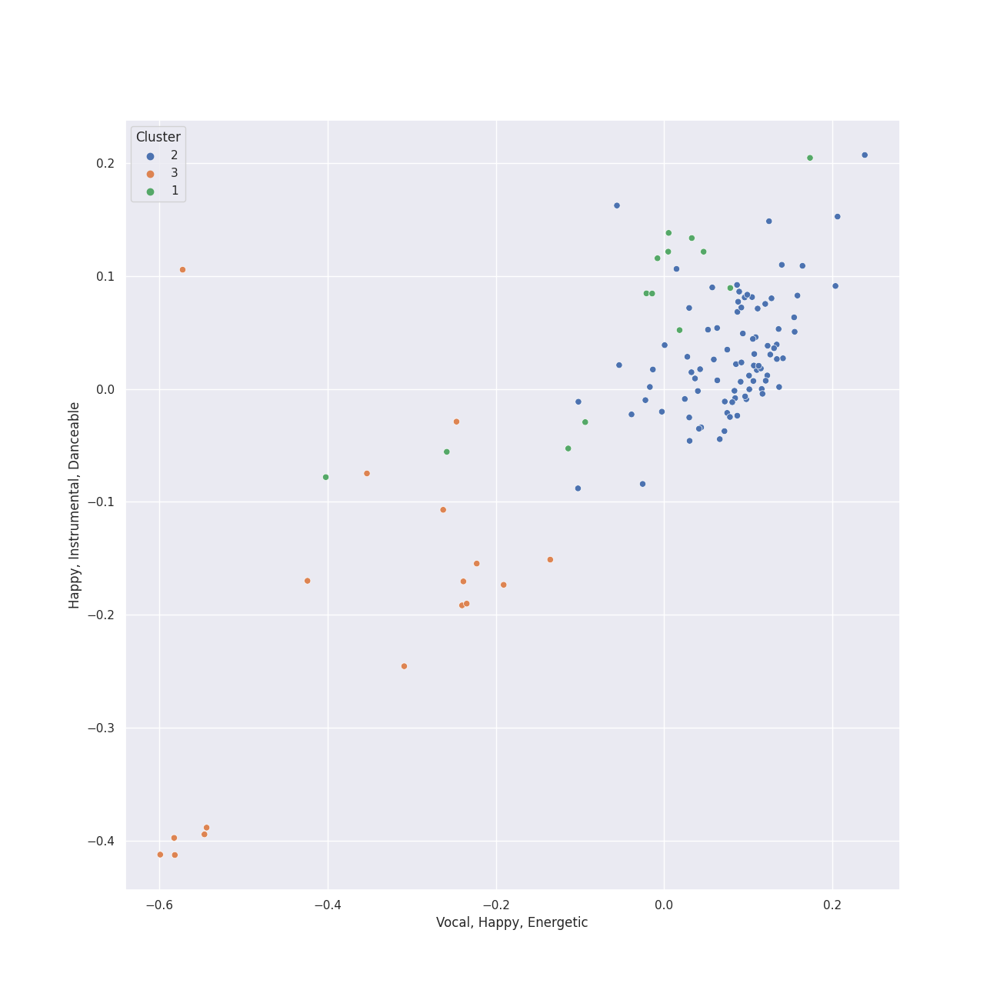

# Clusters in russian romanticism

## Cluster #1

14 tracks

| Art | Track | Album | Artists | Label | 💚 | 🔗 |
|:---|:---|:---|:---|:---|:---|:---|
|  | Night on Bald Mountain | Mussorgsky: Pictures At An Exhibition | Modest Mussorgsky, Wiener Philharmoniker, Gustavo Dudamel | [Deutsche Grammophon (DG)](../../../../labels/deutsche_grammophon__dg_) | | [🔗](https://open.spotify.com/track/6ejFaLGH7F4J5tnaYirs2G) |
|  | Pictures at an Exhibition (Orch. Ravel): I. Gnomus | Mussorgsky: Pictures At An Exhibition | Modest Mussorgsky, Wiener Philharmoniker, Gustavo Dudamel | [Deutsche Grammophon (DG)](../../../../labels/deutsche_grammophon__dg_) | | [🔗](https://open.spotify.com/track/4gKrD45pSLOwGndDsmtisn) |
|  | Pictures at an Exhibition (Orch. Ravel): IX. The Hut on Chicken's Legs | Mussorgsky: Pictures At An Exhibition | Modest Mussorgsky, Wiener Philharmoniker, Gustavo Dudamel | [Deutsche Grammophon (DG)](../../../../labels/deutsche_grammophon__dg_) | | [🔗](https://open.spotify.com/track/4Eev1NK5U0fm4ZADOu9KKq) |
|  | Pictures at an Exhibition (Orch. Ravel): VI. Samuel Goldenberg und Schmuÿle | Mussorgsky: Pictures At An Exhibition | Modest Mussorgsky, Wiener Philharmoniker, Gustavo Dudamel | [Deutsche Grammophon (DG)](../../../../labels/deutsche_grammophon__dg_) | | [🔗](https://open.spotify.com/track/0z8qN0Tn05N5wzFjDaHmMJ) |
|  | Tchaikovsky: Swan Lake, Op. 20, Act 2: No. 11, Scene. Allegro moderato - Moderato - Allegro vivo | Tchaikovsky: Swan Lake | [Pyotr Ilyich Tchaikovsky](../../../../artists/pyotr_ilyich_tchaikovsky/overview.md), André Previn, London Symphony Orchestra | [Warner Classics](../../../../labels/warner_classics) | | [🔗](https://open.spotify.com/track/5ItPxeVnRy31PwbheRAZyw) |
|  | Tchaikovsky: Swan Lake, Op. 20, Act 3: No. 17, Entrance of the Guests and Waltz | Tchaikovsky: Swan Lake | [Pyotr Ilyich Tchaikovsky](../../../../artists/pyotr_ilyich_tchaikovsky/overview.md), André Previn, London Symphony Orchestra | [Warner Classics](../../../../labels/warner_classics) | | [🔗](https://open.spotify.com/track/1RiQJx6VNLVG2SLbyiN6tK) |
|  | Tchaikovsky: Swan Lake, Op. 20, Act 3: No. 18, Scene. Allegro - Allegro giusto | Tchaikovsky: Swan Lake | [Pyotr Ilyich Tchaikovsky](../../../../artists/pyotr_ilyich_tchaikovsky/overview.md), André Previn, London Symphony Orchestra | [Warner Classics](../../../../labels/warner_classics) | | [🔗](https://open.spotify.com/track/2YzKk2NMadveUJ5gSMmo5W) |
|  | Tchaikovsky: Swan Lake, Op. 20, Act 4: No. 28, Scene. Allegro agitato | Tchaikovsky: Swan Lake | [Pyotr Ilyich Tchaikovsky](../../../../artists/pyotr_ilyich_tchaikovsky/overview.md), André Previn, London Symphony Orchestra | [Warner Classics](../../../../labels/warner_classics) | | [🔗](https://open.spotify.com/track/5jg3xtvH1ZkLO2XtaefaSF) |
|  | Tchaikovsky: Swan Lake, Op. 20, Act 4: No. 29, Finale | Tchaikovsky: Swan Lake | [Pyotr Ilyich Tchaikovsky](../../../../artists/pyotr_ilyich_tchaikovsky/overview.md), André Previn, London Symphony Orchestra | [Warner Classics](../../../../labels/warner_classics) | | [🔗](https://open.spotify.com/track/5nYUMQDawD0zfqMtqXq8Ds) |
|  | Tchaikovsky: The Nutcracker, Op. 71, Act I, Scene 1: No. 4, Dancing Scene. Arrival of Drosselmeyer | Tchaikovsky: The Nutcracker | [Pyotr Ilyich Tchaikovsky](../../../../artists/pyotr_ilyich_tchaikovsky/overview.md), Sir Simon Rattle, [Berliner Philharmoniker](../../../../artists/berliner_philharmoniker/overview.md) | [Warner Classics](../../../../labels/warner_classics) | | [🔗](https://open.spotify.com/track/2NodH0sMaxRFSWePxkuutP) |
## Cluster #2

86 tracks

| Art | Track | Album | Artists | Label | 💚 | 🔗 |
|:---|:---|:---|:---|:---|:---|:---|
|  | Tchaikovsky: Swan Lake, Op. 20, Act 1: No. 2, Waltz | Tchaikovsky: Swan Lake | [Pyotr Ilyich Tchaikovsky](../../../../artists/pyotr_ilyich_tchaikovsky/overview.md), André Previn, London Symphony Orchestra | [Warner Classics](../../../../labels/warner_classics) | | [🔗](https://open.spotify.com/track/7gwqbiFgNU1VddAK2XO5Wr) |
|  | Tchaikovsky: Swan Lake, Op. 20, Act 1: No. 4, Pas de trois | Tchaikovsky: Swan Lake | [Pyotr Ilyich Tchaikovsky](../../../../artists/pyotr_ilyich_tchaikovsky/overview.md), André Previn, London Symphony Orchestra | [Warner Classics](../../../../labels/warner_classics) | | [🔗](https://open.spotify.com/track/3lE4dnrzG0FQxg67ZOl9rx) |
|  | Tchaikovsky: Swan Lake, Op. 20, Act 1: No. 6, Pas d'action. Andantino, quasi moderato - Allegro | Tchaikovsky: Swan Lake | [Pyotr Ilyich Tchaikovsky](../../../../artists/pyotr_ilyich_tchaikovsky/overview.md), André Previn, London Symphony Orchestra | [Warner Classics](../../../../labels/warner_classics) | | [🔗](https://open.spotify.com/track/6DlYVW2A5tBGwyrVYQnGsO) |
|  | Tchaikovsky: Swan Lake, Op. 20, Act 2: No. 12, Scene. Allegro - Moderato assai quasi andante | Tchaikovsky: Swan Lake | [Pyotr Ilyich Tchaikovsky](../../../../artists/pyotr_ilyich_tchaikovsky/overview.md), André Previn, London Symphony Orchestra | [Warner Classics](../../../../labels/warner_classics) | | [🔗](https://open.spotify.com/track/4MK0IoF2M5oUMvOrguhyYF) |
|  | Tchaikovsky: Swan Lake, Op. 20, Act 4: No. 27, Dance of the Little Swans | Tchaikovsky: Swan Lake | [Pyotr Ilyich Tchaikovsky](../../../../artists/pyotr_ilyich_tchaikovsky/overview.md), André Previn, London Symphony Orchestra | [Warner Classics](../../../../labels/warner_classics) | | [🔗](https://open.spotify.com/track/4Qu4tyMIENrOgUSGGbJhb4) |
|  | Tchaikovsky: The Nutcracker, Op. 71, Act I, Scene 1: No. 1, Decoration of the Christmas Tree | Tchaikovsky: The Nutcracker | [Pyotr Ilyich Tchaikovsky](../../../../artists/pyotr_ilyich_tchaikovsky/overview.md), Sir Simon Rattle, [Berliner Philharmoniker](../../../../artists/berliner_philharmoniker/overview.md) | [Warner Classics](../../../../labels/warner_classics) | | [🔗](https://open.spotify.com/track/7hVsNjrvtfXZlzxW5vxsAi) |
|  | Swan Lake Suite, Op. 20a: II. Waltz | Mussorgsky: Pictures At An Exhibition | [Pyotr Ilyich Tchaikovsky](../../../../artists/pyotr_ilyich_tchaikovsky/overview.md), Wiener Philharmoniker, Gustavo Dudamel | [Deutsche Grammophon (DG)](../../../../labels/deutsche_grammophon__dg_) | | [🔗](https://open.spotify.com/track/0NOiSayyUFYnLllkTdFa1k) |
|  | 10 Preludes, Op. 23: No. 5 in G Minor: Alla marcia | Rachmaninov: Preludes for Piano (Complete) | Sergei Rachmaninoff, Eldar Nebolsin | [Naxos](../../../../labels/naxos) | | [🔗](https://open.spotify.com/track/0dwRX7z5Yzr1K96QhAKOBh) |
|  | 10 Preludes, Op. 23: No. 7 in C Minor: Allegro | Rachmaninov: Preludes for Piano (Complete) | Sergei Rachmaninoff, Eldar Nebolsin | [Naxos](../../../../labels/naxos) | | [🔗](https://open.spotify.com/track/1BKKpyRblOv1OWjZ0CcAWo) |
|  | 13 Preludes, Op. 32: No. 6 in F Minor: Allegro appassionato | Rachmaninov: Preludes for Piano (Complete) | Sergei Rachmaninoff, Eldar Nebolsin | [Naxos](../../../../labels/naxos) | | [🔗](https://open.spotify.com/track/67SGGqw9rymqT1DvdT5ka6) |
## Cluster #3

17 tracks

| Art | Track | Album | Artists | Label | 💚 | 🔗 |
|:---|:---|:---|:---|:---|:---|:---|
|  | Pictures at an Exhibition (Orch. Ravel): III. Tuileries Gardens | Mussorgsky: Pictures At An Exhibition | Modest Mussorgsky, Wiener Philharmoniker, Gustavo Dudamel | [Deutsche Grammophon (DG)](../../../../labels/deutsche_grammophon__dg_) | | [🔗](https://open.spotify.com/track/5ePWR9SYDsADEMLyAcCcJU) |
|  | Pictures at an Exhibition (Orch. Ravel): Promenade II | Mussorgsky: Pictures At An Exhibition | Modest Mussorgsky, Wiener Philharmoniker, Gustavo Dudamel | [Deutsche Grammophon (DG)](../../../../labels/deutsche_grammophon__dg_) | | [🔗](https://open.spotify.com/track/7etkHCIevRXLnNIg0bvxKi) |
|  | Tchaikovsky: Swan Lake, Op. 20, Act 3: No. 21, Spanish Dance | Tchaikovsky: Swan Lake | [Pyotr Ilyich Tchaikovsky](../../../../artists/pyotr_ilyich_tchaikovsky/overview.md), André Previn, London Symphony Orchestra | [Warner Classics](../../../../labels/warner_classics) | | [🔗](https://open.spotify.com/track/3Vulgn0kOld0a561mg7yt4) |
|  | Tchaikovsky: Swan Lake, Op. 20, Act 3: No. 23, Mazurka | Tchaikovsky: Swan Lake | [Pyotr Ilyich Tchaikovsky](../../../../artists/pyotr_ilyich_tchaikovsky/overview.md), André Previn, London Symphony Orchestra | [Warner Classics](../../../../labels/warner_classics) | | [🔗](https://open.spotify.com/track/2yf6Hbs6YR3o1iEtOxr91R) |
|  | Tchaikovsky: Swan Lake, Op. 20, Act 4: No. 25, Entr'acte | Tchaikovsky: Swan Lake | [Pyotr Ilyich Tchaikovsky](../../../../artists/pyotr_ilyich_tchaikovsky/overview.md), André Previn, London Symphony Orchestra | [Warner Classics](../../../../labels/warner_classics) | | [🔗](https://open.spotify.com/track/4e1dRJR5QrPOlfjx3jShah) |
|  | 9 Sacred Pieces, TH 78: No. 3, Cherubic Hymn No. 3 | Tchaikovsky: Sacred Choral Music | [Pyotr Ilyich Tchaikovsky](../../../../artists/pyotr_ilyich_tchaikovsky/overview.md), NDR Chor, Philipp Ahmann | Carus | | [🔗](https://open.spotify.com/track/5cuTdpoXIWieDK848fuNDW) |
|  | Vespers, Op. 37: IX. "Blagosloven esi, Gospodi" | Rachmaninov: Vespers - All Night Vigil | Sergei Rachmaninoff, St.Petersburg Chamber Choir, Nikolai Korniev | [Decca Music Group Ltd.](../../../../labels/decca_music_group_ltd_) | | [🔗](https://open.spotify.com/track/0NfQexdy6BRC3O7W2LPqHl) |
|  | Vespers, Op. 37: VIII. "Kvalite imya Gospodne" | Rachmaninov: Vespers - All Night Vigil | Sergei Rachmaninoff, St.Petersburg Chamber Choir, Nikolai Korniev | [Decca Music Group Ltd.](../../../../labels/decca_music_group_ltd_) | | [🔗](https://open.spotify.com/track/79tPoVRNUdOSwM8ERRpx8m) |
|  | Vespers, Op. 37: X. "Voskreseniye Khristovo videvshe" | Rachmaninov: Vespers - All Night Vigil | Sergei Rachmaninoff, St.Petersburg Chamber Choir, Nikolai Korniev | [Decca Music Group Ltd.](../../../../labels/decca_music_group_ltd_) | | [🔗](https://open.spotify.com/track/2rzp6tSZjlPxIjkcnKoV7a) |
|  | Vespers, Op. 37: XV. "Vzbrannoy voevode" | Rachmaninov: Vespers - All Night Vigil | Sergei Rachmaninoff, St.Petersburg Chamber Choir, Nikolai Korniev | [Decca Music Group Ltd.](../../../../labels/decca_music_group_ltd_) | | [🔗](https://open.spotify.com/track/5PSyFWOmtBCPwkAiAV770t) |