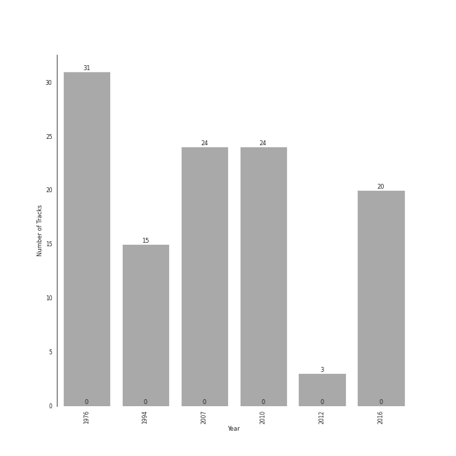

# russian romanticism

117 songs

[See Track Features](audio_features.md)

[See Clusters](clusters/overview.md)

## Top Artists

| Art | Tracks | 💚 | Artist | 🔗 |
|:---|---:|---:|:---|:---|
|  | 59 | 0 | [Pyotr Ilyich Tchaikovsky](../../artists/pyotr_ilyich_tchaikovsky/overview.md) | [🔗](https://open.spotify.com/artist/3MKCzCnpzw3TjUYs2v7vDA) |
|  | 42 | 0 | Sergei Rachmaninoff | [🔗](https://open.spotify.com/artist/0Kekt6CKSo0m5mivKcoH51) |
|  | 34 | 0 | [London Symphony Orchestra](../../artists/london_symphony_orchestra/overview.md) | [🔗](https://open.spotify.com/artist/5yxyJsFanEAuwSM5kOuZKc) |
|  | 31 | 0 | André Previn | [🔗](https://open.spotify.com/artist/2tfWguHr2nj4e8KXLKciVq) |
|  | 24 | 0 | [Berliner Philharmoniker](../../artists/berliner_philharmoniker/overview.md) | [🔗](https://open.spotify.com/artist/6uRJnvQ3f8whVnmeoecv5Z) |
|  | 24 | 0 | Sir Simon Rattle | [🔗](https://open.spotify.com/artist/4GQwgdcDQwqtcHICjUNndp) |
|  | 24 | 0 | Eldar Nebolsin | [🔗](https://open.spotify.com/artist/45ts2AJTWlzJ9JrQlCGxpX) |
|  | 17 | 0 | Gustavo Dudamel | [🔗](https://open.spotify.com/artist/0cxXnDhpgxcMMkKddhORHY) |
|  | 17 | 0 | Wiener Philharmoniker | [🔗](https://open.spotify.com/artist/003f4bk13c6Q3gAUXv7dGJ) |
|  | 16 | 0 | Modest Mussorgsky | [🔗](https://open.spotify.com/artist/284mnx33IWcymQEpMxyfHl) |

See all 19 artists

| Art | Tracks | 💚 | Artist | 🔗 |
|:---|---:|---:|:---|:---|
|  | 15 | 0 | Nikolai Korniev | [🔗](https://open.spotify.com/artist/70hS9SnJefkZo2QJwS2VXi) |
|  | 15 | 0 | St.Petersburg Chamber Choir | [🔗](https://open.spotify.com/artist/46WjEugfIF0rKOewvFiby2) |
|  | 3 | 0 | NDR Chor | [🔗](https://open.spotify.com/artist/7hMAA1N5j1Ynb49NIWO7HV) |
|  | 3 | 0 | Michael Francis | [🔗](https://open.spotify.com/artist/4znpeZQkiPbcXtHlRbfTqF) |
|  | 3 | 0 | Philipp Ahmann | [🔗](https://open.spotify.com/artist/309coOGhdzqXdIRwJH1xUo) |
|  | 3 | 0 | Valentina Lisitsa | [🔗](https://open.spotify.com/artist/0gOrXuu1vCBXe3pwTyb5Ca) |
|  | 1 | 0 | Vladimir Mostovoy | [🔗](https://open.spotify.com/artist/4BTanscTBWJOSpvceZSVSi) |
|  | 1 | 0 | Olga Borodina | [🔗](https://open.spotify.com/artist/47XbXbNzwqcWStfsjzFlKb) |
|  | 1 | 0 | Libera | [🔗](https://open.spotify.com/artist/235C4ktJ2aGIyqaBlXyg7e) |

## Most and least listened tracks
| ​ | Most listened tracks | Rank | ​​ | Least listened tracks | Rank |
|:---|:---|---:|:---|:---|---:|
|  | [Tchaikovsky: The Nutcracker, Op. 71, Act I: No. 2, March](../../artists/pyotr_ilyich_tchaikovsky/overview.md) | 861 |  | [Tchaikovsky: The Nutcracker, Op. 71, Act II: No. 12c, Divertissement. Tea, Chinese Dance](../../artists/pyotr_ilyich_tchaikovsky/overview.md) | 861 |
|  | 13 Preludes, Op. 32: No. 9 in A Major: Allegro moderato | 861 |  | [Tchaikovsky: Swan Lake, Op. 20, Act 3, Appendix I: Pas de deux](../../artists/pyotr_ilyich_tchaikovsky/overview.md) | 861 |
|  | Vespers, Op. 37: XIII. "Dnes spaseniye" | 861 |  | [Tchaikovsky: The Nutcracker, Op. 71, Act I, Scene 1: No. 1, Decoration of the Christmas Tree](../../artists/pyotr_ilyich_tchaikovsky/overview.md) | 861 |
|  | Pictures at an Exhibition (Orch. Ravel): Promenade III | 861 |  | [Tchaikovsky: Swan Lake, Op. 20, Act 1: No. 2, Waltz](../../artists/pyotr_ilyich_tchaikovsky/overview.md) | 861 |
|  | [Tchaikovsky: The Nutcracker, Op. 71, Act 2: No. 13, Waltz of the Flowers](../../artists/pyotr_ilyich_tchaikovsky/overview.md) | 861 |  | Pictures at an Exhibition (Orch. Ravel): Promenade II | 861 |
|  | [Tchaikovsky: Swan Lake, Op. 20, Act 3, Appendix II: No. 20a, Russian Dance](../../artists/pyotr_ilyich_tchaikovsky/overview.md) | 861 |  | [Tchaikovsky: The Nutcracker, Op. 71, Act II: No. 10, The Enchanted Palace of Confiturembourg, the Kingdom of Sweets](../../artists/pyotr_ilyich_tchaikovsky/overview.md) | 861 |
|  | [Tchaikovsky: The Nutcracker, Op. 71, Act II: No. 14b, Pas de deux. Variation I "Tarantella"](../../artists/pyotr_ilyich_tchaikovsky/overview.md) | 861 |  | 13 Preludes, Op. 32: No. 12 in G-Sharp Minor: Allegro | 861 |
|  | Pictures at an Exhibition (Orch. Ravel): X. The Great Gate of Kiev | 861 |  | [Tchaikovsky: The Nutcracker, Op. 71, Act I, Scene 1: No. 5, Scene and Grandfather Dance](../../artists/pyotr_ilyich_tchaikovsky/overview.md) | 861 |
|  | 10 Preludes, Op. 23: No. 3 in D Minor: Tempo di minuetto | 861 |  | [9 Sacred Pieces, TH 78: No. 1, Cherubic Hymn No. 1](../../artists/pyotr_ilyich_tchaikovsky/overview.md) | 861 |
|  | [Swan Lake Suite, Op. 20a: II. Waltz](../../artists/pyotr_ilyich_tchaikovsky/overview.md) | 861 |  | Pictures at an Exhibition (Orch. Ravel): II. The Old Castle | 861 |

## Top Albums

| Art | Tracks | 💚 | Album | Release Date | 🔗 |
|:---|---:|---:|:---|:---|:---|
|  | 31 | 0 | Tchaikovsky: Swan Lake | 1976-01-01 | [🔗](https://open.spotify.com/album/7dVA06E7AP7P7VzPyNxQVO) |
|  | 24 | 0 | Tchaikovsky: The Nutcracker | 2010-10-11 | [🔗](https://open.spotify.com/album/54Awn36ryf55PkZyOR4iwQ) |
|  | 24 | 0 | Rachmaninov: Preludes for Piano (Complete) | 2007-05-29 | [🔗](https://open.spotify.com/album/1vlnwUAidj7bEmRhsq4zTv) |
|  | 17 | 0 | Mussorgsky: Pictures At An Exhibition | 2016-12-02 | [🔗](https://open.spotify.com/album/1b2aoeaYZZBWmJoavOQhnd) |
|  | 15 | 0 | Rachmaninov: Vespers - All Night Vigil | 1994 | [🔗](https://open.spotify.com/album/7hqotgNjEJt09XiggaMI1v) |
|  | 3 | 0 | Tchaikovsky: Sacred Choral Music | 2016-07-01 | [🔗](https://open.spotify.com/album/4udN7bCLaa8zCnaIvoxzOB) |
|  | 3 | 0 | Rachmaninov: Piano Concerto No.2 | 2012-01-01 | [🔗](https://open.spotify.com/album/5lVqgXqdoIH3W1wUM2hzPx) |

## Top Record Labels

| Tracks | 💚 | Label |
|---:|---:|:---|
| 55 | 0 | [Warner Classics](../../labels/warner_classics/overview.md) |
| 24 | 0 | [Naxos](../../labels/naxos/overview.md) |
| 18 | 0 | [Decca Music Group Ltd.](../../labels/decca_music_group_ltd_/overview.md) |
| 17 | 0 | [Deutsche Grammophon (DG)](../../labels/deutsche_grammophon_(dg)/overview.md) |
| 3 | 0 | Carus |

## Years

| ​ | 10 newest albums | ​​ | 10 oldest albums |
|:---|:---|:---|:---|
|  | Mussorgsky: Pictures At An Exhibition (2016-12-02) |  | Tchaikovsky: Swan Lake (1976-01-01) |
|  | Tchaikovsky: Sacred Choral Music (2016-07-01) |  | Rachmaninov: Vespers - All Night Vigil (1994) |
|  | Rachmaninov: Piano Concerto No.2 (2012-01-01) |  | Rachmaninov: Preludes for Piano (Complete) (2007-05-29) |
|  | Tchaikovsky: The Nutcracker (2010-10-11) |  | Tchaikovsky: The Nutcracker (2010-10-11) |
|  | Rachmaninov: Preludes for Piano (Complete) (2007-05-29) |  | Rachmaninov: Piano Concerto No.2 (2012-01-01) |
|  | Rachmaninov: Vespers - All Night Vigil (1994) |  | Tchaikovsky: Sacred Choral Music (2016-07-01) |
|  | Tchaikovsky: Swan Lake (1976-01-01) |  | Mussorgsky: Pictures At An Exhibition (2016-12-02) |

