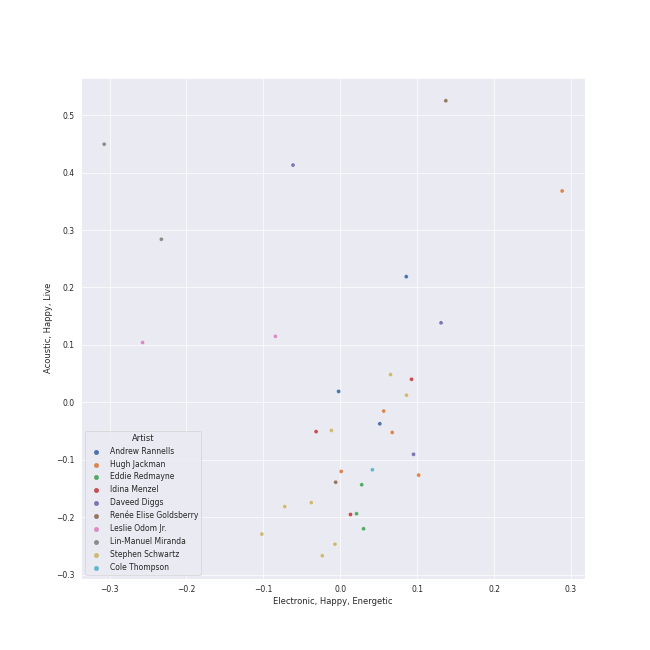

# show tunes

[106 songs](show_tunes_tracks.md)

## Top Artists

See all 68 artists

| Number of Tracks | Art | Artist | 🔗 |
|---:|:---|:---|:---|
| 32 |  | [Andrew Lloyd Webber](../artists/andrew_lloyd_webber.md) | [🔗](https://open.spotify.com/artist/4aP1lp10BRYZO658B2NwkG) |
| 31 |  | [Original Broadway Cast of Hamilton](../artists/original_broadway_cast_of_hamilton.md) | [🔗](https://open.spotify.com/artist/3UUJfRbrA2nTbcg4i0MOwu) |
| 29 |  | [Lin-Manuel Miranda](../artists/lin_manuel_miranda.md) | [🔗](https://open.spotify.com/artist/4aXXDj9aZnlshx7mzj3W1N) |
| 21 |  | [Phantom Of The Opera Original London Cast](../artists/phantom_of_the_opera_original_london_cast.md) | [🔗](https://open.spotify.com/artist/3LfD2yRlfHAtTryX8rFp25) |
| 20 |  | [Leslie Odom Jr.](../artists/leslie_odom_jr_.md) | [🔗](https://open.spotify.com/artist/3cR4rhS2hBWqI7rJEBacvN) |
| 14 |  | [Sarah Brightman](../artists/sarah_brightman.md) | [🔗](https://open.spotify.com/artist/7Ead768rc4ShGxnqtqccU5) |
| 11 |  | [Anthony Ramos](../artists/anthony_ramos.md) | [🔗](https://open.spotify.com/artist/660YptcR0hNHJ8iEr1qcse) |
| 11 |  | [Michael Crawford](../artists/michael_crawford.md) | [🔗](https://open.spotify.com/artist/5fRiVl9fyhUEZhcpMyIxUG) |
| 11 |  | [Daveed Diggs](../artists/daveed_diggs.md) | [🔗](https://open.spotify.com/artist/3twuAojvYNrlWZpMkxLm3P) |
| 11 |  | [Phillipa Soo](../artists/phillipa_soo.md) | [🔗](https://open.spotify.com/artist/2OEGI2wrCVmvavKEOMlccy) |
| 11 |  | [Steve Barton](../artists/steve_barton.md) | [🔗](https://open.spotify.com/artist/1gEOIEK9jgpYvvG57BP0US) |
| 10 |  | [Okieriete Onaodowan](../artists/okieriete_onaodowan.md) | [🔗](https://open.spotify.com/artist/6G3sPhnj4JBCsBVBGvZnkk) |
| 9 |  | [Disney](../artists/disney.md) | [🔗](https://open.spotify.com/artist/3xvaSlT4xsyk6lY1ESOspO) |
| 7 |  | Christopher Jackson | [🔗](https://open.spotify.com/artist/6sLwRSXSUF5JTUnQaFenyj) |
| 7 |  | Emmy Rossum | [🔗](https://open.spotify.com/artist/6JcDqt1rBKIWfnoPjXFYqc) |
| 7 |  | Colm Wilkinson | [🔗](https://open.spotify.com/artist/4hKV8PcRBaHZqBJjSn8OJE) |
| 5 |  | Gerard Butler | [🔗](https://open.spotify.com/artist/7H25O93TTUoaZ0ZaFk318U) |
| 5 |  | Renée Elise Goldsberry | [🔗](https://open.spotify.com/artist/5VJN4jB6PqqEg4kJiAj6Eu) |
| 5 |  | Lea Salonga | [🔗](https://open.spotify.com/artist/1GlMjIezcLwV3OFlX0uXOv) |
| 4 |  | Judy Kuhn | [🔗](https://open.spotify.com/artist/7tHd518aPjJYUgyv9bidBz) |
| 4 |  | Rosemary Ashe | [🔗](https://open.spotify.com/artist/3Oju6zkuJzum4svKeVhKiK) |
| 3 |  | Jonathan Groff | [🔗](https://open.spotify.com/artist/7KkqUt65v6LMtR369OQ6FB) |
| 3 |  | Janet Devenish | [🔗](https://open.spotify.com/artist/7Ev9dg2zamUgQsRUp9DdRl) |
| 3 |  | Frances Ruffelle | [🔗](https://open.spotify.com/artist/5uSeMCBhe3DiROdFrwaXkw) |
| 3 |  | Terrence Mann | [🔗](https://open.spotify.com/artist/5uBIsYz9WatgoViLG6pVj2) |
| 3 |  | David Firth | [🔗](https://open.spotify.com/artist/4kjJU6zIfQi87yTWJMxJNw) |
| 3 |  | John Savident | [🔗](https://open.spotify.com/artist/2V0W4YzPCESOh86ss7D2QE) |
| 3 |  | Mary Millar | [🔗](https://open.spotify.com/artist/1SBvpcra5uod7N0rxJxa3J) |
| 2 |  | Idina Menzel | [🔗](https://open.spotify.com/artist/73Np75Wv2tju61Eo9Zw4IR) |
| 2 |  | Samuel E. Wright | [🔗](https://open.spotify.com/artist/6Id8rcDNyBXPcgKQVfQ8rX) |
| 2 |  | Jasmine Cephas-Jones | [🔗](https://open.spotify.com/artist/4H3e5t5utgPvj6Nsuda5QF) |
| 2 |  | Eddie Redmayne | [🔗](https://open.spotify.com/artist/4EJP6Qhk6l18LumCcpEfLw) |
| 2 |  | Patrick Wilson | [🔗](https://open.spotify.com/artist/0z5nxdz5osD8FsmaUDmfC0) |
| 2 |  | Angela Lansbury | [🔗](https://open.spotify.com/artist/0LtVJXnPR8msCJiE2DjHxy) |
| 1 |  | Students | [🔗](https://open.spotify.com/artist/7oaoEBdRqHXfoiGYa55Atp) |
| 1 |  | Beth Fowler | [🔗](https://open.spotify.com/artist/7KNW6OwcA260MsaEtnvhxV) |
| 1 |  | Harvey Fierstein | [🔗](https://open.spotify.com/artist/7G6zawIBBtDX1WvuT97Ei9) |
| 1 |  | Les Misérables Cast | [🔗](https://open.spotify.com/artist/71wy5iisVKXLZgoPxdFi8A) |
| 1 |  | Jon Rua | [🔗](https://open.spotify.com/artist/69NsP4MC1JbfvKMwpx2oy8) |
| 1 |  | Aaron Tveit | [🔗](https://open.spotify.com/artist/68h2f0WXn4zEctSgNYozXx) |
| 1 |  | Joseph Williams | [🔗](https://open.spotify.com/artist/5xk0kRuXn1zToTHpHAqpui) |
| 1 |  | Minnie Driver | [🔗](https://open.spotify.com/artist/5rNwd5kb1cxVBCQKnDO4b8) |
| 1 |  | Auli'i Cravalho | [🔗](https://open.spotify.com/artist/5mnS9jJdKQQcRSqFu5YPVe) |
| 1 |  | [The King's Singers](../artists/the_king_s_singers.md) | [🔗](https://open.spotify.com/artist/5lR7yDVN4z9kahOiUSlMhe) |
| 1 |  | Jerry Orbach | [🔗](https://open.spotify.com/artist/5i2OpmeVKsmViqoETxuOvO) |
| 1 |  | Jason Weaver | [🔗](https://open.spotify.com/artist/5UdPkKWd8YNR5xGcmqH9QJ) |
| 1 |  | John Aron | [🔗](https://open.spotify.com/artist/5Hco9oOhEcTrU0hzzIkoF7) |
| 1 |  | Jodi Benson | [🔗](https://open.spotify.com/artist/4mmMtabvFCKA6HfmVmitNH) |
| 1 |  | Thayne Jasperson | [🔗](https://open.spotify.com/artist/4lSm9vkdpKSs1O8nKflRaB) |
| 1 |  | Samantha Barks | [🔗](https://open.spotify.com/artist/4gOl5m9dY7IGAipqpul7GZ) |
| 1 |  | Chorus - Mulan | [🔗](https://open.spotify.com/artist/4KpdqBDU2C5gB3vhdojuqA) |
| 1 |  | Jerry Tondo | [🔗](https://open.spotify.com/artist/3wUpOiaLjwAZNregbC7CxO) |
| 1 |  | Chorus - Beauty And the Beast | [🔗](https://open.spotify.com/artist/3kWWBtNzJFtKA222gZz39d) |
| 1 |  | Brad Kane | [🔗](https://open.spotify.com/artist/3dAzSJ9lQnJSq5Z0OgDBep) |
| 1 |  | Ephraim Sykes | [🔗](https://open.spotify.com/artist/3brilvMAN6ILRUMvaqJWdG) |
| 1 |  | Matthew Wilder | [🔗](https://open.spotify.com/artist/3bmFPbLMiLxtR9tFrTcKcP) |
| 1 |  | Janos Kurucz | [🔗](https://open.spotify.com/artist/3MiTXPOmIgoJioulWki8dz) |
| 1 |  | Jennifer Ellison | [🔗](https://open.spotify.com/artist/3FAYTkACAc9Ir1snu0ZzSy) |
| 1 |  | David Bryant | [🔗](https://open.spotify.com/artist/2yPfp367ZwywK1lbGg00b8) |
| 1 |  | Randy Graff | [🔗](https://open.spotify.com/artist/2iRiwwxcJb6fXCxO5jt1cz) |
| 1 |  | Sydney James Harcourt | [🔗](https://open.spotify.com/artist/2fHcpUAFhqmfloo2HkBN3e) |
| 1 |  | Marni Nixon | [🔗](https://open.spotify.com/artist/2Npf96k0QoY8YYwqnELDmQ) |
| 1 |  | AURORA | [🔗](https://open.spotify.com/artist/1WgXqy2Dd70QQOU7Ay074N) |
| 1 |  | Ariana DeBose | [🔗](https://open.spotify.com/artist/1Np9GsrPO7dlczjvdehBxs) |
| 1 |  | Ernie Sabella | [🔗](https://open.spotify.com/artist/0RH6EMxqfzCEB7QCSKQ4xr) |
| 1 |  | Sasha Hutchings | [🔗](https://open.spotify.com/artist/0Pg2rEmiZEnmxw4eQwtvsR) |
| 1 |  | Nathan Lane | [🔗](https://open.spotify.com/artist/0P0do9GwiSgweSF6Ui3mrv) |
| 1 |  | James Hong | [🔗](https://open.spotify.com/artist/00erTY7OuCOdNTN36srPNN) |

## Top Albums

See all 16 albums

| Number of Tracks | Art | Album | Release Date | 🔗 |
|---:|:---|:---|:---|:---|
| 44 |  | Hamilton (Original Broadway Cast Recording) | 2015-09-25 | [🔗](https://open.spotify.com/album/1kCHru7uhxBUdzkm4gzRQc) |
| 21 |  | The Phantom Of The Opera | 1987-01-01 | [🔗](https://open.spotify.com/album/36bEg6FTBaZGLg9ngJZIU6) |
| 11 |  | Les Misérables (Original Broadway Cast Recording) | 1987-05-11 | [🔗](https://open.spotify.com/album/3jbKDx0zB1QoJQTw8i1AvD) |
| 10 |  | The Phantom Of The Opera (Original Motion Picture Soundtrack) | 2004-12-10 | [🔗](https://open.spotify.com/album/1zwEN9cLtWg39zFJnj8brt) |
| 3 |  | The Little Mermaid Special Edition | 2006-01-01 | [🔗](https://open.spotify.com/album/4aAwvCRNJIqiUGVEjieWv6) |
| 3 |  | Mulan (Original Soundtrack) | 1998-01-01 | [🔗](https://open.spotify.com/album/3Ohs7Jo6GM6mydUOL0m5aC) |
| 3 |  | Les Misérables: The Motion Picture Soundtrack Deluxe (Deluxe Edition) | 2013-01-01 | [🔗](https://open.spotify.com/album/0I6Bl1dVB1hQsSoQF6KuTg) |
| 2 |  | Pocahontas | 1995-01-01 | [🔗](https://open.spotify.com/album/7L6kEZVkWh7OEI71b1JHZd) |
| 2 |  | Beauty and the Beast | 1991-01-01 | [🔗](https://open.spotify.com/album/3O5p9VNddbwvqWTdYKEqV5) |
| 1 |  | The Lion King | 1994-01-01 | [🔗](https://open.spotify.com/album/3YA5DdB3wSz4pdfEXoMyRd) |
| 1 |  | The Journey so Far | 2011-08-09 | [🔗](https://open.spotify.com/album/3zr8JDmixklHY1sOURyfoK) |
| 1 |  | Moana (Original Motion Picture Soundtrack/Deluxe Edition) | 2016-11-18 | [🔗](https://open.spotify.com/album/6pZj4nvx6lV3ulIK3BSjvs) |
| 1 |  | Frozen 2 (Original Motion Picture Soundtrack/Deluxe Edition) | 2019-11-15 | [🔗](https://open.spotify.com/album/4M07HWIlZr7zoXoxDHR5mz) |
| 1 |  | Frozen (Original Motion Picture Soundtrack / Deluxe Edition) | 2013-01-01 | [🔗](https://open.spotify.com/album/7lZs5r4oQV2nutddffLrg0) |
| 1 |  | Cappella | 2013 | [🔗](https://open.spotify.com/album/3n6JxpdWnHkazMCQxKK5qI) |
| 1 |  | Aladdin Special Edition | 2004-01-01 | [🔗](https://open.spotify.com/album/7bt2aty3lUo6Q1Ud8pthRz) |

## Top Record Labels

See all 8 labels

| Number of Tracks | Label |
|---:|:---|
| 44 | [Atlantic Records](../labels/atlantic_records.md) |
| 24 | [Polydor Records](../labels/polydor_records.md) |
| 15 | [Walt Disney Records](../labels/walt_disney_records.md) |
| 11 | [Verve (Adult Contemporary) MC](../labels/verve__adult_contemporary__mc.md) |
| 10 | [UMC (Universal Music Catalogue)](../labels/umc__universal_music_catalogue_.md) |
| 1 | [Sony Music Labels Inc.](../labels/sony_music_labels_inc_.md) |
| 1 | [Sony Classical](../labels/sony_classical.md) |
| 1 | LML Music |

## Audio Features

| 10 most Danceable tracks | 10 least Danceable tracks |
|:---|:---|
| Ten Duel Commandments | The Music Of The Night - From 'The Phantom Of The Opera' Motion Picture |
| Washington on Your Side | All I Ask Of You - Reprise |
| A Winter's Ball | All I Ask Of You - From 'The Phantom Of The Opera' Motion Picture |
| Blow Us All Away | Wishing You Were Somehow Here Again - From 'The Phantom Of The Opera' Motion Picture |
| The Adams Administration | All I Ask Of You |
| Farmer Refuted | Overture |
| Non-Stop | Learn To Be Lonely - From 'The Phantom Of The Opera' Motion Picture |
| Yorktown (The World Turned Upside Down) | Entr'Acte |
| Say No to This | All I Ask of You |
| Cabinet Battle #2 | Bring Him Home |

| 10 most Energetic tracks | 10 least Energetic tracks |
|:---|:---|
| Yorktown (The World Turned Upside Down) | A Little Fall Of Rain |
| The Schuyler Sisters | Magical Lasso |
| Guns and Ships | Angel Of Music - From 'The Phantom Of The Opera' Motion Picture |
| Cabinet Battle #1 | Bring Him Home |
| My Shot | In My Life |
| Meet Me Inside | Wishing You Were Somehow Here Again - From 'The Phantom Of The Opera' Motion Picture |
| The Phantom Of the Opera - From 'The Phantom Of The Opera' Motion Picture | All I Ask of You |
| Schuyler Defeated | All I Ask Of You - Reprise |
| Satisfied | Empty Chairs At Empty Tables |
| The Phantom Of The Opera | Come To Me (Fantine's Death) |

| 10 most Speechy tracks | 10 least Speechy tracks |
|:---|:---|
| Aaron Burr, Sir | History Has Its Eyes on You |
| Prologue | Dear Theodosia |
| Ten Duel Commandments | Let It Go - From "Frozen"/Soundtrack Version |
| The World Was Wide Enough | Stars |
| The Adams Administration | Learn To Be Lonely - From 'The Phantom Of The Opera' Motion Picture |
| Cabinet Battle #2 | Overture / Work Song |
| We Know | Beauty and the Beast - From "Beauty and the Beast" / Soundtrack Version |
| A Winter's Ball | Entr'Acte |
| Your Obedient Servant | That Would Be Enough |
| Right Hand Man | A Whole New World |

| 10 most Acoustic tracks | 10 least Acoustic tracks |
|:---|:---|
| Bring Him Home | Overture - From 'The Phantom Of The Opera' Motion Picture |
| All I Ask of You | Overture |
| A Heart Full Of Love | The Reynolds Pamphlet |
| On My Own | The Phantom Of The Opera |
| In My Life | Cabinet Battle #2 |
| A Little Fall Of Rain | Ten Duel Commandments |
| Angel Of Music - From 'The Phantom Of The Opera' Motion Picture | Cabinet Battle #1 |
| Come To Me (Fantine's Death) | Wait for It |
| Empty Chairs At Empty Tables | My Shot |
| Think Of Me - From 'The Phantom Of The Opera' Motion Picture | Washington on Your Side |

| 10 most Instrumental tracks | 10 least Instrumental tracks |
|:---|:---|
| Entr'Acte | Kiss the Girl |
| Overture | Yorktown (The World Turned Upside Down) |
| All I Ask Of You - Reprise | The Reynolds Pamphlet |
| Overture - From 'The Phantom Of The Opera' Motion Picture | Who Lives, Who Dies, Who Tells Your Story |
| Bring Him Home | Farmer Refuted |
| The Phantom Of The Opera | What Comes Next? |
| Reflection | I Know Him |
| Wishing You Were Somehow Here Again | You'll Be Back |
| The Point Of No Return | Satisfied |
| Little Lotte / The Mirror (Angel Of Music) | It's Quiet Uptown |

| 10 most Live tracks | 10 least Live tracks |
|:---|:---|
| Yorktown (The World Turned Upside Down) | Your Obedient Servant |
| I Know Him | Farmer Refuted |
| Reflection | Bring Him Home |
| Stars | Dear Theodosia |
| The Point Of No Return - From 'The Phantom Of The Opera' Motion Picture | All I Ask Of You - Reprise |
| The Room Where It Happens | Washington on Your Side |
| The Story of Tonight | It's Quiet Uptown |
| The Schuyler Sisters | Be Our Guest - From "Beauty And The Beast" Soundtrack |
| Ten Duel Commandments | Think Of Me - From 'The Phantom Of The Opera' Motion Picture |
| Blow Us All Away | Stay Alive - Reprise |

| 10 most Happy tracks | 10 least Happy tracks |
|:---|:---|
| A Girl Worth Fighting For | Wishing You Were Somehow Here Again |
| Schuyler Defeated | Wandering Child / Bravo, Monsieur |
| Ten Duel Commandments | Little Lotte / The Mirror (Angel Of Music) |
| Under the Sea | Down Once More / Track Down This Murderer |
| The Schuyler Sisters | I Remember / Stranger Than You Dreamt It |
| The Adams Administration | All I Ask Of You - Reprise |
| Helpless | Bring Him Home |
| Hakuna Matata - From "The Lion King" Soundtrack | Wishing You Were Somehow Here Again - From 'The Phantom Of The Opera' Motion Picture |
| Kiss the Girl | Why Have You Brought Me Here |
| We Know | The Point Of No Return |
