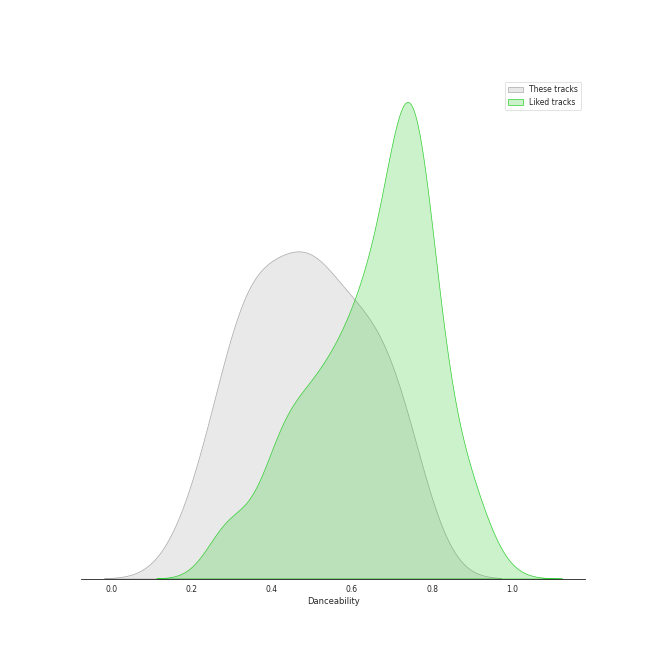
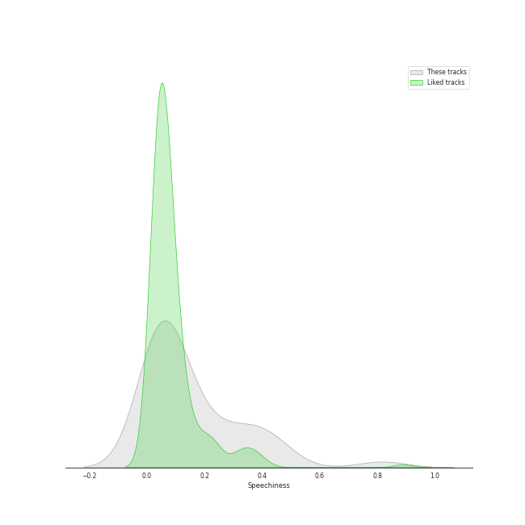
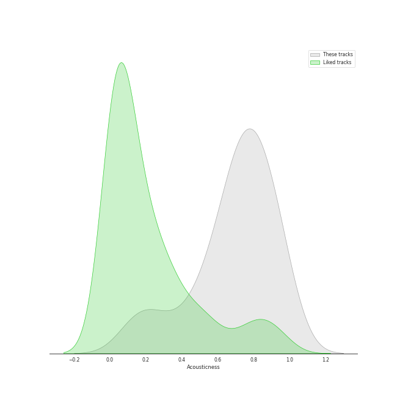
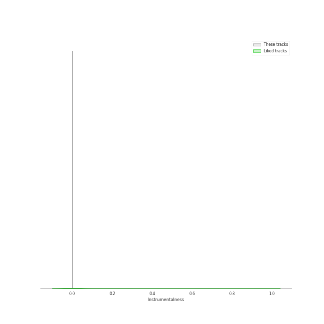

# Audio Features for show tunes

## Danceability

| 10 most Danceable tracks | 10 least Danceable tracks |
|:---|:---|
| Ten Duel Commandments (0.887) | On My Own (0.321) |
| Washington on Your Side (0.884) | Into the Unknown (0.323) |
| A Winter's Ball (0.854) | A Little Fall Of Rain (0.324) |
| Blow Us All Away (0.82) | Do You Hear The People Sing? (0.328) |
| The Adams Administration (0.8) | On My Own (0.338) |
| Farmer Refuted (0.795) | Who Lives, Who Dies, Who Tells Your Story (0.353) |
| Non-Stop (0.77) | Empty Chairs At Empty Tables (0.386) |
| Yorktown (The World Turned Upside Down) (0.76) | History Has Its Eyes on You (0.438) |
| Say No to This (0.754) | One Last Time (0.449) |
| Cabinet Battle #2 (0.753) | Hurricane (0.453) |

## Energy

| 10 most Energetic tracks | 10 least Energetic tracks |
|:---|:---|
| Yorktown (The World Turned Upside Down) (0.883) | A Little Fall Of Rain (0.0291) |
| The Schuyler Sisters (0.727) | Empty Chairs At Empty Tables (0.0688) |
| Guns and Ships (0.666) | On My Own (0.0816) |
| Cabinet Battle #1 (0.658) | Best of Wives and Best of Women (0.115) |
| My Shot (0.649) | On My Own (0.119) |
| Meet Me Inside (0.643) | It's Quiet Uptown (0.187) |
| Schuyler Defeated (0.597) | That Would Be Enough (0.2) |
| Satisfied (0.593) | Dear Theodosia (0.221) |
| What'd I Miss (0.577) | The Story of Tonight (0.237) |
| The Reynolds Pamphlet (0.573) | Stay Alive - Reprise (0.246) |

## Speechiness

| 10 most Speechy tracks | 10 least Speechy tracks |
|:---|:---|
| Aaron Burr, Sir (0.818) | History Has Its Eyes on You (0.0291) |
| Ten Duel Commandments (0.658) | Dear Theodosia (0.0303) |
| The World Was Wide Enough (0.648) | Let It Go - From "Frozen"/Soundtrack Version (0.0305) |
| The Adams Administration (0.544) | That Would Be Enough (0.0355) |
| Cabinet Battle #2 (0.537) | Do You Hear The People Sing? (0.0379) |
| We Know (0.523) | On My Own (0.0381) |
| A Winter's Ball (0.507) | A Little Fall Of Rain (0.0405) |
| Your Obedient Servant (0.502) | Into the Unknown (0.0413) |
| Right Hand Man (0.492) | It's Quiet Uptown (0.0423) |
| Meet Me Inside (0.474) | Empty Chairs At Empty Tables (0.0496) |

## Acousticness

| 10 most Acoustic tracks | 10 least Acoustic tracks |
|:---|:---|
| On My Own (0.967) | The Reynolds Pamphlet (0.0277) |
| A Little Fall Of Rain (0.955) | Cabinet Battle #2 (0.0582) |
| Empty Chairs At Empty Tables (0.944) | Ten Duel Commandments (0.0691) |
| Dear Theodosia (0.907) | Cabinet Battle #1 (0.0859) |
| Do You Hear The People Sing? (0.886) | Wait for It (0.124) |
| On My Own (0.883) | My Shot (0.15) |
| Into the Unknown (0.849) | Washington on Your Side (0.165) |
| The Story of Tonight (0.835) | What'd I Miss (0.169) |
| That Would Be Enough (0.819) | Right Hand Man (0.177) |
| History Has Its Eyes on You (0.803) | The Schuyler Sisters (0.187) |

## Instrumentalness

| 10 most Instrumental tracks | 10 least Instrumental tracks |
|:---|:---|
| Into the Unknown (0.000544) | Schuyler Defeated (0.0) |
| On My Own (0.000126) | Baby It's Cold Outside (with Michael Bublé) (0.0) |
| Dear Theodosia (4.19e-05) | One Last Time (0.0) |
| Empty Chairs At Empty Tables (1.22e-05) | The Election of 1800 (0.0) |
| A Little Fall Of Rain (6.51e-06) | The Story of Tonight (0.0) |
| Wait for It (4.04e-06) | The World Was Wide Enough (0.0) |
| Non-Stop (0.0) | Do You Hear The People Sing? (0.0) |
| Guns and Ships (0.0) | Let It Go - From "Frozen"/Soundtrack Version (0.0) |
| Who Lives, Who Dies, Who Tells Your Story (0.0) | Hurricane (0.0) |
| The Reynolds Pamphlet (0.0) | The Story of Tonight - Reprise (0.0) |

## Liveness

| 10 most Live tracks | 10 least Live tracks |
|:---|:---|
| Yorktown (The World Turned Upside Down) (0.727) | Your Obedient Servant (0.042) |
| I Know Him (0.722) | Farmer Refuted (0.0548) |
| The Room Where It Happens (0.664) | Dear Theodosia (0.0723) |
| The Story of Tonight (0.648) | Washington on Your Side (0.0756) |
| The Schuyler Sisters (0.627) | It's Quiet Uptown (0.0785) |
| Ten Duel Commandments (0.617) | Stay Alive - Reprise (0.0801) |
| Blow Us All Away (0.563) | One Last Time (0.0805) |
| Cabinet Battle #1 (0.489) | Guns and Ships (0.0844) |
| Meet Me Inside (0.363) | Best of Wives and Best of Women (0.0858) |
| Cabinet Battle #2 (0.353) | A Winter's Ball (0.0889) |

## Valence

| 10 most Happy tracks | 10 least Happy tracks |
|:---|:---|
| Schuyler Defeated (0.842) | Empty Chairs At Empty Tables (0.115) |
| Ten Duel Commandments (0.828) | On My Own (0.155) |
| The Schuyler Sisters (0.792) | Who Lives, Who Dies, Who Tells Your Story (0.156) |
| The Adams Administration (0.792) | That Would Be Enough (0.185) |
| Helpless (0.737) | On My Own (0.205) |
| We Know (0.692) | It's Quiet Uptown (0.227) |
| A Winter's Ball (0.688) | Burn (0.255) |
| Blow Us All Away (0.665) | A Little Fall Of Rain (0.264) |
| The Election of 1800 (0.645) | History Has Its Eyes on You (0.274) |
| Meet Me Inside (0.644) | Dear Theodosia (0.274) |

## Tempo

| 10 most Fast tracks | 10 least Fast tracks |
|:---|:---|
| My Shot (180.466) | A Little Fall Of Rain (63.337) |
| What'd I Miss (177.787) | The Election of 1800 (67.426) |
| One Last Time (176.989) | On My Own (71.842) |
| The Room Where It Happens (173.552) | Who Lives, Who Dies, Who Tells Your Story (75.5) |
| Hurricane (171.289) | Do You Hear The People Sing? (76.744) |
| Your Obedient Servant (165.908) | History Has Its Eyes on You (77.415) |
| Aaron Burr, Sir (160.387) | Farmer Refuted (77.879) |
| Stay Alive - Reprise (160.031) | Ten Duel Commandments (77.977) |
| Stay Alive (159.65) | Helpless (79.009) |
| Right Hand Man (158.576) | Say No to This (81.035) |
