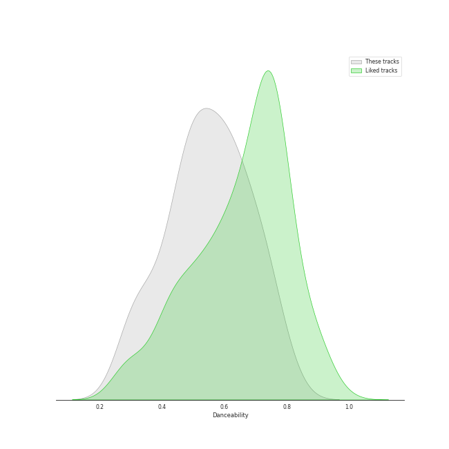
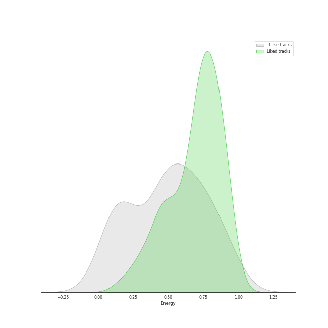
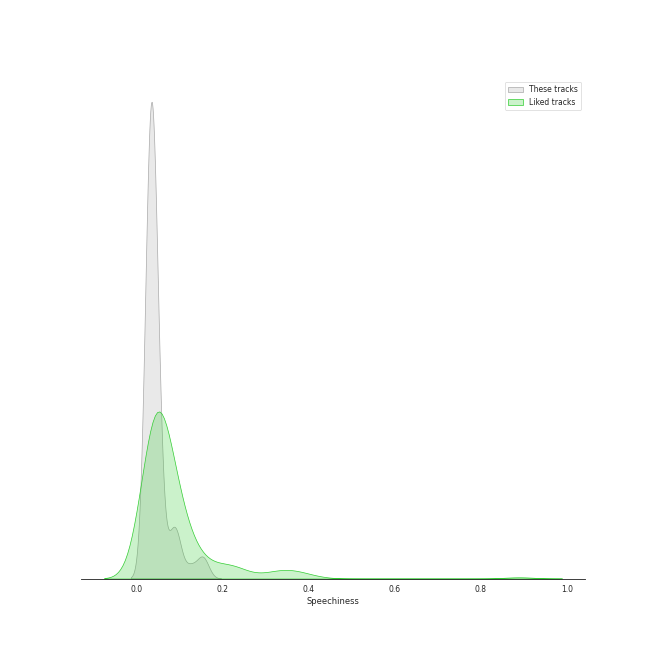
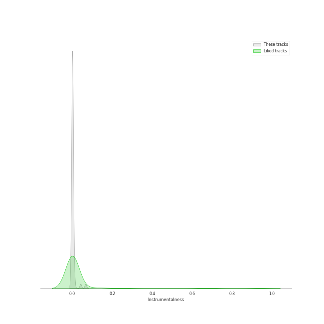
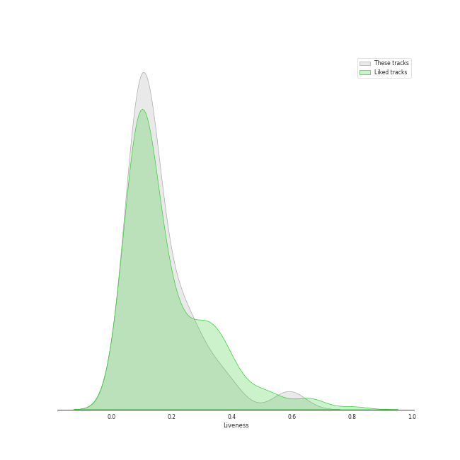
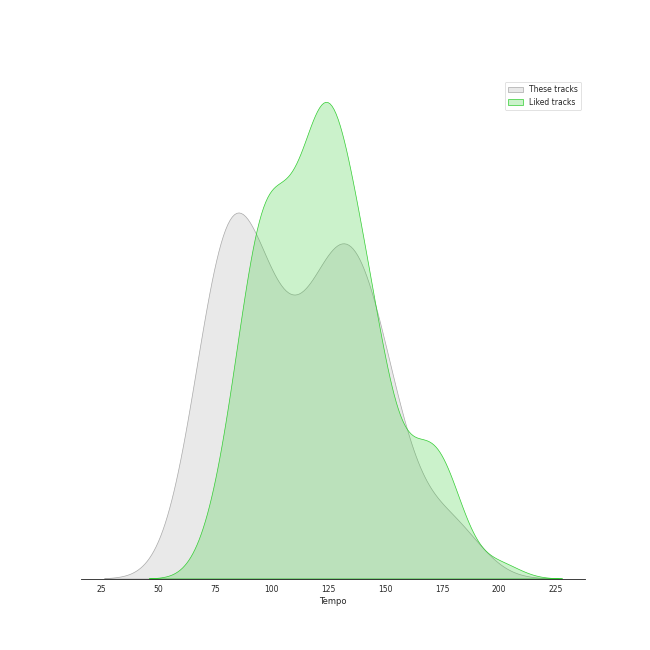

# Track Features for singer-songwriter

## Danceability

| ​ | 10 most Danceable tracks | ​​ | 10 least Danceable tracks |
|:---|:---|:---|:---|
|  | You Can Call Me Al (0.776) |  | She's Always a Woman (0.292) |
|  | My Life (0.741) |  | Shadowboxer (0.298) |
|  | A Matter of Trust (0.738) |  | Mykonos (0.3) |
|  | We Didn't Start the Fire (0.712) |  | Piano Man (0.334) |
|  | I Feel the Earth Move (0.711) |  | And So It Goes (0.351) |
|  | Uptown Girl (0.701) |  | The Boxer (0.351) |
|  | A Case of You (0.693) |  | Captain Jack (0.392) |
|  | Don't Ask Me Why (0.691) |  | Scenes from an Italian Restaurant (0.415) |
|  | The Stranger (0.664) |  | The Pirate of Penance (0.429) |
|  | Movin' Out (Anthony's Song) (0.664) |  | And So It Goes (0.433) |

## Energy

| ​ | 10 most Energetic tracks | ​​ | 10 least Energetic tracks |
|:---|:---|:---|:---|
|  | We Didn't Start the Fire (0.967) |  | And So It Goes (0.0387) |
|  | Uptown Girl (0.944) |  | The Boxer (0.0802) |
|  | Scenes from an Italian Restaurant (0.931) |  | And So It Goes (0.0871) |
|  | Movin' Out (Anthony's Song) (0.88) |  | Blue (0.102) |
|  | The Stranger (0.878) |  | The Dawntreader (0.103) |
|  | Only the Good Die Young (0.872) |  | She's Got a Way (0.142) |
|  | You Oughta Know (0.831) |  | I Can't Make You Love Me (0.149) |
|  | Hammer And A Nail (0.811) |  | I Had a King (0.151) |
|  | I'm a Believer - 2006 Remaster (0.775) |  | Lullabye (Goodnight, My Angel) (0.157) |
|  | You Can Call Me Al (0.763) |  | So Far Away (0.172) |

## Speechiness

| ​ | 10 most Speechy tracks | ​​ | 10 least Speechy tracks |
|:---|:---|:---|:---|
|  | Only the Good Die Young (0.159) |  | The Longest Time (0.0262) |
|  | Scenes from an Italian Restaurant (0.126) |  | Turn the Lights Back On (0.0264) |
|  | Big Shot (0.0972) |  | White Winter Hymnal (0.0268) |
|  | Crazy Love - 2013 Remaster (0.0959) |  | White Winter Hymnal (0.0268) |
|  | I Want You To Love Me (0.09) |  | A Matter of Trust (0.0268) |
|  | The Stranger (0.0837) |  | Piano Man (0.0276) |
|  | Crazy Love (0.0819) |  | A Case of You (0.0288) |
|  | The River of Dreams (0.0576) |  | Light As the Breeze (0.0295) |
|  | You Oughta Know (0.0557) |  | Can I Believe You (0.03) |
|  | Don't Ask Me Why (0.0543) |  | Shadowboxer (0.0303) |

## Acousticness

| ​ | 10 most Acoustic tracks | ​​ | 10 least Acoustic tracks |
|:---|:---|:---|:---|
|  | Blue (0.989) |  | Pressure (0.0148) |
|  | The Pirate of Penance (0.973) |  | A Matter of Trust (0.0589) |
|  | She's Got a Way (0.97) |  | Uptown Girl (0.0755) |
|  | I Had a King (0.968) |  | We Didn't Start the Fire (0.0771) |
|  | The Dawntreader (0.957) |  | My Life (0.108) |
|  | Lullabye (Goodnight, My Angel) (0.948) |  | Hammer And A Nail (0.112) |
|  | And So It Goes (0.941) |  | Don't Ask Me Why (0.138) |
|  | The Boxer (0.93) |  | Big Shot (0.156) |
|  | And So It Goes (0.91) |  | Only the Good Die Young (0.159) |
|  | A Case of You (0.9) |  | The Stranger (0.165) |

## Instrumentalness

| ​ | 10 most Instrumental tracks | ​​ | 10 least Instrumental tracks |
|:---|:---|:---|:---|
|  | Can I Believe You (0.0664) |  | You Oughta Know (0.0) |
|  | I Want You To Love Me (0.0414) |  | White Winter Hymnal (0.0) |
|  | I Had a King (0.0108) |  | Shadowboxer (0.0) |
|  | You Can Call Me Al (0.00647) |  | Carey (0.0) |
|  | Blue (0.00354) |  | Turn the Lights Back On (0.0) |
|  | I Feel the Earth Move (0.00226) |  | And So It Goes (0.0) |
|  | My Life (0.00139) |  | Hammer And A Nail (0.0) |
|  | Pressure (0.000949) |  | Free Man in Paris (0.0) |
|  | Mykonos (0.000834) |  | Cat's in the Cradle (0.0) |
|  | Scenes from an Italian Restaurant (0.000501) |  | Only the Good Die Young (0.0) |

## Liveness

| ​ | 10 most Live tracks | ​​ | 10 least Live tracks |
|:---|:---|:---|:---|
|  | You Oughta Know (0.736) |  | I Feel the Earth Move (0.0528) |
|  | Uptown Girl (0.601) |  | My Life (0.0555) |
|  | Big Yellow Taxi (0.581) |  | Movin' Out (Anthony's Song) (0.0591) |
|  | Brown Eyed Girl (0.406) |  | The Boxer (0.0619) |
|  | Captain Jack (0.374) |  | The River of Dreams (0.0667) |
|  | We Didn't Start the Fire (0.356) |  | Free Man in Paris (0.0691) |
|  | New York State of Mind (0.323) |  | So Far Away (0.0753) |
|  | Piano Man (0.312) |  | Vienna (0.0754) |
|  | A Matter of Trust (0.306) |  | You Can Call Me Al (0.077) |
|  | Turn the Lights Back On (0.271) |  | The Stranger (0.0812) |

## Valence

| ​ | 10 most Happy tracks | ​​ | 10 least Happy tracks |
|:---|:---|:---|:---|
|  | Big Yellow Taxi (0.97) |  | I Can't Make You Love Me (0.113) |
|  | I'm a Believer - 2006 Remaster (0.962) |  | I Had a King (0.136) |
|  | Brown Eyed Girl (0.908) |  | The Pirate of Penance (0.162) |
|  | Movin' Out (Anthony's Song) (0.895) |  | Light As the Breeze (0.19) |
|  | We Didn't Start the Fire (0.895) |  | New York State of Mind (0.194) |
|  | A Matter of Trust (0.88) |  | She's Got a Way (0.196) |
|  | Don't Ask Me Why (0.868) |  | Lullabye (Goodnight, My Angel) (0.22) |
|  | Pressure (0.851) |  | The Stranger (0.222) |
|  | You Can Call Me Al (0.82) |  | Shadowboxer (0.223) |
|  | My Life (0.804) |  | The Dawntreader (0.235) |

## Tempo

| ​ | 10 most Fast tracks | ​​ | 10 least Fast tracks |
|:---|:---|:---|:---|
|  | The Boxer (181.849) |  | Moondance - 2013 Remaster (67.409) |
|  | Piano Man (179.239) |  | Shadowboxer (74.131) |
|  | She's Always a Woman (176.631) |  | Carey (75.368) |
|  | Brown Eyed Girl (150.566) |  | She's Got a Way (75.859) |
|  | Big Shot (149.861) |  | Only the Good Die Young (76.214) |
|  | Pressure (148.494) |  | Lullabye (Goodnight, My Angel) (76.48) |
|  | Captain Jack (146.657) |  | Can I Believe You (77.415) |
|  | Hammer And A Nail (145.152) |  | Crazy Love - 2013 Remaster (77.464) |
|  | We Didn't Start the Fire (145.024) |  | Crazy Love (77.539) |
|  | So Far Away (143.837) |  | Cat's in the Cradle (78.111) |
