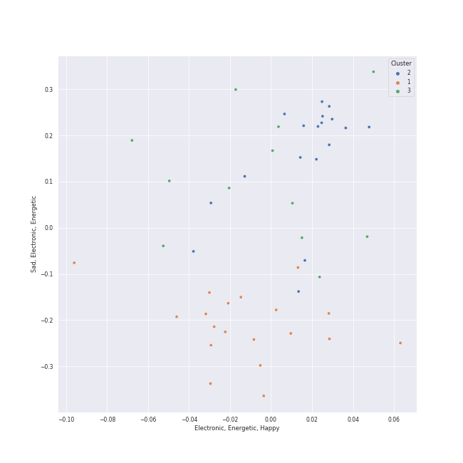

# Clusters in singer-songwriter

## Cluster #1

12 tracks

| Art | Track | Album | Artists | Label | Score | 💚 | 🔗 |
|:---|:---|:---|:---|:---|---:|:---|:---|
|  | Brown Eyed Girl | Blowin' Your Mind! | Van Morrison | [Columbia](../../../../labels/columbia), [Legacy](../../../../labels/legacy) | 0 | 💚 | [🔗](https://open.spotify.com/track/3yrSvpt2l1xhsV9Em88Pul) |
|  | Only the Good Die Young | The Stranger | [Billy Joel](../../../../artists/billy_joel/overview.md) | [Columbia](../../../../labels/columbia) | 0 | 💚 | [🔗](https://open.spotify.com/track/2xabqm0YNQCTcPteQjJ22K) |
|  | We Didn't Start the Fire | Storm Front | [Billy Joel](../../../../artists/billy_joel/overview.md) | [Columbia](../../../../labels/columbia) | 0 | | [🔗](https://open.spotify.com/track/3Cx4yrFaX8CeHwBMReOWXI) |
|  | Big Shot | 52nd Street | [Billy Joel](../../../../artists/billy_joel/overview.md) | [Columbia](../../../../labels/columbia) | 0 | | [🔗](https://open.spotify.com/track/22wxe2Yc9JzihICXYLGAQ7) |
|  | My Life | 52nd Street | [Billy Joel](../../../../artists/billy_joel/overview.md) | [Columbia](../../../../labels/columbia) | 0 | 💚 | [🔗](https://open.spotify.com/track/4ZoBC5MhSEzuknIgAkBaoT) |
|  | Pressure | The Nylon Curtain | [Billy Joel](../../../../artists/billy_joel/overview.md) | [Columbia](../../../../labels/columbia) | 0 | | [🔗](https://open.spotify.com/track/3LqvmDtXWXjF7fg8mh8iZh) |
|  | A Matter of Trust | The Bridge | [Billy Joel](../../../../artists/billy_joel/overview.md) | [Columbia](../../../../labels/columbia) | 0 | 💚 | [🔗](https://open.spotify.com/track/6J212smZzpeOCYQ9DITMSC) |
|  | Don't Ask Me Why | Glass Houses | [Billy Joel](../../../../artists/billy_joel/overview.md) | [Columbia](../../../../labels/columbia) | 0 | | [🔗](https://open.spotify.com/track/6g4vHtdGqD5eEgpf7nKISk) |
|  | You Can Call Me Al | Graceland (25th Anniversary Deluxe Edition) | Paul Simon | Legacy Recordings | 0 | | [🔗](https://open.spotify.com/track/0qxYx4F3vm1AOnfux6dDxP) |
|  | Hammer And A Nail | Nomads · Indians · Saints (Expanded Edition) | Indigo Girls | [Epic](../../../../labels/epic) | 0 | 💚 | [🔗](https://open.spotify.com/track/2OV25P5lmVqnjKnWfj0FeP) |
## Cluster #2

15 tracks

| Art | Track | Album | Artists | Label | Score | 💚 | 🔗 |
|:---|:---|:---|:---|:---|---:|:---|:---|
|  | Crazy Love - 2013 Remaster | Moondance (Expanded Edition) | Van Morrison | [Warner Records](../../../../labels/warner_records) | 0 | | [🔗](https://open.spotify.com/track/2hjAc6x8EoSLhGxRNg8KEw) |
|  | And So It Goes | Storm Front | [Billy Joel](../../../../artists/billy_joel/overview.md) | [Columbia](../../../../labels/columbia) | 0 | 💚 | [🔗](https://open.spotify.com/track/1u7kQUb3lQcpHaYRfia13A) |
|  | And So It Goes | Good Vibrations | [Billy Joel](../../../../artists/billy_joel/overview.md), The King's Singers | RCA Victor | 0 | | [🔗](https://open.spotify.com/track/1v8w3Ve0EYhy8cMlRR92QM) |
|  | Lullabye (Goodnight, My Angel) | River Of Dreams | [Billy Joel](../../../../artists/billy_joel/overview.md) | [Columbia](../../../../labels/columbia) | 0 | 💚 | [🔗](https://open.spotify.com/track/4cURHmiuYii52BVbhrGbv0) |
|  | She's Got a Way | Cold Spring Harbor | [Billy Joel](../../../../artists/billy_joel/overview.md) | [Columbia](../../../../labels/columbia) | 0 | | [🔗](https://open.spotify.com/track/3Ie2eLOIj2IhKnzPwXrLbJ) |
|  | The Dawntreader | Song to a Seagull | [Joni Mitchell](../../../../artists/joni_mitchell/overview.md) | [Rhino](../../../../labels/rhino) | 0 | 💚 | [🔗](https://open.spotify.com/track/0KE9YElZqPumrpm9ovtXlN) |
|  | The Pirate of Penance | Song to a Seagull | [Joni Mitchell](../../../../artists/joni_mitchell/overview.md) | [Rhino](../../../../labels/rhino) | 0 | | [🔗](https://open.spotify.com/track/53QbBfo0PTUKfOBM0YoPU7) |
|  | I Had a King | Song to a Seagull | [Joni Mitchell](../../../../artists/joni_mitchell/overview.md) | [Rhino](../../../../labels/rhino) | 0 | 💚 | [🔗](https://open.spotify.com/track/6rj2z2taVIxPRnzx5LJkGm) |
|  | Blue | Blue | [Joni Mitchell](../../../../artists/joni_mitchell/overview.md) | [Rhino](../../../../labels/rhino) | 0 | | [🔗](https://open.spotify.com/track/1yWIsH3TC51gmzvQxZNCQC) |
|  | So Far Away | Tapestry | Carole King | Ode, [Epic](../../../../labels/epic), [Legacy](../../../../labels/legacy) | 0 | | [🔗](https://open.spotify.com/track/4HHge4zAyIw3pkrtFzmwCl) |
## Cluster #3

27 tracks

| Art | Track | Album | Artists | Label | Score | 💚 | 🔗 |
|:---|:---|:---|:---|:---|---:|:---|:---|
|  | Moondance - 2013 Remaster | Moondance (Deluxe Edition) | Van Morrison | [Warner Records](../../../../labels/warner_records) | 0 | 💚 | [🔗](https://open.spotify.com/track/683b4ikwa62JevCjwrmfg6) |
|  | Turn the Lights Back On | Turn the Lights Back On | [Billy Joel](../../../../artists/billy_joel/overview.md) | [Columbia](../../../../labels/columbia) | 0 | 💚 | [🔗](https://open.spotify.com/track/1KTemUlHzS0SvVtTjY1NTw) |
|  | Captain Jack | Piano Man | [Billy Joel](../../../../artists/billy_joel/overview.md) | [Columbia](../../../../labels/columbia) | 0 | 💚 | [🔗](https://open.spotify.com/track/3igkLltDaiFiMl83IdDBfm) |
|  | White Winter Hymnal | Fleet Foxes | Fleet Foxes | Sub Pop Records | 93 | 💚 | [🔗](https://open.spotify.com/track/0GegHVxeozw3rdjte45Bfx) |
|  | White Winter Hymnal | Fleet Foxes | Fleet Foxes | Sub Pop Records | 0 | | [🔗](https://open.spotify.com/track/3QVtICc8ViNOy4I5K14d8Z) |
|  | Can I Believe You | Shore | Fleet Foxes | Anti/Epitaph | 0 | 💚 | [🔗](https://open.spotify.com/track/3pYB28IRzhtR5cHXLINchp) |
|  | Free Man in Paris | Court and Spark | [Joni Mitchell](../../../../artists/joni_mitchell/overview.md) | [Rhino](../../../../labels/rhino) | 0 | 💚 | [🔗](https://open.spotify.com/track/2by5mqpQ1ZP2G5FOIccMnu) |
|  | I Want You To Love Me | Fetch The Bolt Cutters | Fiona Apple | [Epic](../../../../labels/epic) | 0 | | [🔗](https://open.spotify.com/track/73SBAGI4fPFm4VkB3NjXq8) |
|  | Cat's in the Cradle | Verities & Balderdash | Harry Chapin | [Rhino/Elektra](../../../../labels/rhino) | 0 | 💚 | [🔗](https://open.spotify.com/track/2obblQ6tcePeOEVJV6nEGD) |
|  | Daydream Believer | The Birds, The Bees, & The Monkees | The Monkees | [Rhino](../../../../labels/rhino) | 0 | | [🔗](https://open.spotify.com/track/7uEcCGtM1FBBGIhPozhJjv) |