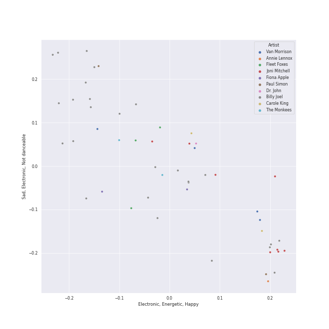
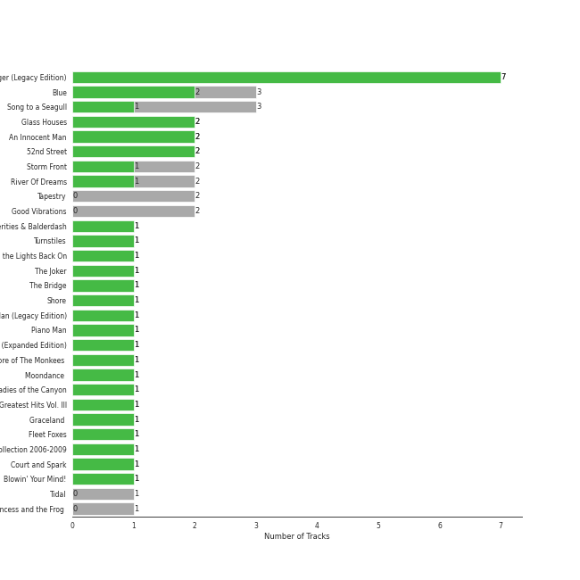

# singer-songwriter

50 songs

[See Track Features](audio_features.md)

[See Clusters](clusters/overview.md)

## Top Artists

| Art | Tracks | 💚 | Artist | 🔗 |
|:---|---:|---:|:---|:---|
|  | 25 | 17 | [Billy Joel](../../artists/billy_joel/overview.md) | [🔗](https://open.spotify.com/artist/6zFYqv1mOsgBRQbae3JJ9e) |
|  | 8 | 6 | [Joni Mitchell](../../artists/joni_mitchell/overview.md) | [🔗](https://open.spotify.com/artist/5hW4L92KnC6dX9t7tYM4Ve) |
|  | 4 | 2 | Van Morrison | [🔗](https://open.spotify.com/artist/44NX2ffIYHr6D4n7RaZF7A) |
|  | 2 | 1 | The Monkees | [🔗](https://open.spotify.com/artist/320EPCSEezHt1rtbfwH6Ck) |
|  | 1 | 1 | Alanis Morissette | [🔗](https://open.spotify.com/artist/6ogn9necmbUdCppmNnGOdi) |
|  | 1 | 1 | Steve Miller Band | [🔗](https://open.spotify.com/artist/6QtGlUje9TIkLrgPZrESuk) |
|  | 1 | 1 | Indigo Girls | [🔗](https://open.spotify.com/artist/4wM29TDTr3HI0qFY3KoSFG) |
|  | 1 | 1 | Harry Chapin | [🔗](https://open.spotify.com/artist/42q4Ivs7tAiCZ5C7eG5q4c) |
|  | 2 | 0 | The King's Singers | [🔗](https://open.spotify.com/artist/5lR7yDVN4z9kahOiUSlMhe) |
|  | 2 | 0 | Carole King | [🔗](https://open.spotify.com/artist/319yZVtYM9MBGqmSQnMyY6) |

See all 14 artists

| Art | Tracks | 💚 | Artist | 🔗 |
|:---|---:|---:|:---|:---|
|  | 2 | 0 | Paul Simon | [🔗](https://open.spotify.com/artist/2CvCyf1gEVhI0mX6aFXmVI) |
|  | 1 | 0 | Bonnie Raitt | [🔗](https://open.spotify.com/artist/4KDyYWR7IpxZ7xrdYbKrqY) |
|  | 1 | 0 | Fleet Foxes | [🔗](https://open.spotify.com/artist/4EVpmkEwrLYEg6jIsiPMIb) |
|  | 1 | 0 | Fiona Apple | [🔗](https://open.spotify.com/artist/3g2kUQ6tHLLbmkV7T4GPtL) |

## Top Albums

| Art | Tracks | 💚 | Album | Release Date | 🔗 |
|:---|---:|---:|:---|:---|:---|
|  | 7 | 6 | The Stranger | 1977-09-29 | [🔗](https://open.spotify.com/album/3IILMjMMnoN2sKzgesX8KV) |
|  | 3 | 2 | Song to a Seagull | 1968-03-01 | [🔗](https://open.spotify.com/album/6rg3WTvmv68Vd6tgR0yS0E) |
|  | 3 | 2 | Blue | 1971-06-22 | [🔗](https://open.spotify.com/album/1vz94WpXDVYIEGja8cjFNa) |
|  | 2 | 2 | Piano Man | 1973-11-09 | [🔗](https://open.spotify.com/album/77ErLrVvYETIlQJHAwhfIH) |
|  | 2 | 2 | An Innocent Man | 1983-08-08 | [🔗](https://open.spotify.com/album/3R3x4zIabsvpD3yxqLaUpc) |
|  | 2 | 1 | Storm Front | 1989-10-17 | [🔗](https://open.spotify.com/album/1Vw2uoVkLAJFVViJ1QyK1D) |
|  | 2 | 1 | River Of Dreams | 1993-08-10 | [🔗](https://open.spotify.com/album/4HPnwQJAEvTY910q4RNeOu) |
|  | 2 | 1 | 52nd Street | 1978-10-13 | [🔗](https://open.spotify.com/album/1HmCO8VK98AU6EXPOjGYyI) |
|  | 2 | 0 | Tapestry | 1971 | [🔗](https://open.spotify.com/album/12n11cgnpjXKLeqrnIERoS) |
|  | 2 | 0 | Good Vibrations | 1993 | [🔗](https://open.spotify.com/album/10IUKCLZPs9onPwXfQVxfv) |

See all 33 albums

| Art | Tracks | 💚 | Album | Release Date | 🔗 |
|:---|---:|---:|:---|:---|:---|
|  | 1 | 1 | Verities & Balderdash | 1974 | [🔗](https://open.spotify.com/album/3nta4nhqWoWjc6LmHIB0kT) |
|  | 1 | 1 | Turnstiles | 1976-05-19 | [🔗](https://open.spotify.com/album/7GiLfxL1su3MSqz7pmKMZi) |
|  | 1 | 1 | Turn the Lights Back On | 2024-02-01 | [🔗](https://open.spotify.com/album/4csPGLYTb7kt85U377UCuC) |
|  | 1 | 1 | The Joker | 1973-01-01 | [🔗](https://open.spotify.com/album/5uYNj1HkZrWKAkhEYcGmJr) |
|  | 1 | 1 | The Bridge | 1986-07-28 | [🔗](https://open.spotify.com/album/2fRxSC6FtiAkhEDVZr2seH) |
|  | 1 | 1 | Nomads · Indians · Saints (Expanded Edition) | 1990-09-21 | [🔗](https://open.spotify.com/album/1KpKdn4HLsD9OAN6GEYAIb) |
|  | 1 | 1 | More of The Monkees (Deluxe Edition) | 1967-01-09 | [🔗](https://open.spotify.com/album/50zHjIiTOZM232gnWvOydX) |
|  | 1 | 1 | Moondance (Deluxe Edition) | 1970-02 | [🔗](https://open.spotify.com/album/7diHYi0CglGJekoM3KaWBK) |
|  | 1 | 1 | Ladies of the Canyon | 1970-03-01 | [🔗](https://open.spotify.com/album/7JOdtLDLyXJIppDRB7kxr9) |
|  | 1 | 1 | Jagged Little Pill | 1995-06-09 | [🔗](https://open.spotify.com/album/09AwlP99cHfKVNKv4FC8VW) |
|  | 1 | 1 | Greatest Hits Vol. III | 1997-06-13 | [🔗](https://open.spotify.com/album/3cJ6ZymbUcNGe1T8YZtGyE) |
|  | 1 | 1 | Court and Spark | 1974-01-17 | [🔗](https://open.spotify.com/album/2akjxkzFolkeV72Yyv5KrM) |
|  | 1 | 1 | Blowin' Your Mind! | 1967-09 | [🔗](https://open.spotify.com/album/7dsWupQRlFuhG8FGiQAUjC) |
|  | 1 | 0 | Tidal | 1996-07-23 | [🔗](https://open.spotify.com/album/5gVBXH8MT6zfdRkjp7qT18) |
|  | 1 | 0 | The Nylon Curtain | 1982-06-23 | [🔗](https://open.spotify.com/album/50bajZpetfL5T0iRCOR74J) |
|  | 1 | 0 | The Essential Van Morrison | 2015-12-04 | [🔗](https://open.spotify.com/album/0RXzDyBEGd2EGQTmv8cxQa) |
|  | 1 | 0 | The Birds, The Bees, & The Monkees | 1968-04-22 | [🔗](https://open.spotify.com/album/2Ov6zb7NfgDh3EXSIIWrb2) |
|  | 1 | 0 | Moondance (Expanded Edition) | 1970-02 | [🔗](https://open.spotify.com/album/6yNYC35npMBHbxG0Vle83O) |
|  | 1 | 0 | Luck Of The Draw | 1991-01-01 | [🔗](https://open.spotify.com/album/6blrkOZ0VmkhYPjfoD7eqf) |
|  | 1 | 0 | Graceland (25th Anniversary Deluxe Edition) | 1986-08-12 | [🔗](https://open.spotify.com/album/6WgGWYw6XXQyLTsWt7tXky) |
|  | 1 | 0 | Glass Houses | 1980-03-12 | [🔗](https://open.spotify.com/album/5sztejERqpktXEdemlUvU5) |
|  | 1 | 0 | Fleet Foxes | 2008-06-03 | [🔗](https://open.spotify.com/album/6XzZ5pg9buAKNYg293KOQ8) |
|  | 1 | 0 | Cold Spring Harbor | 1971-11-01 | [🔗](https://open.spotify.com/album/274rMlKrr22086ohmwAJZA) |

## Top Record Labels

| Tracks | 💚 | Label |
|---:|---:|:---|
| 25 | 18 | [Columbia](../../labels/columbia/overview.md) |
| 11 | 8 | [Rhino](../../labels/rhino/overview.md) |
| 3 | 1 | [Legacy](../../labels/legacy/overview.md) |
| 3 | 1 | [Epic](../../labels/epic/overview.md) |
| 2 | 1 | [Warner Records](../../labels/warner_records/overview.md) |
| 1 | 1 | Maverick |
| 1 | 1 | Elektra |
| 1 | 1 | CAPITOL CATALOG MKT (C92) |
| 2 | 0 | RCA Victor |
| 2 | 0 | Ode |

See all 15 labels

| Tracks | 💚 | Label |
|---:|---:|:---|
| 2 | 0 | Legacy Recordings |
| 1 | 0 | Work |
| 1 | 0 | Sub Pop Records |
| 1 | 0 | Clean Slate |
| 1 | 0 | [Capitol Records](../../labels/capitol_records/overview.md) |

## Top Producers

| Art | Producer | Tracks | Credit Types |
|:---|:---|---:|:---|
|  | [Billy Joel](../../artists/billy_joel/overview.md) | 15 | Lyricist, Producer, Songwriter, Arranger |
| | Jim Boyer | 9 | Producer |
| | Phil Ramone | 9 | Producer |
|  | [Joni Mitchell](../../artists/joni_mitchell/overview.md) | 5 | Lyricist, Songwriter, Producer |
| | Michael Stewart | 2 | Producer |
| | Ron Malo | 2 | Producer |
|  | Van Morrison | 2 | Lyricist, Producer, Songwriter |
| | Michael Omartian | 2 | Arranger |
| | Fred Tenny | 1 | Producer |
| | Jimmy Boyelle | 1 | Producer |

View all

| Art | Producer | Tracks | Credit Types |
|:---|:---|---:|:---|
| | Elliot Scheiner | 1 | Producer |
| | Jim Horn | 1 | Arranger |
| | Liberty DeVitto | 1 | Arranger |
| | Neil Diamond | 1 | Lyricist, Songwriter |
| | Steve Miller | 1 | Producer, Songwriter |
| | Justin Niebank | 1 | Producer |
| | Kenny Ascher | 1 | Arranger |
|  | Harry Chapin | 1 | Songwriter |
| | Steve Lindsey | 1 | Arranger, Producer |
| | John Hendrickson | 1 | Producer |
| | Doug Stegmeyer | 1 | Arranger |
| | Leanne Ungar | 1 | Producer |
| | Tony Brown | 1 | Producer |
| | Ted Blaisdell | 1 | Producer |
| | Lewis Merenstein | 1 | Producer |
| | David Schiffman | 1 | Producer |
| | Ahmet Ertegun | 1 | Songwriter |
| | Scott Litt | 1 | Producer |
| | Chris Fogel | 1 | Producer |
| | Henry Lewy | 1 | Producer |
| | Ira Newborn | 1 | Arranger |
| | Ellis Sorkin | 1 | Producer |
| | Eddie Curtis | 1 | Songwriter |
| | Steve Boyer | 1 | Producer |
| | Lou Waxman | 1 | Producer |
| | Don Puluse | 1 | Producer |
| | Robert Charles | 1 | Producer |
| | David Dickson | 1 | Producer |
| | Bert Russell Berns | 1 | Producer |
| | John Bradley | 1 | Producer |
| | Bill Schnee | 1 | Producer |
| | Bradshaw Leigh | 1 | Producer |
| | Jay Healy | 1 | Producer |
| | Mick Jones | 1 | Producer |
| | Jim DeMain | 1 | Producer |
|  | Alanis Morissette | 1 | Lyricist, Songwriter |
| | Glen Ballard | 1 | Producer, Songwriter |
| | Danny Kortchmar | 1 | Producer |
| | Niko Bolas | 1 | Producer |
| | Emily Saliers | 1 | Lyricist, Songwriter |
| | Sandra Campbell Chapin | 1 | Songwriter |
| | Brooks Arthur | 1 | Producer |
| | Ed Cherney | 1 | Producer |
| | Leonard Cohen | 1 | Lyricist, Songwriter |
| | Bruce Botnick | 1 | Producer |

## Years

| ​ | 10 newest albums | ​​ | 10 oldest albums |
|:---|:---|:---|:---|
|  | Turn the Lights Back On (2024-02-01) |  | More of The Monkees (Deluxe Edition) (1967-01-09) |
|  | The Essential Van Morrison (2015-12-04) |  | Blowin' Your Mind! (1967-09) |
|  | Fleet Foxes (2008-06-03) |  | Song to a Seagull (1968-03-01) |
|  | Greatest Hits Vol. III (1997-06-13) |  | The Birds, The Bees, & The Monkees (1968-04-22) |
|  | Tidal (1996-07-23) |  | Moondance (Expanded Edition) (1970-02) |
|  | Jagged Little Pill (1995-06-09) |  | Moondance (Deluxe Edition) (1970-02) |
|  | River Of Dreams (1993-08-10) |  | Ladies of the Canyon (1970-03-01) |
|  | Good Vibrations (1993) |  | Tapestry (1971) |
|  | Luck Of The Draw (1991-01-01) |  | Blue (1971-06-22) |
|  | Nomads · Indians · Saints (Expanded Edition) (1990-09-21) |  | Cold Spring Harbor (1971-11-01) |

