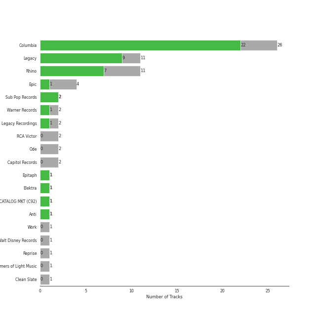

# singer-songwriter

57 songs

[See Track Features](audio_features.md)

[See Clusters](clusters/overview.md)

## Top Artists

| Art | Rank | Tracks | 💚 | Artist | 🔗 |
|:---|---:|---:|---:|:---|:---|
|  | 54 | 26 | 21 | [Billy Joel](../../artists/billy_joel/overview.md) | [🔗](https://open.spotify.com/artist/6zFYqv1mOsgBRQbae3JJ9e) |
|  | 403 | 8 | 5 | [Joni Mitchell](../../artists/joni_mitchell/overview.md) | [🔗](https://open.spotify.com/artist/5hW4L92KnC6dX9t7tYM4Ve) |
|  | 211 | 3 | 3 | Fleet Foxes | [🔗](https://open.spotify.com/artist/4EVpmkEwrLYEg6jIsiPMIb) |
|  | 434 | 4 | 2 | Van Morrison | [🔗](https://open.spotify.com/artist/44NX2ffIYHr6D4n7RaZF7A) |
|  | 434 | 2 | 1 | The Monkees | [🔗](https://open.spotify.com/artist/320EPCSEezHt1rtbfwH6Ck) |
|  | 434 | 2 | 1 | Paul Simon | [🔗](https://open.spotify.com/artist/2CvCyf1gEVhI0mX6aFXmVI) |
|  | 434 | 1 | 1 | Steve Miller Band | [🔗](https://open.spotify.com/artist/6QtGlUje9TIkLrgPZrESuk) |
|  | 434 | 1 | 1 | Indigo Girls | [🔗](https://open.spotify.com/artist/4wM29TDTr3HI0qFY3KoSFG) |
|  | 434 | 1 | 1 | Harry Chapin | [🔗](https://open.spotify.com/artist/42q4Ivs7tAiCZ5C7eG5q4c) |
|  | 434 | 2 | 0 | The King's Singers | [🔗](https://open.spotify.com/artist/5lR7yDVN4z9kahOiUSlMhe) |

See all 17 artists

| Art | Rank | Tracks | 💚 | Artist | 🔗 |
|:---|---:|---:|---:|:---|:---|
|  | 376 | 2 | 0 | Fiona Apple | [🔗](https://open.spotify.com/artist/3g2kUQ6tHLLbmkV7T4GPtL) |
|  | 434 | 2 | 0 | Carole King | [🔗](https://open.spotify.com/artist/319yZVtYM9MBGqmSQnMyY6) |
|  | 434 | 1 | 0 | Jewel | [🔗](https://open.spotify.com/artist/6FbDoZnMBTdhhhLuJBOOqP) |
|  | 434 | 1 | 0 | Annie Lennox | [🔗](https://open.spotify.com/artist/5MspMQqdVbdwP6ax3GXqum) |
|  | 434 | 1 | 0 | Bonnie Raitt | [🔗](https://open.spotify.com/artist/4KDyYWR7IpxZ7xrdYbKrqY) |
|  | 434 | 1 | 0 | The Beach Boys | [🔗](https://open.spotify.com/artist/3oDbviiivRWhXwIE8hxkVV) |
|  | 434 | 1 | 0 | Dr. John | [🔗](https://open.spotify.com/artist/320TrJub4arztwXRm7kqVO) |

## Most and least listened tracks
| Rank | ​ | Most listened tracks | Rank | ​​ | Least listened tracks |
|---:|:---|:---|---:|:---|:---|
| 326 |  | [Vienna](../../artists/billy_joel/overview.md) | 1015 |  | Daydream Believer |
| 452 |  | [Movin' Out (Anthony's Song)](../../artists/billy_joel/overview.md) | 1015 |  | [A Case of You](../../artists/joni_mitchell/overview.md) |
| 539 |  | White Winter Hymnal | 1015 |  | I Want You To Love Me |
| 579 |  | [Only the Good Die Young](../../artists/billy_joel/overview.md) | 1015 |  | [New York State of Mind](../../artists/billy_joel/overview.md) |
| 748 |  | [A Matter of Trust](../../artists/billy_joel/overview.md) | 1015 |  | [I Had a King](../../artists/joni_mitchell/overview.md) |
| 926 |  | [The Dawntreader](../../artists/joni_mitchell/overview.md) | 1015 |  | [Don't Ask Me Why](../../artists/billy_joel/overview.md) |
| 971 |  | [Piano Man](../../artists/billy_joel/overview.md) | 1015 |  | [Big Yellow Taxi](../../artists/joni_mitchell/overview.md) |
| 1010 |  | [The Longest Time](../../artists/billy_joel/overview.md) | 1015 |  | I Can't Make You Love Me |
| 1015 |  | Crazy Love | 1015 |  | Moondance - 2013 Remaster |
| 1015 |  | Shadowboxer | 1015 |  | [It's Still Rock and Roll to Me](../../artists/billy_joel/overview.md) |

## Top Albums

| Art | Rank | Tracks | 💚 | Album | Release Date | 🔗 |
|:---|---:|---:|---:|:---|:---|:---|
|  | 194 | 7 | 7 | The Stranger (Legacy Edition) | 1977 | [🔗](https://open.spotify.com/album/1Mhn9VosyjtWn4dMPFlna6) |
|  | 665 | 3 | 2 | Blue | 1971-06-22 | [🔗](https://open.spotify.com/album/1vz94WpXDVYIEGja8cjFNa) |
|  | 605 | 3 | 1 | Song to a Seagull | 1968-03-01 | [🔗](https://open.spotify.com/album/6rg3WTvmv68Vd6tgR0yS0E) |
|  | 665 | 2 | 2 | Glass Houses | 1980-03-12 | [🔗](https://open.spotify.com/album/5sztejERqpktXEdemlUvU5) |
|  | 656 | 2 | 2 | An Innocent Man | 1983-08-08 | [🔗](https://open.spotify.com/album/3R3x4zIabsvpD3yxqLaUpc) |
|  | 665 | 2 | 2 | 52nd Street | 1978-10-13 | [🔗](https://open.spotify.com/album/1HmCO8VK98AU6EXPOjGYyI) |
|  | 665 | 2 | 1 | Storm Front | 1989-10-17 | [🔗](https://open.spotify.com/album/1Vw2uoVkLAJFVViJ1QyK1D) |
|  | 665 | 2 | 1 | River Of Dreams | 1993-08-10 | [🔗](https://open.spotify.com/album/4HPnwQJAEvTY910q4RNeOu) |
|  | 665 | 2 | 0 | Tapestry | 1971 | [🔗](https://open.spotify.com/album/12n11cgnpjXKLeqrnIERoS) |
|  | 665 | 2 | 0 | Good Vibrations | 1993 | [🔗](https://open.spotify.com/album/10IUKCLZPs9onPwXfQVxfv) |

See all 40 albums

| Art | Rank | Tracks | 💚 | Album | Release Date | 🔗 |
|:---|---:|---:|---:|:---|:---|:---|
|  | 665 | 1 | 1 | Verities & Balderdash | 1974 | [🔗](https://open.spotify.com/album/3nta4nhqWoWjc6LmHIB0kT) |
|  | 665 | 1 | 1 | Turnstiles | 1976-05-19 | [🔗](https://open.spotify.com/album/7GiLfxL1su3MSqz7pmKMZi) |
|  | 665 | 1 | 1 | Turn the Lights Back On | 2024-02-01 | [🔗](https://open.spotify.com/album/4csPGLYTb7kt85U377UCuC) |
|  | 665 | 1 | 1 | The Joker | 1973-01-01 | [🔗](https://open.spotify.com/album/5uYNj1HkZrWKAkhEYcGmJr) |
|  | 499 | 1 | 1 | The Bridge | 1986-07-28 | [🔗](https://open.spotify.com/album/2fRxSC6FtiAkhEDVZr2seH) |
|  | 665 | 1 | 1 | Shore | 2020-09-22 | [🔗](https://open.spotify.com/album/0lmjCPEcec2k6L7ysNIcd3) |
|  | 634 | 1 | 1 | Piano Man (Legacy Edition) | 1973-11-07 | [🔗](https://open.spotify.com/album/69wjSAZXZiD2EBia3b3gxL) |
|  | 665 | 1 | 1 | Piano Man | 1973-11-09 | [🔗](https://open.spotify.com/album/77ErLrVvYETIlQJHAwhfIH) |
|  | 665 | 1 | 1 | Nomads · Indians · Saints (Expanded Edition) | 1990-09-21 | [🔗](https://open.spotify.com/album/1KpKdn4HLsD9OAN6GEYAIb) |
|  | 665 | 1 | 1 | More of The Monkees (Deluxe Edition) | 1967-01-09 | [🔗](https://open.spotify.com/album/50zHjIiTOZM232gnWvOydX) |
|  | 665 | 1 | 1 | Moondance (Deluxe Edition) | 1970-02 | [🔗](https://open.spotify.com/album/7diHYi0CglGJekoM3KaWBK) |
|  | 665 | 1 | 1 | Ladies of the Canyon | 1970-03-01 | [🔗](https://open.spotify.com/album/7JOdtLDLyXJIppDRB7kxr9) |
|  | 665 | 1 | 1 | Greatest Hits Vol. III | 1997-06-13 | [🔗](https://open.spotify.com/album/3cJ6ZymbUcNGe1T8YZtGyE) |
|  | 665 | 1 | 1 | Graceland (25th Anniversary Deluxe Edition) | 1986-08-12 | [🔗](https://open.spotify.com/album/6WgGWYw6XXQyLTsWt7tXky) |
|  | 374 | 1 | 1 | Fleet Foxes | 2008-06-03 | [🔗](https://open.spotify.com/album/5GRnydamKvIeG46dycID6v) |
|  | 665 | 1 | 1 | First Collection 2006-2009 | 2018-11-09 | [🔗](https://open.spotify.com/album/6ou9sQOsIY5xIIX417L3ud) |
|  | 665 | 1 | 1 | Court and Spark | 1974-01-17 | [🔗](https://open.spotify.com/album/2akjxkzFolkeV72Yyv5KrM) |
|  | 665 | 1 | 1 | Blowin' Your Mind! | 1967-09 | [🔗](https://open.spotify.com/album/7dsWupQRlFuhG8FGiQAUjC) |
|  | 665 | 1 | 0 | Tidal | 1996-07-23 | [🔗](https://open.spotify.com/album/5gVBXH8MT6zfdRkjp7qT18) |
|  | 665 | 1 | 0 | The Princess and the Frog (Original Motion Picture Soundtrack) | 2009-11-23 | [🔗](https://open.spotify.com/album/0CcL28OkH89kjgKpNZC8sW) |
|  | 665 | 1 | 0 | The Nylon Curtain | 1982-06-23 | [🔗](https://open.spotify.com/album/50bajZpetfL5T0iRCOR74J) |
|  | 665 | 1 | 0 | The Merry Goes Round | 2011-09-27 | [🔗](https://open.spotify.com/album/2iGUa49fMqANZXcyDlG7cQ) |
|  | 335 | 1 | 0 | The Lord of the Rings: The Return of the King (Original Motion Picture Soundtrack) | 2003-11-24 | [🔗](https://open.spotify.com/album/38x0H9PdY1fHh8EdfPUXqa) |
|  | 665 | 1 | 0 | The Essential Van Morrison | 2015-12-04 | [🔗](https://open.spotify.com/album/0RXzDyBEGd2EGQTmv8cxQa) |
|  | 665 | 1 | 0 | The Birds, The Bees, & The Monkees | 1968-04-22 | [🔗](https://open.spotify.com/album/2Ov6zb7NfgDh3EXSIIWrb2) |
|  | 665 | 1 | 0 | Moondance (Expanded Edition) | 1970-02 | [🔗](https://open.spotify.com/album/6yNYC35npMBHbxG0Vle83O) |
|  | 665 | 1 | 0 | Luck Of The Draw | 1991-01-01 | [🔗](https://open.spotify.com/album/6blrkOZ0VmkhYPjfoD7eqf) |
|  | 665 | 1 | 0 | Fetch The Bolt Cutters | 2020-04-17 | [🔗](https://open.spotify.com/album/0fO1KemWL2uCCQmM22iKlj) |
|  | 665 | 1 | 0 | Cold Spring Harbor | 1971-11-01 | [🔗](https://open.spotify.com/album/274rMlKrr22086ohmwAJZA) |
|  | 665 | 1 | 0 | 50 Big Ones: Greatest Hits | 2012-01-01 | [🔗](https://open.spotify.com/album/6cSZPNsr3tMEHo5QrMjk1F) |

## Top Record Labels

| Tracks | 💚 | Label |
|---:|---:|:---|
| 26 | 22 | [Columbia](../../labels/columbia/overview.md) |
| 11 | 9 | [Legacy](../../labels/legacy/overview.md) |
| 11 | 7 | [Rhino](../../labels/rhino/overview.md) |
| 2 | 2 | Sub Pop Records |
| 4 | 1 | [Epic](../../labels/epic/overview.md) |
| 2 | 1 | [Warner Records](../../labels/warner_records/overview.md) |
| 2 | 1 | Legacy Recordings |
| 1 | 1 | Epitaph |
| 1 | 1 | Elektra |
| 1 | 1 | CAPITOL CATALOG MKT (C92) |

See all 19 labels

| Tracks | 💚 | Label |
|---:|---:|:---|
| 1 | 1 | Anti |
| 2 | 0 | RCA Victor |
| 2 | 0 | Ode |
| 2 | 0 | [Capitol Records](../../labels/capitol_records/overview.md) |
| 1 | 0 | Work |
| 1 | 0 | [Walt Disney Records](../../labels/walt_disney_records/overview.md) |
| 1 | 0 | [Reprise](../../labels/reprise/overview.md) |
| 1 | 0 | Farmers of Light Music |
| 1 | 0 | Clean Slate |

## Top Producers

| Art | Producer | Tracks | Credit Types |
|:---|:---|---:|:---|
|  | [Billy Joel](../../artists/billy_joel/overview.md) | 19 | Lyricist, Producer, Songwriter, Arranger |
| | [Jim Boyer](../../producers/jim_boyer/overview.md) | 13 | Producer |
| | [Phil Ramone](../../producers/phil_ramone/overview.md) | 13 | Producer |
|  | [Joni Mitchell](../../artists/joni_mitchell/overview.md) | 5 | Lyricist, Songwriter, Producer |
| | Michael Stewart | 2 | Producer |
| | Michael Omartian | 2 | Arranger |
| | Robin Pecknold | 2 | Lyricist, Songwriter |
| | Ron Malo | 2 | Producer |
|  | Van Morrison | 2 | Lyricist, Producer, Songwriter |
| | Tony Brown | 1 | Producer |

View all

| Art | Producer | Tracks | Credit Types |
|:---|:---|---:|:---|
| | Neil Diamond | 1 | Lyricist, Songwriter |
| | Ahmet Ertegun | 1 | Songwriter |
| | Lewis Merenstein | 1 | Producer |
| | Elliot Scheiner | 1 | Producer |
| | Jim Horn | 1 | Arranger |
| | Liberty DeVitto | 1 | Arranger |
| | Justin Niebank | 1 | Producer |
| | Steve Miller | 1 | Producer, Songwriter |
| | Leanne Ungar | 1 | Producer |
| | Fred Tenny | 1 | Producer |
| | Leonard Cohen | 1 | Lyricist, Songwriter |
| | Scott Litt | 1 | Producer |
|  | Harry Chapin | 1 | Songwriter |
| | Steve Lindsey | 1 | Arranger, Producer |
| | John Hendrickson | 1 | Producer |
| | Doug Stegmeyer | 1 | Arranger |
| | Henry Lewy | 1 | Producer |
|  | Paul Simon | 1 | Lyricist, Producer, Songwriter |
| | Kenny Ascher | 1 | Arranger |
| | Ed Cherney | 1 | Producer |
| | Ira Newborn | 1 | Arranger |
| | Ellis Sorkin | 1 | Producer |
| | Eddie Curtis | 1 | Songwriter |
| | Rob Mounsey | 1 | Arranger |
| | Steve Boyer | 1 | Producer |
| | Lou Waxman | 1 | Producer |
| | Don Puluse | 1 | Producer |
| | Robert Charles | 1 | Producer |
| | David Dickson | 1 | Producer |
| | Bert Russell Berns | 1 | Producer |
| | Chikapa "Ray" Phiri | 1 | Arranger |
| | John Bradley | 1 | Producer |
| | Bill Schnee | 1 | Producer |
| | Bradshaw Leigh | 1 | Producer |
| | Jay Healy | 1 | Producer |
| | Mick Jones | 1 | Producer |
| | Jim DeMain | 1 | Producer |
| | Danny Kortchmar | 1 | Producer |
| | Niko Bolas | 1 | Producer |
| | Roy Halee | 1 | Producer |
| | Emily Saliers | 1 | Lyricist, Songwriter |
| | Sandra Campbell Chapin | 1 | Songwriter |
| | Brooks Arthur | 1 | Producer |
| | Bruce Botnick | 1 | Producer |

## Years

| ​ | 10 newest albums | ​​ | 10 oldest albums |
|:---|:---|:---|:---|
|  | Turn the Lights Back On (2024-02-01) |  | More of The Monkees (Deluxe Edition) (1967-01-09) |
|  | Shore (2020-09-22) |  | Blowin' Your Mind! (1967-09) |
|  | Fetch The Bolt Cutters (2020-04-17) |  | Song to a Seagull (1968-03-01) |
|  | First Collection 2006-2009 (2018-11-09) |  | The Birds, The Bees, & The Monkees (1968-04-22) |
|  | The Essential Van Morrison (2015-12-04) |  | Moondance (Expanded Edition) (1970-02) |
|  | 50 Big Ones: Greatest Hits (2012-01-01) |  | Moondance (Deluxe Edition) (1970-02) |
|  | The Merry Goes Round (2011-09-27) |  | Ladies of the Canyon (1970-03-01) |
|  | The Princess and the Frog (Original Motion Picture Soundtrack) (2009-11-23) |  | Tapestry (1971) |
|  | Fleet Foxes (2008-06-03) |  | Blue (1971-06-22) |
|  | The Lord of the Rings: The Return of the King (Original Motion Picture Soundtrack) (2003-11-24) |  | Cold Spring Harbor (1971-11-01) |

