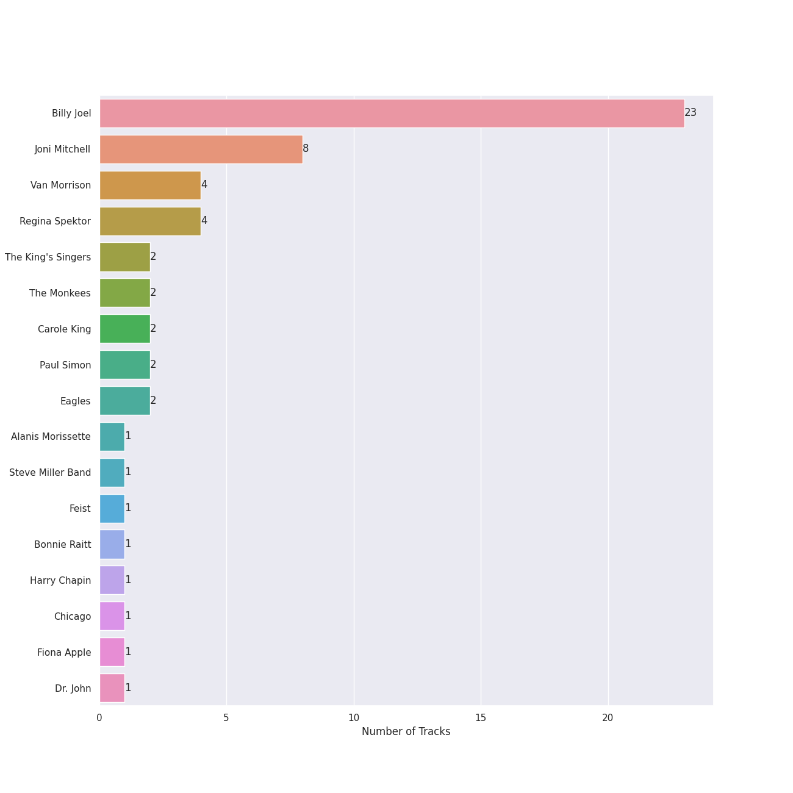
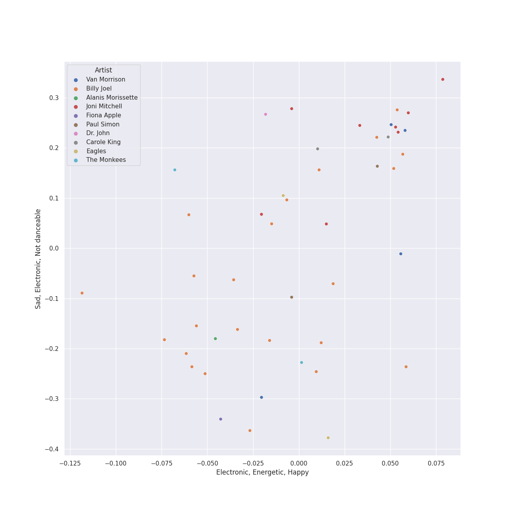
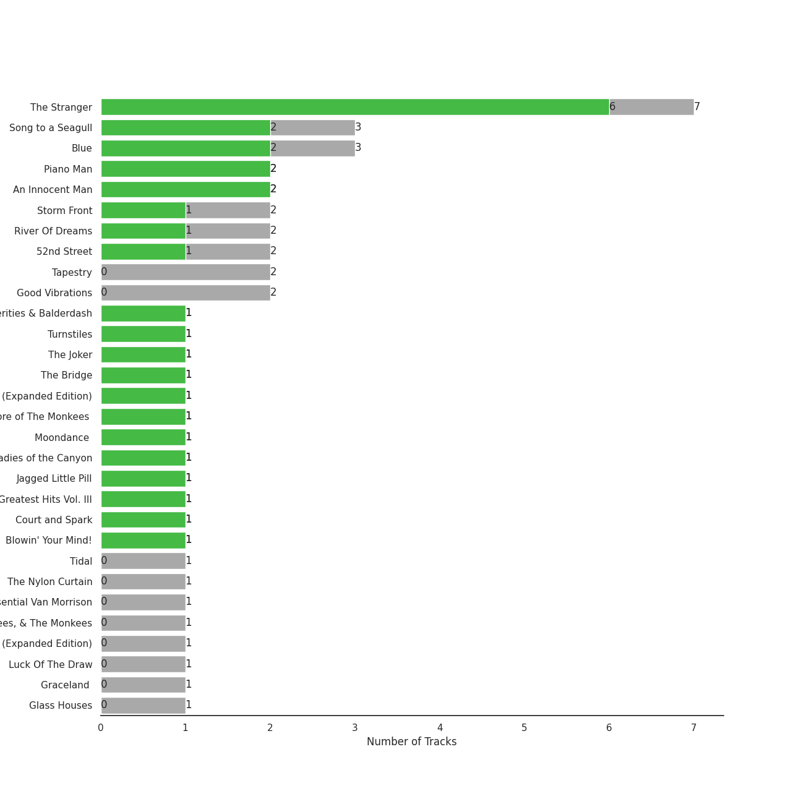
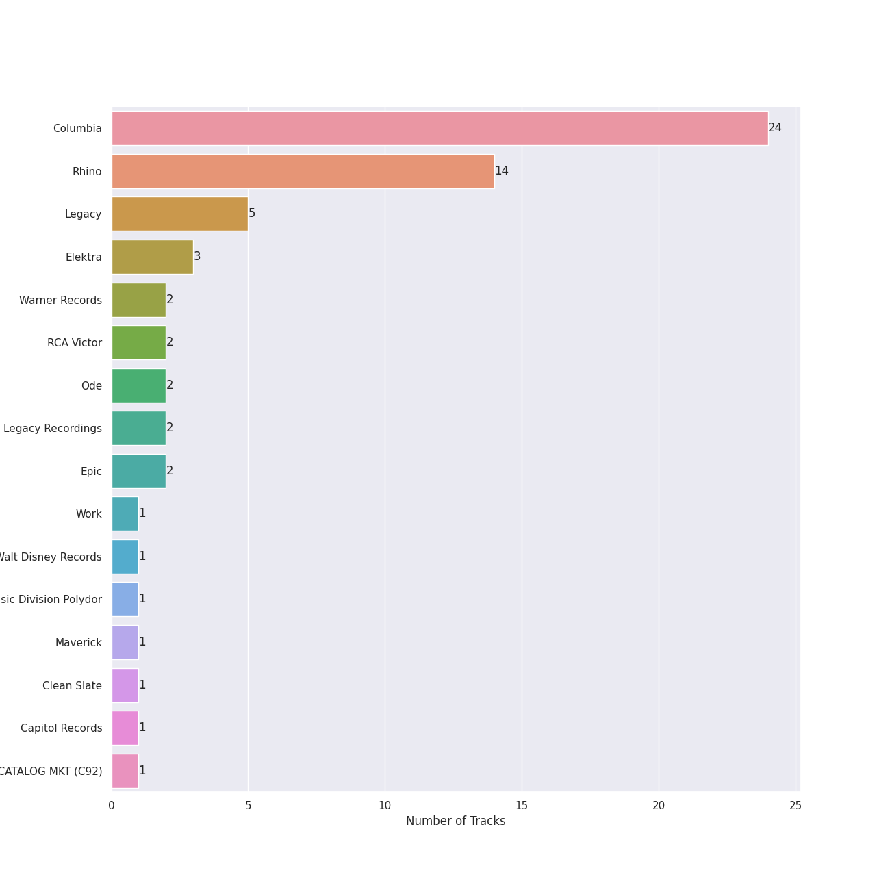

# singer-songwriter

[52 songs](singer_songwriter_tracks.md)

## Top Artists

See all 17 artists

|   Number of Tracks | Art                                                                                              | Artist                                                 | 🔗                                                           |
|-------------------:|:-------------------------------------------------------------------------------------------------|:-------------------------------------------------------|:------------------------------------------------------------|
|                 23 |  | [Billy Joel](../artists/billy_joel.md)                 | [🔗](https://open.spotify.com/artist/6zFYqv1mOsgBRQbae3JJ9e) |
|                  8 |  | Joni Mitchell                                          | [🔗](https://open.spotify.com/artist/5hW4L92KnC6dX9t7tYM4Ve) |
|                  4 |  | Van Morrison                                           | [🔗](https://open.spotify.com/artist/44NX2ffIYHr6D4n7RaZF7A) |
|                  2 |  | [The King's Singers](../artists/the_king_s_singers.md) | [🔗](https://open.spotify.com/artist/5lR7yDVN4z9kahOiUSlMhe) |
|                  2 |  | The Monkees                                            | [🔗](https://open.spotify.com/artist/320EPCSEezHt1rtbfwH6Ck) |
|                  2 |  | Carole King                                            | [🔗](https://open.spotify.com/artist/319yZVtYM9MBGqmSQnMyY6) |
|                  2 |  | Paul Simon                                             | [🔗](https://open.spotify.com/artist/2CvCyf1gEVhI0mX6aFXmVI) |
|                  2 |  | Eagles                                                 | [🔗](https://open.spotify.com/artist/0ECwFtbIWEVNwjlrfc6xoL) |
|                  1 |  | Alanis Morissette                                      | [🔗](https://open.spotify.com/artist/6ogn9necmbUdCppmNnGOdi) |
|                  1 |  | Steve Miller Band                                      | [🔗](https://open.spotify.com/artist/6QtGlUje9TIkLrgPZrESuk) |
|                  1 |  | Feist                                                  | [🔗](https://open.spotify.com/artist/6CWTBjOJK75cTE8Xv8u1kj) |
|                  1 |  | Bonnie Raitt                                           | [🔗](https://open.spotify.com/artist/4KDyYWR7IpxZ7xrdYbKrqY) |
|                  1 |  | Harry Chapin                                           | [🔗](https://open.spotify.com/artist/42q4Ivs7tAiCZ5C7eG5q4c) |
|                  1 |  | Chicago                                                | [🔗](https://open.spotify.com/artist/3iDD7bnsjL9J4fO298r0L0) |
|                  1 |  | Fiona Apple                                            | [🔗](https://open.spotify.com/artist/3g2kUQ6tHLLbmkV7T4GPtL) |
|                  1 |  | Dr. John                                               | [🔗](https://open.spotify.com/artist/320TrJub4arztwXRm7kqVO) |
|                  1 |  | Brandi Carlile                                         | [🔗](https://open.spotify.com/artist/2sG4zTOLvjKG1PSoOyf5Ej) |

## Top Albums

See all 36 albums

|   Number of Tracks | Art                                                                                              | Album                                                          | Release Date   | 🔗                                                          |
|-------------------:|:-------------------------------------------------------------------------------------------------|:---------------------------------------------------------------|:---------------|:-----------------------------------------------------------|
|                  5 |  | The Stranger                                                   | 1977-09-29     | [🔗](https://open.spotify.com/album/3IILMjMMnoN2sKzgesX8KV) |
|                  3 |  | Song to a Seagull                                              | 1968-03-01     | [🔗](https://open.spotify.com/album/6rg3WTvmv68Vd6tgR0yS0E) |
|                  3 |  | Blue                                                           | 1971-06-22     | [🔗](https://open.spotify.com/album/1vz94WpXDVYIEGja8cjFNa) |
|                  2 |  | The Stranger (Legacy Edition)                                  | 1977           | [🔗](https://open.spotify.com/album/1Mhn9VosyjtWn4dMPFlna6) |
|                  2 |  | Tapestry                                                       | 1971           | [🔗](https://open.spotify.com/album/12n11cgnpjXKLeqrnIERoS) |
|                  2 |  | Storm Front                                                    | 1989-10-17     | [🔗](https://open.spotify.com/album/1Vw2uoVkLAJFVViJ1QyK1D) |
|                  2 |  | River Of Dreams                                                | 1993-08-10     | [🔗](https://open.spotify.com/album/4HPnwQJAEvTY910q4RNeOu) |
|                  2 |  | Piano Man                                                      | 1973-11-09     | [🔗](https://open.spotify.com/album/77ErLrVvYETIlQJHAwhfIH) |
|                  2 |  | Good Vibrations                                                | 1993           | [🔗](https://open.spotify.com/album/10IUKCLZPs9onPwXfQVxfv) |
|                  2 |  | An Innocent Man                                                | 1983-08-08     | [🔗](https://open.spotify.com/album/3R3x4zIabsvpD3yxqLaUpc) |
|                  2 |  | 52nd Street                                                    | 1978-10-13     | [🔗](https://open.spotify.com/album/1HmCO8VK98AU6EXPOjGYyI) |
|                  1 |  | Verities & Balderdash                                          | 1974           | [🔗](https://open.spotify.com/album/3nta4nhqWoWjc6LmHIB0kT) |
|                  1 |  | Turnstiles                                                     | 1976-05-19     | [🔗](https://open.spotify.com/album/7GiLfxL1su3MSqz7pmKMZi) |
|                  1 |  | Tidal                                                          | 1996-07-23     | [🔗](https://open.spotify.com/album/5gVBXH8MT6zfdRkjp7qT18) |
|                  1 |  | The Reminder                                                   | 2007-01-01     | [🔗](https://open.spotify.com/album/7bTdGfczXffzzNE9ssJj4Z) |
|                  1 |  | The Princess and the Frog (Original Motion Picture Soundtrack) | 2009-11-23     | [🔗](https://open.spotify.com/album/0CcL28OkH89kjgKpNZC8sW) |
|                  1 |  | The Nylon Curtain                                              | 1982-06-23     | [🔗](https://open.spotify.com/album/50bajZpetfL5T0iRCOR74J) |
|                  1 |  | The Joker                                                      | 1973-01-01     | [🔗](https://open.spotify.com/album/5uYNj1HkZrWKAkhEYcGmJr) |
|                  1 |  | The Essential Van Morrison                                     | 2015-12-04     | [🔗](https://open.spotify.com/album/0RXzDyBEGd2EGQTmv8cxQa) |
|                  1 |  | The Bridge                                                     | 1986-07-28     | [🔗](https://open.spotify.com/album/2fRxSC6FtiAkhEDVZr2seH) |
|                  1 |  | The Birds, The Bees, & The Monkees                             | 1968-04-22     | [🔗](https://open.spotify.com/album/2Ov6zb7NfgDh3EXSIIWrb2) |
|                  1 |  | More of The Monkees (Deluxe Edition)                           | 1967-01-09     | [🔗](https://open.spotify.com/album/50zHjIiTOZM232gnWvOydX) |
|                  1 |  | Moondance (Expanded Edition)                                   | 1970-02        | [🔗](https://open.spotify.com/album/6yNYC35npMBHbxG0Vle83O) |
|                  1 |  | Moondance (Deluxe Edition)                                     | 1970-02        | [🔗](https://open.spotify.com/album/7diHYi0CglGJekoM3KaWBK) |
|                  1 |  | Luck Of The Draw                                               | 1991-01-01     | [🔗](https://open.spotify.com/album/6blrkOZ0VmkhYPjfoD7eqf) |
|                  1 |  | Ladies of the Canyon                                           | 1970-03-01     | [🔗](https://open.spotify.com/album/7JOdtLDLyXJIppDRB7kxr9) |
|                  1 |  | Jagged Little Pill                                             | 1995-06-09     | [🔗](https://open.spotify.com/album/09AwlP99cHfKVNKv4FC8VW) |
|                  1 |  | Hotel California (2013 Remaster)                               | 1976-12-08     | [🔗](https://open.spotify.com/album/2widuo17g5CEC66IbzveRu) |
|                  1 |  | Graceland (25th Anniversary Deluxe Edition)                    | 1986-08-12     | [🔗](https://open.spotify.com/album/6WgGWYw6XXQyLTsWt7tXky) |
|                  1 |  | Glass Houses                                                   | 1980-03-12     | [🔗](https://open.spotify.com/album/5sztejERqpktXEdemlUvU5) |
|                  1 |  | Desperado (2013 Remaster)                                      | 1973           | [🔗](https://open.spotify.com/album/09WBxbis5Sixt01FVMs8UM) |
|                  1 |  | Court and Spark                                                | 1974-01-17     | [🔗](https://open.spotify.com/album/2akjxkzFolkeV72Yyv5KrM) |
|                  1 |  | Cold Spring Harbor                                             | 1971-11-01     | [🔗](https://open.spotify.com/album/274rMlKrr22086ohmwAJZA) |
|                  1 |  | Chicago IX: Chicago's Greatest Hits                            | 1975-11-10     | [🔗](https://open.spotify.com/album/5qWGV0fd7hpdptJYI4G9Dd) |
|                  1 |  | Blowin' Your Mind!                                             | 1967-09        | [🔗](https://open.spotify.com/album/7dsWupQRlFuhG8FGiQAUjC) |
|                  1 |  | Bear Creek                                                     | 2012-06-01     | [🔗](https://open.spotify.com/album/5b8YTIrc88vdnfRguZqvVE) |

## Top Record Labels

See all 16 labels

|   Number of Tracks | Label                                                   |
|-------------------:|:--------------------------------------------------------|
|                 24 | [Columbia](../labels/columbia.md)                       |
|                 14 | [Rhino](../labels/rhino.md)                             |
|                  5 | [Legacy](../labels/legacy.md)                           |
|                  3 | Elektra                                                 |
|                  2 | [Warner Records](../labels/warner_records.md)           |
|                  2 | RCA Victor                                              |
|                  2 | Ode                                                     |
|                  2 | Legacy Recordings                                       |
|                  2 | [Epic](../labels/epic.md)                               |
|                  1 | Work                                                    |
|                  1 | [Walt Disney Records](../labels/walt_disney_records.md) |
|                  1 | Universal Music Division Polydor                        |
|                  1 | Maverick                                                |
|                  1 | Clean Slate                                             |
|                  1 | [Capitol Records](../labels/capitol_records.md)         |
|                  1 | CAPITOL CATALOG MKT (C92)                               |

## Audio Features

| 10 most Danceable tracks    | 10 least Danceable tracks         |
|:----------------------------|:----------------------------------|
| You Can Call Me Al          | Desperado - 2013 Remaster         |
| My Life                     | She's Always a Woman              |
| A Matter of Trust           | Shadowboxer                       |
| We Didn't Start the Fire    | Piano Man                         |
| I Feel the Earth Move       | And So It Goes                    |
| Uptown Girl                 | The Boxer                         |
| Down in New Orleans         | Captain Jack                      |
| A Case of You               | Scenes from an Italian Restaurant |
| Don't Ask Me Why            | The Pirate of Penance             |
| Movin' Out (Anthony's Song) | And So It Goes                    |

| 10 most Energetic tracks          | 10 least Energetic tracks      |
|:----------------------------------|:-------------------------------|
| We Didn't Start the Fire          | And So It Goes                 |
| Uptown Girl                       | The Boxer                      |
| Scenes from an Italian Restaurant | And So It Goes                 |
| Movin' Out (Anthony's Song)       | Blue                           |
| The Stranger                      | The Dawntreader                |
| Only the Good Die Young           | She's Got a Way                |
| 25 or 6 to 4                      | I Can't Make You Love Me       |
| You Oughta Know                   | I Had a King                   |
| I'm a Believer - 2006 Remaster    | Lullabye (Goodnight, My Angel) |
| You Can Call Me Al                | So Far Away                    |

| 10 most Speechy tracks            | 10 least Speechy tracks          |
|:----------------------------------|:---------------------------------|
| Only the Good Die Young           | The Longest Time                 |
| Scenes from an Italian Restaurant | A Matter of Trust                |
| Big Shot                          | Hotel California - 2013 Remaster |
| Crazy Love - 2013 Remaster        | Piano Man                        |
| The Stranger                      | A Case of You                    |
| Crazy Love                        | Shadowboxer                      |
| The River of Dreams               | Daydream Believer                |
| You Oughta Know                   | I Feel the Earth Move            |
| Don't Ask Me Why                  | Desperado - 2013 Remaster        |
| You Can Call Me Al                | I Can't Make You Love Me         |

| 10 most Acoustic tracks        | 10 least Acoustic tracks         |
|:-------------------------------|:---------------------------------|
| Blue                           | Hotel California - 2013 Remaster |
| The Pirate of Penance          | Pressure                         |
| She's Got a Way                | A Matter of Trust                |
| I Had a King                   | Uptown Girl                      |
| The Dawntreader                | We Didn't Start the Fire         |
| Lullabye (Goodnight, My Angel) | My Life                          |
| Desperado - 2013 Remaster      | Don't Ask Me Why                 |
| And So It Goes                 | Big Shot                         |
| The Boxer                      | Only the Good Die Young          |
| And So It Goes                 | The Stranger                     |

| 10 most Instrumental tracks       | 10 least Instrumental tracks   |
|:----------------------------------|:-------------------------------|
| 25 or 6 to 4                      | That Wasn't Me                 |
| I Had a King                      | Don't Ask Me Why               |
| You Can Call Me Al                | And So It Goes                 |
| Blue                              | Cat's in the Cradle            |
| I Feel the Earth Move             | Shadowboxer                    |
| My Life                           | Big Yellow Taxi                |
| Pressure                          | Free Man in Paris              |
| Down in New Orleans               | A Case of You                  |
| Scenes from an Italian Restaurant | Lullabye (Goodnight, My Angel) |
| Hotel California - 2013 Remaster  | Daydream Believer              |

| 10 most Live tracks       | 10 least Live tracks             |
|:--------------------------|:---------------------------------|
| You Oughta Know           | I Feel the Earth Move            |
| Uptown Girl               | My Life                          |
| Big Yellow Taxi           | Hotel California - 2013 Remaster |
| Brown Eyed Girl           | Movin' Out (Anthony's Song)      |
| Captain Jack              | The Boxer                        |
| We Didn't Start the Fire  | The River of Dreams              |
| New York State of Mind    | Free Man in Paris                |
| Piano Man                 | So Far Away                      |
| A Matter of Trust         | Vienna                           |
| Desperado - 2013 Remaster | You Can Call Me Al               |

| 10 most Happy tracks           | 10 least Happy tracks          |
|:-------------------------------|:-------------------------------|
| Big Yellow Taxi                | I Can't Make You Love Me       |
| I'm a Believer - 2006 Remaster | I Had a King                   |
| Brown Eyed Girl                | The Pirate of Penance          |
| Movin' Out (Anthony's Song)    | Desperado - 2013 Remaster      |
| We Didn't Start the Fire       | New York State of Mind         |
| A Matter of Trust              | She's Got a Way                |
| Don't Ask Me Why               | Lullabye (Goodnight, My Angel) |
| Pressure                       | The Stranger                   |
| You Can Call Me Al             | Shadowboxer                    |
| My Life                        | The Dawntreader                |
