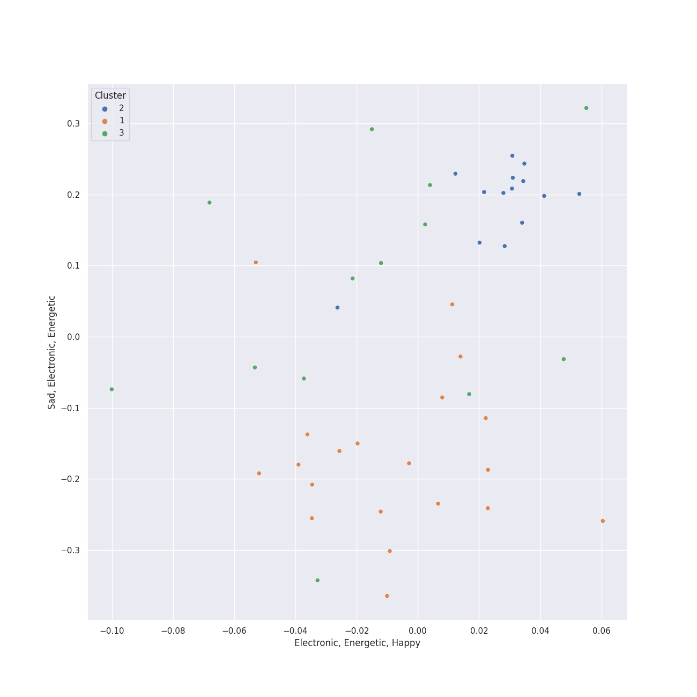

# Clusters in singer-songwriter

## Cluster #1

19 tracks

| Art | Track | Album | Artists | Label | 💚 | 🔗 |
|:---|:---|:---|:---|:---|:---|:---|
|  | Only the Good Die Young | The Stranger | [Billy Joel](../../../../artists/billy_joel/overview.md) | [Columbia](../../../../labels/columbia) | 💚 | [🔗](https://open.spotify.com/track/2xabqm0YNQCTcPteQjJ22K) |
|  | Big Shot | 52nd Street | [Billy Joel](../../../../artists/billy_joel/overview.md) | [Columbia](../../../../labels/columbia) | | [🔗](https://open.spotify.com/track/22wxe2Yc9JzihICXYLGAQ7) |
|  | My Life | 52nd Street | [Billy Joel](../../../../artists/billy_joel/overview.md) | [Columbia](../../../../labels/columbia) | 💚 | [🔗](https://open.spotify.com/track/4ZoBC5MhSEzuknIgAkBaoT) |
|  | Don't Ask Me Why | Glass Houses | [Billy Joel](../../../../artists/billy_joel/overview.md) | [Columbia](../../../../labels/columbia) | | [🔗](https://open.spotify.com/track/6g4vHtdGqD5eEgpf7nKISk) |
|  | The Longest Time | An Innocent Man | [Billy Joel](../../../../artists/billy_joel/overview.md) | [Columbia](../../../../labels/columbia) | 💚 | [🔗](https://open.spotify.com/track/5DH7nDryMhpixm4G4B7RP9) |
|  | The River of Dreams | River Of Dreams | [Billy Joel](../../../../artists/billy_joel/overview.md) | [Columbia](../../../../labels/columbia) | | [🔗](https://open.spotify.com/track/30qVCFYKBtAENjTIBA8FPZ) |
|  | Cat's in the Cradle | Verities & Balderdash | Harry Chapin | [Rhino/Elektra](../../../../labels/rhino) | 💚 | [🔗](https://open.spotify.com/track/2obblQ6tcePeOEVJV6nEGD) |
|  | Hammer And A Nail | Nomads · Indians · Saints (Expanded Edition) | Indigo Girls | [Epic](../../../../labels/epic) | 💚 | [🔗](https://open.spotify.com/track/2OV25P5lmVqnjKnWfj0FeP) |
|  | You Can Call Me Al | Graceland (25th Anniversary Deluxe Edition) | Paul Simon | Legacy Recordings | | [🔗](https://open.spotify.com/track/0qxYx4F3vm1AOnfux6dDxP) |
|  | Daydream Believer | The Birds, The Bees, & The Monkees | The Monkees | [Rhino](../../../../labels/rhino) | | [🔗](https://open.spotify.com/track/7uEcCGtM1FBBGIhPozhJjv) |
## Cluster #2

18 tracks

| Art | Track | Album | Artists | Label | 💚 | 🔗 |
|:---|:---|:---|:---|:---|:---|:---|
|  | She's Got a Way | Cold Spring Harbor | [Billy Joel](../../../../artists/billy_joel/overview.md) | [Columbia](../../../../labels/columbia) | | [🔗](https://open.spotify.com/track/3Ie2eLOIj2IhKnzPwXrLbJ) |
|  | She's Always a Woman | The Stranger | [Billy Joel](../../../../artists/billy_joel/overview.md) | [Columbia](../../../../labels/columbia) | | [🔗](https://open.spotify.com/track/3ILLSvTYvFjjEdbxvQumOb) |
|  | And So It Goes | Storm Front | [Billy Joel](../../../../artists/billy_joel/overview.md) | [Columbia](../../../../labels/columbia) | 💚 | [🔗](https://open.spotify.com/track/1u7kQUb3lQcpHaYRfia13A) |
|  | Lullabye (Goodnight, My Angel) | River Of Dreams | [Billy Joel](../../../../artists/billy_joel/overview.md) | [Columbia](../../../../labels/columbia) | 💚 | [🔗](https://open.spotify.com/track/4cURHmiuYii52BVbhrGbv0) |
|  | I Can't Make You Love Me | Luck Of The Draw | Bonnie Raitt | [Capitol Records](../../../../labels/capitol_records) | | [🔗](https://open.spotify.com/track/69uJi5QsBtqlYkGURTBli8) |
|  | So Far Away | Tapestry | Carole King | Ode, [Epic](../../../../labels/epic), [Legacy](../../../../labels/legacy) | | [🔗](https://open.spotify.com/track/4HHge4zAyIw3pkrtFzmwCl) |
|  | The Dawntreader | Song to a Seagull | [Joni Mitchell](../../../../artists/joni_mitchell/overview.md) | [Rhino](../../../../labels/rhino) | 💚 | [🔗](https://open.spotify.com/track/0KE9YElZqPumrpm9ovtXlN) |
|  | The Pirate of Penance | Song to a Seagull | [Joni Mitchell](../../../../artists/joni_mitchell/overview.md) | [Rhino](../../../../labels/rhino) | | [🔗](https://open.spotify.com/track/53QbBfo0PTUKfOBM0YoPU7) |
|  | Crazy Love - 2013 Remaster | Moondance (Expanded Edition) | Van Morrison | [Warner Records](../../../../labels/warner_records) | | [🔗](https://open.spotify.com/track/2hjAc6x8EoSLhGxRNg8KEw) |
|  | Crazy Love | The Essential Van Morrison | Van Morrison | Legacy Recordings | | [🔗](https://open.spotify.com/track/04glHdRn4SgTADxKoKzOoO) |
## Cluster #3

12 tracks

| Art | Track | Album | Artists | Label | 💚 | 🔗 |
|:---|:---|:---|:---|:---|:---|:---|
|  | Captain Jack | Piano Man | [Billy Joel](../../../../artists/billy_joel/overview.md) | [Columbia](../../../../labels/columbia) | 💚 | [🔗](https://open.spotify.com/track/3igkLltDaiFiMl83IdDBfm) |
|  | Just the Way You Are | The Stranger | [Billy Joel](../../../../artists/billy_joel/overview.md) | [Columbia](../../../../labels/columbia) | 💚 | [🔗](https://open.spotify.com/track/06RdYCp0UxsBtWsonHfSZz) |
|  | Movin' Out (Anthony's Song) | The Stranger | [Billy Joel](../../../../artists/billy_joel/overview.md) | [Columbia](../../../../labels/columbia) | 💚 | [🔗](https://open.spotify.com/track/4cG3ovmC8Hnp9ZsmSZI2O4) |
|  | I Feel the Earth Move | Tapestry | Carole King | Ode, [Epic](../../../../labels/epic), [Legacy](../../../../labels/legacy) | | [🔗](https://open.spotify.com/track/1BWsOxeMx83OrKGCV4gxly) |
|  | White Winter Hymnal | Fleet Foxes | Fleet Foxes | Sub Pop Records | | [🔗](https://open.spotify.com/track/3QVtICc8ViNOy4I5K14d8Z) |
|  | Carey | Blue | [Joni Mitchell](../../../../artists/joni_mitchell/overview.md) | [Rhino](../../../../labels/rhino) | 💚 | [🔗](https://open.spotify.com/track/11dUk8E2z8Oj1JURwl7GJd) |
|  | Free Man in Paris | Court and Spark | [Joni Mitchell](../../../../artists/joni_mitchell/overview.md) | [Rhino](../../../../labels/rhino) | 💚 | [🔗](https://open.spotify.com/track/2by5mqpQ1ZP2G5FOIccMnu) |
|  | The Joker | The Joker | Steve Miller Band | CAPITOL CATALOG MKT (C92) | 💚 | [🔗](https://open.spotify.com/track/1bp2IO61zbQrbWNmKKxg3f) |
|  | I'm a Believer - 2006 Remaster | More of The Monkees (Deluxe Edition) | The Monkees | [Rhino](../../../../labels/rhino) | 💚 | [🔗](https://open.spotify.com/track/3G7tRC24Uh09Hmp1KZ7LQ2) |
|  | Moondance - 2013 Remaster | Moondance (Deluxe Edition) | Van Morrison | [Warner Records](../../../../labels/warner_records) | 💚 | [🔗](https://open.spotify.com/track/683b4ikwa62JevCjwrmfg6) |