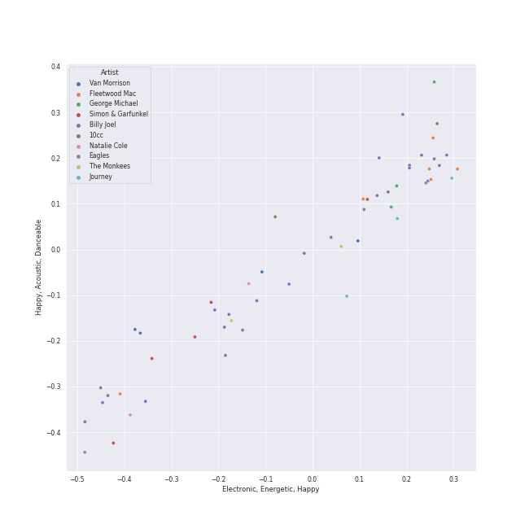
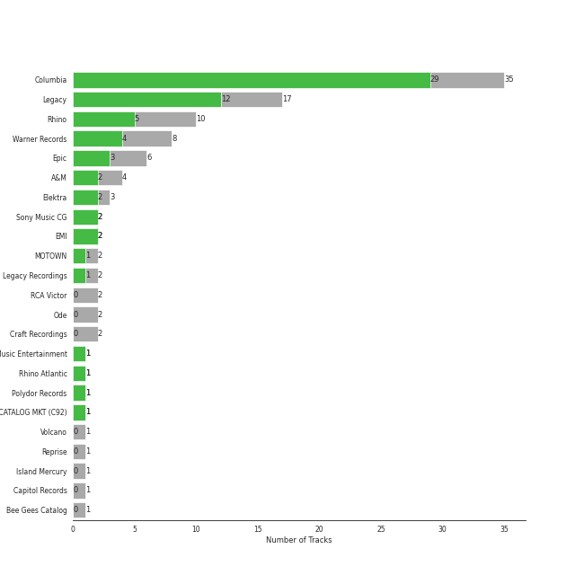

# soft rock

[59 songs](soft_rock_tracks.md)

## Top Artists

See all 22 artists

|   Number of Tracks | Art                                                                                              | Artist                                                 | 🔗                                                           |
|-------------------:|:-------------------------------------------------------------------------------------------------|:-------------------------------------------------------|:------------------------------------------------------------|
|                 23 |  | [Billy Joel](../artists/billy_joel.md)                 | [🔗](https://open.spotify.com/artist/6zFYqv1mOsgBRQbae3JJ9e) |
|                  6 |  | Fleetwood Mac                                          | [🔗](https://open.spotify.com/artist/08GQAI4eElDnROBrJRGE0X) |
|                  4 |  | Van Morrison                                           | [🔗](https://open.spotify.com/artist/44NX2ffIYHr6D4n7RaZF7A) |
|                  3 |  | Journey                                                | [🔗](https://open.spotify.com/artist/0rvjqX7ttXeg3mTy8Xscbt) |
|                  2 |  | [The King's Singers](../artists/the_king_s_singers.md) | [🔗](https://open.spotify.com/artist/5lR7yDVN4z9kahOiUSlMhe) |
|                  2 |  | Styx                                                   | [🔗](https://open.spotify.com/artist/4salDzkGmfycRqNUbyBphh) |
|                  2 |  | The Monkees                                            | [🔗](https://open.spotify.com/artist/320EPCSEezHt1rtbfwH6Ck) |
|                  2 |  | Carole King                                            | [🔗](https://open.spotify.com/artist/319yZVtYM9MBGqmSQnMyY6) |
|                  2 |  | Kansas                                                 | [🔗](https://open.spotify.com/artist/2hl0xAkS2AIRAu23TVMBG1) |
|                  2 |  | Paul Simon                                             | [🔗](https://open.spotify.com/artist/2CvCyf1gEVhI0mX6aFXmVI) |
|                  2 |  | Eagles                                                 | [🔗](https://open.spotify.com/artist/0ECwFtbIWEVNwjlrfc6xoL) |
|                  1 |  | Commodores                                             | [🔗](https://open.spotify.com/artist/6twIAGnYuIT1pncMAsXnEm) |
|                  1 |  | Steve Miller Band                                      | [🔗](https://open.spotify.com/artist/6QtGlUje9TIkLrgPZrESuk) |
|                  1 |  | Foreigner                                              | [🔗](https://open.spotify.com/artist/6IRouO5mvvfcyxtPDKMYFN) |
|                  1 |  | Bonnie Raitt                                           | [🔗](https://open.spotify.com/artist/4KDyYWR7IpxZ7xrdYbKrqY) |
|                  1 |  | Harry Chapin                                           | [🔗](https://open.spotify.com/artist/42q4Ivs7tAiCZ5C7eG5q4c) |
|                  1 |  | Chicago                                                | [🔗](https://open.spotify.com/artist/3iDD7bnsjL9J4fO298r0L0) |
|                  1 |  | Frankie Valli                                          | [🔗](https://open.spotify.com/artist/3CDKmzJu6uwEGnPLLZffpD) |
|                  1 |  | a-ha                                                   | [🔗](https://open.spotify.com/artist/2jzc5TC5TVFLXQlBNiIUzE) |
|                  1 |  | Survivor                                               | [🔗](https://open.spotify.com/artist/26bcq2nyj5GB7uRr558iQg) |
|                  1 |  | Bee Gees                                               | [🔗](https://open.spotify.com/artist/1LZEQNv7sE11VDY3SdxQeN) |
|                  1 |  | Sting                                                  | [🔗](https://open.spotify.com/artist/0Ty63ceoRnnJKVEYP0VQpk) |

## Top Albums

See all 44 albums

|   Number of Tracks | Art                                                                                              | Album                                          | 🔗                                                          |
|-------------------:|:-------------------------------------------------------------------------------------------------|:-----------------------------------------------|:-----------------------------------------------------------|
|                  5 |  | The Stranger                                   | [🔗](https://open.spotify.com/album/3IILMjMMnoN2sKzgesX8KV) |
|                  3 |  | Rumours (Super Deluxe)                         | [🔗](https://open.spotify.com/album/0BwWUstDMUbgq2NYONRqlu) |
|                  2 |  | The Stranger (Legacy Edition)                  | [🔗](https://open.spotify.com/album/1Mhn9VosyjtWn4dMPFlna6) |
|                  2 |  | Tapestry                                       | [🔗](https://open.spotify.com/album/12n11cgnpjXKLeqrnIERoS) |
|                  2 |  | Storm Front                                    | [🔗](https://open.spotify.com/album/1Vw2uoVkLAJFVViJ1QyK1D) |
|                  2 |  | River Of Dreams                                | [🔗](https://open.spotify.com/album/4HPnwQJAEvTY910q4RNeOu) |
|                  2 |  | Piano Man                                      | [🔗](https://open.spotify.com/album/77ErLrVvYETIlQJHAwhfIH) |
|                  2 |  | Good Vibrations                                | [🔗](https://open.spotify.com/album/10IUKCLZPs9onPwXfQVxfv) |
|                  2 |  | Fleetwood Mac                                  | [🔗](https://open.spotify.com/album/5VIQ3VaAoRKOEpJ0fewdvo) |
|                  2 |  | An Innocent Man                                | [🔗](https://open.spotify.com/album/3R3x4zIabsvpD3yxqLaUpc) |
|                  2 |  | 52nd Street                                    | [🔗](https://open.spotify.com/album/1HmCO8VK98AU6EXPOjGYyI) |
|                  1 |  | Verities & Balderdash                          | [🔗](https://open.spotify.com/album/3nta4nhqWoWjc6LmHIB0kT) |
|                  1 |  | Tusk (2015 Remaster)                           | [🔗](https://open.spotify.com/album/5FIN8pyPVx8ggNs5jQ86Re) |
|                  1 |  | Turnstiles                                     | [🔗](https://open.spotify.com/album/7GiLfxL1su3MSqz7pmKMZi) |
|                  1 |  | The Very Best of Frankie Valli & The 4 Seasons | [🔗](https://open.spotify.com/album/0NUEQILaBzavnzcMEs4buZ) |
|                  1 |  | The Ultimate Bee Gees                          | [🔗](https://open.spotify.com/album/5GucSY3249qHDx4v1Hcxry) |
|                  1 |  | The Nylon Curtain                              | [🔗](https://open.spotify.com/album/50bajZpetfL5T0iRCOR74J) |
|                  1 |  | The Joker                                      | [🔗](https://open.spotify.com/album/5uYNj1HkZrWKAkhEYcGmJr) |
|                  1 |  | The Grand Illusion                             | [🔗](https://open.spotify.com/album/6MFIBPVrZjHjP0pPkVF3IU) |
|                  1 |  | The Essential Van Morrison                     | [🔗](https://open.spotify.com/album/0RXzDyBEGd2EGQTmv8cxQa) |
|                  1 |  | The Bridge                                     | [🔗](https://open.spotify.com/album/2fRxSC6FtiAkhEDVZr2seH) |
|                  1 |  | The Birds, The Bees, & The Monkees             | [🔗](https://open.spotify.com/album/2Ov6zb7NfgDh3EXSIIWrb2) |
|                  1 |  | Ten Summoner's Tales                           | [🔗](https://open.spotify.com/album/5kV0KBXfELibs6qQJLmOtg) |
|                  1 |  | Rocky IV                                       | [🔗](https://open.spotify.com/album/3t3BbpFJiGcXl4jI5CRLLA) |
|                  1 |  | Point Of Know Return (Expanded Edition)        | [🔗](https://open.spotify.com/album/6oU298pdPTCQnMx1PYwyUA) |
|                  1 |  | Pieces Of Eight                                | [🔗](https://open.spotify.com/album/294yFGYq9SBXWR4g6dK63D) |
|                  1 |  | More of The Monkees (Deluxe Edition)           | [🔗](https://open.spotify.com/album/50zHjIiTOZM232gnWvOydX) |
|                  1 |  | Moondance (Expanded Edition)                   | [🔗](https://open.spotify.com/album/6yNYC35npMBHbxG0Vle83O) |
|                  1 |  | Moondance (Deluxe Edition)                     | [🔗](https://open.spotify.com/album/7diHYi0CglGJekoM3KaWBK) |
|                  1 |  | Luck Of The Draw                               | [🔗](https://open.spotify.com/album/6blrkOZ0VmkhYPjfoD7eqf) |
|                  1 |  | Leftoverture (Expanded Edition)                | [🔗](https://open.spotify.com/album/7MejfRSNnrpcLZIxkeZDqR) |
|                  1 |  | Infinity                                       | [🔗](https://open.spotify.com/album/7K4Nk5fHkCuzNm5A6mdo2U) |
|                  1 |  | Hunting High and Low                           | [🔗](https://open.spotify.com/album/1ER3B6zev5JEAaqhnyyfbf) |
|                  1 |  | Hotel California (2013 Remaster)               | [🔗](https://open.spotify.com/album/2widuo17g5CEC66IbzveRu) |
|                  1 |  | Graceland (25th Anniversary Deluxe Edition)    | [🔗](https://open.spotify.com/album/6WgGWYw6XXQyLTsWt7tXky) |
|                  1 |  | Glass Houses                                   | [🔗](https://open.spotify.com/album/5sztejERqpktXEdemlUvU5) |
|                  1 |  | Foreigner (Expanded)                           | [🔗](https://open.spotify.com/album/1OU7zJvUfgxxPHgkTClt1M) |
|                  1 |  | Escape (Bonus Track Version)                   | [🔗](https://open.spotify.com/album/43wpzak9OmQfrjyksuGwp0) |
|                  1 |  | Desperado (2013 Remaster)                      | [🔗](https://open.spotify.com/album/09WBxbis5Sixt01FVMs8UM) |
|                  1 |  | Departure                                      | [🔗](https://open.spotify.com/album/2OyVtIEp7O7a6o82DF4Ba5) |
|                  1 |  | Commodores                                     | [🔗](https://open.spotify.com/album/2tzbNCAUTmW4MIM2Ulvrwl) |
|                  1 |  | Cold Spring Harbor                             | [🔗](https://open.spotify.com/album/274rMlKrr22086ohmwAJZA) |
|                  1 |  | Chicago IX: Chicago's Greatest Hits            | [🔗](https://open.spotify.com/album/5qWGV0fd7hpdptJYI4G9Dd) |
|                  1 |  | Blowin' Your Mind!                             | [🔗](https://open.spotify.com/album/7dsWupQRlFuhG8FGiQAUjC) |

## Top Record Labels

See all 16 labels

|   Number of Tracks | Label                                           |
|-------------------:|:------------------------------------------------|
|                 26 | [Columbia](../labels/columbia.md)               |
|                 12 | [Rhino](../labels/rhino.md)                     |
|                 10 | [Legacy](../labels/legacy.md)                   |
|                  8 | [Warner Records](../labels/warner_records.md)   |
|                  4 | [Epic](../labels/epic.md)                       |
|                  3 | Elektra                                         |
|                  3 | A&M                                             |
|                  2 | RCA Victor                                      |
|                  2 | Ode                                             |
|                  2 | Legacy Recordings                               |
|                  1 | Volcano                                         |
|                  1 | Rhino Atlantic                                  |
|                  1 | [MOTOWN](../labels/motown.md)                   |
|                  1 | [Capitol Records](../labels/capitol_records.md) |
|                  1 | CAPITOL CATALOG MKT (C92)                       |
|                  1 | Bee Gees Catalog                                |

## Audio Features

| 10 most Danceable tracks   | 10 least Danceable tracks         |
|:---------------------------|:----------------------------------|
| Dreams - 2004 Remaster     | Scenes from an Italian Restaurant |
| Eye of the Tiger           | Landslide                         |
| You Can Call Me Al         | Captain Jack                      |
| Sara - 2015 Remaster       | The Boxer                         |
| My Life                    | And So It Goes                    |
| A Matter of Trust          | Piano Man                         |
| Rhiannon                   | Come Sail Away                    |
| We Didn't Start the Fire   | She's Always a Woman              |
| I Feel the Earth Move      | Desperado - 2013 Remaster         |
| Stayin Alive               | Lights                            |

| 10 most Energetic tracks          | 10 least Energetic tracks      |
|:----------------------------------|:-------------------------------|
| We Didn't Start the Fire          | Desperado - 2013 Remaster      |
| Uptown Girl                       | Crazy Love - 2013 Remaster     |
| Go Your Own Way - 2004 Remaster   | So Far Away                    |
| Any Way You Want It               | Landslide                      |
| Scenes from an Italian Restaurant | Lullabye (Goodnight, My Angel) |
| Take on Me                        | I Can't Make You Love Me       |
| Movin' Out (Anthony's Song)       | She's Got a Way                |
| The Stranger                      | And So It Goes                 |
| Only the Good Die Young           | The Boxer                      |
| 25 or 6 to 4                      | And So It Goes                 |

| 10 most Speechy tracks            | 10 least Speechy tracks          |
|:----------------------------------|:---------------------------------|
| Only the Good Die Young           | Sara - 2015 Remaster             |
| Scenes from an Italian Restaurant | Rhiannon                         |
| Big Shot                          | Dust in the Wind                 |
| Crazy Love - 2013 Remaster        | Dreams - 2004 Remaster           |
| The Stranger                      | Piano Man                        |
| Crazy Love                        | Cold as Ice                      |
| Can't Take My Eyes off You        | Hotel California - 2013 Remaster |
| The River of Dreams               | A Matter of Trust                |
| Don't Ask Me Why                  | The Longest Time                 |
| Take on Me                        | Fields Of Gold                   |

| 10 most Acoustic tracks        | 10 least Acoustic tracks         |
|:-------------------------------|:---------------------------------|
| She's Got a Way                | Stayin Alive                     |
| Lullabye (Goodnight, My Angel) | Cold as Ice                      |
| Desperado - 2013 Remaster      | Take on Me                       |
| And So It Goes                 | Go Your Own Way - 2004 Remaster  |
| The Boxer                      | Renegade                         |
| And So It Goes                 | Pressure                         |
| So Far Away                    | The Chain - 2004 Remaster        |
| Landslide                      | Hotel California - 2013 Remaster |
| Crazy Love                     | Carry on Wayward Son             |
| I Can't Make You Love Me       | Any Way You Want It              |

| 10 most Instrumental tracks   | 10 least Instrumental tracks   |
|:------------------------------|:-------------------------------|
| Rhiannon                      | Lullabye (Goodnight, My Angel) |
| 25 or 6 to 4                  | Vienna                         |
| Sara - 2015 Remaster          | The Longest Time               |
| Fields Of Gold                | Uptown Girl                    |
| Stayin Alive                  | Don't Ask Me Why               |
| Lights                        | Cat's in the Cradle            |
| You Can Call Me Al            | Daydream Believer              |
| Dreams - 2004 Remaster        | Brown Eyed Girl                |
| I Feel the Earth Move         | Don't Stop Believin'           |
| My Life                       | Cold as Ice                    |

| 10 most Live tracks      | 10 least Live tracks             |
|:-------------------------|:---------------------------------|
| Uptown Girl              | Can't Take My Eyes off You       |
| Don't Stop Believin'     | Go Your Own Way - 2004 Remaster  |
| Carry on Wayward Son     | The River of Dreams              |
| Brown Eyed Girl          | The Boxer                        |
| Captain Jack             | Easy                             |
| We Didn't Start the Fire | Movin' Out (Anthony's Song)      |
| Lights                   | Hotel California - 2013 Remaster |
| New York State of Mind   | My Life                          |
| Piano Man                | I Feel the Earth Move            |
| A Matter of Trust        | The Chain - 2004 Remaster        |

| 10 most Happy tracks            | 10 least Happy tracks          |
|:--------------------------------|:-------------------------------|
| I'm a Believer - 2006 Remaster  | Fields Of Gold                 |
| Stayin Alive                    | Vienna                         |
| Brown Eyed Girl                 | And So It Goes                 |
| Movin' Out (Anthony's Song)     | The Stranger                   |
| We Didn't Start the Fire        | Lullabye (Goodnight, My Angel) |
| A Matter of Trust               | She's Got a Way                |
| Take on Me                      | New York State of Mind         |
| Don't Ask Me Why                | Desperado - 2013 Remaster      |
| Pressure                        | Come Sail Away                 |
| Go Your Own Way - 2004 Remaster | I Can't Make You Love Me       |
