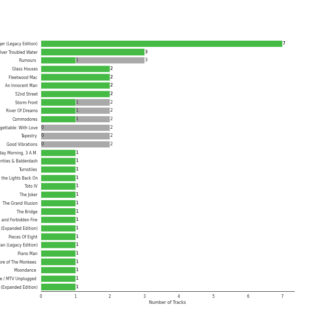
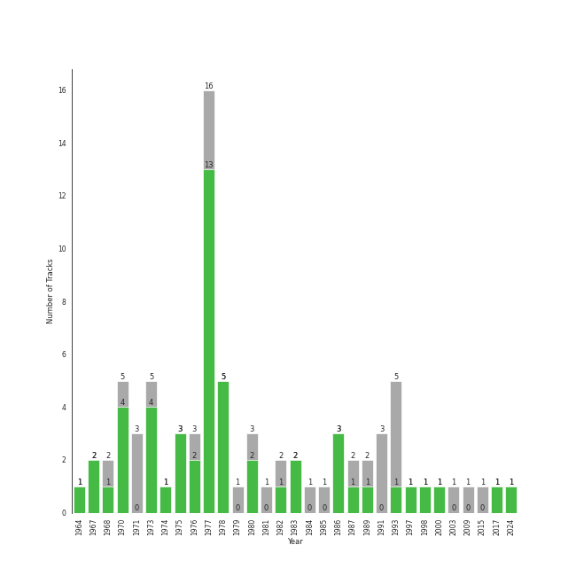

# soft rock

[58 songs](soft_rock_tracks.md)

## Top Artists

See all 21 artists

| Art | Tracks | 💚 | Artist | 🔗 |
|:---|---:|---:|:---|:---|
|  | 23 | 15 | [Billy Joel](../artists/billy_joel.md) | [🔗](https://open.spotify.com/artist/6zFYqv1mOsgBRQbae3JJ9e) |
|  | 6 | 2 | Fleetwood Mac | [🔗](https://open.spotify.com/artist/08GQAI4eElDnROBrJRGE0X) |
|  | 4 | 2 | Van Morrison | [🔗](https://open.spotify.com/artist/44NX2ffIYHr6D4n7RaZF7A) |
|  | 3 | 1 | Journey | [🔗](https://open.spotify.com/artist/0rvjqX7ttXeg3mTy8Xscbt) |
|  | 2 | 2 | Styx | [🔗](https://open.spotify.com/artist/4salDzkGmfycRqNUbyBphh) |
|  | 2 | 1 | The Monkees | [🔗](https://open.spotify.com/artist/320EPCSEezHt1rtbfwH6Ck) |
|  | 2 | 1 | Kansas | [🔗](https://open.spotify.com/artist/2hl0xAkS2AIRAu23TVMBG1) |
|  | 2 | 1 | Eagles | [🔗](https://open.spotify.com/artist/0ECwFtbIWEVNwjlrfc6xoL) |
|  | 2 | 0 | The King's Singers | [🔗](https://open.spotify.com/artist/5lR7yDVN4z9kahOiUSlMhe) |
|  | 2 | 0 | Carole King | [🔗](https://open.spotify.com/artist/319yZVtYM9MBGqmSQnMyY6) |
|  | 2 | 0 | Paul Simon | [🔗](https://open.spotify.com/artist/2CvCyf1gEVhI0mX6aFXmVI) |
|  | 1 | 1 | Commodores | [🔗](https://open.spotify.com/artist/6twIAGnYuIT1pncMAsXnEm) |
|  | 1 | 1 | Steve Miller Band | [🔗](https://open.spotify.com/artist/6QtGlUje9TIkLrgPZrESuk) |
|  | 1 | 1 | Foreigner | [🔗](https://open.spotify.com/artist/6IRouO5mvvfcyxtPDKMYFN) |
|  | 1 | 1 | Harry Chapin | [🔗](https://open.spotify.com/artist/42q4Ivs7tAiCZ5C7eG5q4c) |
|  | 1 | 1 | Chicago | [🔗](https://open.spotify.com/artist/3iDD7bnsjL9J4fO298r0L0) |
|  | 1 | 1 | Frankie Valli | [🔗](https://open.spotify.com/artist/3CDKmzJu6uwEGnPLLZffpD) |
|  | 1 | 1 | a-ha | [🔗](https://open.spotify.com/artist/2jzc5TC5TVFLXQlBNiIUzE) |
|  | 1 | 0 | Survivor | [🔗](https://open.spotify.com/artist/26bcq2nyj5GB7uRr558iQg) |
|  | 1 | 0 | Bee Gees | [🔗](https://open.spotify.com/artist/1LZEQNv7sE11VDY3SdxQeN) |
|  | 1 | 0 | Sting | [🔗](https://open.spotify.com/artist/0Ty63ceoRnnJKVEYP0VQpk) |

## Top Albums

See all 42 albums

| Art | Tracks | 💚 | Album | Release Date | 🔗 |
|:---|---:|---:|:---|:---|:---|
|  | 7 | 6 | The Stranger | 1977-09-29 | [🔗](https://open.spotify.com/album/3IILMjMMnoN2sKzgesX8KV) |
|  | 3 | 0 | Rumours (Super Deluxe) | 1977-02-04 | [🔗](https://open.spotify.com/album/0BwWUstDMUbgq2NYONRqlu) |
|  | 2 | 2 | Piano Man | 1973-11-09 | [🔗](https://open.spotify.com/album/77ErLrVvYETIlQJHAwhfIH) |
|  | 2 | 2 | Fleetwood Mac | 1975-07-11 | [🔗](https://open.spotify.com/album/5VIQ3VaAoRKOEpJ0fewdvo) |
|  | 2 | 2 | An Innocent Man | 1983-08-08 | [🔗](https://open.spotify.com/album/3R3x4zIabsvpD3yxqLaUpc) |
|  | 2 | 1 | Storm Front | 1989-10-17 | [🔗](https://open.spotify.com/album/1Vw2uoVkLAJFVViJ1QyK1D) |
|  | 2 | 1 | River Of Dreams | 1993-08-10 | [🔗](https://open.spotify.com/album/4HPnwQJAEvTY910q4RNeOu) |
|  | 2 | 1 | 52nd Street | 1978-10-13 | [🔗](https://open.spotify.com/album/1HmCO8VK98AU6EXPOjGYyI) |
|  | 2 | 0 | Tapestry | 1971 | [🔗](https://open.spotify.com/album/12n11cgnpjXKLeqrnIERoS) |
|  | 2 | 0 | Good Vibrations | 1993 | [🔗](https://open.spotify.com/album/10IUKCLZPs9onPwXfQVxfv) |
|  | 1 | 1 | Verities & Balderdash | 1974 | [🔗](https://open.spotify.com/album/3nta4nhqWoWjc6LmHIB0kT) |
|  | 1 | 1 | Turnstiles | 1976-05-19 | [🔗](https://open.spotify.com/album/7GiLfxL1su3MSqz7pmKMZi) |
|  | 1 | 1 | The Very Best of Frankie Valli & The 4 Seasons | 2003-01-14 | [🔗](https://open.spotify.com/album/0NUEQILaBzavnzcMEs4buZ) |
|  | 1 | 1 | The Joker | 1973-01-01 | [🔗](https://open.spotify.com/album/5uYNj1HkZrWKAkhEYcGmJr) |
|  | 1 | 1 | The Grand Illusion | 1977-01-01 | [🔗](https://open.spotify.com/album/6MFIBPVrZjHjP0pPkVF3IU) |
|  | 1 | 1 | The Bridge | 1986-07-28 | [🔗](https://open.spotify.com/album/2fRxSC6FtiAkhEDVZr2seH) |
|  | 1 | 1 | Point Of Know Return (Expanded Edition) | 1977 | [🔗](https://open.spotify.com/album/6oU298pdPTCQnMx1PYwyUA) |
|  | 1 | 1 | Pieces Of Eight | 1978-01-01 | [🔗](https://open.spotify.com/album/294yFGYq9SBXWR4g6dK63D) |
|  | 1 | 1 | More of The Monkees (Deluxe Edition) | 1967-01-09 | [🔗](https://open.spotify.com/album/50zHjIiTOZM232gnWvOydX) |
|  | 1 | 1 | Moondance (Deluxe Edition) | 1970-02 | [🔗](https://open.spotify.com/album/7diHYi0CglGJekoM3KaWBK) |
|  | 1 | 1 | Infinity | 1978 | [🔗](https://open.spotify.com/album/7K4Nk5fHkCuzNm5A6mdo2U) |
|  | 1 | 1 | Hunting High and Low | 1985-06-01 | [🔗](https://open.spotify.com/album/1ER3B6zev5JEAaqhnyyfbf) |
|  | 1 | 1 | Foreigner (Expanded) | 1977-03-08 | [🔗](https://open.spotify.com/album/1OU7zJvUfgxxPHgkTClt1M) |
|  | 1 | 1 | Desperado (2013 Remaster) | 1973 | [🔗](https://open.spotify.com/album/09WBxbis5Sixt01FVMs8UM) |
|  | 1 | 1 | Commodores | 1977-01-01 | [🔗](https://open.spotify.com/album/2tzbNCAUTmW4MIM2Ulvrwl) |
|  | 1 | 1 | Chicago IX: Chicago's Greatest Hits | 1975-11-10 | [🔗](https://open.spotify.com/album/5qWGV0fd7hpdptJYI4G9Dd) |
|  | 1 | 1 | Blowin' Your Mind! | 1967-09 | [🔗](https://open.spotify.com/album/7dsWupQRlFuhG8FGiQAUjC) |
|  | 1 | 0 | Tusk (2015 Remaster) | 1979-10-12 | [🔗](https://open.spotify.com/album/5FIN8pyPVx8ggNs5jQ86Re) |
|  | 1 | 0 | The Ultimate Bee Gees | 2009-11-03 | [🔗](https://open.spotify.com/album/5GucSY3249qHDx4v1Hcxry) |
|  | 1 | 0 | The Nylon Curtain | 1982-06-23 | [🔗](https://open.spotify.com/album/50bajZpetfL5T0iRCOR74J) |
|  | 1 | 0 | The Essential Van Morrison | 2015-12-04 | [🔗](https://open.spotify.com/album/0RXzDyBEGd2EGQTmv8cxQa) |
|  | 1 | 0 | The Birds, The Bees, & The Monkees | 1968-04-22 | [🔗](https://open.spotify.com/album/2Ov6zb7NfgDh3EXSIIWrb2) |
|  | 1 | 0 | Ten Summoner's Tales | 1993-03-09 | [🔗](https://open.spotify.com/album/5kV0KBXfELibs6qQJLmOtg) |
|  | 1 | 0 | Rocky IV | 1985 | [🔗](https://open.spotify.com/album/3t3BbpFJiGcXl4jI5CRLLA) |
|  | 1 | 0 | Moondance (Expanded Edition) | 1970-02 | [🔗](https://open.spotify.com/album/6yNYC35npMBHbxG0Vle83O) |
|  | 1 | 0 | Leftoverture (Expanded Edition) | 1976 | [🔗](https://open.spotify.com/album/7MejfRSNnrpcLZIxkeZDqR) |
|  | 1 | 0 | Hotel California (2013 Remaster) | 1976-12-08 | [🔗](https://open.spotify.com/album/2widuo17g5CEC66IbzveRu) |
|  | 1 | 0 | Graceland (25th Anniversary Deluxe Edition) | 1986-08-12 | [🔗](https://open.spotify.com/album/6WgGWYw6XXQyLTsWt7tXky) |
|  | 1 | 0 | Glass Houses | 1980-03-12 | [🔗](https://open.spotify.com/album/5sztejERqpktXEdemlUvU5) |
|  | 1 | 0 | Escape (Bonus Track Version) | 1981 | [🔗](https://open.spotify.com/album/43wpzak9OmQfrjyksuGwp0) |
|  | 1 | 0 | Departure | 1980 | [🔗](https://open.spotify.com/album/2OyVtIEp7O7a6o82DF4Ba5) |
|  | 1 | 0 | Cold Spring Harbor | 1971-11-01 | [🔗](https://open.spotify.com/album/274rMlKrr22086ohmwAJZA) |

## Top Record Labels

See all 15 labels

| Tracks | 💚 | Label |
|---:|---:|:---|
| 26 | 17 | [Columbia](../labels/columbia.md) |
| 12 | 6 | [Rhino](../labels/rhino.md) |
| 8 | 3 | [Warner Records](../labels/warner_records.md) |
| 8 | 3 | [Legacy](../labels/legacy.md) |
| 4 | 1 | [Epic](../labels/epic.md) |
| 3 | 2 | Elektra |
| 3 | 2 | A&M |
| 2 | 0 | RCA Victor |
| 2 | 0 | Ode |
| 2 | 0 | Legacy Recordings |
| 1 | 1 | Rhino Atlantic |
| 1 | 1 | [MOTOWN](../labels/motown.md) |
| 1 | 1 | CAPITOL CATALOG MKT (C92) |
| 1 | 0 | Volcano |
| 1 | 0 | Bee Gees Catalog |

## Years

| 10 newest albums | 10 oldest albums |
|:---|:---|
| 
 The Essential Van Morrison (2015-12-04)
 | 
 More of The Monkees (Deluxe Edition) (1967-01-09)
 |
| 
 The Ultimate Bee Gees (2009-11-03)
 | 
 Blowin' Your Mind! (1967-09)
 |
| 
 The Very Best of Frankie Valli & The 4 Seasons (2003-01-14)
 | 
 The Birds, The Bees, & The Monkees (1968-04-22)
 |
| 
 River Of Dreams (1993-08-10)
 | 
 Moondance (Expanded Edition) (1970-02)
 |
| 
 Ten Summoner's Tales (1993-03-09)
 | 
 Moondance (Deluxe Edition) (1970-02)
 |
| 
 Good Vibrations (1993)
 | 
 Tapestry (1971)
 |
| 
 Storm Front (1989-10-17)
 | 
 Cold Spring Harbor (1971-11-01)
 |
| 
 Graceland (25th Anniversary Deluxe Edition) (1986-08-12)
 | 
 Desperado (2013 Remaster) (1973)
 |
| 
 The Bridge (1986-07-28)
 | 
 The Joker (1973-01-01)
 |
| 
 Hunting High and Low (1985-06-01)
 | 
 Piano Man (1973-11-09)
 |
## Audio Features

| 10 most Danceable tracks | 10 least Danceable tracks |
|:---|:---|
| Dreams - 2004 Remaster (0.828) | Lights (0.193) |
| Eye of the Tiger (0.817) | Desperado - 2013 Remaster (0.228) |
| You Can Call Me Al (0.776) | She's Always a Woman (0.292) |
| Sara - 2015 Remaster (0.743) | Come Sail Away (0.324) |
| My Life (0.741) | Piano Man (0.334) |
| A Matter of Trust (0.738) | And So It Goes (0.351) |
| Rhiannon (0.723) | The Boxer (0.351) |
| We Didn't Start the Fire (0.712) | Captain Jack (0.392) |
| I Feel the Earth Move (0.711) | Landslide (0.414) |
| Stayin Alive (0.703) | Scenes from an Italian Restaurant (0.415) |

| 10 most Energetic tracks | 10 least Energetic tracks |
|:---|:---|
| We Didn't Start the Fire (0.967) | And So It Goes (0.0387) |
| Uptown Girl (0.944) | The Boxer (0.0802) |
| Go Your Own Way - 2004 Remaster (0.941) | And So It Goes (0.0871) |
| Any Way You Want It (0.932) | She's Got a Way (0.142) |
| Scenes from an Italian Restaurant (0.931) | Lullabye (Goodnight, My Angel) (0.157) |
| Take on Me (0.902) | Landslide (0.161) |
| Movin' Out (Anthony's Song) (0.88) | So Far Away (0.172) |
| The Stranger (0.878) | Crazy Love - 2013 Remaster (0.188) |
| Only the Good Die Young (0.872) | Desperado - 2013 Remaster (0.224) |
| 25 or 6 to 4 (0.869) | Crazy Love (0.236) |

| 10 most Speechy tracks | 10 least Speechy tracks |
|:---|:---|
| Only the Good Die Young (0.159) | Fields Of Gold (0.0246) |
| Scenes from an Italian Restaurant (0.126) | The Longest Time (0.0262) |
| Big Shot (0.0972) | A Matter of Trust (0.0268) |
| Crazy Love - 2013 Remaster (0.0959) | Hotel California - 2013 Remaster (0.027) |
| The Stranger (0.0837) | Cold as Ice (0.0271) |
| Crazy Love (0.0819) | Dreams - 2004 Remaster (0.0276) |
| Can't Take My Eyes off You (0.0746) | Piano Man (0.0276) |
| The River of Dreams (0.0576) | Dust in the Wind (0.0283) |
| Don't Ask Me Why (0.0543) | Rhiannon (0.0296) |
| Take on Me (0.054) | Sara - 2015 Remaster (0.0303) |

| 10 most Acoustic tracks | 10 least Acoustic tracks |
|:---|:---|
| She's Got a Way (0.97) | Any Way You Want It (0.00251) |
| Lullabye (Goodnight, My Angel) (0.948) | Carry on Wayward Son (0.00321) |
| Desperado - 2013 Remaster (0.946) | Hotel California - 2013 Remaster (0.00574) |
| And So It Goes (0.941) | The Chain - 2004 Remaster (0.009) |
| The Boxer (0.93) | Pressure (0.0148) |
| And So It Goes (0.91) | Renegade (0.0151) |
| So Far Away (0.897) | Go Your Own Way - 2004 Remaster (0.0167) |
| Landslide (0.883) | Take on Me (0.018) |
| Crazy Love (0.85) | Cold as Ice (0.0264) |
| Crazy Love - 2013 Remaster (0.841) | Stayin Alive (0.0328) |

| 10 most Instrumental tracks | 10 least Instrumental tracks |
|:---|:---|
| Rhiannon (0.0946) | And So It Goes (0.0) |
| 25 or 6 to 4 (0.0367) | Cat's in the Cradle (0.0) |
| Sara - 2015 Remaster (0.0208) | Only the Good Die Young (0.0) |
| Fields Of Gold (0.0141) | We Didn't Start the Fire (0.0) |
| Stayin Alive (0.00839) | Brown Eyed Girl (0.0) |
| Lights (0.00711) | Don't Stop Believin' (0.0) |
| You Can Call Me Al (0.00647) | Lullabye (Goodnight, My Angel) (0.0) |
| Dreams - 2004 Remaster (0.00428) | The Longest Time (0.0) |
| I Feel the Earth Move (0.00226) | Uptown Girl (0.0) |
| My Life (0.00139) | Don't Ask Me Why (0.0) |

| 10 most Live tracks | 10 least Live tracks |
|:---|:---|
| Uptown Girl (0.601) | The Chain - 2004 Remaster (0.0451) |
| Don't Stop Believin' (0.447) | I Feel the Earth Move (0.0528) |
| Carry on Wayward Son (0.446) | My Life (0.0555) |
| Brown Eyed Girl (0.406) | Hotel California - 2013 Remaster (0.0575) |
| Captain Jack (0.374) | Movin' Out (Anthony's Song) (0.0591) |
| We Didn't Start the Fire (0.356) | Easy (0.0596) |
| Lights (0.332) | The Boxer (0.0619) |
| New York State of Mind (0.323) | The River of Dreams (0.0667) |
| Piano Man (0.312) | Go Your Own Way - 2004 Remaster (0.068) |
| A Matter of Trust (0.306) | Can't Take My Eyes off You (0.0692) |

| 10 most Happy tracks | 10 least Happy tracks |
|:---|:---|
| I'm a Believer - 2006 Remaster (0.962) | Come Sail Away (0.141) |
| Stayin Alive (0.949) | Desperado - 2013 Remaster (0.18) |
| Brown Eyed Girl (0.908) | New York State of Mind (0.194) |
| Movin' Out (Anthony's Song) (0.895) | She's Got a Way (0.196) |
| We Didn't Start the Fire (0.895) | Lullabye (Goodnight, My Angel) (0.22) |
| A Matter of Trust (0.88) | The Stranger (0.222) |
| Take on Me (0.876) | And So It Goes (0.24) |
| Don't Ask Me Why (0.868) | Vienna (0.308) |
| Pressure (0.851) | Fields Of Gold (0.32) |
| Go Your Own Way - 2004 Remaster (0.831) | Crazy Love (0.325) |
