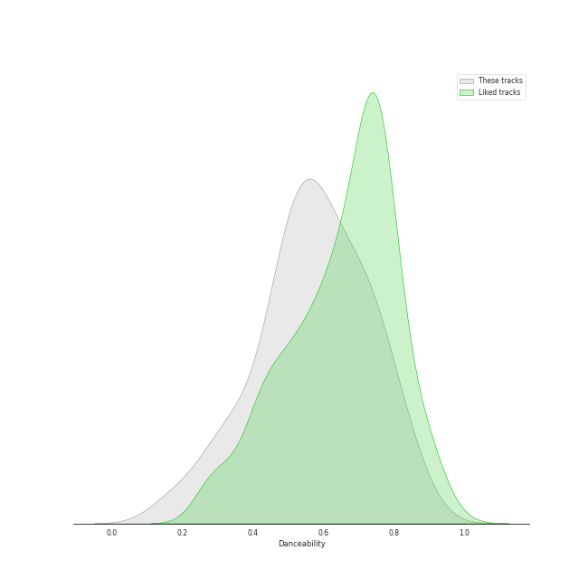
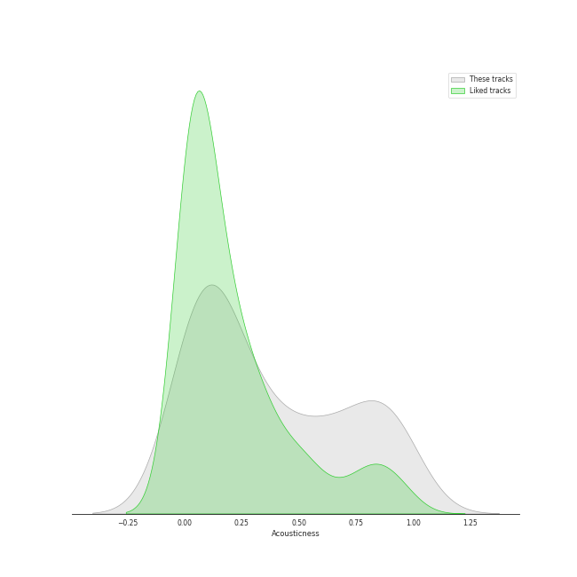
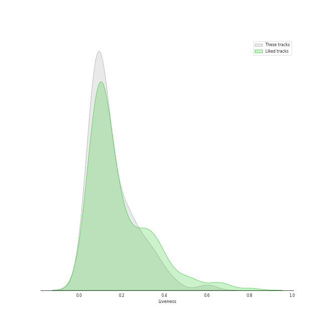
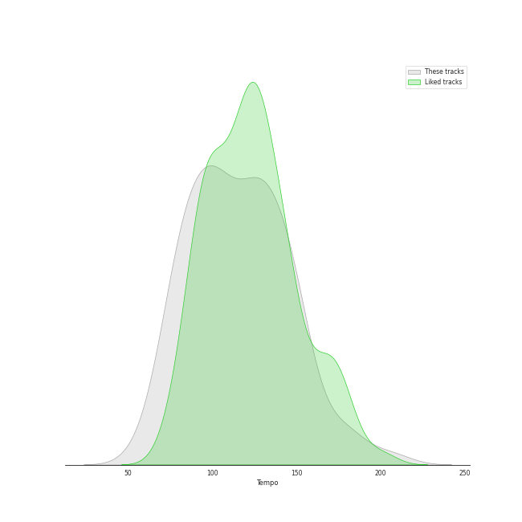

# Audio Features for soft rock

## Danceability

| 10 most Danceable tracks | 10 least Danceable tracks |
|:---|:---|
| Dreams - 2004 Remaster (0.828) | Bridge Over Troubled Water (0.149) |
| Eye of the Tiger (0.817) | Lights (0.193) |
| I Will Survive - Single Version (0.777) | Desperado - 2013 Remaster (0.228) |
| You Can Call Me Al (0.776) | She's Always a Woman (0.292) |
| Cecilia (0.755) | Come Sail Away (0.324) |
| Sara - 2015 Remaster (0.743) | Piano Man (0.334) |
| My Life (0.741) | And So It Goes (0.351) |
| A Matter of Trust (0.738) | The Boxer (0.351) |
| Last Christmas (0.735) | Captain Jack (0.392) |
| Rhiannon (0.723) | Landslide (0.414) |

## Energy

| 10 most Energetic tracks | 10 least Energetic tracks |
|:---|:---|
| We Didn't Start the Fire (0.967) | And So It Goes (0.0387) |
| Uptown Girl (0.944) | The Boxer (0.0802) |
| Go Your Own Way - 2004 Remaster (0.941) | And So It Goes (0.0871) |
| Any Way You Want It (0.932) | She's Got a Way (0.142) |
| Scenes from an Italian Restaurant (0.931) | Lullabye (Goodnight, My Angel) (0.157) |
| Take on Me (0.902) | Landslide (0.161) |
| Movin' Out (Anthony's Song) (0.88) | So Far Away (0.172) |
| The Stranger (0.878) | Crazy Love - 2013 Remaster (0.188) |
| Cecilia (0.876) | Bridge Over Troubled Water (0.206) |
| Only the Good Die Young (0.872) | The Sound of Silence - Acoustic Version (0.216) |

## Speechiness

| 10 most Speechy tracks | 10 least Speechy tracks |
|:---|:---|
| Only the Good Die Young (0.159) | Fields Of Gold (0.0246) |
| Scenes from an Italian Restaurant (0.126) | The Longest Time (0.0262) |
| Big Shot (0.0972) | A Matter of Trust (0.0268) |
| Crazy Love - 2013 Remaster (0.0959) | Hotel California - 2013 Remaster (0.027) |
| The Stranger (0.0837) | Cold as Ice (0.0271) |
| Crazy Love (0.0819) | Dreams - 2004 Remaster (0.0276) |
| The Boxer (0.0615) | Piano Man (0.0276) |
| The River of Dreams (0.0576) | Dust in the Wind (0.0283) |
| Don't Ask Me Why (0.0543) | Last Christmas (0.0293) |
| Take on Me (0.054) | Rhiannon (0.0296) |

## Acousticness

| 10 most Acoustic tracks | 10 least Acoustic tracks |
|:---|:---|
| She's Got a Way (0.97) | Any Way You Want It (0.00251) |
| Lullabye (Goodnight, My Angel) (0.948) | Carry on Wayward Son (0.00321) |
| Desperado - 2013 Remaster (0.946) | Hotel California - 2013 Remaster (0.00574) |
| And So It Goes (0.941) | The Chain - 2004 Remaster (0.009) |
| The Boxer (0.93) | I Will Survive - Single Version (0.0131) |
| And So It Goes (0.91) | Pressure (0.0148) |
| So Far Away (0.897) | Renegade (0.0151) |
| Landslide (0.883) | Go Your Own Way - 2004 Remaster (0.0167) |
| Crazy Love (0.85) | Take on Me (0.018) |
| Crazy Love - 2013 Remaster (0.841) | Cold as Ice (0.0264) |

## Instrumentalness

| 10 most Instrumental tracks | 10 least Instrumental tracks |
|:---|:---|
| Rhiannon (0.0946) | And So It Goes (0.0) |
| 25 or 6 to 4 (0.0367) | Cat's in the Cradle (0.0) |
| Sara - 2015 Remaster (0.0208) | Only the Good Die Young (0.0) |
| Fields Of Gold (0.0141) | We Didn't Start the Fire (0.0) |
| Stayin Alive (0.00839) | Brown Eyed Girl (0.0) |
| I Will Survive - Single Version (0.00805) | Don't Stop Believin' (0.0) |
| Lights (0.00711) | Lullabye (Goodnight, My Angel) (0.0) |
| You Can Call Me Al (0.00647) | The Longest Time (0.0) |
| Dreams - 2004 Remaster (0.00428) | The Sound of Silence - Acoustic Version (0.0) |
| I Feel the Earth Move (0.00226) | Uptown Girl (0.0) |

## Liveness

| 10 most Live tracks | 10 least Live tracks |
|:---|:---|
| Uptown Girl (0.601) | The Chain - 2004 Remaster (0.0451) |
| Don't Stop Believin' (0.447) | I Feel the Earth Move (0.0528) |
| Carry on Wayward Son (0.446) | My Life (0.0555) |
| Brown Eyed Girl (0.406) | Hotel California - 2013 Remaster (0.0575) |
| Captain Jack (0.374) | Movin' Out (Anthony's Song) (0.0591) |
| We Didn't Start the Fire (0.356) | Easy (0.0596) |
| Last Christmas (0.355) | The Boxer (0.0619) |
| Lights (0.332) | The River of Dreams (0.0667) |
| New York State of Mind (0.323) | Go Your Own Way - 2004 Remaster (0.068) |
| Piano Man (0.312) | Renegade (0.0723) |

## Valence

| 10 most Happy tracks | 10 least Happy tracks |
|:---|:---|
| I'm a Believer - 2006 Remaster (0.962) | Come Sail Away (0.141) |
| Cecilia (0.954) | Desperado - 2013 Remaster (0.18) |
| Stayin Alive (0.949) | New York State of Mind (0.194) |
| Last Christmas (0.947) | She's Got a Way (0.196) |
| Brown Eyed Girl (0.908) | Lullabye (Goodnight, My Angel) (0.22) |
| Movin' Out (Anthony's Song) (0.895) | The Stranger (0.222) |
| We Didn't Start the Fire (0.895) | And So It Goes (0.24) |
| A Matter of Trust (0.88) | Bridge Over Troubled Water (0.264) |
| Take on Me (0.876) | Vienna (0.308) |
| Don't Ask Me Why (0.868) | Fields Of Gold (0.32) |

## Tempo

| 10 most Fast tracks | 10 least Fast tracks |
|:---|:---|
| Lights (205.422) | Desperado - 2013 Remaster (60.3) |
| The Boxer (181.849) | Moondance - 2013 Remaster (67.409) |
| Piano Man (179.239) | She's Got a Way (75.859) |
| She's Always a Woman (176.631) | Only the Good Die Young (76.214) |
| Landslide (159.375) | Lullabye (Goodnight, My Angel) (76.48) |
| The Chain - 2004 Remaster (151.553) | Crazy Love - 2013 Remaster (77.464) |
| Brown Eyed Girl (150.566) | Crazy Love (77.539) |
| Big Shot (149.861) | Cat's in the Cradle (78.111) |
| Pressure (148.494) | Bridge Over Troubled Water (79.764) |
| 25 or 6 to 4 (147.502) | I'm a Believer - 2006 Remaster (80.106) |
