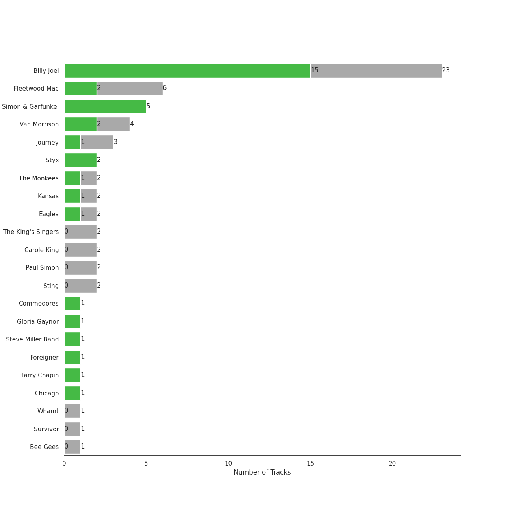
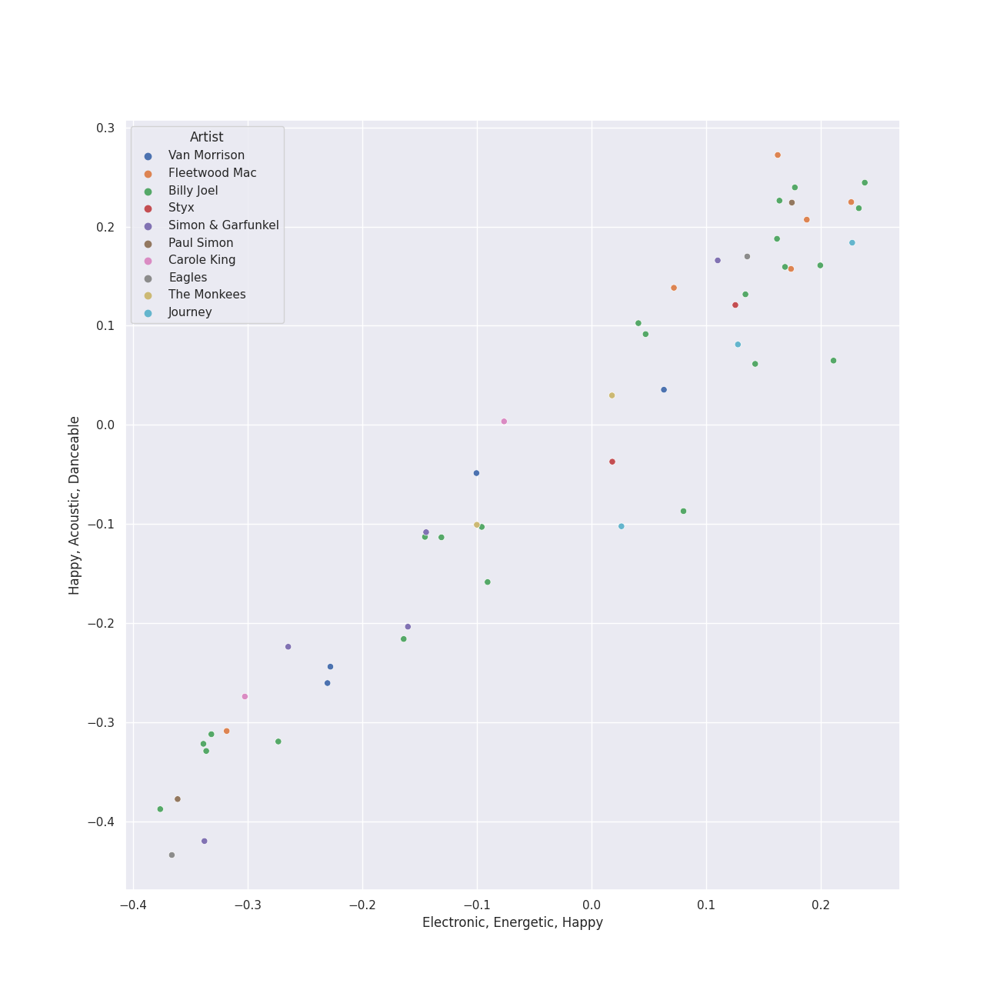
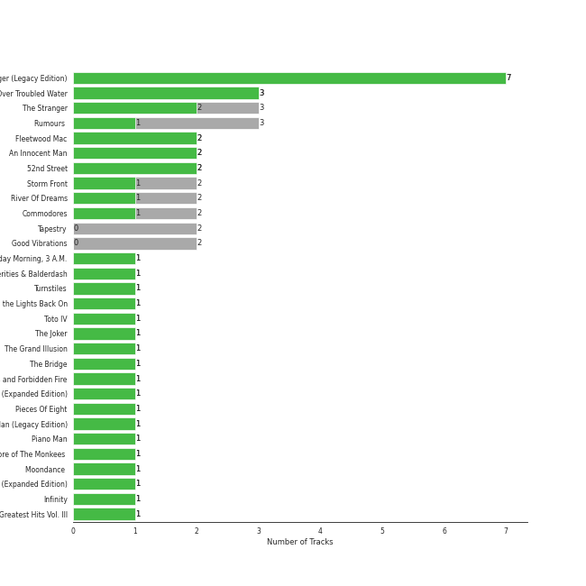
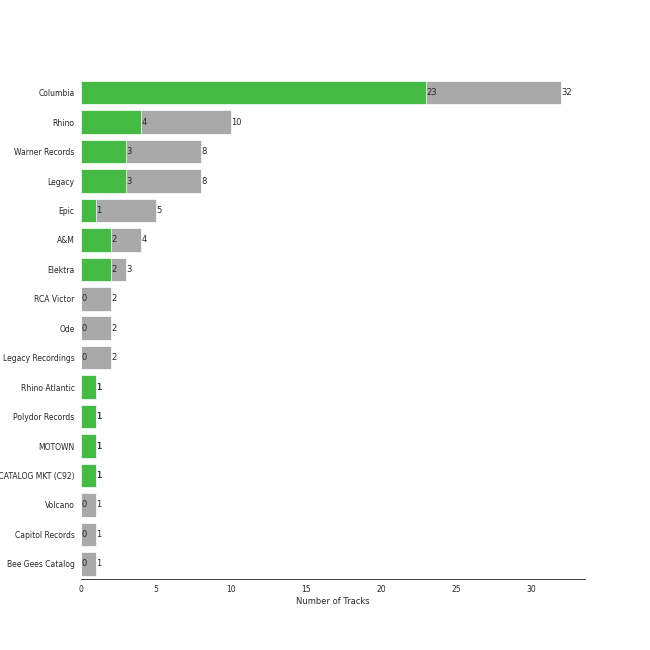
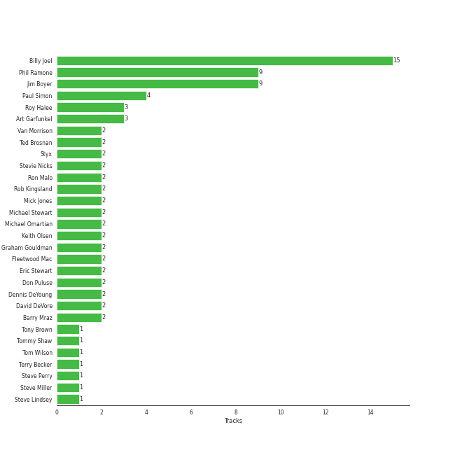
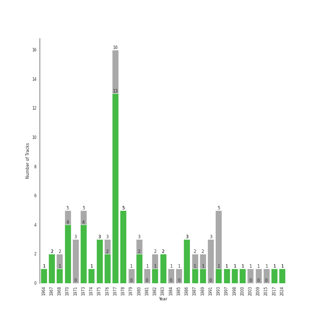

# soft rock

75 songs

[See Track Features](audio_features.md)

[See Clusters](clusters/overview.md)

## Top Artists

| Art | Tracks | 💚 | Artist | 🔗 |
|:---|---:|---:|:---|:---|
|  | 26 | 21 | [Billy Joel](../../artists/billy_joel/overview.md) | [🔗](https://open.spotify.com/artist/6zFYqv1mOsgBRQbae3JJ9e) |
|  | 5 | 5 | [Simon & Garfunkel](../../artists/simon___garfunkel/overview.md) | [🔗](https://open.spotify.com/artist/70cRZdQywnSFp9pnc2WTCE) |
|  | 6 | 3 | Fleetwood Mac | [🔗](https://open.spotify.com/artist/08GQAI4eElDnROBrJRGE0X) |
|  | 4 | 2 | Van Morrison | [🔗](https://open.spotify.com/artist/44NX2ffIYHr6D4n7RaZF7A) |
|  | 2 | 2 | 10cc | [🔗](https://open.spotify.com/artist/6i6WlGzQtXtz7GcC5H5st5) |
|  | 2 | 2 | Styx | [🔗](https://open.spotify.com/artist/4salDzkGmfycRqNUbyBphh) |
|  | 2 | 2 | Kansas | [🔗](https://open.spotify.com/artist/2hl0xAkS2AIRAu23TVMBG1) |
|  | 3 | 1 | Journey | [🔗](https://open.spotify.com/artist/0rvjqX7ttXeg3mTy8Xscbt) |
|  | 2 | 1 | Commodores | [🔗](https://open.spotify.com/artist/6twIAGnYuIT1pncMAsXnEm) |
|  | 2 | 1 | The Monkees | [🔗](https://open.spotify.com/artist/320EPCSEezHt1rtbfwH6Ck) |

See all 28 artists

| Art | Tracks | 💚 | Artist | 🔗 |
|:---|---:|---:|:---|:---|
|  | 2 | 1 | Paul Simon | [🔗](https://open.spotify.com/artist/2CvCyf1gEVhI0mX6aFXmVI) |
|  | 2 | 1 | Eagles | [🔗](https://open.spotify.com/artist/0ECwFtbIWEVNwjlrfc6xoL) |
|  | 1 | 1 | Gloria Gaynor | [🔗](https://open.spotify.com/artist/6V6WCgi7waF55bJmylC4H5) |
|  | 1 | 1 | Steve Miller Band | [🔗](https://open.spotify.com/artist/6QtGlUje9TIkLrgPZrESuk) |
|  | 1 | 1 | Foreigner | [🔗](https://open.spotify.com/artist/6IRouO5mvvfcyxtPDKMYFN) |
|  | 1 | 1 | Harry Chapin | [🔗](https://open.spotify.com/artist/42q4Ivs7tAiCZ5C7eG5q4c) |
|  | 1 | 1 | Chicago | [🔗](https://open.spotify.com/artist/3iDD7bnsjL9J4fO298r0L0) |
|  | 1 | 1 | Bonnie Tyler | [🔗](https://open.spotify.com/artist/0SD4eZCN4Kr0wQk56hCdh2) |
|  | 1 | 1 | TOTO | [🔗](https://open.spotify.com/artist/0PFtn5NtBbbUNbU9EAmIWF) |
|  | 2 | 0 | The King's Singers | [🔗](https://open.spotify.com/artist/5lR7yDVN4z9kahOiUSlMhe) |
|  | 2 | 0 | Carole King | [🔗](https://open.spotify.com/artist/319yZVtYM9MBGqmSQnMyY6) |
|  | 2 | 0 | Sting | [🔗](https://open.spotify.com/artist/0Ty63ceoRnnJKVEYP0VQpk) |
|  | 1 | 0 | Wham! | [🔗](https://open.spotify.com/artist/5lpH0xAS4fVfLkACg9DAuM) |
|  | 1 | 0 | Annie Lennox | [🔗](https://open.spotify.com/artist/5MspMQqdVbdwP6ax3GXqum) |
|  | 1 | 0 | Bonnie Raitt | [🔗](https://open.spotify.com/artist/4KDyYWR7IpxZ7xrdYbKrqY) |
|  | 1 | 0 | Kool & The Gang | [🔗](https://open.spotify.com/artist/3VNITwohbvU5Wuy5PC6dsI) |
|  | 1 | 0 | Survivor | [🔗](https://open.spotify.com/artist/26bcq2nyj5GB7uRr558iQg) |
|  | 1 | 0 | Bee Gees | [🔗](https://open.spotify.com/artist/1LZEQNv7sE11VDY3SdxQeN) |

## Most and least listened tracks
| ​ | Most listened tracks | Rank | ​​ | Least listened tracks | Rank |
|:---|:---|---:|:---|:---|---:|
|  | [Vienna](../../artists/billy_joel/overview.md) | 474 |  | Cold as Ice | 2599 |
|  | [Movin' Out (Anthony's Song)](../../artists/billy_joel/overview.md) | 478 |  | Daydream Believer | 2599 |
|  | [Only the Good Die Young](../../artists/billy_joel/overview.md) | 483 |  | Stayin Alive | 2599 |
|  | [A Matter of Trust](../../artists/billy_joel/overview.md) | 484 |  | I Will Survive - Single Version | 2599 |
|  | [Piano Man](../../artists/billy_joel/overview.md) | 487 |  | Lights | 2599 |
|  | [The Longest Time](../../artists/billy_joel/overview.md) | 488 |  | [The Boxer](../../artists/simon___garfunkel/overview.md) | 2599 |
|  | Renegade | 686 |  | Any Way You Want It | 2599 |
|  | Africa | 712 |  | Dust in the Wind | 2599 |
|  | Desperado - 2013 Remaster | 728 |  | [Bridge Over Troubled Water](../../artists/simon___garfunkel/overview.md) | 2599 |
|  | 25 or 6 to 4 | 811 |  | [Cecilia](../../artists/simon___garfunkel/overview.md) | 2599 |

## Top Albums

| Art | Tracks | 💚 | Album | Release Date | 🔗 |
|:---|---:|---:|:---|:---|:---|
|  | 7 | 7 | The Stranger (Legacy Edition) | 1977 | [🔗](https://open.spotify.com/album/1Mhn9VosyjtWn4dMPFlna6) |
|  | 3 | 3 | Bridge Over Troubled Water | 1970-01-26 | [🔗](https://open.spotify.com/album/0JwHz5SSvpYWuuCNbtYZoV) |
|  | 3 | 1 | Rumours (Super Deluxe) | 1977-02-04 | [🔗](https://open.spotify.com/album/0BwWUstDMUbgq2NYONRqlu) |
|  | 2 | 2 | Glass Houses | 1980-03-12 | [🔗](https://open.spotify.com/album/5sztejERqpktXEdemlUvU5) |
|  | 2 | 2 | Fleetwood Mac | 1975-07-11 | [🔗](https://open.spotify.com/album/5VIQ3VaAoRKOEpJ0fewdvo) |
|  | 2 | 2 | An Innocent Man | 1983-08-08 | [🔗](https://open.spotify.com/album/3R3x4zIabsvpD3yxqLaUpc) |
|  | 2 | 2 | 52nd Street | 1978-10-13 | [🔗](https://open.spotify.com/album/1HmCO8VK98AU6EXPOjGYyI) |
|  | 2 | 1 | Storm Front | 1989-10-17 | [🔗](https://open.spotify.com/album/1Vw2uoVkLAJFVViJ1QyK1D) |
|  | 2 | 1 | River Of Dreams | 1993-08-10 | [🔗](https://open.spotify.com/album/4HPnwQJAEvTY910q4RNeOu) |
|  | 2 | 1 | Commodores | 1977-01-01 | [🔗](https://open.spotify.com/album/2tzbNCAUTmW4MIM2Ulvrwl) |

See all 56 albums

| Art | Tracks | 💚 | Album | Release Date | 🔗 |
|:---|---:|---:|:---|:---|:---|
|  | 2 | 0 | Tapestry | 1971 | [🔗](https://open.spotify.com/album/12n11cgnpjXKLeqrnIERoS) |
|  | 2 | 0 | Good Vibrations | 1993 | [🔗](https://open.spotify.com/album/10IUKCLZPs9onPwXfQVxfv) |
|  | 1 | 1 | Wednesday Morning, 3 A.M. | 1964-10-19 | [🔗](https://open.spotify.com/album/5pnJrocLlZ3FWEbcr2PTz0) |
|  | 1 | 1 | Verities & Balderdash | 1974 | [🔗](https://open.spotify.com/album/3nta4nhqWoWjc6LmHIB0kT) |
|  | 1 | 1 | Turnstiles | 1976-05-19 | [🔗](https://open.spotify.com/album/7GiLfxL1su3MSqz7pmKMZi) |
|  | 1 | 1 | Turn the Lights Back On | 2024-02-01 | [🔗](https://open.spotify.com/album/4csPGLYTb7kt85U377UCuC) |
|  | 1 | 1 | Toto IV | 1982-04-08 | [🔗](https://open.spotify.com/album/62U7xIHcID94o20Of5ea4D) |
|  | 1 | 1 | The Joker | 1973-01-01 | [🔗](https://open.spotify.com/album/5uYNj1HkZrWKAkhEYcGmJr) |
|  | 1 | 1 | The Grand Illusion | 1977-01-01 | [🔗](https://open.spotify.com/album/6MFIBPVrZjHjP0pPkVF3IU) |
|  | 1 | 1 | The Bridge | 1986-07-28 | [🔗](https://open.spotify.com/album/2fRxSC6FtiAkhEDVZr2seH) |
|  | 1 | 1 | Secret Dreams and Forbidden Fire | 1986-05-05 | [🔗](https://open.spotify.com/album/4doea7KA9jw7nkm3IOs0PR) |
|  | 1 | 1 | Point Of Know Return (Expanded Edition) | 1977 | [🔗](https://open.spotify.com/album/6oU298pdPTCQnMx1PYwyUA) |
|  | 1 | 1 | Pieces Of Eight | 1978-01-01 | [🔗](https://open.spotify.com/album/294yFGYq9SBXWR4g6dK63D) |
|  | 1 | 1 | Piano Man (Legacy Edition) | 1973-11-07 | [🔗](https://open.spotify.com/album/69wjSAZXZiD2EBia3b3gxL) |
|  | 1 | 1 | Piano Man | 1973-11-09 | [🔗](https://open.spotify.com/album/77ErLrVvYETIlQJHAwhfIH) |
|  | 1 | 1 | More of The Monkees (Deluxe Edition) | 1967-01-09 | [🔗](https://open.spotify.com/album/50zHjIiTOZM232gnWvOydX) |
|  | 1 | 1 | Moondance (Deluxe Edition) | 1970-02 | [🔗](https://open.spotify.com/album/7diHYi0CglGJekoM3KaWBK) |
|  | 1 | 1 | Leftoverture (Expanded Edition) | 1976 | [🔗](https://open.spotify.com/album/7MejfRSNnrpcLZIxkeZDqR) |
|  | 1 | 1 | Infinity | 1978 | [🔗](https://open.spotify.com/album/7K4Nk5fHkCuzNm5A6mdo2U) |
|  | 1 | 1 | Greatest Hits Vol. III | 1997-06-13 | [🔗](https://open.spotify.com/album/3cJ6ZymbUcNGe1T8YZtGyE) |
|  | 1 | 1 | Graceland (25th Anniversary Deluxe Edition) | 1986-08-12 | [🔗](https://open.spotify.com/album/6WgGWYw6XXQyLTsWt7tXky) |
|  | 1 | 1 | Foreigner (Expanded) | 1977-03-08 | [🔗](https://open.spotify.com/album/1OU7zJvUfgxxPHgkTClt1M) |
|  | 1 | 1 | Desperado (2013 Remaster) | 1973-04-17 | [🔗](https://open.spotify.com/album/09WBxbis5Sixt01FVMs8UM) |
|  | 1 | 1 | Deceptive Bends | 1977 | [🔗](https://open.spotify.com/album/6D3RQD5AQZ4P2aDzsZmBI4) |
|  | 1 | 1 | Chicago IX: Chicago's Greatest Hits | 1975-11-10 | [🔗](https://open.spotify.com/album/5qWGV0fd7hpdptJYI4G9Dd) |
|  | 1 | 1 | Bookends | 1968-04-03 | [🔗](https://open.spotify.com/album/3bzgbgiytguTDnwzflAZr2) |
|  | 1 | 1 | Blowin' Your Mind! | 1967-09 | [🔗](https://open.spotify.com/album/7dsWupQRlFuhG8FGiQAUjC) |
|  | 1 | 1 | Bloody Tourists | 1978 | [🔗](https://open.spotify.com/album/3MecVG0PeBObAhjwEAczFG) |
|  | 1 | 1 | 20th Century Masters: The Millennium Collection: Best Of Gloria Gaynor | 2000-01-01 | [🔗](https://open.spotify.com/album/2BU2SNYoIPtZvGEJckdIhx) |
|  | 1 | 0 | Wild And Peaceful | 1973-09 | [🔗](https://open.spotify.com/album/3MRgojA0LfPka4RG7aRjsI) |
|  | 1 | 0 | Tusk (2015 Remaster) | 1979-10-12 | [🔗](https://open.spotify.com/album/5FIN8pyPVx8ggNs5jQ86Re) |
|  | 1 | 0 | The Ultimate Bee Gees | 2009-11-03 | [🔗](https://open.spotify.com/album/5GucSY3249qHDx4v1Hcxry) |
|  | 1 | 0 | The Nylon Curtain | 1982-06-23 | [🔗](https://open.spotify.com/album/50bajZpetfL5T0iRCOR74J) |
|  | 1 | 0 | The Lord of the Rings: The Return of the King (Original Motion Picture Soundtrack) | 2003-11-24 | [🔗](https://open.spotify.com/album/38x0H9PdY1fHh8EdfPUXqa) |
|  | 1 | 0 | The Essential Van Morrison | 2015-12-04 | [🔗](https://open.spotify.com/album/0RXzDyBEGd2EGQTmv8cxQa) |
|  | 1 | 0 | The Birds, The Bees, & The Monkees | 1968-04-22 | [🔗](https://open.spotify.com/album/2Ov6zb7NfgDh3EXSIIWrb2) |
|  | 1 | 0 | Ten Summoner's Tales | 1993-03-09 | [🔗](https://open.spotify.com/album/5kV0KBXfELibs6qQJLmOtg) |
|  | 1 | 0 | Rocky IV | 1985 | [🔗](https://open.spotify.com/album/3t3BbpFJiGcXl4jI5CRLLA) |
|  | 1 | 0 | Moondance (Expanded Edition) | 1970-02 | [🔗](https://open.spotify.com/album/6yNYC35npMBHbxG0Vle83O) |
|  | 1 | 0 | Luck Of The Draw | 1991-01-01 | [🔗](https://open.spotify.com/album/6blrkOZ0VmkhYPjfoD7eqf) |
|  | 1 | 0 | LAST CHRISTMAS | 1984-11-29 | [🔗](https://open.spotify.com/album/6egzU9NKfora01qaNbvwfZ) |
|  | 1 | 0 | Hotel California (2013 Remaster) | 1976-12-08 | [🔗](https://open.spotify.com/album/2widuo17g5CEC66IbzveRu) |
|  | 1 | 0 | Escape (2022 Remaster) | 1981-07-17 | [🔗](https://open.spotify.com/album/4guAwaniEAEQSW0NCpo4gm) |
|  | 1 | 0 | Departure | 1980 | [🔗](https://open.spotify.com/album/2OyVtIEp7O7a6o82DF4Ba5) |
|  | 1 | 0 | Cold Spring Harbor | 1971-11-01 | [🔗](https://open.spotify.com/album/274rMlKrr22086ohmwAJZA) |
|  | 1 | 0 | ...Nothing Like The Sun | 1987-01-01 | [🔗](https://open.spotify.com/album/3mVCQqgwEvwD7lHy9KHi7R) |

## Top Record Labels

| Tracks | 💚 | Label |
|---:|---:|:---|
| 35 | 29 | [Columbia](../../labels/columbia/overview.md) |
| 17 | 12 | [Legacy](../../labels/legacy/overview.md) |
| 10 | 5 | [Rhino](../../labels/rhino/overview.md) |
| 8 | 4 | [Warner Records](../../labels/warner_records/overview.md) |
| 5 | 2 | [Epic](../../labels/epic/overview.md) |
| 4 | 2 | A&M |
| 3 | 2 | Elektra |
| 2 | 2 | [EMI](../../labels/emi/overview.md) |
| 2 | 1 | [MOTOWN](../../labels/motown/overview.md) |
| 2 | 1 | Legacy Recordings |

See all 21 labels

| Tracks | 💚 | Label |
|---:|---:|:---|
| 1 | 1 | Sony Music CG |
| 1 | 1 | Rhino Atlantic |
| 1 | 1 | [Polydor Records](../../labels/polydor_records/overview.md) |
| 1 | 1 | CAPITOL CATALOG MKT (C92) |
| 2 | 0 | RCA Victor |
| 2 | 0 | Ode |
| 1 | 0 | Volcano |
| 1 | 0 | [Reprise](../../labels/reprise/overview.md) |
| 1 | 0 | Island Mercury |
| 1 | 0 | [Capitol Records](../../labels/capitol_records/overview.md) |
| 1 | 0 | Bee Gees Catalog |

## Top Producers

| Art | Producer | Tracks | Credit Types |
|:---|:---|---:|:---|
|  | [Billy Joel](../../artists/billy_joel/overview.md) | 19 | Lyricist, Producer, Songwriter, Arranger |
| | [Phil Ramone](../../producers/phil_ramone/overview.md) | 13 | Producer |
| | [Jim Boyer](../../producers/jim_boyer/overview.md) | 13 | Producer |
|  | Paul Simon | 5 | Lyricist, Producer, Songwriter |
| | Roy Halee | 4 | Producer |
| | Art Garfunkel | 3 | Producer |
|  | Fleetwood Mac | 3 | Producer |
| | Kerry Livgren | 2 | Lyricist, Songwriter |
| | Ted Brosnan | 2 | Producer |
| | Michael Omartian | 2 | Arranger |

View all

| Art | Producer | Tracks | Credit Types |
|:---|:---|---:|:---|
| | Mick Jones | 2 | Producer, Songwriter |
|  | Van Morrison | 2 | Lyricist, Producer, Songwriter |
| | Dennis DeYoung | 2 | Lyricist, Songwriter, Producer |
| | Ron Malo | 2 | Producer |
| | Keith Olsen | 2 | Producer |
|  | Kansas | 2 | Arranger |
| | Jeff Glixman | 2 | Producer |
|  | Styx | 2 | Producer |
| | Eric Stewart | 2 | Producer, Songwriter |
| | Barry Mraz | 2 | Producer |
| | David DeVore | 2 | Producer |
| | Stevie Nicks | 2 | Lyricist, Songwriter |
| | Graham Gouldman | 2 | Producer, Songwriter |
| | Rob Kingsland | 2 | Producer |
| | Don Puluse | 2 | Producer |
| | Michael Stewart | 2 | Producer |
| | Leanne Ungar | 1 | Producer |
|  | 10cc | 1 | Producer |
| | Lewis Merenstein | 1 | Producer |
| | Ahmet Ertegun | 1 | Songwriter |
| | John Jansen | 1 | Producer |
| | Robert Lamm | 1 | Lyricist, Songwriter |
| | John Sinclair | 1 | Producer |
| | Liberty DeVitto | 1 | Arranger |
| | Rory Dodd | 1 | Arranger |
| | James Anthony Carmichael | 1 | Producer |
| | Jim Ed Norman | 1 | Arranger |
| | Ian McDonald | 1 | Producer |
| | Bruce Botnick | 1 | Producer |
| | Tommy Shaw | 1 | Lyricist, Songwriter |
| | Freddie Perren | 1 | Songwriter |
| | Terry Becker | 1 | Producer |
| | Aynsley Dunbar | 1 | Producer |
| | Glyn Johns | 1 | Producer |
| | Ken Caillat | 1 | Producer |
| | Dean Pitchford | 1 | Lyricist |
| | Holly Sherwood | 1 | Arranger |
| | Doug Stegmeyer | 1 | Arranger |
| | Ellen Foley | 1 | Arranger |
| | John Hendrickson | 1 | Producer |
| | Steve Lindsey | 1 | Arranger, Producer |
| | Richard Dashut | 1 | Producer |
| | Don Henley | 1 | Songwriter |
| | Eric Troyer | 1 | Arranger |
|  | Harry Chapin | 1 | Songwriter |
| | Steve Perry | 1 | Songwriter |
| | Tony Brown | 1 | Producer |
| | Glenn Frey | 1 | Songwriter |
| | Fred Tenny | 1 | Producer |
| | Justin Niebank | 1 | Producer |
| | Steve Miller | 1 | Producer, Songwriter |
| | Neil Diamond | 1 | Lyricist, Songwriter |
| | Jimmy Douglass | 1 | Producer |
| | Eddie Curtis | 1 | Songwriter |
| | Jim Horn | 1 | Arranger |
| | Brian Ross-Myring | 1 | Producer |
| | Arthur Payson | 1 | Producer |
| | Gregg Rolie | 1 | Producer |
| | Bill Schnee | 1 | Producer |
| | John Bradley | 1 | Producer |
| | Dino Fekaris | 1 | Songwriter |
| | Chikapa "Ray" Phiri | 1 | Arranger |
| | Bert Russell Berns | 1 | Producer |
| | David Dickson | 1 | Producer |
| | Robert Charles | 1 | Producer |
| | Lou Waxman | 1 | Producer |
| | Bradshaw Leigh | 1 | Producer |
| | Neil Dorfsman | 1 | Producer |
| | Ed Walsh | 1 | Producer |
| | Steve Boyer | 1 | Producer |
| | Randy Mason | 1 | Producer |
| | Rob Mounsey | 1 | Arranger |
| | Lou Gramm | 1 | Songwriter |
| | Gary Lyons | 1 | Producer |
| | Jim Tomlinson | 1 | Arranger |
| | John Philip Shenale | 1 | Producer |
| | James William Guercio | 1 | Producer |
| | Lionel Richie | 1 | Lyricist, Songwriter |
| | Elliot Scheiner | 1 | Producer |
| | Bill "Bleu" Evans | 1 | Producer |
| | Kevin Herron | 1 | Producer |
| | Ira Newborn | 1 | Arranger |
| | Kenny Ascher | 1 | Arranger |
| | Chris Hinshaw | 1 | Producer |
| | Leonard Cohen | 1 | Lyricist, Songwriter |
| | Ross Valory | 1 | Producer |
| | Ed Cherney | 1 | Producer |
| | Brooks Arthur | 1 | Producer |
| | Lindsey Buckingham | 1 | Lyricist, Songwriter |
| | Tom Wilson | 1 | Producer |

## Years

| ​ | 10 newest albums | ​​ | 10 oldest albums |
|:---|:---|:---|:---|
|  | Turn the Lights Back On (2024-02-01) |  | Wednesday Morning, 3 A.M. (1964-10-19) |
|  | The Essential Van Morrison (2015-12-04) |  | More of The Monkees (Deluxe Edition) (1967-01-09) |
|  | The Ultimate Bee Gees (2009-11-03) |  | Blowin' Your Mind! (1967-09) |
|  | The Lord of the Rings: The Return of the King (Original Motion Picture Soundtrack) (2003-11-24) |  | Bookends (1968-04-03) |
|  | 20th Century Masters: The Millennium Collection: Best Of Gloria Gaynor (2000-01-01) |  | The Birds, The Bees, & The Monkees (1968-04-22) |
|  | Greatest Hits Vol. III (1997-06-13) |  | Bridge Over Troubled Water (1970-01-26) |
|  | River Of Dreams (1993-08-10) |  | Moondance (Expanded Edition) (1970-02) |
|  | Ten Summoner's Tales (1993-03-09) |  | Moondance (Deluxe Edition) (1970-02) |
|  | Good Vibrations (1993) |  | Tapestry (1971) |
|  | Luck Of The Draw (1991-01-01) |  | Cold Spring Harbor (1971-11-01) |

