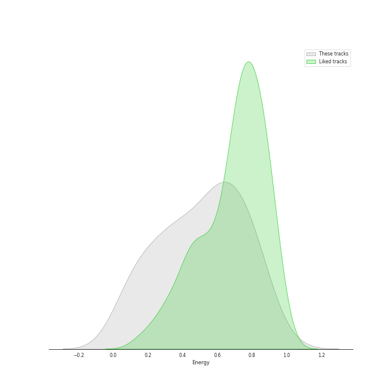
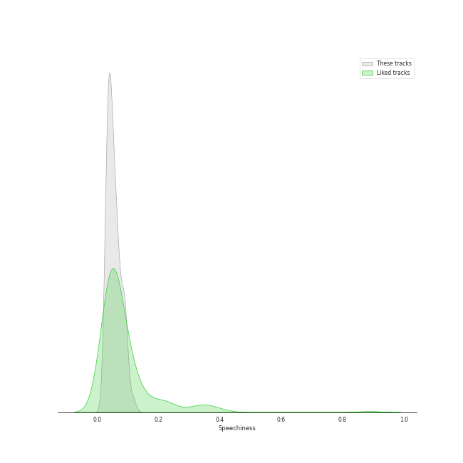
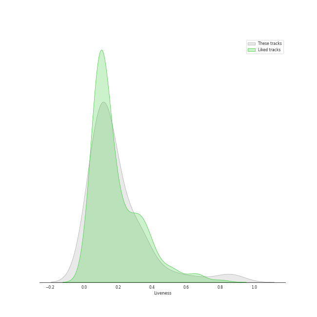
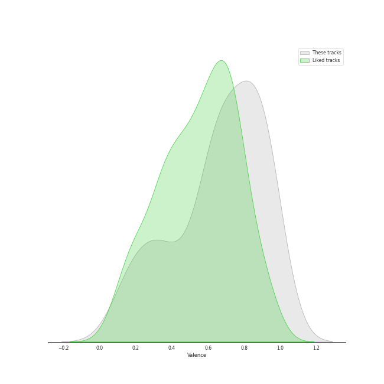

# Track Features for soul

## Danceability

| ​ | 10 most Danceable tracks | ​​ | 10 least Danceable tracks |
|:---|:---|:---|:---|
|  | Billie Jean (0.932) |  | Nature Boy (0.203) |
|  | P.Y.T. (Pretty Young Thing) (0.894) |  | Stormy Weather (0.262) |
|  | Don't Stop 'Til You Get Enough (0.878) |  | What A Wonderful World (0.271) |
|  | Smooth Criminal - 2012 Remaster (0.853) |  | At Last (0.274) |
|  | Wanna Be Startin' Somethin' (0.842) |  | Unforgettable (0.286) |
|  | Papa Was A Rollin' Stone - Single Version (0.817) |  | The Christmas Song (Merry Christmas To You) (0.319) |
|  | Man in the Mirror - 2012 Remaster (0.808) |  | Unforgettable (0.349) |
|  | Respect (0.805) |  | Dream A Little Dream Of Me - Single Version (0.443) |
|  | Thriller (0.771) |  | L-O-V-E - 2000 Remaster (0.451) |
|  | Ain't Too Proud To Beg (0.763) |  | I've Got A Crush On You (0.455) |

## Energy

| ​ | 10 most Energetic tracks | ​​ | 10 least Energetic tracks |
|:---|:---|:---|:---|
|  | Smooth Criminal - 2012 Remaster (0.981) |  | La vie en rose - Single Version (0.0406) |
|  | Wanna Be Startin' Somethin' (0.872) |  | Baby It's Cold Outside (0.0813) |
|  | Isn't She Lovely (0.826) |  | Nature Boy (0.0895) |
|  | Don't Stop 'Til You Get Enough (0.821) |  | Dream A Little Dream Of Me - Single Version (0.104) |
|  | Man in the Mirror - 2012 Remaster (0.812) |  | I've Got A Crush On You (0.106) |
|  | Beat It (0.8) |  | What A Wonderful World (0.165) |
|  | I Saw Mommy Kissing Santa Claus (0.712) |  | Unforgettable (0.182) |
|  | The Way You Do The Things You Do (0.704) |  | L-O-V-E - 2000 Remaster (0.187) |
|  | Thriller (0.687) |  | The Christmas Song (Merry Christmas To You) (0.21) |
|  | ABC (0.678) |  | Cheek To Cheek (0.264) |

## Speechiness

| ​ | 10 most Speechy tracks | ​​ | 10 least Speechy tracks |
|:---|:---|:---|:---|
|  | Dream A Little Dream Of Me - Single Version (0.101) |  | I'd Rather Go Blind (0.0247) |
|  | L-O-V-E - 2000 Remaster (0.0928) |  | I'll Be There (0.0253) |
|  | Cheek To Cheek (0.0914) |  | Unforgettable (0.028) |
|  | Don't Stop 'Til You Get Enough (0.089) |  | At Last (0.0293) |
|  | Isn't She Lovely (0.0851) |  | Stormy Weather (0.0303) |
|  | Papa Was A Rollin' Stone - Single Version (0.0811) |  | Unforgettable (0.031) |
|  | Smooth Criminal - 2012 Remaster (0.0751) |  | The Way You Do The Things You Do (0.0321) |
|  | Superstition - Single Version (0.0725) |  | Easy (0.0332) |
|  | Blue Moon (0.0698) |  | Signed, Sealed, Delivered (I'm Yours) (0.0337) |
|  | Mack the Knife (0.0697) |  | Milestones (feat. John Coltrane, Cannonball Adderley, Red Garland, Paul Chambers & Philly Joe Jones) (0.0341) |

## Acousticness

| ​ | 10 most Acoustic tracks | ​​ | 10 least Acoustic tracks |
|:---|:---|:---|:---|
|  | I've Got A Crush On You (0.986) |  | Billie Jean (0.0173) |
|  | Blue Moon (0.982) |  | Wanna Be Startin' Somethin' (0.0259) |
|  | Nature Boy (0.971) |  | Beat It (0.027) |
|  | Baby It's Cold Outside (0.931) |  | Thriller (0.0318) |
|  | Unforgettable (0.92) |  | Superstition - Single Version (0.038) |
|  | The Christmas Song (Merry Christmas To You) (0.92) |  | Signed, Sealed, Delivered (I'm Yours) (0.0534) |
|  | Dream A Little Dream Of Me - Single Version (0.913) |  | Easy (0.112) |
|  | La vie en rose - Single Version (0.877) |  | Don't Stop 'Til You Get Enough (0.126) |
|  | Unforgettable (0.85) |  | The Way You Do The Things You Do (0.159) |
|  | Sleigh Ride (0.764) |  | Respect (0.164) |

## Instrumentalness

| ​ | 10 most Instrumental tracks | ​​ | 10 least Instrumental tracks |
|:---|:---|:---|:---|
|  | Smooth Criminal - 2012 Remaster (0.468) |  | Mack the Knife (0.0) |
|  | Wanna Be Startin' Somethin' (0.419) |  | Stormy Weather (0.0) |
|  | Blue Moon (0.12) |  | Signed, Sealed, Delivered (I'm Yours) (0.0) |
|  | Papa Was A Rollin' Stone - Single Version (0.0507) |  | Cheek To Cheek (0.0) |
|  | Don't Stop 'Til You Get Enough (0.0461) |  | Ain't Too Proud To Beg (0.0) |
|  | Billie Jean (0.0436) |  | For Once In My Life (0.0) |
|  | Nature Boy (0.0213) |  | Sleigh Ride (0.0) |
|  | Unforgettable (0.0152) |  | I've Got A Crush On You (0.0) |
|  | At Last (0.0133) |  | Baby It's Cold Outside (0.0) |
|  | Superstition - Single Version (0.0064) |  | L-O-V-E (0.0) |

## Liveness

| ​ | 10 most Live tracks | ​​ | 10 least Live tracks |
|:---|:---|:---|:---|
|  | Thriller (0.89) |  | Superstition - Single Version (0.0385) |
|  | I Saw Mommy Kissing Santa Claus (0.817) |  | Billie Jean (0.0414) |
|  | I'll Be There (0.654) |  | Papa Was A Rollin' Stone - Single Version (0.0468) |
|  | For Once In My Life (0.523) |  | Respect (0.0546) |
|  | I Want You Back (0.37) |  | Wanna Be Startin' Somethin' (0.0573) |
|  | The Way You Do The Things You Do (0.358) |  | Easy (0.0596) |
|  | At Last (0.334) |  | P.Y.T. (Pretty Young Thing) (0.0691) |
|  | Mack the Knife (0.332) |  | L-O-V-E - 2000 Remaster (0.0792) |
|  | Isn't She Lovely (0.324) |  | Unforgettable (0.0798) |
|  | Smooth Criminal - 2012 Remaster (0.306) |  | La vie en rose - Single Version (0.0845) |

## Valence

| ​ | 10 most Happy tracks | ​​ | 10 least Happy tracks |
|:---|:---|:---|:---|
|  | Respect (0.965) |  | Nature Boy (0.115) |
|  | P.Y.T. (Pretty Young Thing) (0.961) |  | Unforgettable (0.142) |
|  | ABC (0.947) |  | Unforgettable (0.178) |
|  | Don't Stop 'Til You Get Enough (0.947) |  | What A Wonderful World (0.203) |
|  | Santa Claus Is Coming To Town (0.932) |  | The Christmas Song (Merry Christmas To You) (0.209) |
|  | Ain't Too Proud To Beg (0.926) |  | I've Got A Crush On You (0.258) |
|  | My Guy (0.91) |  | Man in the Mirror - 2012 Remaster (0.269) |
|  | Wanna Be Startin' Somethin' (0.906) |  | La vie en rose - Single Version (0.285) |
|  | Beat It (0.9) |  | At Last (0.328) |
|  | Papa Was A Rollin' Stone - Single Version (0.898) |  | I'll Be There (0.331) |

## Tempo

| ​ | 10 most Fast tracks | ​​ | 10 least Fast tracks |
|:---|:---|:---|:---|
|  | I Want You Back (196.605) |  | I've Got A Crush On You (66.807) |
|  | Stormy Weather (174.176) |  | La vie en rose - Single Version (70.138) |
|  | Nature Boy (173.451) |  | Dream A Little Dream Of Me - Single Version (76.497) |
|  | L-O-V-E - 2000 Remaster (157.47) |  | What A Wonderful World (77.082) |
|  | Sleigh Ride (154.759) |  | The Christmas Song (Merry Christmas To You) (78.696) |
|  | Santa Claus Is Coming To Town (146.709) |  | L-O-V-E (78.884) |
|  | Beat It (138.823) |  | I'd Rather Go Blind (82.52) |
|  | Unforgettable (136.094) |  | Unforgettable (85.691) |
|  | Easy (132.909) |  | At Last (87.43) |
|  | I Saw Mommy Kissing Santa Claus (128.897) |  | Mack the Knife (88.973) |
