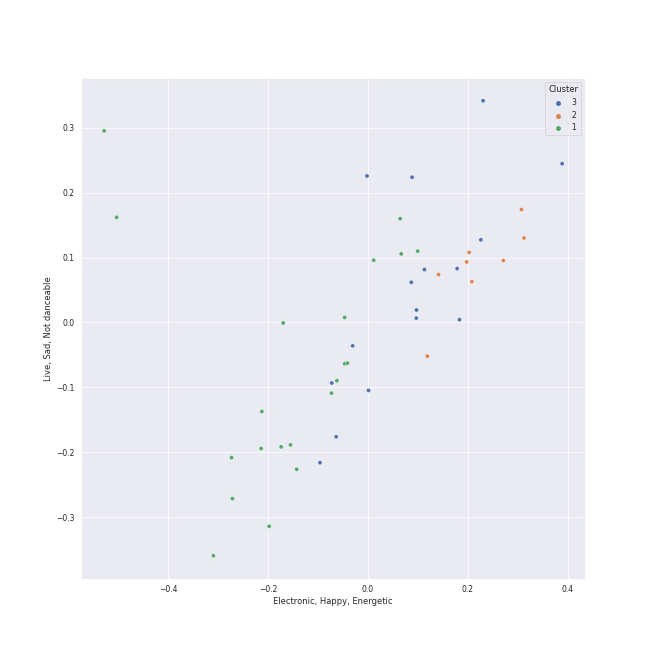

# Clusters in soul

## Cluster #1

17 tracks

| Art | Track | Album | Artists | Label | Score | 💚 | 🔗 |
|:---|:---|:---|:---|:---|---:|:---|:---|
|  | Cheek To Cheek | The Complete Ella And Louis On Verve | Ella Fitzgerald, Louis Armstrong | Verve Reissues | 40 | | [🔗](https://open.spotify.com/track/33jt3kYWjQzqn3xyYQ5ZEh) |
|  | Sleigh Ride | Ella Wishes You A Swinging Christmas (Expanded Edition) | Ella Fitzgerald | Verve Reissues | 0 | | [🔗](https://open.spotify.com/track/4ukUoXLuFzMixyZyabSGc4) |
|  | Mack the Knife | The Great American Songbook | Louis Armstrong | [Columbia](../../../../labels/columbia), [Legacy](../../../../labels/legacy) | 186 | | [🔗](https://open.spotify.com/track/0RNxWy0PC3AyH4ThH3aGK6) |
|  | Shining Star | That's The Way Of The World | Earth, Wind & Fire | [Columbia](../../../../labels/columbia) | 0 | 💚 | [🔗](https://open.spotify.com/track/0RgcOUQg4qYAEt9RIdf3oB) |
|  | Down in New Orleans | The Princess and the Frog (Original Motion Picture Soundtrack) | Dr. John | [Walt Disney Records](../../../../labels/walt_disney_records) | 0 | | [🔗](https://open.spotify.com/track/4tCdoXt7EiwZZhMevxmY8u) |
|  | I'd Rather Go Blind | Tell Mama | Etta James | [Geffen](../../../../labels/geffen) | 0 | 💚 | [🔗](https://open.spotify.com/track/1kPBT8S2wJFNAyBMnGVZgL) |
|  | L-O-V-E | Unforgettable: With Love | Natalie Cole | Craft Recordings | 0 | | [🔗](https://open.spotify.com/track/637xWjdmJY7CAQJsnsT7Fs) |
|  | L-O-V-E - 2000 Remaster | Romance | Nat King Cole | [UME - Global Clearing House](../../../../labels/ume_-_global_clearing_house) | 0 | | [🔗](https://open.spotify.com/track/6OHPdG4tYiHRPUHwf68nRU) |
|  | My Girl | The Temptations Sing Smokey | The Temptations | [MOTOWN](../../../../labels/motown), [UNI](../../../../labels/uni) | 0 | 💚 | [🔗](https://open.spotify.com/track/745H5CctFr12Mo7cqa1BMH) |
|  | I Got You (I Feel Good) | I Got You (I Feel Good) | James Brown & The Famous Flames | [Universal Records](../../../../labels/universal_music_llc) | 0 | | [🔗](https://open.spotify.com/track/5haXbSJqjjM0TCJ5XkfEaC) |
## Cluster #2

34 tracks

| Art | Track | Album | Artists | Label | Score | 💚 | 🔗 |
|:---|:---|:---|:---|:---|---:|:---|:---|
|  | Get Up (I Feel Like Being A) Sex Machine | Star Time | James Brown | [Universal/Island Def Jam](../../../../labels/universal_music_llc) | 0 | 💚 | [🔗](https://open.spotify.com/track/2ivdsb1RcEJjIs5tuHkUC9) |
|  | Higher Ground | Innervisions | Stevie Wonder | [Motown](../../../../labels/motown) | 0 | 💚 | [🔗](https://open.spotify.com/track/0dMd4rilfd6gPbXaLpNYhu) |
|  | Signed, Sealed, Delivered (I'm Yours) | Signed, Sealed And Delivered | Stevie Wonder | [MOTOWN](../../../../labels/motown), [UNI](../../../../labels/uni) | 0 | 💚 | [🔗](https://open.spotify.com/track/2eF8pWbiivYsYRpbntYsnc) |
|  | Santa Claus Is Coming To Town | Jackson Five Christmas Album | The Jackson 5 | [MOTOWN](../../../../labels/motown), [UNI](../../../../labels/uni) | 0 | | [🔗](https://open.spotify.com/track/4rMWDm28mERZcRPc1f3yir) |
|  | Don't Stop 'Til You Get Enough | Off the Wall | [Michael Jackson](../../../../artists/michael_jackson/overview.md) | [Epic](../../../../labels/epic) | 0 | | [🔗](https://open.spotify.com/track/46eu3SBuFCXWsPT39Yg3tJ) |
|  | Beat It | HIStory - PAST, PRESENT AND FUTURE - BOOK I | [Michael Jackson](../../../../artists/michael_jackson/overview.md) | [Epic](../../../../labels/epic) | 0 | 💚 | [🔗](https://open.spotify.com/track/52xaypL0Kjzk0ngwv3oBPR) |
|  | Give Up The Funk (Tear The Roof Off The Sucker) | Mothership Connection | Parliament | Def Jam West | 0 | 💚 | [🔗](https://open.spotify.com/track/4XRkQloZFcRrCONN7ZQ49Y) |
|  | Super Freak | Street Songs (Deluxe Edition) | Rick James | [Motown](../../../../labels/motown) | 0 | 💚 | [🔗](https://open.spotify.com/track/2dCmGcEOQrMQhMMS8Vj7Ca) |
|  | Jungle Boogie | Wild And Peaceful | Kool & The Gang | Island Mercury | 0 | | [🔗](https://open.spotify.com/track/3K0SJUQNbOkUprTFcwwAKN) |
|  | Thank You (Falettinme Be Mice Elf Agin) - Single Version | Greatest Hits | Sly & The Family Stone | [Epic](../../../../labels/epic), [Legacy](../../../../labels/legacy) | 0 | 💚 | [🔗](https://open.spotify.com/track/74iQ3gahRTOGc19bYadBE3) |
## Cluster #3

11 tracks

| Art | Track | Album | Artists | Label | Score | 💚 | 🔗 |
|:---|:---|:---|:---|:---|---:|:---|:---|
|  | Dream A Little Dream Of Me | Ella: The Legendary Decca Recordings | Ella Fitzgerald, Louis Armstrong | Verve Reissues | 0 | 💚 | [🔗](https://open.spotify.com/track/0KBvapFwuz8gPKu6Gw23WN) |
|  | Dream A Little Dream Of Me - Single Version | Love, Ella | Ella Fitzgerald, Louis Armstrong | Verve Reissues | 0 | 💚 | [🔗](https://open.spotify.com/track/78MI7mu1LV1k4IA2HzKmHe) |
|  | La vie en rose - Single Version | Satchmo Serenades | Louis Armstrong | Verve | 0 | | [🔗](https://open.spotify.com/track/0zDVclPMSsjeyvbnqhWOmt) |
|  | What A Wonderful World | What A Wonderful World | Louis Armstrong | [GRP](../../../../labels/grp) | 0 | 💚 | [🔗](https://open.spotify.com/track/29U7stRjqHU6rMiS8BfaI9) |
|  | Stormy Weather | At Last! | Etta James | [Geffen*](../../../../labels/geffen) | 42 | 💚 | [🔗](https://open.spotify.com/track/2IdwQxhJn9ZE4zIotcCefR) |
|  | I'll Be Seeing You | Billie Holiday | Billie Holiday | Verve Reissues | 254 | | [🔗](https://open.spotify.com/track/4smkJW6uzoHxGReZqqwHS5) |
|  | Unforgettable | Unforgettable: With Love | Natalie Cole, Nat King Cole | Craft Recordings | 0 | | [🔗](https://open.spotify.com/track/2MVQbDuhVs2muWFURtIdNb) |
|  | Nature Boy | The Nat King Cole Story | Nat King Cole | [Capitol Records](../../../../labels/capitol_records) | 0 | 💚 | [🔗](https://open.spotify.com/track/2WMyu5IYgxEuCd6xgFgJrl) |
|  | The Christmas Song (Merry Christmas To You) | The Christmas Song (Expanded Edition) | Nat King Cole | CAPITOL CATALOG MKT (C92) | 281 | | [🔗](https://open.spotify.com/track/4PS1e8f2LvuTFgUs1Cn3ON) |
|  | Unforgettable | Unforgettable | Nat King Cole | CAPITOL CATALOG MKT (C92) | 0 | | [🔗](https://open.spotify.com/track/648TTtYB0bH0P8Hfy0FmkL) |