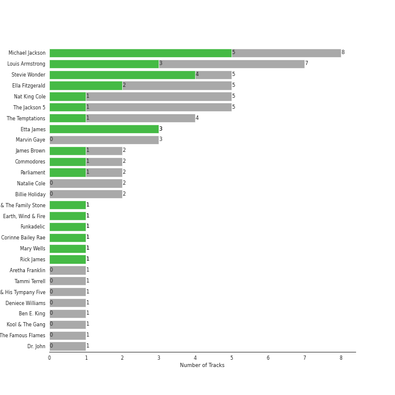
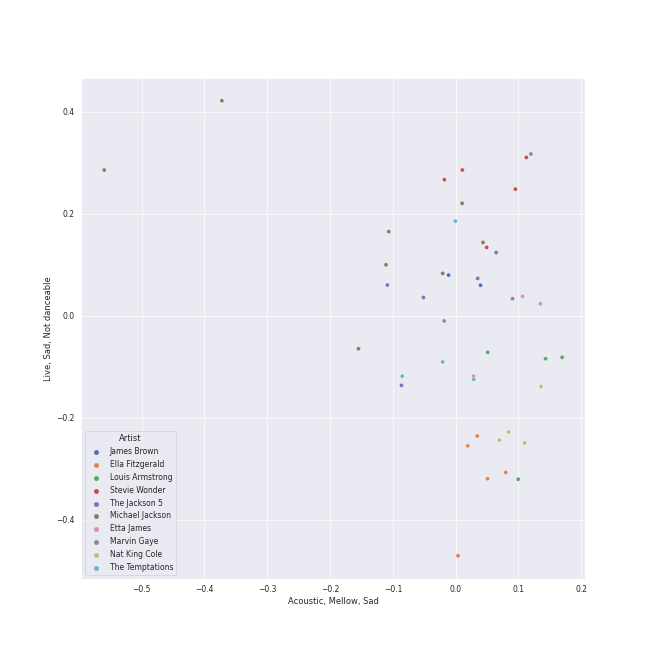
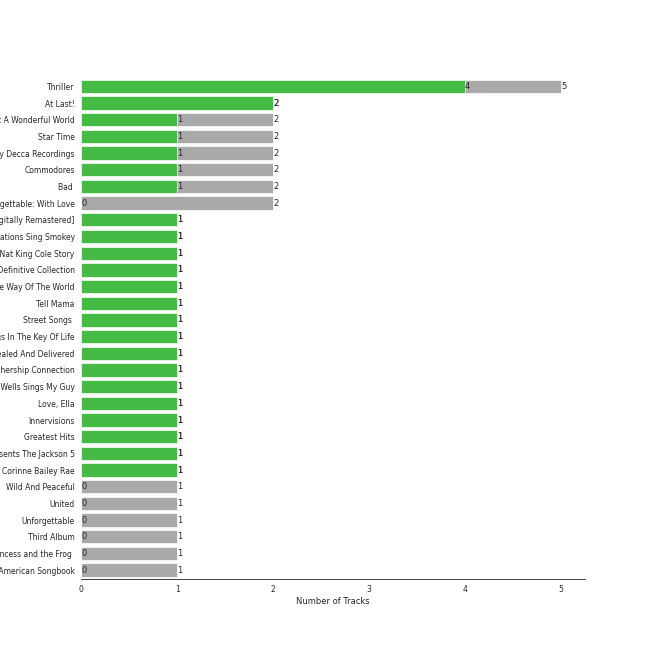
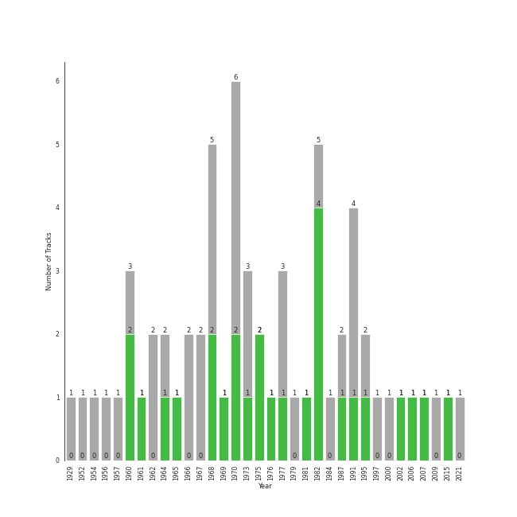

# soul

48 songs

[See Track Features](audio_features.md)

[See Clusters](clusters/overview.md)

## Top Artists

| Art | Tracks | 💚 | Artist | 🔗 |
|:---|---:|---:|:---|:---|
|  | 8 | 5 | [Michael Jackson](../../artists/michael_jackson/overview.md) | [🔗](https://open.spotify.com/artist/3fMbdgg4jU18AjLCKBhRSm) |
|  | 7 | 3 | Louis Armstrong | [🔗](https://open.spotify.com/artist/19eLuQmk9aCobbVDHc6eek) |
|  | 3 | 3 | Etta James | [🔗](https://open.spotify.com/artist/0iOVhN3tnSvgDbcg25JoJb) |
|  | 6 | 2 | Ella Fitzgerald | [🔗](https://open.spotify.com/artist/5V0MlUE1Bft0mbLlND7FJz) |
|  | 5 | 2 | The Jackson 5 | [🔗](https://open.spotify.com/artist/2iE18Oxc8YSumAU232n4rW) |
|  | 4 | 2 | Stevie Wonder | [🔗](https://open.spotify.com/artist/7guDJrEfX3qb6FEbdPA5qi) |
|  | 5 | 1 | Nat King Cole | [🔗](https://open.spotify.com/artist/7v4imS0moSyGdXyLgVTIV7) |
|  | 4 | 1 | The Temptations | [🔗](https://open.spotify.com/artist/3RwQ26hR2tJtA8F9p2n7jG) |
|  | 1 | 1 | Commodores | [🔗](https://open.spotify.com/artist/6twIAGnYuIT1pncMAsXnEm) |
|  | 1 | 1 | Corinne Bailey Rae | [🔗](https://open.spotify.com/artist/29WzbAQtDnBJF09es0uddn) |

See all 22 artists

| Art | Tracks | 💚 | Artist | 🔗 |
|:---|---:|---:|:---|:---|
|  | 1 | 1 | Mary Wells | [🔗](https://open.spotify.com/artist/1cjZk1xXn3YCToNg3uJpA7) |
|  | 2 | 0 | Natalie Cole | [🔗](https://open.spotify.com/artist/5tTsrGPwQRWUsHR2Xf7Ke9) |
|  | 2 | 0 | Billie Holiday | [🔗](https://open.spotify.com/artist/1YzCsTRb22dQkh9lghPIrp) |
|  | 1 | 0 | Aretha Franklin | [🔗](https://open.spotify.com/artist/7nwUJBm0HE4ZxD3f5cy5ok) |
|  | 1 | 0 | Louis Jordan & His Tympany Five | [🔗](https://open.spotify.com/artist/62FPyLpIhmk27hBw6RHlhh) |
|  | 1 | 0 | Cannonball Adderley | [🔗](https://open.spotify.com/artist/5v74mT11KGJqadf9sLw4dA) |
|  | 1 | 0 | Philly Joe Jones | [🔗](https://open.spotify.com/artist/4WhH68K75YKSAwHAqWFpi1) |
|  | 1 | 0 | Red Garland | [🔗](https://open.spotify.com/artist/35iymrFS4VnsKn35ebHKX9) |
|  | 1 | 0 | Dr. John | [🔗](https://open.spotify.com/artist/320TrJub4arztwXRm7kqVO) |
|  | 1 | 0 | John Coltrane | [🔗](https://open.spotify.com/artist/2hGh5VOeeqimQFxqXvfCUf) |
|  | 1 | 0 | Miles Davis | [🔗](https://open.spotify.com/artist/0kbYTNQb4Pb1rPbbaF0pT4) |
|  | 1 | 0 | Paul Chambers | [🔗](https://open.spotify.com/artist/0M1UOBJZ9tcKJbrbnVlHZG) |

## Top Albums

| Art | Tracks | 💚 | Album | Release Date | 🔗 |
|:---|---:|---:|:---|:---|:---|
|  | 4 | 3 | Thriller | 1982-11-30 | [🔗](https://open.spotify.com/album/2ANVost0y2y52ema1E9xAZ) |
|  | 2 | 2 | At Last! | 1960 | [🔗](https://open.spotify.com/album/7rd4PorIOPjPTy7qdUeeCt) |
|  | 2 | 1 | What A Wonderful World | 1968-01-01 | [🔗](https://open.spotify.com/album/6mmv0gwumlFGWDGJXF4yEv) |
|  | 2 | 1 | Ella: The Legendary Decca Recordings | 1995-08-29 | [🔗](https://open.spotify.com/album/0G5ZHFj5VmvIWEAuF8NEIT) |
|  | 2 | 1 | Bad (Remastered) | 1987-08-31 | [🔗](https://open.spotify.com/album/3Us57CjssWnHjTUIXBuIeH) |
|  | 2 | 0 | Unforgettable: With Love | 1991-06-11 | [🔗](https://open.spotify.com/album/4ilUfGGQXin7hr1srDDXF0) |
|  | 1 | 1 | Third Album | 1970-09-08 | [🔗](https://open.spotify.com/album/5d6X8oegJmu9XKn9UBAswG) |
|  | 1 | 1 | The Temptations Sing Smokey | 1965-03-22 | [🔗](https://open.spotify.com/album/45tweuKI0zdh8zgKo05cTw) |
|  | 1 | 1 | The Nat King Cole Story | 1961-09-25 | [🔗](https://open.spotify.com/album/3NoP1ifIejWkGSDsO9T2xH) |
|  | 1 | 1 | The Definitive Collection | 2002-10-29 | [🔗](https://open.spotify.com/album/4E1itnJOhTMRSATNaxh0Sq) |

See all 40 albums

| Art | Tracks | 💚 | Album | Release Date | 🔗 |
|:---|---:|---:|:---|:---|:---|
|  | 1 | 1 | Tell Mama | 1968-04-18 | [🔗](https://open.spotify.com/album/4ReJ59T4YxC62WkfyVTWpr) |
|  | 1 | 1 | Signed, Sealed And Delivered | 1970-08-07 | [🔗](https://open.spotify.com/album/54ootLtDyMZFr9obtWQvvO) |
|  | 1 | 1 | Mary Wells Sings My Guy | 1964 | [🔗](https://open.spotify.com/album/6pUoPt9A6P1G8YJ5vw6GBP) |
|  | 1 | 1 | Love, Ella | 2007-05-03 | [🔗](https://open.spotify.com/album/1y5KGkUKO0NG32MhIIagCA) |
|  | 1 | 1 | HIStory - PAST, PRESENT AND FUTURE - BOOK I | 1995-06-16 | [🔗](https://open.spotify.com/album/3OBhnTLrvkoEEETjFA3Qfk) |
|  | 1 | 1 | Diana Ross Presents The Jackson 5 | 1969-12-18 | [🔗](https://open.spotify.com/album/51uoKRa8vT5SULrlF8s2t1) |
|  | 1 | 1 | Corinne Bailey Rae | 2006-01-01 | [🔗](https://open.spotify.com/album/141Mp3P2VKHQMhtkW1DyQg) |
|  | 1 | 1 | Commodores | 1977-01-01 | [🔗](https://open.spotify.com/album/2tzbNCAUTmW4MIM2Ulvrwl) |
|  | 1 | 0 | Unforgettable | 1954-01-01 | [🔗](https://open.spotify.com/album/7GBvXtxnvBluo2f4xBVNkm) |
|  | 1 | 0 | The Princess and the Frog (Original Motion Picture Soundtrack) | 2009-11-23 | [🔗](https://open.spotify.com/album/0CcL28OkH89kjgKpNZC8sW) |
|  | 1 | 0 | The Great American Songbook | 1929 | [🔗](https://open.spotify.com/album/3AiEMTv9oFDRaDjqv93mOU) |
|  | 1 | 0 | The Complete Ella And Louis On Verve | 1997-05-20 | [🔗](https://open.spotify.com/album/2uqlkJu6vckJahCsp6Hfcn) |
|  | 1 | 0 | The Christmas Song (Expanded Edition) | 1962 | [🔗](https://open.spotify.com/album/6vBGI5522jvPi0ZZuGQNp4) |
|  | 1 | 0 | Songs In The Key Of Life | 1976-09-28 | [🔗](https://open.spotify.com/album/6YUCc2RiXcEKS9ibuZxjt0) |
|  | 1 | 0 | Solitude | 1956-01-01 | [🔗](https://open.spotify.com/album/4izD3SCRElbkO06i8yf4Zp) |
|  | 1 | 0 | Satchmo Serenades | 1952-04-01 | [🔗](https://open.spotify.com/album/17fcllu2aPjrx4ZCm05jMc) |
|  | 1 | 0 | Romance | 2021-02-12 | [🔗](https://open.spotify.com/album/5MuNxtOyex8o77Qdjaqeng) |
|  | 1 | 0 | Off the Wall | 1979-08-10 | [🔗](https://open.spotify.com/album/2ZytN2cY4Zjrr9ukb2rqTP) |
|  | 1 | 0 | Milestones | 1958-04 | [🔗](https://open.spotify.com/album/56I4vUYWQ4aXLiyfo8XuZv) |
|  | 1 | 0 | Meet The Temptations | 1964 | [🔗](https://open.spotify.com/album/199rfdL0k6q5ReLA7V4KMt) |
|  | 1 | 0 | Jackson Five Christmas Album | 1970-01-01 | [🔗](https://open.spotify.com/album/6J7kk80VywP59lPn8E5Cal) |
|  | 1 | 0 | I Never Loved a Man the Way I Love You | 1967-03-10 | [🔗](https://open.spotify.com/album/5WndWfzGwCkHzAbQXVkg2V) |
|  | 1 | 0 | Gettin' Ready (Expanded Edition) | 1966 | [🔗](https://open.spotify.com/album/3RE8NUULcBzFvVtCmlI4lb) |
|  | 1 | 0 | For Once In My Life | 1968-12-01 | [🔗](https://open.spotify.com/album/3pPBbp1Nl9n1AM9xFpdKtZ) |
|  | 1 | 0 | Ella Wishes You A Swinging Christmas (Expanded Edition) | 1960-01-01 | [🔗](https://open.spotify.com/album/2UhPCUgK2IGUrg7lIvMYfb) |
|  | 1 | 0 | Ella Sings Gershwin | 1950-09-11 | [🔗](https://open.spotify.com/album/3DJYxksYYP018jgpOTVXqO) |
|  | 1 | 0 | Christmas Album | 1970-10-15 | [🔗](https://open.spotify.com/album/5M8U1qYKvRQHJJVHmPY7QD) |
|  | 1 | 0 | Billie Holiday | 1957-01-01 | [🔗](https://open.spotify.com/album/4MkdTflpaaGGcXb5vtOYRs) |
|  | 1 | 0 | ABC | 1970-05-08 | [🔗](https://open.spotify.com/album/3btVhknqDeGAEd1Qj7lL57) |
|  | 1 | 0 | 20th Century Masters: The Millennium Collection: Best Of The Temptations, Vol. 2 - The '70s, '80s, '90s | 2000-01-11 | [🔗](https://open.spotify.com/album/2kzUxFepw1uLjbgqV537eP) |

## Top Record Labels

| Tracks | 💚 | Label |
|---:|---:|:---|
| 15 | 7 | [MOTOWN](../../labels/motown/overview.md) |
| 10 | 6 | [UNI](../../labels/uni/overview.md) |
| 8 | 5 | [Epic](../../labels/epic/overview.md) |
| 3 | 3 | [Geffen](../../labels/geffen/overview.md) |
| 8 | 2 | Verve Reissues |
| 4 | 1 | [Legacy](../../labels/legacy/overview.md) |
| 2 | 1 | [GRP](../../labels/grp/overview.md) |
| 1 | 1 | EMI |
| 1 | 1 | [Capitol Records](../../labels/capitol_records/overview.md) |
| 2 | 0 | Craft Recordings |

See all 16 labels

| Tracks | 💚 | Label |
|---:|---:|:---|
| 2 | 0 | [Columbia](../../labels/columbia/overview.md) |
| 2 | 0 | CAPITOL CATALOG MKT (C92) |
| 1 | 0 | [Walt Disney Records](../../labels/walt_disney_records/overview.md) |
| 1 | 0 | Verve |
| 1 | 0 | [UME - Global Clearing House](../../labels/ume_-_global_clearing_house/overview.md) |
| 1 | 0 | Rhino Atlantic |

## Top Producers

| Art | Producer | Tracks | Credit Types |
|:---|:---|---:|:---|
| | Bruce Swedien | 5 | Producer |
| | Quincy Jones | 5 | Producer, Arranger, Songwriter |
| | Jerry Hey | 3 | Arranger |
|  | [Michael Jackson](../../artists/michael_jackson/overview.md) | 3 | Lyricist, Producer, Songwriter, Arranger |
| | Berry Gordy | 2 | Songwriter |
|  | Stevie Wonder | 2 | Lyricist, Songwriter |
| | Rod Temperton | 2 | Arranger, Lyricist, Songwriter |
| | Smokey Robinson | 2 | Lyricist, Songwriter |
| | Ronald White | 1 | Songwriter |
| | George David Weiss | 1 | Songwriter |

View all

| Art | Producer | Tracks | Credit Types |
|:---|:---|---:|:---|
| | Jeremy Wheatley | 1 | Producer |
| | Wilbur Schwandt | 1 | Songwriter |
| | Billy Foster | 1 | Lyricist |
|  | Corinne Bailey Rae | 1 | Songwriter |
| | Bob Simpson | 1 | Producer |
| | Greg Phillinganes | 1 | Producer |
| | Leonard Chess | 1 | Producer |
| | Eddie Brackett | 1 | Producer |
| | Fabian André (André, Fabian) | 1 | Songwriter |
| | James Anthony Carmichael | 1 | Producer |
| | Bill Wolfer | 1 | Producer |
| | John Beck | 1 | Songwriter |
| | Hal Davis | 1 | Songwriter |
| | Freddie Perren | 1 | Songwriter |
| | Rick Hall | 1 | Arranger, Producer |
| | Jimmy Hogarth | 1 | Producer |
| | Donn Landee | 1 | Producer |
| | Lionel Richie | 1 | Lyricist, Songwriter |
| | Anthony Marinelli | 1 | Producer |
| | James Ingram | 1 | Arranger, Songwriter |
| | eden ahbez | 1 | Lyricist, Songwriter |
| | Riley Hampton | 1 | Arranger |
| | The Corporation | 1 | Producer |
| | Leonard & Phil Chess | 1 | Producer |
| | Ellington Jordan | 1 | Songwriter |
| | Harold Arlen | 1 | Songwriter |
| | Gus Kahn | 1 | Lyricist |
| | Bob Thiele | 1 | Producer, Songwriter |
| | Steve Chrisanthou | 1 | Producer, Songwriter |
| | Ted Koehler | 1 | Lyricist |
| | Bob West | 1 | Songwriter |
| | Deke Richards | 1 | Songwriter |
| | Phil Chess | 1 | Producer |
| | Steve Porcaro | 1 | Producer |
| | Willie Hutch | 1 | Songwriter |
| | Lee Gillette | 1 | Producer |
| | Fonce Mizell | 1 | Songwriter |

## Years

| ​ | 10 newest albums | ​​ | 10 oldest albums |
|:---|:---|:---|:---|
|  | Romance (2021-02-12) |  | The Great American Songbook (1929) |
|  | The Princess and the Frog (Original Motion Picture Soundtrack) (2009-11-23) |  | Ella Sings Gershwin (1950-09-11) |
|  | Love, Ella (2007-05-03) |  | Satchmo Serenades (1952-04-01) |
|  | Corinne Bailey Rae (2006-01-01) |  | Unforgettable (1954-01-01) |
|  | The Definitive Collection (2002-10-29) |  | Solitude (1956-01-01) |
|  | 20th Century Masters: The Millennium Collection: Best Of The Temptations, Vol. 2 - The '70s, '80s, '90s (2000-01-11) |  | Billie Holiday (1957-01-01) |
|  | The Complete Ella And Louis On Verve (1997-05-20) |  | Milestones (1958-04) |
|  | Ella: The Legendary Decca Recordings (1995-08-29) |  | At Last! (1960) |
|  | HIStory - PAST, PRESENT AND FUTURE - BOOK I (1995-06-16) |  | Ella Wishes You A Swinging Christmas (Expanded Edition) (1960-01-01) |
|  | Unforgettable: With Love (1991-06-11) |  | The Nat King Cole Story (1961-09-25) |

