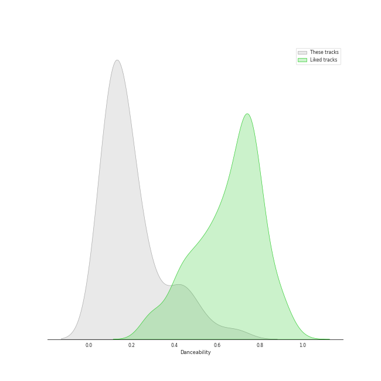
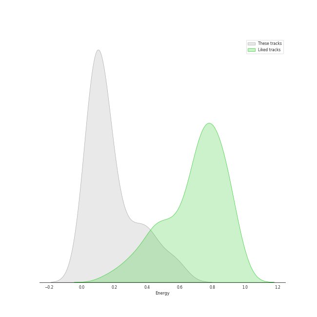
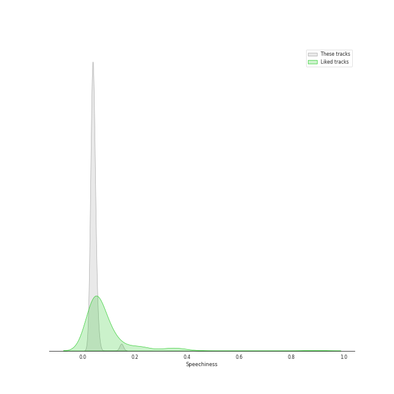
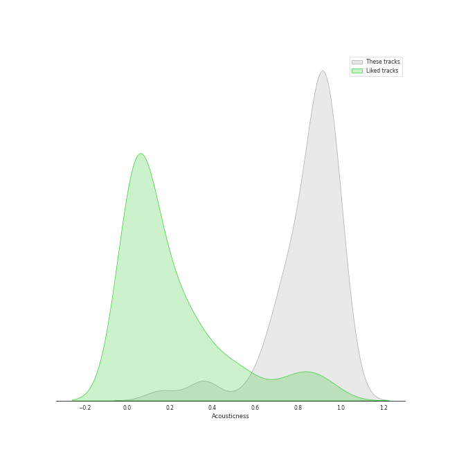
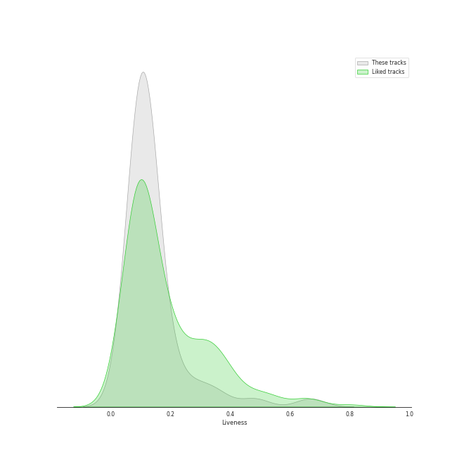
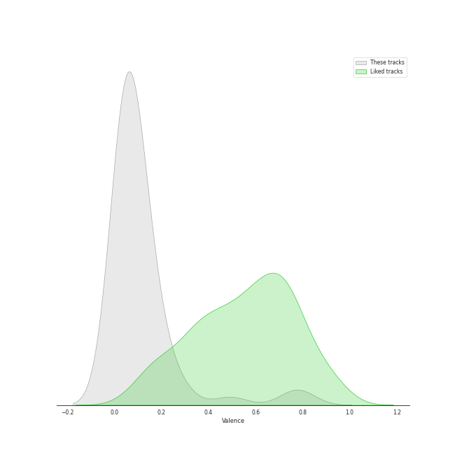
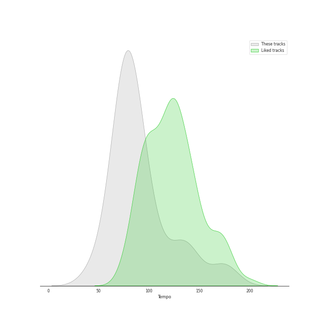

# Track Features for soundtrack

## Danceability

| ​ | 10 most Danceable tracks | ​​ | 10 least Danceable tracks |
|:---|:---|:---|:---|
|  | Cantina Band (0.688) |  | Anduril (0.0607) |
|  | The Imperial March (Darth Vader's Theme) (0.566) |  | Many Meetings (0.0623) |
|  | Concerning Hobbits (0.488) |  | The Grey Havens (feat. Sir James Galway) (0.0633) |
|  | Duel of the Fates (0.471) |  | Samwise the Brave (0.0646) |
|  | A Tale (0.453) |  | Twilight and Shadow (feat. Renee Fleming) (0.0693) |
|  | Raiders March (0.422) |  | The White Tree (0.0699) |
|  | Carol of the Bells (0.418) |  | The Prophecy (0.0735) |
|  | The Knight Bus (0.403) |  | The Return of the King (feat. Sir James Galway, Viggo Mortensen and Renee Fleming) (0.0754) |
|  | Jaws: Title Theme (0.364) |  | Rose, Dragon (0.0808) |
|  | The Bridge of Khazad Dum (0.299) |  | The Labyrinth (0.0813) |

## Energy

| ​ | 10 most Energetic tracks | ​​ | 10 least Energetic tracks |
|:---|:---|:---|:---|
|  | Main Title/Rebel Blockade Runner - Medley (0.593) |  | The Passing of the Elves (0.0146) |
|  | Cantina Band (0.582) |  | A Tale (0.0316) |
|  | Star Trek Main Theme (0.521) |  | Evenstar (0.0407) |
|  | The Bridge of Khazad Dum (0.492) |  | The Grey Havens (feat. Sir James Galway) (0.0427) |
|  | Helm's Deep (0.422) |  | Breath of Life (0.044) |
|  | Forth Eorlingas (0.418) |  | Hope and Memory (0.0586) |
|  | Duel of the Fates (0.411) |  | Mercedes Lullaby (0.0621) |
|  | The Imperial March (Darth Vader's Theme) (0.389) |  | Concerning Hobbits (0.0629) |
|  | Shelob's Lair (0.387) |  | The Prophecy (0.0657) |
|  | Raiders March (0.351) |  | Twilight and Shadow (feat. Renee Fleming) (0.0663) |

## Speechiness

| ​ | 10 most Speechy tracks | ​​ | 10 least Speechy tracks |
|:---|:---|:---|:---|
|  | Cantina Band (0.149) |  | A Tale (0.0291) |
|  | Jaws: Title Theme (0.0605) |  | The Imperial March (Darth Vader's Theme) (0.0301) |
|  | Foundations of Stone (0.0548) |  | Theme From Jurassic Park (0.0333) |
|  | The Bridge of Khazad Dum (0.0544) |  | Theme From Jurassic Park - From "Jurassic Park" Soundtrack (0.0333) |
|  | The Council of Elrond (feat. "Aniron") [Theme for Aragorn and Arwen] (0.0517) |  | The Passing of the Elves (0.0342) |
|  | Helm's Deep (0.0505) |  | Concerning Hobbits (0.0342) |
|  | The Knight Bus (0.0472) |  | The White Tree (0.0346) |
|  | Many Meetings (0.0459) |  | Forth Eorlingas (0.0348) |
|  | Evenstar (0.0457) |  | The Ride of the Rohirrim (0.035) |
|  | Carol of the Bells (0.0448) |  | Raiders March (0.0352) |

## Acousticness

| ​ | 10 most Acoustic tracks | ​​ | 10 least Acoustic tracks |
|:---|:---|:---|:---|
|  | Carol of the Bells (0.994) |  | Cantina Band (0.161) |
|  | Many Meetings (0.982) |  | The Bridge of Khazad Dum (0.36) |
|  | The Council of Elrond (feat. "Aniron") [Theme for Aragorn and Arwen] (0.979) |  | Main Title/Rebel Blockade Runner - Medley (0.361) |
|  | Twilight and Shadow (feat. Renee Fleming) (0.97) |  | The Knight Bus (0.591) |
|  | Long, Long Time Ago (0.968) |  | Foundations of Stone (0.655) |
|  | Yoda's Theme (0.963) |  | Shelob's Lair (0.678) |
|  | Mercedes Lullaby (0.963) |  | The Shadow of the Past (0.719) |
|  | Rose, Dragon (0.961) |  | Raiders March (0.731) |
|  | Evenstar (0.96) |  | Duel of the Fates (0.733) |
|  | The Grey Havens (feat. Sir James Galway) (0.955) |  | The White Tree (0.734) |

## Instrumentalness

| ​ | 10 most Instrumental tracks | ​​ | 10 least Instrumental tracks |
|:---|:---|:---|:---|
|  | The Grey Havens (feat. Sir James Galway) (0.976) |  | The Passing of the Elves (7.77e-06) |
|  | A Tale (0.971) |  | Cantina Band (0.00147) |
|  | Forth Eorlingas (0.962) |  | Carol of the Bells (0.0292) |
|  | Hope and Memory (0.962) |  | The Knight Bus (0.0792) |
|  | The Prophecy (0.958) |  | Pan's Labyrinth Lullaby (0.0889) |
|  | The White Rider (0.955) |  | Mischief Managed! (0.22) |
|  | Helm's Deep (0.953) |  | The Steward of Gondor (feat. Billy Boyd) (0.347) |
|  | Star Trek Main Theme (0.952) |  | Concerning Hobbits (0.406) |
|  | Twilight and Shadow (feat. Renee Fleming) (0.948) |  | The Imperial March (Darth Vader's Theme) (0.44) |
|  | The Labyrinth (0.943) |  | Rose, Dragon (0.496) |

## Liveness

| ​ | 10 most Live tracks | ​​ | 10 least Live tracks |
|:---|:---|:---|:---|
|  | Anduril (0.669) |  | Foundations of Stone (0.0507) |
|  | Star Trek Main Theme (0.481) |  | Cantina Band (0.0532) |
|  | The Return of the King (feat. Sir James Galway, Viggo Mortensen and Renee Fleming) (0.363) |  | The White Tree (0.064) |
|  | Jaws: Title Theme (0.327) |  | A Tale (0.0703) |
|  | Duel of the Fates (0.28) |  | Mercedes Lullaby (0.0745) |
|  | The Prophecy (0.258) |  | Welcome To Jurassic Park (0.0764) |
|  | The Bridge of Khazad Dum (0.202) |  | Mischief Managed! (0.0772) |
|  | The Knight Bus (0.195) |  | Raiders March (0.0785) |
|  | Carol of the Bells (0.179) |  | Pan's Labyrinth Lullaby (0.0803) |
|  | The Passing of the Elves (0.174) |  | The Ride of the Rohirrim (0.0891) |

## Valence

| ​ | 10 most Happy tracks | ​​ | 10 least Happy tracks |
|:---|:---|:---|:---|
|  | Carol of the Bells (0.8) |  | Princess Leia's Theme (0.031) |
|  | Cantina Band (0.754) |  | Anduril (0.0315) |
|  | Main Title/Rebel Blockade Runner - Medley (0.493) |  | The Prophecy (0.0317) |
|  | Duel of the Fates (0.282) |  | Lothlorien (feat. "Lament for Gandalf") (0.0328) |
|  | The Imperial March (Darth Vader's Theme) (0.26) |  | Rose, Dragon (0.033) |
|  | A Tale (0.18) |  | Evenstar (0.0342) |
|  | The Knight Bus (0.177) |  | The Grey Havens (feat. Sir James Galway) (0.0345) |
|  | Concerning Hobbits (0.175) |  | The King of the Golden Hall (0.0346) |
|  | Raiders March (0.169) |  | The Shadow of the Past (0.0353) |
|  | The Ride of the Rohirrim (0.155) |  | Many Meetings (0.0359) |

## Tempo

| ​ | 10 most Fast tracks | ​​ | 10 least Fast tracks |
|:---|:---|:---|:---|
|  | The Prophecy (177.549) |  | Anduril (43.741) |
|  | Helm's Deep (174.453) |  | Carol of the Bells (46.718) |
|  | Rose, Dragon (172.532) |  | The Grey Havens (feat. Sir James Galway) (57.72) |
|  | The Shadow of the Past (144.708) |  | Many Meetings (64.791) |
|  | The King of the Golden Hall (139.327) |  | Samwise the Brave (65.689) |
|  | The Knight Bus (138.63) |  | The Labyrinth (66.051) |
|  | The Ride of the Rohirrim (132.606) |  | Hope and Memory (69.165) |
|  | Raiders March (132.308) |  | A Tale (69.955) |
|  | Cantina Band (131.501) |  | Pan's Labyrinth Lullaby (70.79) |
|  | Jaws: Title Theme (118.95) |  | A Storm Is Coming (72.277) |
