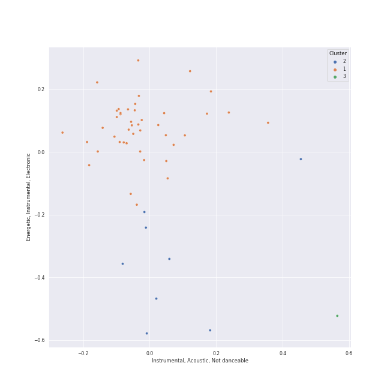

# Clusters in soundtrack

## Cluster #1

44 tracks

| Art | Track | Album | Artists | Label | Rank | 💚 | 🔗 |
|:---|:---|:---|:---|:---|---:|:---|:---|
|  | A Storm Is Coming | The Lord of the Rings: The Return of the King (Original Motion Picture Soundtrack) | Howard Shore | [Reprise](../../../../labels/reprise) | nan | | [🔗](https://open.spotify.com/track/0wicJTv0Jv3xLp37FLb8Eh) |
|  | The White Rider | The Lord of the Rings: The Two Towers (Original Motion Picture Soundtrack) | Howard Shore | [Reprise](../../../../labels/reprise) | nan | | [🔗](https://open.spotify.com/track/4cnKkXvh0WiFvk0tibAgRW) |
|  | Lothlorien (feat. "Lament for Gandalf") | The Lord of the Rings: The Fellowship of the Ring (Original Motion Picture Soundtrack) | Howard Shore, Elizabeth Fraser | [Reprise](../../../../labels/reprise) | nan | | [🔗](https://open.spotify.com/track/63CXPpiEiW7JnXvZ1cUXcp) |
|  | The Ring Goes South | The Lord of the Rings: The Fellowship of the Ring (Original Motion Picture Soundtrack) | Howard Shore | [Reprise](../../../../labels/reprise) | nan | | [🔗](https://open.spotify.com/track/6IQY3GEMC2B3mchMvi4NZj) |
|  | The Flying Sequence | Superman: The Movie (Original Motion Picture Soundtrack) | John Williams | [Rhino](../../../../labels/rhino), [Warner Records](../../../../labels/warner_records) | nan | | [🔗](https://open.spotify.com/track/5dPcPWdK2V25QKIV7deqfL) |
|  | Theme From Jurassic Park | Jurassic Park | John Williams | [Geffen*](../../../../labels/geffen) | nan | | [🔗](https://open.spotify.com/track/2TZbQZXOuR8osP2AK8yYMN) |
|  | Welcome To Jurassic Park | Jurassic Park | John Williams | [Geffen*](../../../../labels/geffen) | nan | | [🔗](https://open.spotify.com/track/7MW1YzseA4CGfrZMBLqQWK) |
|  | Yoda's Theme | Star Wars: The Empire Strikes Back (Original Motion Picture Soundtrack) | John Williams, [London Symphony Orchestra](../../../../artists/london_symphony_orchestra/overview.md) | [Walt Disney Records](../../../../labels/walt_disney_records) | nan | | [🔗](https://open.spotify.com/track/5fsT9U41OCFlaKA5XTCHtz) |
|  | Sayuri's Theme | Memoirs of a Geisha | John Williams, Yo-Yo Ma, Itzhak Perlman | [Sony Classical](../../../../labels/sony_classical) | nan | | [🔗](https://open.spotify.com/track/66EIPOdC3UZZCJdiUSRo92) |
|  | Theme From Jurassic Park - From "Jurassic Park" Soundtrack | Jurassic Park (Soundtrack) | John Williams | [Universal Music](../../../../labels/universal_music_llc) | nan | | [🔗](https://open.spotify.com/track/72VjtouKhCbaBol2e7tsaQ) |
## Cluster #2

8 tracks

| Art | Track | Album | Artists | Label | Rank | 💚 | 🔗 |
|:---|:---|:---|:---|:---|---:|:---|:---|
|  | The Passing of the Elves | The Lord of the Rings: The Fellowship of the Ring - the Complete Recordings | Howard Shore | [Rhino](../../../../labels/rhino), [Warner Records](../../../../labels/warner_records) | nan | | [🔗](https://open.spotify.com/track/05q7lfYerRkqqNDua3vJOL) |
|  | The Steward of Gondor (feat. Billy Boyd) | The Lord of the Rings: The Return of the King (Original Motion Picture Soundtrack) | Howard Shore, Billy Boyd | [Reprise](../../../../labels/reprise) | 683 | | [🔗](https://open.spotify.com/track/227hmntzKpN4CsYt3RVKcC) |
|  | Concerning Hobbits | The Lord of the Rings: The Fellowship of the Ring (Original Motion Picture Soundtrack) | Howard Shore | [Reprise](../../../../labels/reprise) | nan | | [🔗](https://open.spotify.com/track/644es5aYPJghtZLjM1rmSP) |
|  | Main Title/Rebel Blockade Runner - Medley | Star Wars Episode IV: A New Hope (Original Motion Picture Soundtrack) | John Williams, [London Symphony Orchestra](../../../../artists/london_symphony_orchestra/overview.md) | [Sony Classical](../../../../labels/sony_classical) | nan | | [🔗](https://open.spotify.com/track/5jMfUVMOGlEkEYc3aSYnWm) |
|  | The Knight Bus | Harry Potter and the Prisoner of Azkaban / Original Motion Picture Soundtrack | John Williams | [Warner Sunset/Nonesuch/Atlantic](../../../../labels/atlantic_records) | nan | | [🔗](https://open.spotify.com/track/2owMaKos8aeNx0usmPCVmy) |
|  | Mischief Managed! | Harry Potter and the Prisoner of Azkaban / Original Motion Picture Soundtrack | John Williams | [Warner Sunset/Nonesuch/Atlantic](../../../../labels/atlantic_records) | nan | | [🔗](https://open.spotify.com/track/3NrAMPb3hlWCmw9kepqBmM) |
|  | The Imperial March (Darth Vader's Theme) | Star Wars Episode V: The Empire Strikes Back (Original Motion Picture Soundtrack) | John Williams, John Neal | [Sony Classical](../../../../labels/sony_classical) | nan | | [🔗](https://open.spotify.com/track/62HY7V5hRKtfIZ7uCYqYqu) |
|  | Pan's Labyrinth Lullaby | Pan's Labyrinth (Original Motion Picture Soundtrack) | Javier Navarrete | Milan Records | nan | | [🔗](https://open.spotify.com/track/4lKFXSXc1ZpavjZpcR42GC) |
## Cluster #3

1 tracks

| Art | Track | Album | Artists | Label | Rank | 💚 | 🔗 |
|:---|:---|:---|:---|:---|---:|:---|:---|
|  | Cantina Band | Star Wars Episode IV: A New Hope (Original Motion Picture Soundtrack) | John Williams, [London Symphony Orchestra](../../../../artists/london_symphony_orchestra/overview.md) | [Sony Classical](../../../../labels/sony_classical) | nan | | [🔗](https://open.spotify.com/track/1jUPOeAOtsjjV1jUWc2H1g) |