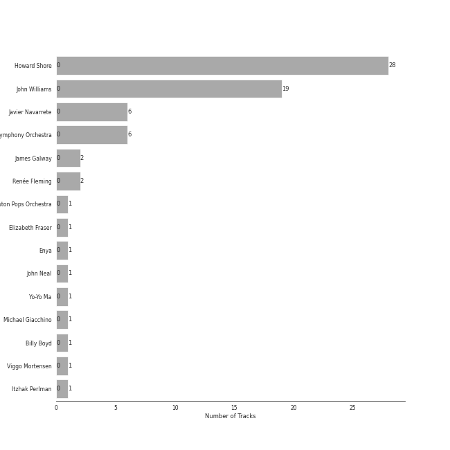
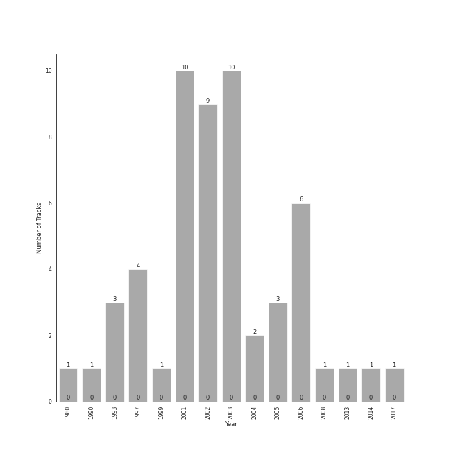

# soundtrack

53 songs

[See Track Features](audio_features.md)

[See Clusters](clusters/overview.md)

## Top Artists

| Art | Tracks | 💚 | Artist | 🔗 |
|:---|---:|---:|:---|:---|
|  | 28 | 0 | Howard Shore | [🔗](https://open.spotify.com/artist/0OcclcP5o8VKH2TRqSY2A7) |
|  | 18 | 0 | John Williams | [🔗](https://open.spotify.com/artist/3dRfiJ2650SZu6GbydcHNb) |
|  | 6 | 0 | Javier Navarrete | [🔗](https://open.spotify.com/artist/6Ayc7FBYR3HjkGQb7SZrzQ) |
|  | 6 | 0 | [London Symphony Orchestra](../../artists/london_symphony_orchestra/overview.md) | [🔗](https://open.spotify.com/artist/5yxyJsFanEAuwSM5kOuZKc) |
|  | 2 | 0 | James Galway | [🔗](https://open.spotify.com/artist/774mHr909NkDVeyyXQBQfZ) |
|  | 2 | 0 | Renée Fleming | [🔗](https://open.spotify.com/artist/3SK3gLBgy1jRuA4VnLlcs8) |
|  | 1 | 0 | Boston Pops Orchestra | [🔗](https://open.spotify.com/artist/7CIcEIOiWaZcEH35cpsdZq) |
|  | 1 | 0 | Elizabeth Fraser | [🔗](https://open.spotify.com/artist/791Z3924aa619hZ3xsOJEx) |
|  | 1 | 0 | Enya | [🔗](https://open.spotify.com/artist/6uothxMWeLWIhsGeF7cyo4) |
|  | 1 | 0 | John Neal | [🔗](https://open.spotify.com/artist/5zMZofgPVYk9IVibwopcbY) |

See all 15 artists

| Art | Tracks | 💚 | Artist | 🔗 |
|:---|---:|---:|:---|:---|
|  | 1 | 0 | Yo-Yo Ma | [🔗](https://open.spotify.com/artist/5Dl3HXZjG6ZOWT5cV375lk) |
|  | 1 | 0 | Michael Giacchino | [🔗](https://open.spotify.com/artist/4kLvhMAuCloLxoP1aVM7Lr) |
|  | 1 | 0 | Billy Boyd | [🔗](https://open.spotify.com/artist/1wTKlkGklPb1JMTVUIwAoj) |
|  | 1 | 0 | Viggo Mortensen | [🔗](https://open.spotify.com/artist/11habIRpXVkScDFp3rJrgu) |
|  | 1 | 0 | Itzhak Perlman | [🔗](https://open.spotify.com/artist/0hIG9FXgjQxT8fKaYceFbA) |

## Most and least listened tracks
| ​ | Most listened tracks | Rank | ​​ | Least listened tracks | Rank |
|:---|:---|---:|:---|:---|---:|
|  | Anduril | 392 |  | Helm's Deep | 868 |
|  | The Steward of Gondor (feat. Billy Boyd) | 795 |  | Welcome To Jurassic Park | 868 |
|  | The Passing of the Elves | 868 |  | Theme From Jurassic Park - From "Jurassic Park" Soundtrack | 868 |
|  | The Return of the King (feat. Sir James Galway, Viggo Mortensen and Renee Fleming) | 868 |  | Breath of Life | 868 |
|  | Samwise the Brave | 868 |  | Star Trek Main Theme | 868 |
|  | Many Meetings | 868 |  | The Ring Goes South | 868 |
|  | The Grey Havens (feat. Sir James Galway) | 868 |  | The Bridge of Khazad Dum | 868 |
|  | Love Theme from Superman | 868 |  | The Prophecy | 868 |
|  | A Storm Is Coming | 868 |  | Sayuri's Theme | 868 |
|  | Evenstar | 868 |  | Concerning Hobbits | 868 |

## Top Albums

| Art | Tracks | 💚 | Album | Release Date | 🔗 |
|:---|---:|---:|:---|:---|:---|
|  | 10 | 0 | The Lord of the Rings: The Return of the King (Original Motion Picture Soundtrack) | 2003-11-24 | [🔗](https://open.spotify.com/album/38x0H9PdY1fHh8EdfPUXqa) |
|  | 9 | 0 | The Lord of the Rings: The Two Towers (Original Motion Picture Soundtrack) | 2002-12-02 | [🔗](https://open.spotify.com/album/1zIoYLpYOq8d4HFzHJ7vc8) |
|  | 8 | 0 | The Lord of the Rings: The Fellowship of the Ring (Original Motion Picture Soundtrack) | 2001-11-19 | [🔗](https://open.spotify.com/album/04rz93AqGy9JduzV3K81Dh) |
|  | 6 | 0 | Pan's Labyrinth (Original Motion Picture Soundtrack) | 2006-12-19 | [🔗](https://open.spotify.com/album/5b5tWFo32wYBLMweeiL8vE) |
|  | 3 | 0 | Star Wars Episode IV: A New Hope (Original Motion Picture Soundtrack) | 1997 | [🔗](https://open.spotify.com/album/39vpWS7vrC4Pz33bNafjva) |
|  | 2 | 0 | Superman: The Movie (Original Motion Picture Soundtrack) | 2005-03-15 | [🔗](https://open.spotify.com/album/7Hlfql6zSPcQGyZZ6TY5jO) |
|  | 2 | 0 | Jurassic Park | 1993-05-25 | [🔗](https://open.spotify.com/album/1yyFmCMeNtuLWsLZAXPStf) |
|  | 2 | 0 | Harry Potter and the Prisoner of Azkaban / Original Motion Picture Soundtrack | 2004-05-25 | [🔗](https://open.spotify.com/album/7DDls7RWrCLvZgTVCJgfcq) |
|  | 1 | 0 | The Lord of the Rings: The Fellowship of the Ring - the Complete Recordings | 2001 | [🔗](https://open.spotify.com/album/55RTkgUCP7t80hiTUhATMH) |
|  | 1 | 0 | Star Wars: The Phantom Menace (Original Motion Picture Soundtrack) | 1999-05-04 | [🔗](https://open.spotify.com/album/45EFycwtfRhnDPWbc2mClK) |

See all 19 albums

| Art | Tracks | 💚 | Album | Release Date | 🔗 |
|:---|---:|---:|:---|:---|:---|
|  | 1 | 0 | Star Wars: The Empire Strikes Back (Original Motion Picture Soundtrack) | 1980-01-01 | [🔗](https://open.spotify.com/album/669tU9gpisLy8EM6qlKrdL) |
|  | 1 | 0 | Star Wars Episode V: The Empire Strikes Back (Original Motion Picture Soundtrack) | 1997 | [🔗](https://open.spotify.com/album/0a5t6HeElUsxiFrdocSlBM) |
|  | 1 | 0 | Star Trek Into Darkness (Music From The Motion Picture) | 2013-01-01 | [🔗](https://open.spotify.com/album/0dst3z0HnOCF0pdU05AZ4b) |
|  | 1 | 0 | Memoirs of a Geisha | 2005-11-22 | [🔗](https://open.spotify.com/album/4EstIlJ9P9TVBCOlvVLADj) |
|  | 1 | 0 | Jurassic Park (Soundtrack) | 1993-01-01 | [🔗](https://open.spotify.com/album/1PgeYPKQY9H5pxHGJa5izY) |
|  | 1 | 0 | John Williams - Greatest Hits 1969-1999 | 2014-08-18 | [🔗](https://open.spotify.com/album/3xeo92ykCYWfe32si3I6zF) |
|  | 1 | 0 | John Williams & Steven Spielberg: The Ultimate Collection | 2017-03-17 | [🔗](https://open.spotify.com/album/2K9laKccwpVMQf2lJoVJVg) |
|  | 1 | 0 | Indiana Jones and the Kingdom of the Crystal Skull (International Jewel) | 2008-01-01 | [🔗](https://open.spotify.com/album/6NKHFx1dBKrBU68RDFo76f) |
|  | 1 | 0 | Harry Potter and The Sorcerer's Stone Original Motion Picture Soundtrack | 2001-10-30 | [🔗](https://open.spotify.com/album/6zeHM5CV0CjcS0K8ouWE4N) |

## Top Record Labels

| Tracks | 💚 | Label |
|---:|---:|:---|
| 27 | 0 | [Reprise](../../labels/reprise/overview.md) |
| 7 | 0 | [Sony Classical](../../labels/sony_classical/overview.md) |
| 6 | 0 | Milan Records |
| 3 | 0 | [Warner Records](../../labels/warner_records/overview.md) |
| 3 | 0 | [Rhino](../../labels/rhino/overview.md) |
| 3 | 0 | [Atlantic Records](../../labels/atlantic_records/overview.md) |
| 2 | 0 | Warner Sunset |
| 2 | 0 | [Walt Disney Records](../../labels/walt_disney_records/overview.md) |
| 2 | 0 | Nonesuch |
| 2 | 0 | [Geffen](../../labels/geffen/overview.md) |

See all 13 labels

| Tracks | 💚 | Label |
|---:|---:|:---|
| 1 | 0 | Varese Sarabande |
| 1 | 0 | [Universal Music LLC](../../labels/universal_music_llc/overview.md) |
| 1 | 0 | Concord Records |

## Years

| ​ | 10 newest albums | ​​ | 10 oldest albums |
|:---|:---|:---|:---|
|  | John Williams & Steven Spielberg: The Ultimate Collection (2017-03-17) |  | Star Wars: The Empire Strikes Back (Original Motion Picture Soundtrack) (1980-01-01) |
|  | John Williams - Greatest Hits 1969-1999 (2014-08-18) |  | Jurassic Park (Soundtrack) (1993-01-01) |
|  | Star Trek Into Darkness (Music From The Motion Picture) (2013-01-01) |  | Jurassic Park (1993-05-25) |
|  | Indiana Jones and the Kingdom of the Crystal Skull (International Jewel) (2008-01-01) |  | Star Wars Episode V: The Empire Strikes Back (Original Motion Picture Soundtrack) (1997) |
|  | Pan's Labyrinth (Original Motion Picture Soundtrack) (2006-12-19) |  | Star Wars Episode IV: A New Hope (Original Motion Picture Soundtrack) (1997) |
|  | Memoirs of a Geisha (2005-11-22) |  | Star Wars: The Phantom Menace (Original Motion Picture Soundtrack) (1999-05-04) |
|  | Superman: The Movie (Original Motion Picture Soundtrack) (2005-03-15) |  | The Lord of the Rings: The Fellowship of the Ring - the Complete Recordings (2001) |
|  | Harry Potter and the Prisoner of Azkaban / Original Motion Picture Soundtrack (2004-05-25) |  | Harry Potter and The Sorcerer's Stone Original Motion Picture Soundtrack (2001-10-30) |
|  | The Lord of the Rings: The Return of the King (Original Motion Picture Soundtrack) (2003-11-24) |  | The Lord of the Rings: The Fellowship of the Ring (Original Motion Picture Soundtrack) (2001-11-19) |
|  | The Lord of the Rings: The Two Towers (Original Motion Picture Soundtrack) (2002-12-02) |  | The Lord of the Rings: The Two Towers (Original Motion Picture Soundtrack) (2002-12-02) |

