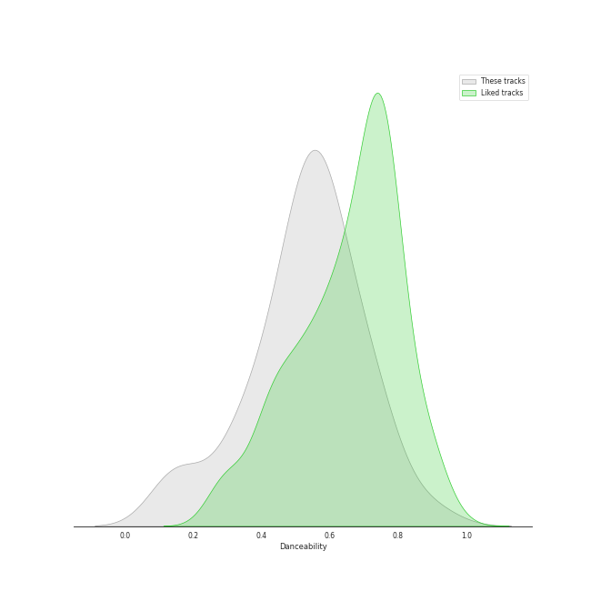
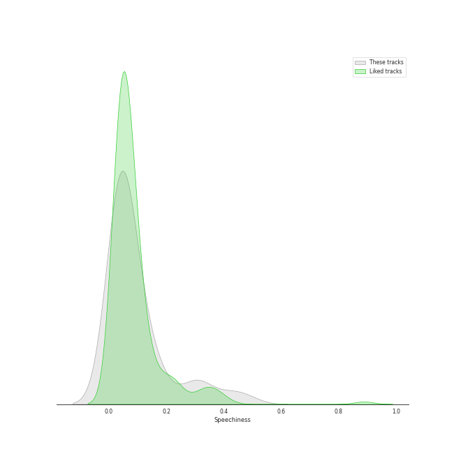
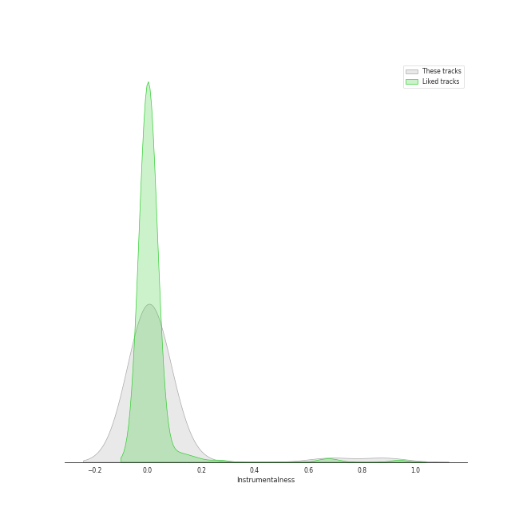
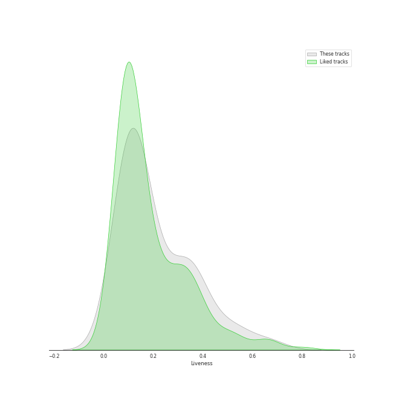
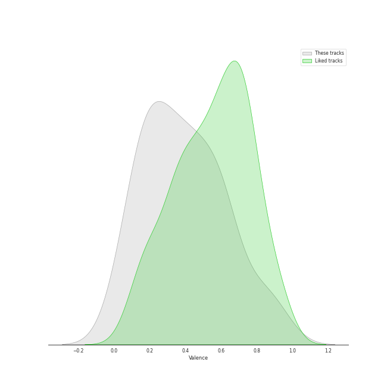
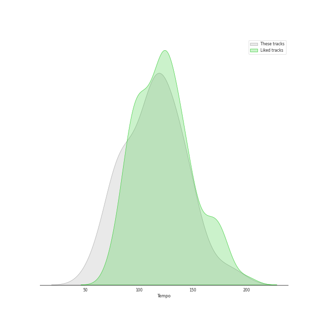

# Track Features for uk alternative pop

## Danceability

| ​ | 10 most Danceable tracks | ​​ | 10 least Danceable tracks |
|:---|:---|:---|:---|
|  | In My Bones (feat. Kimbra & Tank and The Bangas) (0.897) |  | Moon River (0.144) |
|  | Woke Up Today (0.765) |  | Home Is (0.148) |
|  | Mi Corazón (feat. Camilo) (0.755) |  | Bridge Over Troubled Water (feat. John Legend & Tori Kelly) (0.153) |
|  | Hunger (0.729) |  | You And I (0.29) |
|  | She Put Sunshine (0.729) |  | What Kind Of Man (0.313) |
|  | Running Outta Love (feat. Tori Kelly) (0.704) |  | Seven Devils (0.363) |
|  | All Night Long (feat. Take 6) (0.698) |  | Kiss With A Fist (0.367) |
|  | In My Room (0.676) |  | How Big, How Blue, How Beautiful (0.372) |
|  | Hajanga (0.654) |  | Delilah (0.426) |
|  | Here Comes The Sun (feat. dodie) (0.641) |  | No Light, No Light (0.43) |

## Energy

| ​ | 10 most Energetic tracks | ​​ | 10 least Energetic tracks |
|:---|:---|:---|:---|
|  | Delilah (0.87) |  | Feel (feat. Lianne La Havas) (0.134) |
|  | Rabbit Heart (Raise It Up) (0.853) |  | Home Is (0.147) |
|  | In My Bones (feat. Kimbra & Tank and The Bangas) (0.823) |  | Make Me Cry (0.152) |
|  | Over You (feat. aespa & Chris Martin) (0.82) |  | You And I (0.153) |
|  | Dog Days Are Over (0.81) |  | Moon River (0.154) |
|  | Lover To Lover (0.809) |  | In My Room (0.21) |
|  | Shake It Out (0.804) |  | Flintstones (0.274) |
|  | Kiss With A Fist (0.801) |  | Bridge Over Troubled Water (feat. John Legend & Tori Kelly) (0.291) |
|  | Seven Devils (0.781) |  | He Won't Hold You (feat. Rapsody) (0.355) |
|  | Woke Up Today (0.763) |  | Here Comes The Sun (feat. dodie) (0.398) |

## Speechiness

| ​ | 10 most Speechy tracks | ​​ | 10 least Speechy tracks |
|:---|:---|:---|:---|
|  | Time Alone With You (feat. Daniel Caesar) (0.47) |  | Never Gonna Be Alone (feat. Lizzy McAlpine & John Mayer) (0.0265) |
|  | Running Outta Love (feat. Tori Kelly) (0.405) |  | You And I (0.0288) |
|  | Flintstones (0.314) |  | Bridge Over Troubled Water (feat. John Legend & Tori Kelly) (0.0296) |
|  | All I Need (with Mahalia & Ty Dolla $ign) (0.311) |  | Moon River (0.0302) |
|  | With The Love In My Heart (0.29) |  | Lover To Lover (0.0309) |
|  | In My Bones (feat. Kimbra & Tank and The Bangas) (0.189) |  | What The Water Gave Me (0.0319) |
|  | In My Room (0.158) |  | You've Got The Love (0.0319) |
|  | He Won't Hold You (feat. Rapsody) (0.147) |  | How Big, How Blue, How Beautiful (0.0324) |
|  | Kiss With A Fist (0.137) |  | A Rock Somewhere (feat. Anoushka Shankar & Varijashree Venugopal) (0.0342) |
|  | Cinnamon Crush (feat. Lindsey Lomis) (0.121) |  | Home Is (0.0355) |

## Acousticness

| ​ | 10 most Acoustic tracks | ​​ | 10 least Acoustic tracks |
|:---|:---|:---|:---|
|  | Home Is (0.976) |  | Kiss With A Fist (0.0024) |
|  | Moon River (0.97) |  | You've Got The Love (0.00455) |
|  | You And I (0.943) |  | Seven Devils (0.00913) |
|  | Make Me Cry (0.917) |  | What The Water Gave Me (0.00933) |
|  | A Rock Somewhere (feat. Anoushka Shankar & Varijashree Venugopal) (0.905) |  | Shake It Out (0.0104) |
|  | Bridge Over Troubled Water (feat. John Legend & Tori Kelly) (0.883) |  | No Light, No Light (0.0124) |
|  | Here Comes The Sun (feat. dodie) (0.838) |  | What Kind Of Man (0.0229) |
|  | Feel (feat. Lianne La Havas) (0.836) |  | Dog Days Are Over (0.0416) |
|  | He Won't Hold You (feat. Rapsody) (0.783) |  | Rabbit Heart (Raise It Up) (0.0553) |
|  | Cinnamon Crush (feat. Lindsey Lomis) (0.758) |  | WELLLL (0.0645) |

## Instrumentalness

| ​ | 10 most Instrumental tracks | ​​ | 10 least Instrumental tracks |
|:---|:---|:---|:---|
|  | Home Is (0.884) |  | All I Need (with Mahalia & Ty Dolla $ign) (0.0) |
|  | Never Gonna Be Alone (feat. Lizzy McAlpine & John Mayer) (0.682) |  | Running Outta Love (feat. Tori Kelly) (0.0) |
|  | A Rock Somewhere (feat. Anoushka Shankar & Varijashree Venugopal) (0.0944) |  | Time Alone With You (feat. Daniel Caesar) (0.0) |
|  | Hajanga (0.0763) |  | What Kind Of Man (0.0) |
|  | With The Love In My Heart (0.045) |  | I'm Not Calling You A Liar (0.0) |
|  | Moon River (0.0284) |  | Delilah (0.0) |
|  | Feel (feat. Lianne La Havas) (0.0184) |  | Shake It Out (0.0) |
|  | In My Room (0.00459) |  | WELLLL (0.0) |
|  | Dog Days Are Over (0.00379) |  | Hunger (0.0) |
|  | He Won't Hold You (feat. Rapsody) (0.00138) |  | You've Got The Love (0.0) |

## Liveness

| ​ | 10 most Live tracks | ​​ | 10 least Live tracks |
|:---|:---|:---|:---|
|  | WELLLL (0.665) |  | Seven Devils (0.0477) |
|  | Here Comes The Sun (feat. dodie) (0.539) |  | Kiss With A Fist (0.0603) |
|  | Time Alone With You (feat. Daniel Caesar) (0.522) |  | A Rock Somewhere (feat. Anoushka Shankar & Varijashree Venugopal) (0.0765) |
|  | No Light, No Light (0.444) |  | Feel (feat. Lianne La Havas) (0.081) |
|  | Never Let Me Go (0.383) |  | All Night Long (feat. Take 6) (0.0875) |
|  | He Won't Hold You (feat. Rapsody) (0.373) |  | In My Room (0.0926) |
|  | With The Love In My Heart (0.371) |  | Hunger (0.0985) |
|  | Lover To Lover (0.347) |  | Home Is (0.0987) |
|  | Mi Corazón (feat. Camilo) (0.337) |  | Hajanga (0.102) |
|  | Over You (feat. aespa & Chris Martin) (0.335) |  | Cinnamon Crush (feat. Lindsey Lomis) (0.102) |

## Valence

| ​ | 10 most Happy tracks | ​​ | 10 least Happy tracks |
|:---|:---|:---|:---|
|  | Woke Up Today (0.91) |  | Home Is (0.0335) |
|  | All I Need (with Mahalia & Ty Dolla $ign) (0.887) |  | Moon River (0.04) |
|  | Over You (feat. aespa & Chris Martin) (0.809) |  | How Big, How Blue, How Beautiful (0.0825) |
|  | In My Bones (feat. Kimbra & Tank and The Bangas) (0.767) |  | Bridge Over Troubled Water (feat. John Legend & Tori Kelly) (0.117) |
|  | Flintstones (0.644) |  | With The Love In My Heart (0.126) |
|  | Kiss With A Fist (0.624) |  | Feel (feat. Lianne La Havas) (0.136) |
|  | All Night Long (feat. Take 6) (0.615) |  | No Light, No Light (0.162) |
|  | Running Outta Love (feat. Tori Kelly) (0.606) |  | You And I (0.163) |
|  | Hajanga (0.587) |  | What The Water Gave Me (0.183) |
|  | She Put Sunshine (0.583) |  | He Won't Hold You (feat. Rapsody) (0.196) |

## Tempo

| ​ | 10 most Fast tracks | ​​ | 10 least Fast tracks |
|:---|:---|:---|:---|
|  | In My Room (188.05) |  | Seven Devils (58.567) |
|  | Delilah (169.946) |  | Running Outta Love (feat. Tori Kelly) (68.076) |
|  | Between Two Lungs (150.061) |  | Cinnamon Crush (feat. Lindsey Lomis) (75.386) |
|  | Dog Days Are Over (149.954) |  | He Won't Hold You (feat. Rapsody) (78.731) |
|  | A Rock Somewhere (feat. Anoushka Shankar & Varijashree Venugopal) (147.981) |  | Time Alone With You (feat. Daniel Caesar) (79.153) |
|  | Never Let Me Go (145.203) |  | Over You (feat. aespa & Chris Martin) (80.037) |
|  | Here Comes The Sun (feat. dodie) (145.043) |  | All I Need (with Mahalia & Ty Dolla $ign) (82.992) |
|  | Flintstones (141.386) |  | Bridge Over Troubled Water (feat. John Legend & Tori Kelly) (84.16) |
|  | Hajanga (134.067) |  | Moon River (85.391) |
|  | She Put Sunshine (133.991) |  | WELLLL (86.133) |
