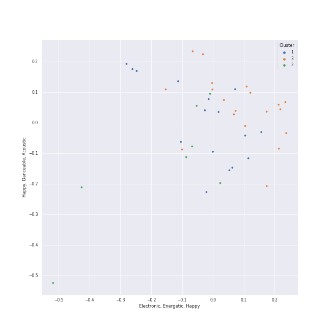

# Clusters in uk alternative pop

## Cluster #1

16 tracks

| Art | Track | Album | Artists | Label | Rank | 💚 | 🔗 |
|:---|:---|:---|:---|:---|---:|:---|:---|
|  | In My Bones (feat. Kimbra & Tank and The Bangas) | Djesse Vol. 3 | [Jacob Collier](../../../../artists/jacob_collier/overview.md), [Kimbra](../../../../artists/kimbra/overview.md), Tank and The Bangas | [Decca (UMO)](../../../../labels/decca_(umo)) | 489 | 💚 | [🔗](https://open.spotify.com/track/06PNiDGtPIMOq9VU2ftVCk) |
|  | Running Outta Love (feat. Tori Kelly) | Djesse Vol. 3 | [Jacob Collier](../../../../artists/jacob_collier/overview.md), Tori Kelly | [Decca (UMO)](../../../../labels/decca_(umo)) | 500 | 💚 | [🔗](https://open.spotify.com/track/18kV8FzhGXE6XndMdiv4Ox) |
|  | Mi Corazón (feat. Camilo) | Djesse Vol. 4 | [Jacob Collier](../../../../artists/jacob_collier/overview.md), Camilo | [Decca (UMO)](../../../../labels/decca_(umo)) | nan | 💚 | [🔗](https://open.spotify.com/track/5Rg0oIXL40HY5CsUWD3IAJ) |
|  | She Put Sunshine | Djesse Vol. 4 | [Jacob Collier](../../../../artists/jacob_collier/overview.md) | [Decca (UMO)](../../../../labels/decca_(umo)) | nan | 💚 | [🔗](https://open.spotify.com/track/60ZCmLIYDUHmQ98Ydo1cR8) |
|  | Cinnamon Crush (feat. Lindsey Lomis) | Djesse Vol. 4 | [Jacob Collier](../../../../artists/jacob_collier/overview.md), Lindsey Lomis | [Decca (UMO)](../../../../labels/decca_(umo)) | nan | 💚 | [🔗](https://open.spotify.com/track/6XJvYWE3tx9tRVavh6GysW) |
|  | Over You (feat. aespa & Chris Martin) | Djesse Vol. 4 | [Jacob Collier](../../../../artists/jacob_collier/overview.md), [aespa](../../../../artists/aespa/overview.md), Chris Martin | [Decca (UMO)](../../../../labels/decca_(umo)) | 342 | 💚 | [🔗](https://open.spotify.com/track/7MSZg4Km8CM7NRXTeJoANZ) |
|  | All Night Long (feat. Take 6) | Djesse Vol. 1 | [Jacob Collier](../../../../artists/jacob_collier/overview.md), Metropole Orkest, Jules Buckley, Take 6 | [Decca (UMO)](../../../../labels/decca_(umo)) | nan | 💚 | [🔗](https://open.spotify.com/track/6TN4FrJvMdYrLDF2Lz7ArI) |
|  | In My Room | In My Room | [Jacob Collier](../../../../artists/jacob_collier/overview.md) | Hajanga Records | nan | 💚 | [🔗](https://open.spotify.com/track/1yGl3V3BiRSaVnuFC93CYd) |
|  | Flintstones | In My Room | [Jacob Collier](../../../../artists/jacob_collier/overview.md) | Hajanga Records | nan | | [🔗](https://open.spotify.com/track/731rnSkAluFeKZaGTHig7W) |
|  | Between Two Lungs | Lungs (Deluxe Edition) | [Florence + The Machine](../../../../artists/florence_+_the_machine/overview.md) | [Universal-Island Records Ltd.](../../../../labels/universal-island_records_ltd_) | nan | 💚 | [🔗](https://open.spotify.com/track/5WnYyCWBbJyLChmd2sbZK9) |
## Cluster #2

7 tracks

| Art | Track | Album | Artists | Label | Rank | 💚 | 🔗 |
|:---|:---|:---|:---|:---|---:|:---|:---|
|  | A Rock Somewhere (feat. Anoushka Shankar & Varijashree Venugopal) | Djesse Vol. 4 | [Jacob Collier](../../../../artists/jacob_collier/overview.md), Anoushka Shankar, Varijashree Venugopal | [Decca (UMO)](../../../../labels/decca_(umo)) | nan | 💚 | [🔗](https://open.spotify.com/track/0PZU2E5P51ZJOQDW1k5U8F) |
|  | Home Is | Djesse Vol. 1 | [Jacob Collier](../../../../artists/jacob_collier/overview.md), VOCES8 | [Decca (UMO)](../../../../labels/decca_(umo)) | nan | | [🔗](https://open.spotify.com/track/3nur4bNfmRCoLFxk9ubHHK) |
|  | Moon River | Djesse Vol. 2 | [Jacob Collier](../../../../artists/jacob_collier/overview.md) | [Decca (UMO)](../../../../labels/decca_(umo)) | 591 | 💚 | [🔗](https://open.spotify.com/track/1IRRqn75jaZHp7zMT1NGbZ) |
|  | Make Me Cry | Djesse Vol. 2 | [Jacob Collier](../../../../artists/jacob_collier/overview.md) | [Decca (UMO)](../../../../labels/decca_(umo)) | nan | 💚 | [🔗](https://open.spotify.com/track/4Y6VEDkRSpbn8Wt8x18RHh) |
|  | Feel (feat. Lianne La Havas) | Djesse Vol. 2 | [Jacob Collier](../../../../artists/jacob_collier/overview.md), Lianne La Havas | [Decca (UMO)](../../../../labels/decca_(umo)) | nan | | [🔗](https://open.spotify.com/track/7MGNHuYwmm9UjQgdVciO1v) |
|  | You And I | In My Room | [Jacob Collier](../../../../artists/jacob_collier/overview.md) | Hajanga Records | nan | 💚 | [🔗](https://open.spotify.com/track/0yZ1VBdUdX2dEBXv4LXzn8) |
|  | Never Gonna Be Alone (feat. Lizzy McAlpine & John Mayer) | Never Gonna Be Alone (feat. Lizzy McAlpine & John Mayer) | [Jacob Collier](../../../../artists/jacob_collier/overview.md), Lizzy McAlpine, John Mayer | [Decca (UMO)](../../../../labels/decca_(umo)) | nan | | [🔗](https://open.spotify.com/track/5m9OR6G4lNt9Da6dy1xpHx) |
## Cluster #3

19 tracks

| Art | Track | Album | Artists | Label | Rank | 💚 | 🔗 |
|:---|:---|:---|:---|:---|---:|:---|:---|
|  | Every Little Thing She Does Is Magic | Djesse Vol. 1 | [Jacob Collier](../../../../artists/jacob_collier/overview.md), Metropole Orkest, Jules Buckley | [Decca (UMO)](../../../../labels/decca_(umo)) | 509 | 💚 | [🔗](https://open.spotify.com/track/0xuz9pSNwyWljXUgEGEhjp) |
|  | Dog Days Are Over | Lungs (Deluxe Edition) | [Florence + The Machine](../../../../artists/florence_+_the_machine/overview.md) | [Universal-Island Records Ltd.](../../../../labels/universal-island_records_ltd_) | nan | 💚 | [🔗](https://open.spotify.com/track/1YLJVmuzeM2YSUkCCaTNUB) |
|  | I'm Not Calling You A Liar | Lungs (Deluxe Edition) | [Florence + The Machine](../../../../artists/florence_+_the_machine/overview.md) | [Universal-Island Records Ltd.](../../../../labels/universal-island_records_ltd_) | nan | 💚 | [🔗](https://open.spotify.com/track/3euILOYDltKArnqpupsE1W) |
|  | Rabbit Heart (Raise It Up) | Lungs (Deluxe Edition) | [Florence + The Machine](../../../../artists/florence_+_the_machine/overview.md) | [Universal-Island Records Ltd.](../../../../labels/universal-island_records_ltd_) | nan | 💚 | [🔗](https://open.spotify.com/track/5RoLLyMmaEG4WiVMlp7r59) |
|  | You've Got The Love | Lungs (Deluxe Edition) | [Florence + The Machine](../../../../artists/florence_+_the_machine/overview.md) | [Universal-Island Records Ltd.](../../../../labels/universal-island_records_ltd_) | nan | 💚 | [🔗](https://open.spotify.com/track/6u9RqxALwkjJ1ukB1y8vuP) |
|  | What The Water Gave Me | Ceremonials (Deluxe Edition) | [Florence + The Machine](../../../../artists/florence_+_the_machine/overview.md) | [Universal-Island Records Ltd.](../../../../labels/universal-island_records_ltd_) | 487 | 💚 | [🔗](https://open.spotify.com/track/3RiOPzAvhNKuMIdPYOrKV8) |
|  | Shake It Out | Ceremonials (Deluxe Edition) | [Florence + The Machine](../../../../artists/florence_+_the_machine/overview.md) | [Universal-Island Records Ltd.](../../../../labels/universal-island_records_ltd_) | nan | 💚 | [🔗](https://open.spotify.com/track/4lY95OMGb9WxP6IYut64ir) |
|  | Never Let Me Go | Ceremonials (Deluxe Edition) | [Florence + The Machine](../../../../artists/florence_+_the_machine/overview.md) | [Universal-Island Records Ltd.](../../../../labels/universal-island_records_ltd_) | 223 | 💚 | [🔗](https://open.spotify.com/track/6cC9RY7MoUx5z3aHjDTNI6) |
|  | What Kind Of Man | How Big, How Blue, How Beautiful | [Florence + The Machine](../../../../artists/florence_+_the_machine/overview.md) | [Universal-Island Records Ltd.](../../../../labels/universal-island_records_ltd_) | nan | | [🔗](https://open.spotify.com/track/2ZE1EiHnmtdiv9KAJTGeRq) |
|  | How Big, How Blue, How Beautiful | How Big, How Blue, How Beautiful | [Florence + The Machine](../../../../artists/florence_+_the_machine/overview.md) | [Universal-Island Records Ltd.](../../../../labels/universal-island_records_ltd_) | nan | 💚 | [🔗](https://open.spotify.com/track/7GlwvJ8iAbCEfZjGq3iwmZ) |