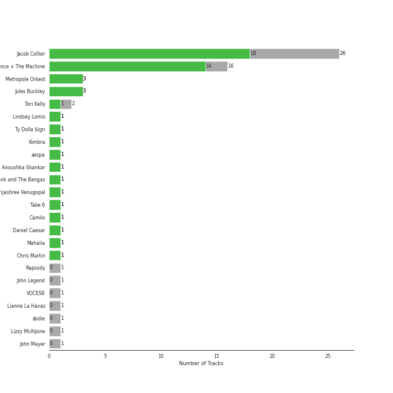
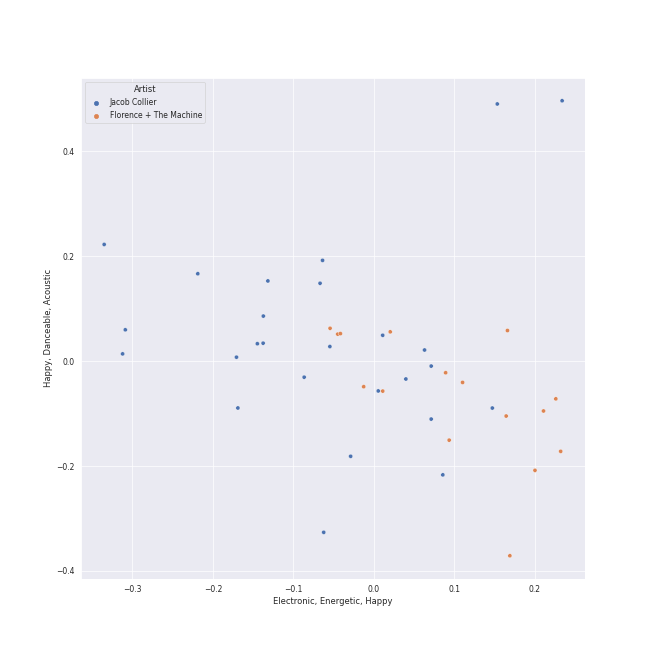
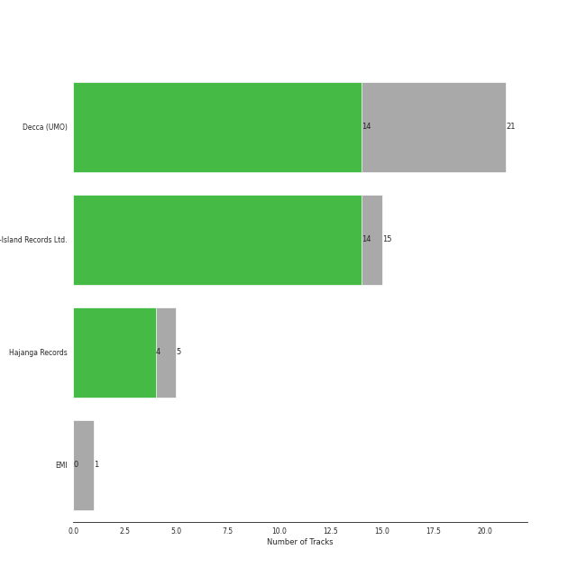

# uk alternative pop

36 songs

[See Track Features](audio_features.md)

[See Clusters](clusters/overview.md)

## Top Artists

| Art | Tracks | 💚 | Artist | 🔗 |
|:---|---:|---:|:---|:---|
|  | 20 | 15 | [Jacob Collier](../../artists/jacob_collier/overview.md) | [🔗](https://open.spotify.com/artist/0QWrMNukfcVOmgEU0FEDyD) |
|  | 16 | 14 | [Florence + The Machine](../../artists/florence_+_the_machine/overview.md) | [🔗](https://open.spotify.com/artist/1moxjboGR7GNWYIMWsRjgG) |
|  | 3 | 3 | Metropole Orkest | [🔗](https://open.spotify.com/artist/7JYdpWAsiqzrmMB3qxkEbI) |
|  | 3 | 3 | Jules Buckley | [🔗](https://open.spotify.com/artist/5gGbAKDXhDoBXIJe8SuBvX) |
|  | 1 | 1 | Ty Dolla $ign | [🔗](https://open.spotify.com/artist/7c0XG5cIJTrrAgEC3ULPiq) |
|  | 1 | 1 | [Kimbra](../../artists/kimbra/overview.md) | [🔗](https://open.spotify.com/artist/6hk7Yq1DU9QcCCrz9uc0Ti) |
|  | 1 | 1 | Rapsody | [🔗](https://open.spotify.com/artist/6NL31G53xThQXkFs7lDpL5) |
|  | 1 | 1 | Tank and The Bangas | [🔗](https://open.spotify.com/artist/5cAtakaadWHJLxmGKrKcX7) |
|  | 1 | 1 | Take 6 | [🔗](https://open.spotify.com/artist/31zQEL3ARiYe63jn3jtM18) |
|  | 1 | 1 | Daniel Caesar | [🔗](https://open.spotify.com/artist/20wkVLutqVOYrc0kxFs7rA) |

See all 17 artists

| Art | Tracks | 💚 | Artist | 🔗 |
|:---|---:|---:|:---|:---|
|  | 1 | 1 | Tori Kelly | [🔗](https://open.spotify.com/artist/1vSN1fsvrzpbttOYGsliDr) |
|  | 1 | 1 | Mahalia | [🔗](https://open.spotify.com/artist/16rCzZOMQX7P8Kmn5YKexI) |
|  | 1 | 0 | VOCES8 | [🔗](https://open.spotify.com/artist/32nW8kGbs65y8CSlIvREuc) |
|  | 1 | 0 | Lianne La Havas | [🔗](https://open.spotify.com/artist/2RP4pPHTXlQpDnO9LvR7Yt) |
|  | 1 | 0 | dodie | [🔗](https://open.spotify.com/artist/21TinSsF5ytwsfdyz5VSVS) |
|  | 1 | 0 | Lizzy McAlpine | [🔗](https://open.spotify.com/artist/1GmsPCcpKgF9OhlNXjOsbS) |
|  | 1 | 0 | John Mayer | [🔗](https://open.spotify.com/artist/0hEurMDQu99nJRq8pTxO14) |

## Top Albums

| Art | Tracks | 💚 | Album | Release Date | 🔗 |
|:---|---:|---:|:---|:---|:---|
|  | 6 | 6 | Lungs | 2009-01-01 | [🔗](https://open.spotify.com/album/2KAK58PimXHF4lSoKO3RxA) |
|  | 6 | 6 | Ceremonials (Deluxe Edition) | 2011-01-01 | [🔗](https://open.spotify.com/album/5SxudoALxEAVh9l83kSebx) |
|  | 5 | 5 | Djesse Vol. 3 | 2020-08-14 | [🔗](https://open.spotify.com/album/33cj3kzLqVOg9zvy69Wrc8) |
|  | 5 | 4 | In My Room | 2016-07-01 | [🔗](https://open.spotify.com/album/70N5l7CBZmAMCh1WfnM6in) |
|  | 4 | 3 | Djesse Vol. 1 | 2018-12-07 | [🔗](https://open.spotify.com/album/47bMDS4CMLbqcIVjEMWUjK) |
|  | 4 | 2 | Djesse Vol. 2 | 2019-07-19 | [🔗](https://open.spotify.com/album/3zNi5dCpkbm4zv7h1vGOMy) |
|  | 3 | 2 | How Big, How Blue, How Beautiful | 2015-06-01 | [🔗](https://open.spotify.com/album/2btszoya78vyT8fwelmVnz) |
|  | 1 | 1 | WELLLL | 2023-07-14 | [🔗](https://open.spotify.com/album/6RFuKQSGuvj6f0l9A7wnbm) |
|  | 1 | 0 | Never Gonna Be Alone (feat. Lizzy McAlpine & John Mayer) | 2022-06-10 | [🔗](https://open.spotify.com/album/0rFjAGsF5UhG8hPeirWaHV) |
|  | 1 | 0 | High As Hope | 2018-06-29 | [🔗](https://open.spotify.com/album/0pKZJj9GzcKPCS8r4IaksA) |

## Top Record Labels

| Tracks | 💚 | Label |
|---:|---:|:---|
| 15 | 14 | [Universal-Island Records Ltd.](../../labels/universal-island_records_ltd_/overview.md) |
| 15 | 11 | [Decca (UMO)](../../labels/decca_(umo)/overview.md) |
| 5 | 4 | Hajanga Records |
| 1 | 0 | EMI |

## Top Producers

| Art | Producer | Tracks | Credit Types |
|:---|:---|---:|:---|
| | Florence Welch | 13 | Songwriter, Lyricist |
| | Paul Epworth | 7 | Producer, Lyricist, Songwriter |
|  | [Jacob Collier](../../artists/jacob_collier/overview.md) | 6 | Arranger, Producer, Songwriter |
| | Isabella Summers | 6 | Songwriter, Producer, Lyricist |
| | Ben Bloomberg | 5 | Producer |
| | Craig Silvey | 4 | Producer |
| | Cenzo Townshend | 4 | Producer |
| | James Ford | 3 | Producer |
| | Sally Herbert | 3 | Arranger |
| | Jimmy Robertson | 3 | Producer |

View all

| Art | Producer | Tracks | Credit Types |
|:---|:---|---:|:---|
| | Kid Harpoon | 2 | Songwriter |
| | Tom Elmhirst | 2 | Producer |
| | Robin Baynton | 2 | Producer |
| | Markus Dravs | 2 | Producer |
| | Bullion | 2 | Producer |
| | Mark "Spike" Stent | 2 | Producer |
| | Francis White | 1 | Lyricist, Songwriter |
|  | Rapsody | 1 | Producer, Songwriter |
| | Mat Bartram | 1 | Producer |
|  | Daniel Caesar | 1 | Songwriter |
| | Brian Degraw | 1 | Songwriter |
| | Ali Helnwein | 1 | Arranger |
|  | Tori Kelly | 1 | Songwriter |
| | Will Owen | 1 | Arranger |
| | Steve Mackey | 1 | Producer |
| | Josh Diamond | 1 | Songwriter |
| | Rush | 1 | Songwriter |
| | Charlie Hugall | 1 | Producer |
| | Johnny Mercer | 1 | Lyricist |
| | Richard Flack | 1 | Producer |
| | Tarriona 'Tank' Ball | 1 | Songwriter |
| | DJ Fai | 1 | Producer |
| | Lizzi Bougatsos | 1 | Songwriter |
| | John Bellamy | 1 | Songwriter |
| | Tim Dewit | 1 | Songwriter |
| | Henry Mancini | 1 | Songwriter |
|  | Ty Dolla $ign | 1 | Songwriter |
| | Mark "Top" Rankin | 1 | Producer |
| | Matt Allchin | 1 | Songwriter |
| | Anthony B. Stephens | 1 | Songwriter |
| | Wissam Ghorayeb | 1 | Producer |
| | Pete Prokopiw | 1 | Producer |
| | Arnecia Michelle Harris | 1 | Songwriter |
|  | [Kimbra](../../artists/kimbra/overview.md) | 1 | Songwriter |

## Years

| ​ | 10 newest albums | ​​ | 10 oldest albums |
|:---|:---|:---|:---|
|  | WELLLL (2023-07-14) |  | Lungs (2009-01-01) |
|  | Never Gonna Be Alone (feat. Lizzy McAlpine & John Mayer) (2022-06-10) |  | Ceremonials (Deluxe Edition) (2011-01-01) |
|  | Djesse Vol. 3 (2020-08-14) |  | How Big, How Blue, How Beautiful (2015-06-01) |
|  | Djesse Vol. 2 (2019-07-19) |  | In My Room (2016-07-01) |
|  | Djesse Vol. 1 (2018-12-07) |  | High As Hope (2018-06-29) |
|  | High As Hope (2018-06-29) |  | Djesse Vol. 1 (2018-12-07) |
|  | In My Room (2016-07-01) |  | Djesse Vol. 2 (2019-07-19) |
|  | How Big, How Blue, How Beautiful (2015-06-01) |  | Djesse Vol. 3 (2020-08-14) |
|  | Ceremonials (Deluxe Edition) (2011-01-01) |  | Never Gonna Be Alone (feat. Lizzy McAlpine & John Mayer) (2022-06-10) |
|  | Lungs (2009-01-01) |  | WELLLL (2023-07-14) |

