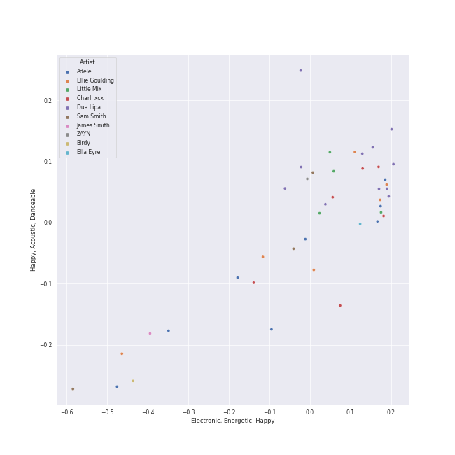

# uk pop

43 songs

[See Track Features](audio_features.md)

[See Clusters](clusters/overview.md)

## Top Artists

| Art | Rank | Tracks | 💚 | Artist | 🔗 |
|:---|---:|---:|---:|:---|:---|
|  | 87 | 11 | 7 | [Dua Lipa](../../artists/dua_lipa/overview.md) | [🔗](https://open.spotify.com/artist/6M2wZ9GZgrQXHCFfjv46we) |
|  | 123 | 8 | 5 | [Adele](../../artists/adele/overview.md) | [🔗](https://open.spotify.com/artist/4dpARuHxo51G3z768sgnrY) |
|  | 292 | 6 | 4 | Charli xcx | [🔗](https://open.spotify.com/artist/25uiPmTg16RbhZWAqwLBy5) |
|  | 192 | 4 | 4 | Little Mix | [🔗](https://open.spotify.com/artist/3e7awlrlDSwF3iM0WBjGMp) |
|  | 430 | 6 | 3 | Ellie Goulding | [🔗](https://open.spotify.com/artist/0X2BH1fck6amBIoJhDVmmJ) |
|  | 430 | 3 | 1 | Sam Smith | [🔗](https://open.spotify.com/artist/2wY79sveU1sp5g7SokKOiI) |
|  | 430 | 2 | 1 | Rina Sawayama | [🔗](https://open.spotify.com/artist/2KEqzdPS7M5YwGmiuPTdr5) |
|  | 50 | 1 | 1 | [HWASA](../../artists/hwasa/overview.md) | [🔗](https://open.spotify.com/artist/7bmYpVgQub656uNTu6qGNQ) |
|  | 44 | 1 | 1 | [Billie Eilish](../../artists/billie_eilish/overview.md) | [🔗](https://open.spotify.com/artist/6qqNVTkY8uBg9cP3Jd7DAH) |
|  | 430 | 1 | 1 | Ella Eyre | [🔗](https://open.spotify.com/artist/66TrUkUZ3RM29dqeDQRgyA) |

See all 23 artists

| Art | Rank | Tracks | 💚 | Artist | 🔗 |
|:---|---:|---:|---:|:---|:---|
|  | 354 | 1 | 1 | Lauv | [🔗](https://open.spotify.com/artist/5JZ7CnR6gTvEMKX4g70Amv) |
|  | 272 | 1 | 1 | DaBaby | [🔗](https://open.spotify.com/artist/4r63FhuTkUYltbVAg5TQnk) |
|  | 4 | 1 | 1 | [BLACKPINK](../../artists/blackpink/overview.md) | [🔗](https://open.spotify.com/artist/41MozSoPIsD1dJM0CLPjZF) |
|  | 121 | 1 | 1 | Kim Petras | [🔗](https://open.spotify.com/artist/3Xt3RrJMFv5SZkCfUE8C1J) |
|  | 430 | 1 | 1 | Birdy | [🔗](https://open.spotify.com/artist/2WX2uTcsvV5OnS0inACecP) |
|  | 430 | 1 | 1 | Mabel | [🔗](https://open.spotify.com/artist/1MIVXf74SZHmTIp4V4paH4) |
|  | 430 | 1 | 0 | Diplo | [🔗](https://open.spotify.com/artist/5fMUXHkw8R8eOP2RNVYEZX) |
|  | 430 | 1 | 0 | ZAYN | [🔗](https://open.spotify.com/artist/5ZsFI1h6hIdQRw2ti0hz81) |
|  | 430 | 1 | 0 | James Smith | [🔗](https://open.spotify.com/artist/543ccHFPnZfJMD8tRGPtu7) |
|  | 280 | 1 | 0 | A. G. Cook | [🔗](https://open.spotify.com/artist/335TWGWGFan4vaacJzSiU8) |
|  | 430 | 1 | 0 | VERNON | [🔗](https://open.spotify.com/artist/2Y34b9AOK30zXgL7cAH4NG) |
|  | 2 | 1 | 0 | [Red Velvet](../../artists/red_velvet/overview.md) | [🔗](https://open.spotify.com/artist/1z4g3DjTBBZKhvAroFlhOM) |
|  | 19 | 1 | 0 | [Taylor Swift](../../artists/taylor_swift/overview.md) | [🔗](https://open.spotify.com/artist/06HL4z0CvFAxyc27GXpf02) |

## Most and least listened tracks
| Rank | ​ | Most listened tracks | Rank | ​​ | Least listened tracks |
|---:|:---|:---|---:|:---|:---|
| 209 |  | [Take It All](../../artists/adele/overview.md) | 974 |  | [Physical](../../artists/dua_lipa/overview.md) |
| 762 |  | Good Ones | 974 |  | [Kiss and Make Up](../../artists/dua_lipa/overview.md) |
| 974 |  | Love Me Like You Do | 974 |  | Something In The Way You Move |
| 974 |  | DNA | 974 |  | [Hotter Than Hell](../../artists/dua_lipa/overview.md) |
| 974 |  | [Easy On Me](../../artists/adele/overview.md) | 974 |  | [Set Fire to the Rain](../../artists/adele/overview.md) |
| 974 |  | Power | 974 |  | [Chasing Pavements](../../artists/adele/overview.md) |
| 974 |  | Beg for You (feat. Rina Sawayama) | 974 |  | Black Magic |
| 974 |  | [Don't Start Now](../../artists/dua_lipa/overview.md) | 974 |  | [Skyfall](../../artists/adele/overview.md) |
| 974 |  | Have Yourself A Merry Little Christmas | 974 |  | Close To Me - Red Velvet Remix |
| 974 |  | Just The Way You Are | 974 |  | Slow Grenade |

## Top Albums

| Art | Rank | Tracks | 💚 | Album | Release Date | 🔗 |
|:---|---:|---:|---:|:---|:---|:---|
|  | 643 | 6 | 3 | Future Nostalgia | 2020-03-27 | [🔗](https://open.spotify.com/album/5lKlFlReHOLShQKyRv6AL9) |
|  | 153 | 4 | 3 | 21 | 2011-01-24 | [🔗](https://open.spotify.com/album/0Lg1uZvI312TPqxNWShFXL) |
|  | 643 | 2 | 2 | Dua Lipa (Complete Edition) | 2018-10-19 | [🔗](https://open.spotify.com/album/0obMz8EHnr3dg6NCUK4xWp) |
|  | 510 | 2 | 2 | CRASH | 2022-03-18 | [🔗](https://open.spotify.com/album/1QqipMXWzJhr6yfcNKTp8B) |
|  | 643 | 2 | 1 | Lights | 2011-01-01 | [🔗](https://open.spotify.com/album/3duZhvcaoqdNveQYXf9dMV) |
|  | 643 | 2 | 1 | BRAT | 2024-06-07 | [🔗](https://open.spotify.com/album/2lIZef4lzdvZkiiCzvPKj7) |
|  | 643 | 1 | 1 | Unholy (feat. Kim Petras) | 2022-09-22 | [🔗](https://open.spotify.com/album/0gX9tkL5njRax8ymWcXARi) |
|  | 643 | 1 | 1 | Slow Grenade | 2020-06-30 | [🔗](https://open.spotify.com/album/15Zgvxqql6EPHE3NJlUt0R) |
|  | 643 | 1 | 1 | Skyfall | 2012-10-04 | [🔗](https://open.spotify.com/album/6TwN6Lq9glwnG8kNp6chHY) |
|  | 643 | 1 | 1 | Salute (Expanded Edition) | 2013-11-11 | [🔗](https://open.spotify.com/album/4cH9WxyfNWlfR257RitWBt) |

See all 31 albums

| Art | Rank | Tracks | 💚 | Album | Release Date | 🔗 |
|:---|---:|---:|---:|:---|:---|:---|
|  | 643 | 1 | 1 | Physical (feat. Hwa Sa) | 2020-01-28 | [🔗](https://open.spotify.com/album/6apIJi4hf7U6cBOFwIqq1b) |
|  | 643 | 1 | 1 | Ivy To Roses - Mixtape | 2019-01-18 | [🔗](https://open.spotify.com/album/0syM7OUAhV7S6XmOa4nLUZ) |
|  | 643 | 1 | 1 | Guess featuring Billie Eilish | 2024-08-01 | [🔗](https://open.spotify.com/album/3ThlxfLSy4bfKzxWqmC7VN) |
|  | 643 | 1 | 1 | Glory Days (Expanded Edition) | 2016-11-18 | [🔗](https://open.spotify.com/album/4w49hcqZt66HZX0MJHfW0m) |
|  | 643 | 1 | 1 | Get Weird (Expanded Edition) | 2015-11-06 | [🔗](https://open.spotify.com/album/2FnfZiFMv7bmXAIATOJDHs) |
|  | 643 | 1 | 1 | Fifty Shades Freed (Original Motion Picture Soundtrack) | 2018-02-09 | [🔗](https://open.spotify.com/album/4w0N1CaZwQ5RPIuawqlYyy) |
|  | 643 | 1 | 1 | Ella Eyre | 2015-01-12 | [🔗](https://open.spotify.com/album/5J69OYtRXeI9dHDK2R95h5) |
|  | 643 | 1 | 1 | Easy On Me | 2021-10-14 | [🔗](https://open.spotify.com/album/224jZ4sUX7OhAuMwaxp86S) |
|  | 643 | 1 | 1 | Dance The Night (From Barbie The Album) | 2023-05-25 | [🔗](https://open.spotify.com/album/5cH7FqB7JD5q1tJXJ7FHYu) |
|  | 643 | 1 | 1 | DNA (Expanded Edition) | 2012-11-19 | [🔗](https://open.spotify.com/album/7B8LPRplA8cByTSzgQvdxd) |
|  | 643 | 1 | 1 | Birdy | 2011-11-04 | [🔗](https://open.spotify.com/album/1WGjSVIw0TVfbp5KrOFiP0) |
|  | 643 | 1 | 0 | Love Goes | 2020-10-30 | [🔗](https://open.spotify.com/album/5XCBX16KNYsAe7V5hQV9mC) |
|  | 643 | 1 | 0 | Little Love - EP | 2018-06-01 | [🔗](https://open.spotify.com/album/2PLM1yTphJeFZg01Xiaumc) |
|  | 643 | 1 | 0 | I Don’t Wanna Live Forever (Fifty Shades Darker) | 2016-12-09 | [🔗](https://open.spotify.com/album/5MxXY7DbFMUiHFTPUabgJJ) |
|  | 643 | 1 | 0 | Have Yourself A Merry Little Christmas | 2014-12-05 | [🔗](https://open.spotify.com/album/3nCpXy6LlyXWuFR08tMycK) |
|  | 643 | 1 | 0 | Dua Lipa | 2017-06-02 | [🔗](https://open.spotify.com/album/2vlhlrgMaXqcnhRqIEV9AP) |
|  | 643 | 1 | 0 | Delirium | 2015-11-13 | [🔗](https://open.spotify.com/album/4A43DyDoAVa1Fb8pq6Yejl) |
|  | 643 | 1 | 0 | Close To Me (Red Velvet Remix) | 2019-04-05 | [🔗](https://open.spotify.com/album/7dg5iqyFYqRQH7vtAG9VNf) |
|  | 643 | 1 | 0 | Beg For You (A. G. Cook & VERNON OF SEVENTEEN Remix) [feat. Rina Sawayama] | 2022-02-25 | [🔗](https://open.spotify.com/album/6snPKZGUbpydW2XJu9ievq) |
|  | 643 | 1 | 0 | 30 | 2021-11-19 | [🔗](https://open.spotify.com/album/21jF5jlMtzo94wbxmJ18aa) |
|  | 643 | 1 | 0 | 19 | 2008-01-28 | [🔗](https://open.spotify.com/album/1ydnyXPdmHrWXqXDgtQCPf) |

## Top Record Labels

| Tracks | 💚 | Label |
|---:|---:|:---|
| 10 | 6 | [Warner Records](../../labels/warner_records/overview.md) |
| 6 | 5 | [Atlantic Records](../../labels/atlantic_records/overview.md) |
| 6 | 4 | [XL Recordings](../../labels/xl_recordings/overview.md) |
| 4 | 4 | [Syco Music](../../labels/syco_music/overview.md) |
| 6 | 3 | [Polydor Records](../../labels/polydor_records/overview.md) |
| 3 | 2 | [Columbia](../../labels/columbia/overview.md) |
| 2 | 1 | [EMI](../../labels/emi/overview.md) |
| 2 | 1 | Atlantic Records UK |
| 1 | 1 | [Virgin Records](../../labels/virgin_records/overview.md) |
| 1 | 1 | [Universal Music LLC](../../labels/universal_music_llc/overview.md) |

See all 15 labels

| Tracks | 💚 | Label |
|---:|---:|:---|
| 1 | 1 | [Republic Records](../../labels/republic_records/overview.md) |
| 1 | 1 | FSF |
| 1 | 1 | Capitol Records UK |
| 2 | 0 | PLG - Capitol |
| 1 | 0 | Universal Music Group |

## Top Producers

| Art | Producer | Tracks | Credit Types |
|:---|:---|---:|:---|
|  | [Dua Lipa](../../artists/dua_lipa/overview.md) | 6 | Songwriter |
| | [Serban Ghenea](../../producers/serban_ghenea/overview.md) | 6 | Producer |
|  | [Adele](../../artists/adele/overview.md) | 5 | Producer, Songwriter |
| | [John Hanes](../../producers/john_hanes/overview.md) | 4 | Producer |
| | Caroline Ailin | 4 | Songwriter, Producer |
|  | Charli xcx | 4 | Songwriter, Lyricist |
| | [Josh Gudwin](../../producers/josh_gudwin/overview.md) | 3 | Producer |
| | KAMILLE | 3 | Songwriter |
| | Maegan Cottone | 3 | Arranger, Producer, Songwriter |
| | Tom Elmhirst | 3 | Producer |

View all

| Art | Producer | Tracks | Credit Types |
|:---|:---|---:|:---|
| | [Cirkut](../../producers/cirkut/overview.md) | 2 | Songwriter, Producer |
| | Clarence Coffee Jr. | 2 | Songwriter |
| | Cameron Gower Poole | 2 | Producer |
| | Ian Kirkpatrick | 2 | Producer, Songwriter |
| | Perrie Edwards | 2 | Songwriter |
| | Leigh-Anne | 2 | Songwriter |
|  | Ellie Goulding | 2 | Songwriter |
| | Jade Thirlwall | 2 | Songwriter |
| | TMS | 2 | Producer |
| | Peter Kelleher | 2 | Songwriter |
| | Emily Warren | 2 | Songwriter |
| | Andrew Watt | 2 | Songwriter, Producer |
| | Thomas Barnes | 2 | Songwriter |
| | Matt Radosevich | 2 | Producer |
| | Ben Collier | 2 | Producer |
| | Ali Tamposi | 2 | Songwriter |
| | Jesy Nelson | 2 | Songwriter |
| | Ben Kohn | 2 | Songwriter |
| | [Mark "Spike" Stent](../../producers/mark__spike__stent/overview.md) | 2 | Producer |
| | Sarah Hudson | 2 | Songwriter |
| | Andrew Farriss | 1 | Songwriter |
| | Jimmy Napes | 1 | Songwriter |
|  | A. G. Cook | 1 | Producer, Songwriter |
| | Richard "Biff" Stannard | 1 | Producer, Songwriter |
| | Ruffsound | 1 | Songwriter |
| | Julian Burg | 1 | Producer |
| | Lorna Blackwood | 1 | Producer |
| | Michael Hutchence | 1 | Songwriter |
| | Stephen Kozmeniuk | 1 | Producer, Songwriter |
| | Lionel Crasta | 1 | Producer |
| | Jason Elliott | 1 | Producer |
| | Screwface | 1 | Producer |
| | Dan Wilson | 1 | Producer, Songwriter |
| | Oscar Görres (Görres, Oscar) | 1 | Producer, Songwriter |
| | [ILYA](../../producers/ilya/overview.md) | 1 | Songwriter |
| | Daniel Aslet | 1 | Producer |
| | Oscar Holter | 1 | Producer, Songwriter |
| | Ben Hogarth | 1 | Producer |
| | Francis White | 1 | Songwriter |
| | [TEDDY](../../producers/teddy/overview.md) | 1 | Songwriter |
| | Jordan Johnson | 1 | Songwriter |
|  | [Billie Eilish](../../artists/billie_eilish/overview.md) | 1 | Songwriter |
| | Matthew Scatchell | 1 | Producer |
| | [Greg Kurstin](../../producers/greg_kurstin/overview.md) | 1 | Producer, Songwriter |
| | Matt Snell | 1 | Producer |
| | Steve Churchyard | 1 | Producer |
| | Digital Farm Animals | 1 | Producer, Songwriter |
| | Noonie Bao | 1 | Songwriter |
| | Simon Clarke | 1 | Arranger |
| | Robopop | 1 | Producer, Songwriter |
| | Thomas Warren | 1 | Producer |
| | Henrik Barman Michelsen | 1 | Producer, Songwriter |
| | Nicky D'Silva | 1 | Producer |
| | KNY Factory | 1 | Songwriter |
| | Anoo Bhagavan | 1 | Songwriter |
| | Fraser T. Smith | 1 | Songwriter |
| | Steve Mac | 1 | Producer, Songwriter |
| | Omer Fedi | 1 | Songwriter |
| | David Campbell | 1 | Arranger |
|  | Mark Ronson | 1 | Producer, Songwriter |
| | Alexander Soifer | 1 | Producer, Songwriter |
| | Ash Howes | 1 | Producer, Songwriter |
|  | Lauv | 1 | Songwriter |
|  | DaBaby | 1 | Songwriter |
| | Andrew Wyatt | 1 | Producer, Songwriter |
| | Kevin Grainger | 1 | Producer |
| | The Dare | 1 | Producer, Songwriter |
| | Dylan Brady | 1 | Songwriter |
| | Drew Jurecka | 1 | Arranger, Producer |
| | Paul LaMalfa | 1 | Producer |
| | Joe Kearns | 1 | Producer, Songwriter |
| | Robin Fredriksson | 1 | Songwriter |
| | Brandon Bost | 1 | Producer |
| | Chris Laws | 1 | Producer |
| | Alex Pasco | 1 | Producer |
| | Roland Spreckley | 1 | Songwriter |
| | Simon Rhodes | 1 | Producer |
| | Idania Valencia | 1 | Producer |
| | Ed Drewett | 1 | Songwriter |
| | Paul 'P Dub' Walton | 1 | Producer |
| | Daniel Pursey | 1 | Producer |
| | [FINNEAS](../../producers/finneas/overview.md) | 1 | Producer, Songwriter |
| | [Phil Tan](../../producers/phil_tan/overview.md) | 1 | Producer |
| | Niclas von der Burg | 1 | Songwriter |
| | Justin Vernon | 1 | Lyricist, Songwriter |
| | Ali Payami | 1 | Producer, Songwriter |
| | Iain James | 1 | Songwriter |
| | David Buckley | 1 | Arranger |
| | Leland | 1 | Songwriter |
| | Mattias Larsson | 1 | Songwriter |

## Years

| ​ | 10 newest albums | ​​ | 10 oldest albums |
|:---|:---|:---|:---|
|  | Guess featuring Billie Eilish (2024-08-01) |  | 19 (2008-01-28) |
|  | BRAT (2024-06-07) |  | Lights (2011-01-01) |
|  | Dance The Night (From Barbie The Album) (2023-05-25) |  | 21 (2011-01-24) |
|  | Unholy (feat. Kim Petras) (2022-09-22) |  | Birdy (2011-11-04) |
|  | CRASH (2022-03-18) |  | Skyfall (2012-10-04) |
|  | Beg For You (A. G. Cook & VERNON OF SEVENTEEN Remix) [feat. Rina Sawayama] (2022-02-25) |  | DNA (Expanded Edition) (2012-11-19) |
|  | 30 (2021-11-19) |  | Salute (Expanded Edition) (2013-11-11) |
|  | Easy On Me (2021-10-14) |  | Have Yourself A Merry Little Christmas (2014-12-05) |
|  | Love Goes (2020-10-30) |  | Ella Eyre (2015-01-12) |
|  | Slow Grenade (2020-06-30) |  | Get Weird (Expanded Edition) (2015-11-06) |

