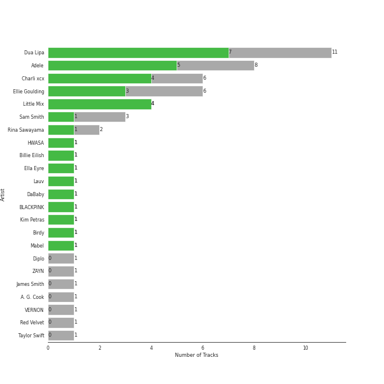
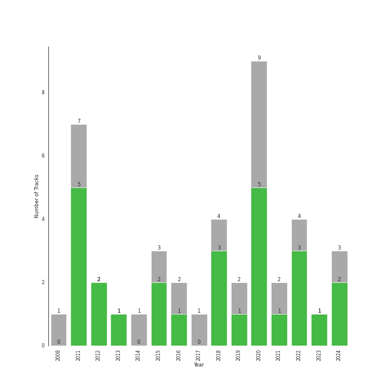

# uk pop

[40 songs](tracks.md)

[See Track Features](audio_features.md)

[See Clusters](clusters/overview.md)

## Top Artists

| Art | Tracks | 💚 | Artist | 🔗 |
|:---|---:|---:|:---|:---|
|  | 12 | 7 | [Dua Lipa](../../artists/dua_lipa/overview.md) | [🔗](https://open.spotify.com/artist/6M2wZ9GZgrQXHCFfjv46we) |
|  | 8 | 4 | Adele | [🔗](https://open.spotify.com/artist/4dpARuHxo51G3z768sgnrY) |
|  | 6 | 3 | Ellie Goulding | [🔗](https://open.spotify.com/artist/0X2BH1fck6amBIoJhDVmmJ) |
|  | 3 | 3 | Little Mix | [🔗](https://open.spotify.com/artist/3e7awlrlDSwF3iM0WBjGMp) |
|  | 3 | 1 | Sam Smith | [🔗](https://open.spotify.com/artist/2wY79sveU1sp5g7SokKOiI) |
|  | 2 | 1 | Charli XCX | [🔗](https://open.spotify.com/artist/25uiPmTg16RbhZWAqwLBy5) |
|  | 1 | 1 | [HWASA](../../artists/hwasa/overview.md) | [🔗](https://open.spotify.com/artist/7bmYpVgQub656uNTu6qGNQ) |
|  | 1 | 1 | Ella Eyre | [🔗](https://open.spotify.com/artist/66TrUkUZ3RM29dqeDQRgyA) |
|  | 1 | 1 | Lauv | [🔗](https://open.spotify.com/artist/5JZ7CnR6gTvEMKX4g70Amv) |
|  | 1 | 1 | DaBaby | [🔗](https://open.spotify.com/artist/4r63FhuTkUYltbVAg5TQnk) |

See all 24 artists

| Art | Tracks | 💚 | Artist | 🔗 |
|:---|---:|---:|:---|:---|
|  | 1 | 1 | [BLACKPINK](../../artists/blackpink/overview.md) | [🔗](https://open.spotify.com/artist/41MozSoPIsD1dJM0CLPjZF) |
|  | 1 | 1 | Kim Petras | [🔗](https://open.spotify.com/artist/3Xt3RrJMFv5SZkCfUE8C1J) |
|  | 1 | 1 | Birdy | [🔗](https://open.spotify.com/artist/2WX2uTcsvV5OnS0inACecP) |
|  | 1 | 1 | Mabel | [🔗](https://open.spotify.com/artist/1MIVXf74SZHmTIp4V4paH4) |
|  | 1 | 0 | Diplo | [🔗](https://open.spotify.com/artist/5fMUXHkw8R8eOP2RNVYEZX) |
|  | 1 | 0 | ZAYN | [🔗](https://open.spotify.com/artist/5ZsFI1h6hIdQRw2ti0hz81) |
|  | 1 | 0 | RAYE | [🔗](https://open.spotify.com/artist/5KKpBU5eC2tJDzf0wmlRp2) |
|  | 1 | 0 | James Smith | [🔗](https://open.spotify.com/artist/543ccHFPnZfJMD8tRGPtu7) |
|  | 1 | 0 | Jax Jones | [🔗](https://open.spotify.com/artist/4Q6nIcaBED8qUel8bBx6Cr) |
|  | 1 | 0 | A. G. Cook | [🔗](https://open.spotify.com/artist/335TWGWGFan4vaacJzSiU8) |
|  | 1 | 0 | VERNON | [🔗](https://open.spotify.com/artist/2Y34b9AOK30zXgL7cAH4NG) |
|  | 1 | 0 | Rina Sawayama | [🔗](https://open.spotify.com/artist/2KEqzdPS7M5YwGmiuPTdr5) |
|  | 1 | 0 | [Red Velvet](../../artists/red_velvet/overview.md) | [🔗](https://open.spotify.com/artist/1z4g3DjTBBZKhvAroFlhOM) |
|  | 1 | 0 | [Taylor Swift](../../artists/taylor_swift/overview.md) | [🔗](https://open.spotify.com/artist/06HL4z0CvFAxyc27GXpf02) |

## Top Albums

| Art | Tracks | 💚 | Album | Release Date | 🔗 |
|:---|---:|---:|:---|:---|:---|
|  | 7 | 3 | Future Nostalgia | 2020-03-27 | [🔗](https://open.spotify.com/album/5lKlFlReHOLShQKyRv6AL9) |
|  | 4 | 2 | 21 | 2011-01-24 | [🔗](https://open.spotify.com/album/0Lg1uZvI312TPqxNWShFXL) |
|  | 2 | 2 | Dua Lipa (Complete Edition) | 2018-10-19 | [🔗](https://open.spotify.com/album/0obMz8EHnr3dg6NCUK4xWp) |
|  | 2 | 1 | Lights | 2011-01-01 | [🔗](https://open.spotify.com/album/3duZhvcaoqdNveQYXf9dMV) |
|  | 1 | 1 | Unholy (feat. Kim Petras) | 2022-09-22 | [🔗](https://open.spotify.com/album/0gX9tkL5njRax8ymWcXARi) |
|  | 1 | 1 | Slow Grenade | 2020-06-30 | [🔗](https://open.spotify.com/album/15Zgvxqql6EPHE3NJlUt0R) |
|  | 1 | 1 | Skyfall | 2012-10-04 | [🔗](https://open.spotify.com/album/6TwN6Lq9glwnG8kNp6chHY) |
|  | 1 | 1 | Salute (Expanded Edition) | 2013-11-11 | [🔗](https://open.spotify.com/album/4cH9WxyfNWlfR257RitWBt) |
|  | 1 | 1 | Physical (feat. Hwa Sa) | 2020-01-28 | [🔗](https://open.spotify.com/album/6apIJi4hf7U6cBOFwIqq1b) |
|  | 1 | 1 | Ivy To Roses (Mixtape) | 2019-01-18 | [🔗](https://open.spotify.com/album/0syM7OUAhV7S6XmOa4nLUZ) |

See all 29 albums

| Art | Tracks | 💚 | Album | Release Date | 🔗 |
|:---|---:|---:|:---|:---|:---|
|  | 1 | 1 | Glory Days (Expanded Edition) | 2016-11-18 | [🔗](https://open.spotify.com/album/4w49hcqZt66HZX0MJHfW0m) |
|  | 1 | 1 | Get Weird (Expanded Edition) | 2015-11-06 | [🔗](https://open.spotify.com/album/2FnfZiFMv7bmXAIATOJDHs) |
|  | 1 | 1 | Fifty Shades Freed (Original Motion Picture Soundtrack) | 2018-02-09 | [🔗](https://open.spotify.com/album/4w0N1CaZwQ5RPIuawqlYyy) |
|  | 1 | 1 | Ella Eyre | 2015-01-12 | [🔗](https://open.spotify.com/album/5J69OYtRXeI9dHDK2R95h5) |
|  | 1 | 1 | Easy On Me | 2021-10-14 | [🔗](https://open.spotify.com/album/224jZ4sUX7OhAuMwaxp86S) |
|  | 1 | 1 | Dance The Night (From Barbie The Album) | 2023-05-25 | [🔗](https://open.spotify.com/album/5cH7FqB7JD5q1tJXJ7FHYu) |
|  | 1 | 1 | CRASH | 2022-03-18 | [🔗](https://open.spotify.com/album/1QqipMXWzJhr6yfcNKTp8B) |
|  | 1 | 1 | Birdy | 2011-11-04 | [🔗](https://open.spotify.com/album/1WGjSVIw0TVfbp5KrOFiP0) |
|  | 1 | 0 | You Don't Know Me | 2016-12-09 | [🔗](https://open.spotify.com/album/3gdmWRWWJmkp5uMBXf755B) |
|  | 1 | 0 | Love Goes | 2020-10-30 | [🔗](https://open.spotify.com/album/5XCBX16KNYsAe7V5hQV9mC) |
|  | 1 | 0 | Little Love - EP | 2018-06-01 | [🔗](https://open.spotify.com/album/2PLM1yTphJeFZg01Xiaumc) |
|  | 1 | 0 | I Don’t Wanna Live Forever (Fifty Shades Darker) | 2016-12-09 | [🔗](https://open.spotify.com/album/5MxXY7DbFMUiHFTPUabgJJ) |
|  | 1 | 0 | Have Yourself A Merry Little Christmas | 2014-12-05 | [🔗](https://open.spotify.com/album/3nCpXy6LlyXWuFR08tMycK) |
|  | 1 | 0 | Dua Lipa | 2017-06-02 | [🔗](https://open.spotify.com/album/2vlhlrgMaXqcnhRqIEV9AP) |
|  | 1 | 0 | Delirium | 2015-11-13 | [🔗](https://open.spotify.com/album/4A43DyDoAVa1Fb8pq6Yejl) |
|  | 1 | 0 | Close To Me (Red Velvet Remix) | 2019-04-05 | [🔗](https://open.spotify.com/album/7dg5iqyFYqRQH7vtAG9VNf) |
|  | 1 | 0 | Beg For You (A. G. Cook & VERNON OF SEVENTEEN Remix) [feat. Rina Sawayama] | 2022-02-25 | [🔗](https://open.spotify.com/album/6snPKZGUbpydW2XJu9ievq) |
|  | 1 | 0 | 30 | 2021-11-19 | [🔗](https://open.spotify.com/album/21jF5jlMtzo94wbxmJ18aa) |
|  | 1 | 0 | 19 | 2008-01-28 | [🔗](https://open.spotify.com/album/1ydnyXPdmHrWXqXDgtQCPf) |

## Top Record Labels

| Tracks | 💚 | Label |
|---:|---:|:---|
| 11 | 6 | [Warner Records](../../labels/warner_records/overview.md) |
| 7 | 3 | [Polydor Records](../../labels/polydor_records/overview.md) |
| 6 | 3 | [XL Recordings](../../labels/xl_recordings/overview.md) |
| 3 | 3 | [Syco Music](../../labels/syco_music/overview.md) |
| 3 | 2 | [Columbia](../../labels/columbia/overview.md) |
| 2 | 2 | [Atlantic Records](../../labels/atlantic_records/overview.md) |
| 2 | 1 | EMI |
| 2 | 1 | Atlantic Records UK |
| 1 | 1 | [Virgin Records](../../labels/virgin_records/overview.md) |
| 1 | 1 | [Universal Music LLC](../../labels/universal_music_llc/overview.md) |

See all 15 labels

| Tracks | 💚 | Label |
|---:|---:|:---|
| 1 | 1 | [Republic Records](../../labels/republic_records/overview.md) |
| 1 | 1 | FSF |
| 1 | 1 | Capitol Records UK |
| 2 | 0 | [Capitol Records](../../labels/capitol_records/overview.md) |
| 1 | 0 | Universal Music Group |

## Years

| ​ | 10 newest albums | ​​ | 10 oldest albums |
|:---|:---|:---|:---|
|  | Dance The Night (From Barbie The Album) (2023-05-25) |  | 19 (2008-01-28) |
|  | Unholy (feat. Kim Petras) (2022-09-22) |  | Lights (2011-01-01) |
|  | CRASH (2022-03-18) |  | 21 (2011-01-24) |
|  | Beg For You (A. G. Cook & VERNON OF SEVENTEEN Remix) [feat. Rina Sawayama] (2022-02-25) |  | Birdy (2011-11-04) |
|  | 30 (2021-11-19) |  | Skyfall (2012-10-04) |
|  | Easy On Me (2021-10-14) |  | Salute (Expanded Edition) (2013-11-11) |
|  | Love Goes (2020-10-30) |  | Have Yourself A Merry Little Christmas (2014-12-05) |
|  | Slow Grenade (2020-06-30) |  | Ella Eyre (2015-01-12) |
|  | Future Nostalgia (2020-03-27) |  | Get Weird (Expanded Edition) (2015-11-06) |
|  | Physical (feat. Hwa Sa) (2020-01-28) |  | Delirium (2015-11-13) |