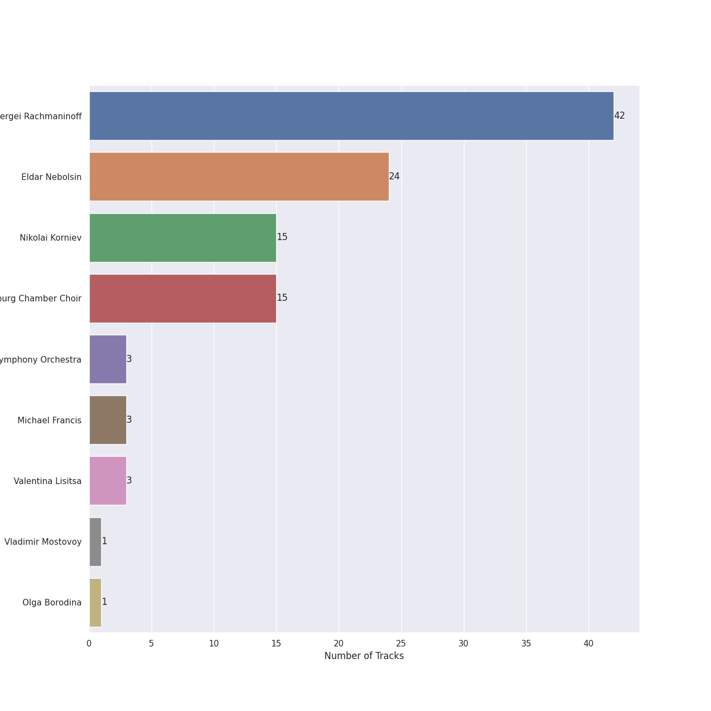
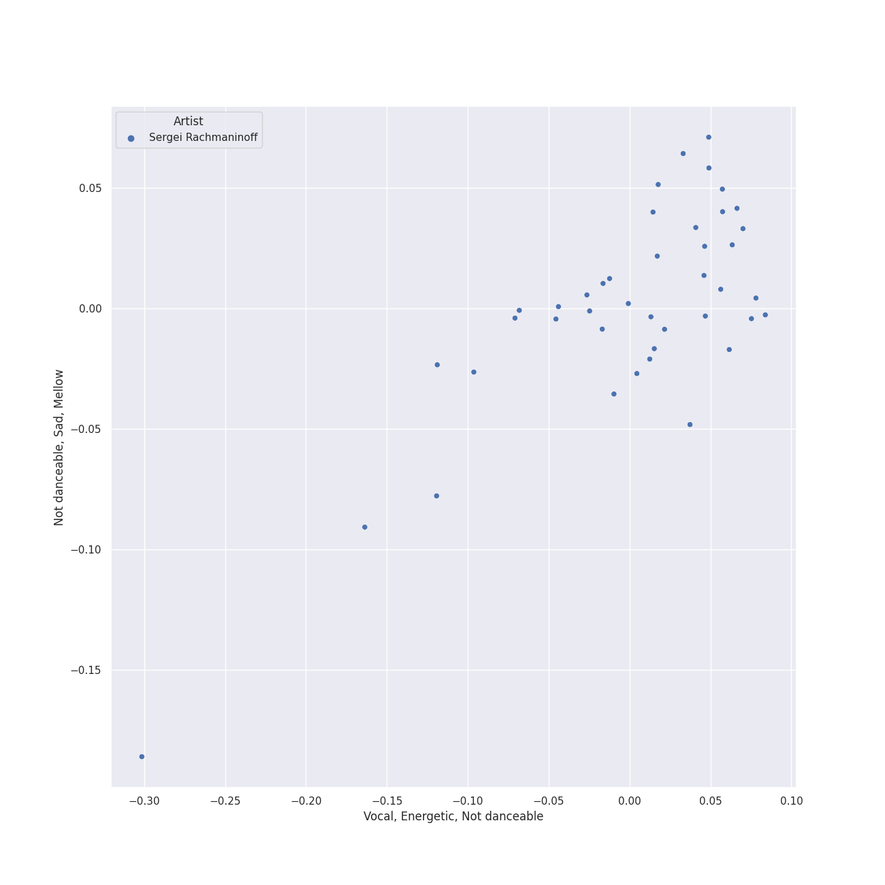
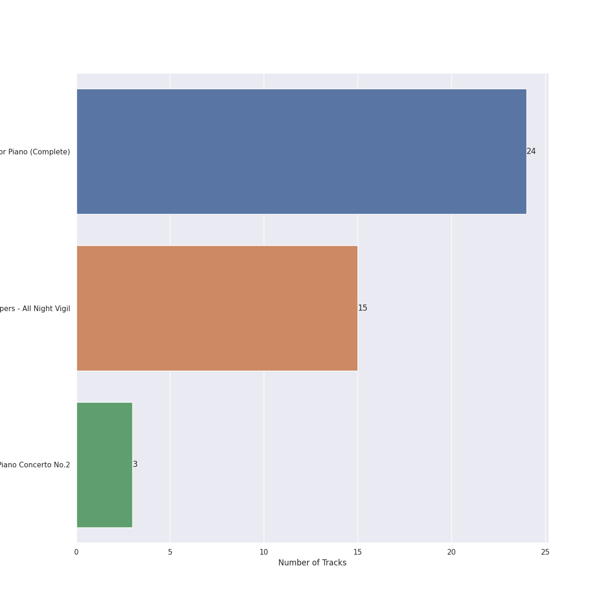
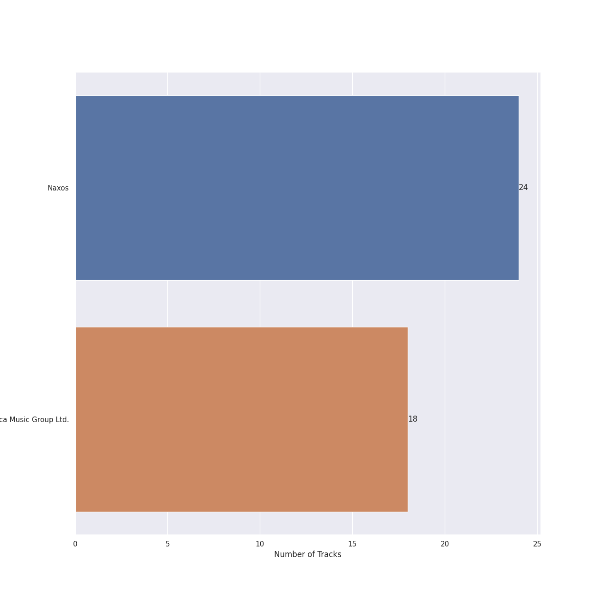

# ukrainian classical

[42 songs](ukrainian_classical_tracks.md)

## Top Artists

See all 9 artists

|   Number of Tracks | Art                                                                                              | Artist                                                                   | 🔗                                                           |
|-------------------:|:-------------------------------------------------------------------------------------------------|:-------------------------------------------------------------------------|:------------------------------------------------------------|
|                 42 |  | [Sergei Rachmaninoff](../artists/sergei_rachmaninoff.md)                 | [🔗](https://open.spotify.com/artist/0Kekt6CKSo0m5mivKcoH51) |
|                 24 |  | [Eldar Nebolsin](../artists/eldar_nebolsin.md)                           | [🔗](https://open.spotify.com/artist/45ts2AJTWlzJ9JrQlCGxpX) |
|                 15 |  | [Nikolai Korniev](../artists/nikolai_korniev.md)                         | [🔗](https://open.spotify.com/artist/70hS9SnJefkZo2QJwS2VXi) |
|                 15 |  | [St.Petersburg Chamber Choir](../artists/st_petersburg_chamber_choir.md) | [🔗](https://open.spotify.com/artist/46WjEugfIF0rKOewvFiby2) |
|                  3 |  | [London Symphony Orchestra](../artists/london_symphony_orchestra.md)     | [🔗](https://open.spotify.com/artist/5yxyJsFanEAuwSM5kOuZKc) |
|                  3 |  | Michael Francis                                                          | [🔗](https://open.spotify.com/artist/4znpeZQkiPbcXtHlRbfTqF) |
|                  3 |  | Valentina Lisitsa                                                        | [🔗](https://open.spotify.com/artist/0gOrXuu1vCBXe3pwTyb5Ca) |
|                  1 |  | Vladimir Mostovoy                                                        | [🔗](https://open.spotify.com/artist/4BTanscTBWJOSpvceZSVSi) |
|                  1 |  | Olga Borodina                                                            | [🔗](https://open.spotify.com/artist/47XbXbNzwqcWStfsjzFlKb) |

## Top Albums

See all 3 albums

|   Number of Tracks | Art                                                                                              | Album                                      | Release Date   | 🔗                                                          |
|-------------------:|:-------------------------------------------------------------------------------------------------|:-------------------------------------------|:---------------|:-----------------------------------------------------------|
|                 24 |  | Rachmaninov: Preludes for Piano (Complete) | 2007-05-29     | [🔗](https://open.spotify.com/album/1vlnwUAidj7bEmRhsq4zTv) |
|                 15 |  | Rachmaninov: Vespers - All Night Vigil     | 1994           | [🔗](https://open.spotify.com/album/7hqotgNjEJt09XiggaMI1v) |
|                  3 |  | Rachmaninov: Piano Concerto No.2           | 2012-01-01     | [🔗](https://open.spotify.com/album/5lVqgXqdoIH3W1wUM2hzPx) |

## Top Record Labels

See all 2 labels

|   Number of Tracks | Label                                                         |
|-------------------:|:--------------------------------------------------------------|
|                 24 | [Naxos](../labels/naxos.md)                                   |
|                 18 | [Decca Music Group Ltd.](../labels/decca_music_group_ltd_.md) |

## Audio Features

| 10 most Danceable tracks                                      | 10 least Danceable tracks                            |
|:--------------------------------------------------------------|:-----------------------------------------------------|
| 13 Preludes, Op. 32: No. 3 in E Major: Allegro vivace         | Vespers, Op. 37: XII. "Slava v vyshnikh Bogu"        |
| 13 Preludes, Op. 32: No. 8 in A Minor: Vivo                   | Vespers, Op. 37: V. "Nyne otpushchayeshi"            |
| Morceaux de fantaisie, Op. 3: No. 2, Prelude in C-Sharp Minor | Vespers, Op. 37: IV. "Svete tikhyi"                  |
| 10 Preludes, Op. 23: No. 10 in G-Flat Major: Largo            | Vespers, Op. 37: XIV. "Voskrez iz groba"             |
| 13 Preludes, Op. 32: No. 11 in B Major: Allegretto            | Vespers, Op. 37: II. "Blagoslovi dushe moya"         |
| 10 Preludes, Op. 23: No. 5 in G Minor: Alla marcia            | Vespers, Op. 37: VI. "Bogoroditse Devo"              |
| 10 Preludes, Op. 23: No. 6 in E-Flat Major: Andante           | Piano Concerto No. 2 in C Minor, Op. 18: 1. Moderato |
| 10 Preludes, Op. 23: No. 3 in D Minor: Tempo di minuetto      | Vespers, Op. 37: IX. "Blagosloven esi, Gospodi"      |
| 10 Preludes, Op. 23: No. 1 in F-Sharp Minor: Largo            | Vespers, Op. 37: VII. "Slava v vyshnikh Bogu"        |
| 13 Preludes, Op. 32: No. 1 in C Major: Allegro vivace         | Vespers, Op. 37: XIII. "Dnes spaseniye"              |

| 10 most Energetic tracks                                       | 10 least Energetic tracks                                |
|:---------------------------------------------------------------|:---------------------------------------------------------|
| Vespers, Op. 37: XV. "Vzbrannoy voevode"                       | 10 Preludes, Op. 23: No. 10 in G-Flat Major: Largo       |
| Vespers, Op. 37: VIII. "Kvalite imya Gospodne"                 | 13 Preludes, Op. 32: No. 5 in G Major: Moderato          |
| 10 Preludes, Op. 23: No. 2 in B-Flat Major: Maestoso           | 13 Preludes, Op. 32: No. 7 in F Major: Moderato          |
| 13 Preludes, Op. 32: No. 3 in E Major: Allegro vivace          | 10 Preludes, Op. 23: No. 1 in F-Sharp Minor: Largo       |
| 13 Preludes, Op. 32: No. 1 in C Major: Allegro vivace          | 13 Preludes, Op. 32: No. 11 in B Major: Allegretto       |
| 13 Preludes, Op. 32: No. 8 in A Minor: Vivo                    | 10 Preludes, Op. 23: No. 4 in D Major: Andante cantabile |
| 10 Preludes, Op. 23: No. 5 in G Minor: Alla marcia             | Vespers, Op. 37: III. "Blazhen muzh"                     |
| 10 Preludes, Op. 23: No. 9 in E-Flat Minor: Presto             | Vespers, Op. 37: V. "Nyne otpushchayeshi"                |
| Piano Concerto No. 2 in C Minor, Op. 18: 3. Allegro scherzando | 10 Preludes, Op. 23: No. 6 in E-Flat Major: Andante      |
| Vespers, Op. 37: I. "Priidite, poklonimsya"                    | Vespers, Op. 37: IV. "Svete tikhyi"                      |

| 10 most Speechy tracks                                        | 10 least Speechy tracks                                        |
|:--------------------------------------------------------------|:---------------------------------------------------------------|
| 10 Preludes, Op. 23: No. 1 in F-Sharp Minor: Largo            | 13 Preludes, Op. 32: No. 6 in F Minor: Allegro appassionato    |
| Morceaux de fantaisie, Op. 3: No. 2, Prelude in C-Sharp Minor | 10 Preludes, Op. 23: No. 7 in C Minor: Allegro                 |
| 13 Preludes, Op. 32: No. 11 in B Major: Allegretto            | 10 Preludes, Op. 23: No. 2 in B-Flat Major: Maestoso           |
| 13 Preludes, Op. 32: No. 10 in B Minor: Lento                 | 10 Preludes, Op. 23: No. 6 in E-Flat Major: Andante            |
| Vespers, Op. 37: XII. "Slava v vyshnikh Bogu"                 | Piano Concerto No. 2 in C Minor, Op. 18: 3. Allegro scherzando |
| Vespers, Op. 37: II. "Blagoslovi dushe moya"                  | 10 Preludes, Op. 23: No. 3 in D Minor: Tempo di minuetto       |
| Vespers, Op. 37: XI. "Velichit dusha moya Gospoda"            | 13 Preludes, Op. 32: No. 1 in C Major: Allegro vivace          |
| 13 Preludes, Op. 32: No. 13 in D-Flat Major: Grave - Allegro  | 10 Preludes, Op. 23: No. 5 in G Minor: Alla marcia             |
| 10 Preludes, Op. 23: No. 10 in G-Flat Major: Largo            | 13 Preludes, Op. 32: No. 2 in B-Flat Minor: Allegretto         |
| 13 Preludes, Op. 32: No. 8 in A Minor: Vivo                   | Vespers, Op. 37: III. "Blazhen muzh"                           |

| 10 most Acoustic tracks                                | 10 least Acoustic tracks                                       |
|:-------------------------------------------------------|:---------------------------------------------------------------|
| Vespers, Op. 37: I. "Priidite, poklonimsya"            | 10 Preludes, Op. 23: No. 2 in B-Flat Major: Maestoso           |
| 13 Preludes, Op. 32: No. 2 in B-Flat Minor: Allegretto | Piano Concerto No. 2 in C Minor, Op. 18: 1. Moderato           |
| 13 Preludes, Op. 32: No. 10 in B Minor: Lento          | Piano Concerto No. 2 in C Minor, Op. 18: 3. Allegro scherzando |
| Vespers, Op. 37: VIII. "Kvalite imya Gospodne"         | Vespers, Op. 37: VI. "Bogoroditse Devo"                        |
| 13 Preludes, Op. 32: No. 7 in F Major: Moderato        | Piano Concerto No. 2 in C Minor, Op. 18: 2. Adagio sostenuto   |
| 10 Preludes, Op. 23: No. 1 in F-Sharp Minor: Largo     | 10 Preludes, Op. 23: No. 9 in E-Flat Minor: Presto             |
| 13 Preludes, Op. 32: No. 5 in G Major: Moderato        | 13 Preludes, Op. 32: No. 13 in D-Flat Major: Grave - Allegro   |
| 10 Preludes, Op. 23: No. 10 in G-Flat Major: Largo     | 13 Preludes, Op. 32: No. 6 in F Minor: Allegro appassionato    |
| Vespers, Op. 37: XV. "Vzbrannoy voevode"               | 13 Preludes, Op. 32: No. 1 in C Major: Allegro vivace          |
| 13 Preludes, Op. 32: No. 3 in E Major: Allegro vivace  | 10 Preludes, Op. 23: No. 8 in A-Flat Major: Allegro vivace     |

| 10 most Instrumental tracks                                   | 10 least Instrumental tracks                          |
|:--------------------------------------------------------------|:------------------------------------------------------|
| Vespers, Op. 37: XIV. "Voskrez iz groba"                      | Vespers, Op. 37: II. "Blagoslovi dushe moya"          |
| Vespers, Op. 37: VI. "Bogoroditse Devo"                       | Vespers, Op. 37: XV. "Vzbrannoy voevode"              |
| Piano Concerto No. 2 in C Minor, Op. 18: 2. Adagio sostenuto  | Vespers, Op. 37: VIII. "Kvalite imya Gospodne"        |
| 13 Preludes, Op. 32: No. 5 in G Major: Moderato               | Vespers, Op. 37: IX. "Blagosloven esi, Gospodi"       |
| 13 Preludes, Op. 32: No. 3 in E Major: Allegro vivace         | Vespers, Op. 37: X. "Voskreseniye Khristovo videvshe" |
| 10 Preludes, Op. 23: No. 9 in E-Flat Minor: Presto            | 13 Preludes, Op. 32: No. 1 in C Major: Allegro vivace |
| 10 Preludes, Op. 23: No. 3 in D Minor: Tempo di minuetto      | Vespers, Op. 37: VII. "Slava v vyshnikh Bogu"         |
| Morceaux de fantaisie, Op. 3: No. 2, Prelude in C-Sharp Minor | 10 Preludes, Op. 23: No. 2 in B-Flat Major: Maestoso  |
| 13 Preludes, Op. 32: No. 9 in A Major: Allegro moderato       | 10 Preludes, Op. 23: No. 7 in C Minor: Allegro        |
| Vespers, Op. 37: IV. "Svete tikhyi"                           | Vespers, Op. 37: III. "Blazhen muzh"                  |

| 10 most Live tracks                                         | 10 least Live tracks                                         |
|:------------------------------------------------------------|:-------------------------------------------------------------|
| 10 Preludes, Op. 23: No. 9 in E-Flat Minor: Presto          | 13 Preludes, Op. 32: No. 7 in F Major: Moderato              |
| Vespers, Op. 37: XIII. "Dnes spaseniye"                     | Piano Concerto No. 2 in C Minor, Op. 18: 2. Adagio sostenuto |
| 10 Preludes, Op. 23: No. 5 in G Minor: Alla marcia          | 13 Preludes, Op. 32: No. 8 in A Minor: Vivo                  |
| 10 Preludes, Op. 23: No. 2 in B-Flat Major: Maestoso        | Piano Concerto No. 2 in C Minor, Op. 18: 1. Moderato         |
| 13 Preludes, Op. 32: No. 3 in E Major: Allegro vivace       | Vespers, Op. 37: II. "Blagoslovi dushe moya"                 |
| Vespers, Op. 37: IV. "Svete tikhyi"                         | Vespers, Op. 37: XII. "Slava v vyshnikh Bogu"                |
| Vespers, Op. 37: XI. "Velichit dusha moya Gospoda"          | 13 Preludes, Op. 32: No. 5 in G Major: Moderato              |
| 10 Preludes, Op. 23: No. 3 in D Minor: Tempo di minuetto    | 10 Preludes, Op. 23: No. 4 in D Major: Andante cantabile     |
| Vespers, Op. 37: III. "Blazhen muzh"                        | 13 Preludes, Op. 32: No. 9 in A Major: Allegro moderato      |
| 13 Preludes, Op. 32: No. 6 in F Minor: Allegro appassionato | Vespers, Op. 37: I. "Priidite, poklonimsya"                  |

| 10 most Happy tracks                                        | 10 least Happy tracks                                        |
|:------------------------------------------------------------|:-------------------------------------------------------------|
| 13 Preludes, Op. 32: No. 3 in E Major: Allegro vivace       | Vespers, Op. 37: IV. "Svete tikhyi"                          |
| 13 Preludes, Op. 32: No. 8 in A Minor: Vivo                 | Vespers, Op. 37: VI. "Bogoroditse Devo"                      |
| 10 Preludes, Op. 23: No. 2 in B-Flat Major: Maestoso        | Vespers, Op. 37: II. "Blagoslovi dushe moya"                 |
| 13 Preludes, Op. 32: No. 6 in F Minor: Allegro appassionato | Vespers, Op. 37: XIV. "Voskrez iz groba"                     |
| 10 Preludes, Op. 23: No. 9 in E-Flat Minor: Presto          | Vespers, Op. 37: XIII. "Dnes spaseniye"                      |
| 10 Preludes, Op. 23: No. 3 in D Minor: Tempo di minuetto    | 13 Preludes, Op. 32: No. 10 in B Minor: Lento                |
| 13 Preludes, Op. 32: No. 1 in C Major: Allegro vivace       | 13 Preludes, Op. 32: No. 12 in G-Sharp Minor: Allegro        |
| 10 Preludes, Op. 23: No. 5 in G Minor: Alla marcia          | Vespers, Op. 37: VII. "Slava v vyshnikh Bogu"                |
| 10 Preludes, Op. 23: No. 10 in G-Flat Major: Largo          | Piano Concerto No. 2 in C Minor, Op. 18: 2. Adagio sostenuto |
| 13 Preludes, Op. 32: No. 11 in B Major: Allegretto          | 10 Preludes, Op. 23: No. 1 in F-Sharp Minor: Largo           |
