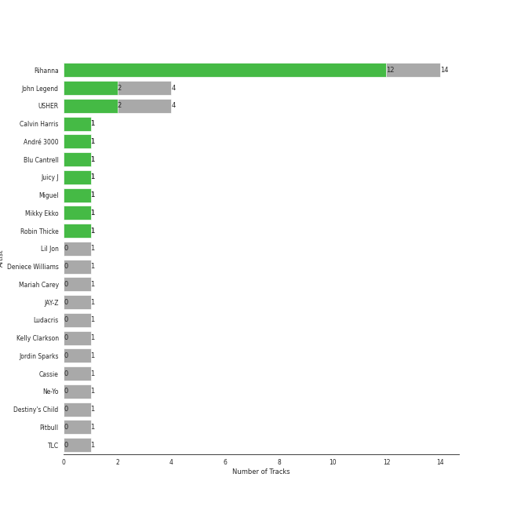
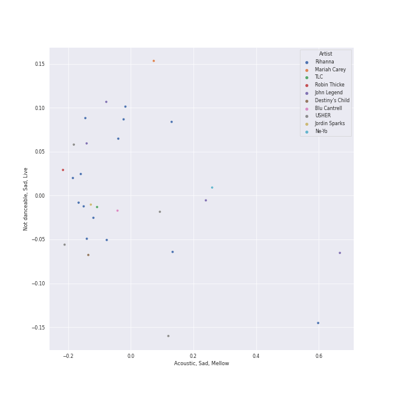
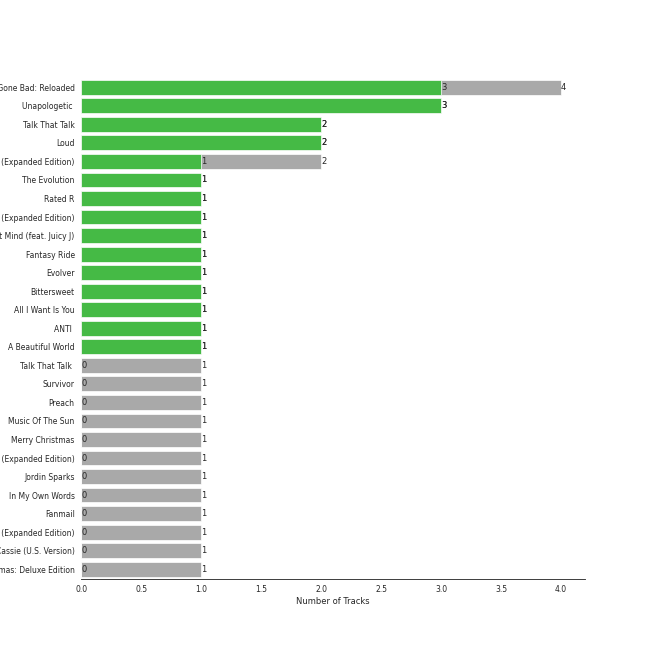
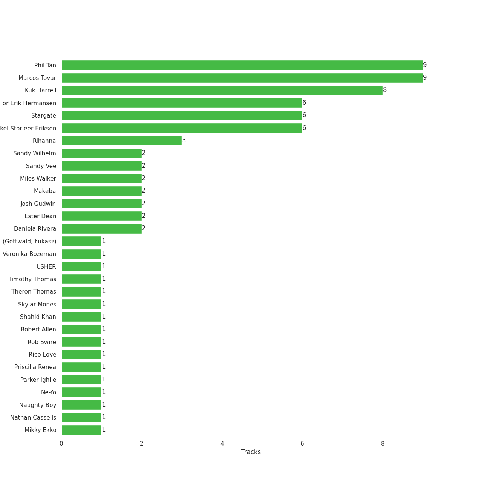
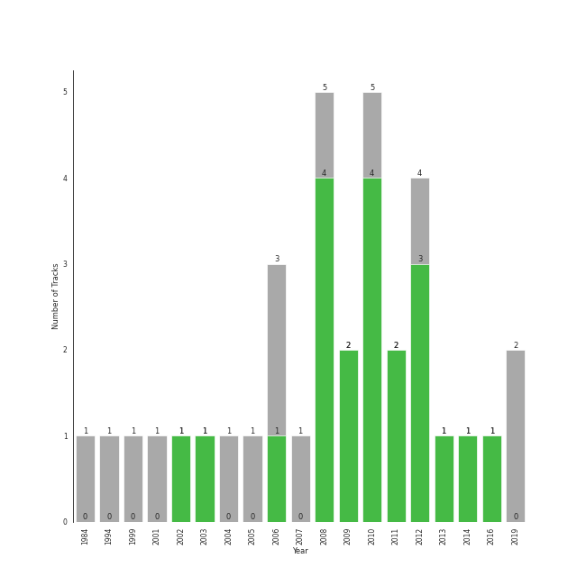

# urban contemporary

34 songs

[See Track Features](audio_features.md)

[See Clusters](clusters/overview.md)

## Top Artists

| Art | Tracks | 💚 | Artist | 🔗 |
|:---|---:|---:|:---|:---|
|  | 14 | 12 | [Rihanna](../../artists/rihanna/overview.md) | [🔗](https://open.spotify.com/artist/5pKCCKE2ajJHZ9KAiaK11H) |
|  | 4 | 2 | John Legend | [🔗](https://open.spotify.com/artist/5y2Xq6xcjJb2jVM54GHK3t) |
|  | 4 | 2 | USHER | [🔗](https://open.spotify.com/artist/23zg3TcAtWQy7J6upgbUnj) |
|  | 2 | 2 | Ciara | [🔗](https://open.spotify.com/artist/2NdeV5rLm47xAvogXrYhJX) |
|  | 1 | 1 | Calvin Harris | [🔗](https://open.spotify.com/artist/7CajNmpbOovFoOoasH2HaY) |
|  | 1 | 1 | André 3000 | [🔗](https://open.spotify.com/artist/74V3dE1a51skRkdII8y2C6) |
|  | 1 | 1 | Blu Cantrell | [🔗](https://open.spotify.com/artist/6vytZ677lz4LzCrUDcDokM) |
|  | 1 | 1 | Chamillionaire | [🔗](https://open.spotify.com/artist/6vdMPayKk8YJxxeNP5oMCb) |
|  | 1 | 1 | Juicy J | [🔗](https://open.spotify.com/artist/5gCRApTajqwbnHHPbr2Fpi) |
|  | 1 | 1 | Miguel | [🔗](https://open.spotify.com/artist/360IAlyVv4PCEVjgyMZrxK) |

See all 25 artists

| Art | Tracks | 💚 | Artist | 🔗 |
|:---|---:|---:|:---|:---|
|  | 1 | 1 | Justin Timberlake | [🔗](https://open.spotify.com/artist/31TPClRtHm23RisEBtV3X7) |
|  | 1 | 1 | Mikky Ekko | [🔗](https://open.spotify.com/artist/1buzCmyYZE4kcdLRudsb8V) |
|  | 1 | 1 | Robin Thicke | [🔗](https://open.spotify.com/artist/0ZrpamOxcZybMHGg1AYtHP) |
|  | 1 | 0 | Lil Jon | [🔗](https://open.spotify.com/artist/7sfl4Xt5KmfyDs2T3SVSMK) |
|  | 1 | 0 | Deniece Williams | [🔗](https://open.spotify.com/artist/5jNGQ7VOU87x5402JjhTtd) |
|  | 1 | 0 | Mariah Carey | [🔗](https://open.spotify.com/artist/4iHNK0tOyZPYnBU7nGAgpQ) |
|  | 1 | 0 | JAY-Z | [🔗](https://open.spotify.com/artist/3nFkdlSjzX9mRTtwJOzDYB) |
|  | 1 | 0 | Ludacris | [🔗](https://open.spotify.com/artist/3ipn9JLAPI5GUEo4y4jcoi) |
|  | 1 | 0 | Kelly Clarkson | [🔗](https://open.spotify.com/artist/3BmGtnKgCSGYIUhmivXKWX) |
|  | 1 | 0 | Jordin Sparks | [🔗](https://open.spotify.com/artist/2AQjGvtT0pFYfxR3neFcvz) |
|  | 1 | 0 | Cassie | [🔗](https://open.spotify.com/artist/27FGXRNruFoOdf1vP8dqcH) |
|  | 1 | 0 | Ne-Yo | [🔗](https://open.spotify.com/artist/21E3waRsmPlU7jZsS13rcj) |
|  | 1 | 0 | Destiny's Child | [🔗](https://open.spotify.com/artist/1Y8cdNmUJH7yBTd9yOvr5i) |
|  | 1 | 0 | Pitbull | [🔗](https://open.spotify.com/artist/0TnOYISbd1XYRBk9myaseg) |
|  | 1 | 0 | TLC | [🔗](https://open.spotify.com/artist/0TImkz4nPqjegtVSMZnMRq) |

## Most and least listened tracks
| ​ | Most listened tracks | Rank | ​​ | Least listened tracks | Rank |
|:---|:---|---:|:---|:---|---:|
|  | Get Up (feat. Chamillionaire) | 265 |  | [S&M](../../artists/rihanna/overview.md) | nan |
|  | [What Now](../../artists/rihanna/overview.md) | 268 |  | [Don't Stop The Music](../../artists/rihanna/overview.md) | nan |
|  | All I Want for Christmas Is You | 485 |  | Sure Thing | nan |
|  | [Stay](../../artists/rihanna/overview.md) | 654 |  | [We Found Love](../../artists/rihanna/overview.md) | nan |
|  | Love Sex Magic (feat. Justin Timberlake) | nan |  | No Scrubs | nan |
|  | Me & U | nan |  | [Watch n' Learn](../../artists/rihanna/overview.md) | nan |
|  | I Don't Mind (feat. Juicy J) | nan |  | [Only Girl (In The World)](../../artists/rihanna/overview.md) | nan |
|  | Green Light (feat. André 3000) | nan |  | When I Get You Alone | nan |
|  | So Sick | nan |  | Preach | nan |
|  | There Goes My Baby | nan |  | [Disturbia](../../artists/rihanna/overview.md) | nan |

## Top Albums

| Art | Tracks | 💚 | Album | Release Date | 🔗 |
|:---|---:|---:|:---|:---|:---|
|  | 4 | 3 | Good Girl Gone Bad: Reloaded | 2008-06-02 | [🔗](https://open.spotify.com/album/3JSWZWeTHF4HDGt5Eozdy7) |
|  | 3 | 3 | Unapologetic (Deluxe) | 2012-12-11 | [🔗](https://open.spotify.com/album/4eddbruVtOqw8khwxSH6H2) |
|  | 2 | 2 | Talk That Talk | 2011-11-19 | [🔗](https://open.spotify.com/album/1Kw1bVd07oRqcjrcjQKC8T) |
|  | 2 | 2 | Loud | 2010-11-16 | [🔗](https://open.spotify.com/album/6UHhmTLl9T1scRYLmpHcDX) |
|  | 2 | 1 | Raymond v Raymond (Expanded Edition) | 2010-03-30 | [🔗](https://open.spotify.com/album/6A1F3Fkq5dYeYYNkXflcTX) |
|  | 1 | 1 | The Evolution | 2006 | [🔗](https://open.spotify.com/album/0hfJ35SzCkWesdUpLKXLto) |
|  | 1 | 1 | Rated R | 2009-11-20 | [🔗](https://open.spotify.com/album/7uGmyYwDFJbSc1xs4hkEs2) |
|  | 1 | 1 | Love In The Future (Expanded Edition) | 2013-08-30 | [🔗](https://open.spotify.com/album/4OTAx9un4e6NfoHuVRiOrC) |
|  | 1 | 1 | I Don't Mind (feat. Juicy J) | 2014-11-21 | [🔗](https://open.spotify.com/album/5BAqg5IJQ7XFKfdoCiOlJw) |
|  | 1 | 1 | Fantasy Ride | 2009-05-05 | [🔗](https://open.spotify.com/album/5bIi3gz4jULkZV38aTwLPn) |

See all 26 albums

| Art | Tracks | 💚 | Album | Release Date | 🔗 |
|:---|---:|---:|:---|:---|:---|
|  | 1 | 1 | Evolver | 2008-10-27 | [🔗](https://open.spotify.com/album/11sKu4dBGvmEZTuVw9EC9A) |
|  | 1 | 1 | Bittersweet | 2003 | [🔗](https://open.spotify.com/album/3UviDOQkc4WbXkNi6DIBZu) |
|  | 1 | 1 | All I Want Is You | 2010-11-26 | [🔗](https://open.spotify.com/album/493HYe7N5pleudEZRyhE7R) |
|  | 1 | 1 | ANTI (Deluxe) | 2016-01-28 | [🔗](https://open.spotify.com/album/4UlGauD7ROb3YbVOFMgW5u) |
|  | 1 | 1 | A Beautiful World | 2002-12-13 | [🔗](https://open.spotify.com/album/76wI74XuASLFrY9pUVLhO9) |
|  | 1 | 0 | Survivor | 2001-05-01 | [🔗](https://open.spotify.com/album/480AZOo2VQ1kf3GedAiKV9) |
|  | 1 | 0 | Preach | 2019-02-15 | [🔗](https://open.spotify.com/album/32r4o1R9a1lK5DoVXGEC7E) |
|  | 1 | 0 | Music Of The Sun | 2005-08-29 | [🔗](https://open.spotify.com/album/4FyGpObwABjn0o8Tdp7AZz) |
|  | 1 | 0 | Merry Christmas | 1994-10-28 | [🔗](https://open.spotify.com/album/61ulfFSmmxMhc2wCdmdMkN) |
|  | 1 | 0 | Let's Hear It for the Boy (Expanded Edition) | 1984-04-16 | [🔗](https://open.spotify.com/album/5SQ28k8Esr8yY55ZKvgC5u) |
|  | 1 | 0 | Jordin Sparks | 2007-11-20 | [🔗](https://open.spotify.com/album/6JCNOvp9UeMrFuXwNW0JW6) |
|  | 1 | 0 | In My Own Words | 2006-01-01 | [🔗](https://open.spotify.com/album/6gkwOLmk0ALMOjWs5WhAEr) |
|  | 1 | 0 | Fanmail | 1999-02-23 | [🔗](https://open.spotify.com/album/1CvjjpvqVMoyprsf74bpYW) |
|  | 1 | 0 | Confessions (Expanded Edition) | 2004-03-23 | [🔗](https://open.spotify.com/album/1RM6MGv6bcl6NrAG8PGoZk) |
|  | 1 | 0 | Cassie (U.S. Version) | 2006-08-07 | [🔗](https://open.spotify.com/album/0j1qzjaJmsF1FkcICf3hRu) |
|  | 1 | 0 | A Legendary Christmas: Deluxe Edition | 2019-11-08 | [🔗](https://open.spotify.com/album/3wanKGZXsWXr6ZKdQrDtGu) |

## Top Record Labels

| Tracks | 💚 | Label |
|---:|---:|:---|
| 13 | 11 | [Def Jam Recordings](../../labels/def_jam_recordings/overview.md) |
| 6 | 3 | LaFace Records |
| 7 | 2 | [Columbia](../../labels/columbia/overview.md) |
| 2 | 2 | G.O.O.D. Music |
| 2 | 1 | Arista |
| 1 | 1 | Roc Nation |
| 1 | 1 | Rihanna |
| 1 | 1 | [RCA Records Label](../../labels/rca_records_label/overview.md) |
| 1 | 1 | Nu America Music |
| 1 | 1 | [Jive](../../labels/jive/overview.md) |

See all 14 labels

| Tracks | 💚 | Label |
|---:|---:|:---|
| 1 | 0 | [Legacy](../../labels/legacy/overview.md) |
| 1 | 0 | Def Soul |
| 1 | 0 | [Bad Boy](../../labels/bad_boy/overview.md) |
| 1 | 0 | 19 Recordings Limited |

## Top Producers

| Art | Producer | Tracks | Credit Types |
|:---|:---|---:|:---|
| | [Marcos Tovar](../../producers/marcos_tovar/overview.md) | 9 | Producer |
| | [Phil Tan](../../producers/phil_tan/overview.md) | 9 | Producer |
| | Kuk Harrell | 8 | Producer |
| | Tor Erik Hermansen | 6 | Songwriter |
| | Stargate | 6 | Producer |
| | [Mikkel Storleer Eriksen](../../producers/mikkel_storleer_eriksen/overview.md) | 6 | Songwriter, Producer |
|  | [Rihanna](../../artists/rihanna/overview.md) | 3 | Songwriter |
| | Daniela Rivera | 2 | Producer |
| | Sandy Vee | 2 | Producer |
| | Makeba | 2 | Producer, Songwriter |

View all

| Art | Producer | Tracks | Credit Types |
|:---|:---|---:|:---|
| | Miles Walker | 2 | Producer |
| | [Josh Gudwin](../../producers/josh_gudwin/overview.md) | 2 | Producer |
| | Sandy Wilhelm | 2 | Songwriter |
| | Ester Dean | 2 | Songwriter |
| | Frank Romano | 1 | Songwriter |
|  | Juicy J | 1 | Songwriter |
| | Kevin Davis | 1 | Producer |
| | Veronika Bozeman | 1 | Producer |
| | Frankie Storm | 1 | Songwriter |
| | [Łukasz Gottwald (Gottwald, Łukasz)](../../producers/łukasz_gottwald_(gottwald,_łukasz)/overview.md) | 1 | Songwriter |
| | Hit-Boy | 1 | Producer, Songwriter |
| | Paul Foley | 1 | Producer |
|  | Chris Brown | 1 | Songwriter |
| | Robin Tadross | 1 | Songwriter |
| | Shahid Khan | 1 | Songwriter |
| | Al Hemberger | 1 | Producer |
| | Parker Ighile | 1 | Producer, Songwriter |
| | Jim Jonsin | 1 | Songwriter |
| | Mike Gaydusek | 1 | Producer |
|  | [Michael Jackson](../../artists/michael_jackson/overview.md) | 1 | Songwriter |
| | Rob Swire | 1 | Producer, Songwriter |
| | Danny Morris | 1 | Songwriter |
|  | Ne-Yo | 1 | Producer, Songwriter |
| | Jacob Kasher | 1 | Songwriter |
| | Justin Parker | 1 | Arranger, Producer, Songwriter |
| | Crystal Nicole | 1 | Songwriter |
| | Elof Loelv | 1 | Producer, Songwriter |
| | Robert Allen | 1 | Songwriter |
| | Theron Thomas | 1 | Songwriter |
| | Andre Merritt | 1 | Songwriter |
| | Timothy Thomas | 1 | Songwriter |
| | Andrew Vastola | 1 | Producer |
| | Nathan Cassells | 1 | Producer, Songwriter |
| | [Cirkut](../../producers/cirkut/overview.md) | 1 | Songwriter |
| | Happy Perez | 1 | Songwriter |
| | Fred Ball | 1 | Producer, Songwriter |
| | [Mark "Spike" Stent](../../producers/mark__spike__stent/overview.md) | 1 | Producer |
| | The Y's | 1 | Producer |
| | Naughty Boy | 1 | Producer |
|  | Miguel | 1 | Songwriter |
| | Dallas Austin | 1 | Lyricist, Songwriter |
|  | USHER | 1 | Songwriter |
| | Skylar Mones | 1 | Producer |
| | Livvi Franc | 1 | Songwriter |
| | James Fauntleroy | 1 | Songwriter |
| | Brian Kennedy | 1 | Producer, Songwriter |
| | [Manny Marroquin](../../producers/manny_marroquin/overview.md) | 1 | Producer |
|  | Justin Timberlake | 1 | Songwriter |
| | Josh Houghkirk | 1 | Producer |
| | Alju Jackson | 1 | Songwriter |
| | Mike Elizondo | 1 | Songwriter |
| | Emeli Sandé (Sandé, Emeli) | 1 | Songwriter |
| | Rico Love | 1 | Songwriter |
| | Joseph Angel | 1 | Arranger, Songwriter |
| | Priscilla Renea | 1 | Songwriter |
|  | Calvin Harris | 1 | Producer, Songwriter |
|  | Mikky Ekko | 1 | Arranger, Producer, Songwriter |

## Years

| ​ | 10 newest albums | ​​ | 10 oldest albums |
|:---|:---|:---|:---|
|  | A Legendary Christmas: Deluxe Edition (2019-11-08) |  | Let's Hear It for the Boy (Expanded Edition) (1984-04-16) |
|  | Preach (2019-02-15) |  | Merry Christmas (1994-10-28) |
|  | ANTI (Deluxe) (2016-01-28) |  | Fanmail (1999-02-23) |
|  | I Don't Mind (feat. Juicy J) (2014-11-21) |  | Survivor (2001-05-01) |
|  | Love In The Future (Expanded Edition) (2013-08-30) |  | A Beautiful World (2002-12-13) |
|  | Unapologetic (Deluxe) (2012-12-11) |  | Bittersweet (2003) |
|  | Talk That Talk (2011-11-19) |  | Confessions (Expanded Edition) (2004-03-23) |
|  | All I Want Is You (2010-11-26) |  | Music Of The Sun (2005-08-29) |
|  | Loud (2010-11-16) |  | The Evolution (2006) |
|  | Raymond v Raymond (Expanded Edition) (2010-03-30) |  | In My Own Words (2006-01-01) |

