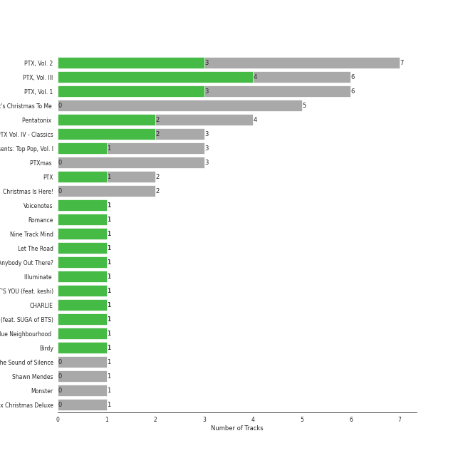

# viral pop

[44 songs](viral_pop_tracks.md)

## Top Artists

See all 24 artists

|   Number of Tracks | Art                                                                                              | Artist                                       | 🔗                                                           |
|-------------------:|:-------------------------------------------------------------------------------------------------|:---------------------------------------------|:------------------------------------------------------------|
|                 32 |  | [Peter Hollens](../artists/peter_hollens.md) | [🔗](https://open.spotify.com/artist/7EIbKyiLnEJ1Y074UIUyZJ) |
|                  4 |  | Shawn Mendes                                 | [🔗](https://open.spotify.com/artist/7n2wHs1TKAczGzO7Dd2rGr) |
|                  4 |  | Evynne Hollens                               | [🔗](https://open.spotify.com/artist/3nj3MfJCFFoKiRkAOW1R8c) |
|                  4 |  | Tim Foust                                    | [🔗](https://open.spotify.com/artist/2VtwFbDZzIoT9ZD0uR5HHD) |
|                  2 |  | Jon McLaughlin                               | [🔗](https://open.spotify.com/artist/6z29S0IoiBJpSMP8plyCj7) |
|                  2 |  | Charlie Puth                                 | [🔗](https://open.spotify.com/artist/6VuMaDnrHyPL1p4EHjYLi7) |
|                  1 |  | Anna Gilbert                                 | [🔗](https://open.spotify.com/artist/77ajzV8In7jP3U2OYT1Yy7) |
|                  1 |  | The Hound + The Fox                          | [🔗](https://open.spotify.com/artist/6KxrjoB8dMcRC295reb2Us) |
|                  1 |  | A Great Big World                            | [🔗](https://open.spotify.com/artist/5xKp3UyavIBUsGy3DQdXeF) |
|                  1 |  | The Swingles                                 | [🔗](https://open.spotify.com/artist/5QvPTVBx6OlrUuPwC8W3uU) |
|                  1 |  | Tyler Ward                                   | [🔗](https://open.spotify.com/artist/5Hc9oDGvStNGmnj44m8sHg) |
|                  1 |  | James Smith                                  | [🔗](https://open.spotify.com/artist/543ccHFPnZfJMD8tRGPtu7) |
|                  1 |  | Camila Cabello                               | [🔗](https://open.spotify.com/artist/4nDoRrQiYLoBzwC5BhVJzF) |
|                  1 |  | Taylor Davis                                 | [🔗](https://open.spotify.com/artist/480xKab3lUPhBBnCzlzqIu) |
|                  1 |  | Troye Sivan                                  | [🔗](https://open.spotify.com/artist/3WGpXCj9YhhfX11TToZcXP) |
|                  1 |  | Lindsey Stirling                             | [🔗](https://open.spotify.com/artist/378dH6EszOLFShpRzAQkVM) |
|                  1 |  | Hank Green                                   | [🔗](https://open.spotify.com/artist/2SQVGFEgP0UZTZC1re2ECh) |
|                  1 |  | Home Free                                    | [🔗](https://open.spotify.com/artist/2MSlGNpwXDScUdspOK6TS7) |
|                  1 |  | David Archuleta                              | [🔗](https://open.spotify.com/artist/2C9n4tQgNLhHPhSCmdsQnk) |
|                  1 |  | Justin Bieber                                | [🔗](https://open.spotify.com/artist/1uNFoZAHBGtllmzznpCI3s) |
|                  1 |  | Christina Aguilera                           | [🔗](https://open.spotify.com/artist/1l7ZsJRRS8wlW3WfJfPfNS) |
|                  1 |  | MAX                                          | [🔗](https://open.spotify.com/artist/1bqxdqvUtPWZri43cKHac8) |
|                  1 |  | SUGA                                         | [🔗](https://open.spotify.com/artist/0ebNdVaOfp6N0oZ1guIxM8) |
|                  1 |  | Selena Gomez                                 | [🔗](https://open.spotify.com/artist/0C8ZW7ezQVs4URX5aX7Kqx) |

## Top Albums

See all 19 albums

|   Number of Tracks | Art                                                                                              | Album                                                               | 🔗                                                          |
|-------------------:|:-------------------------------------------------------------------------------------------------|:--------------------------------------------------------------------|:-----------------------------------------------------------|
|                 11 |  | Legendary Folk Songs                                                | [🔗](https://open.spotify.com/album/22qN0Gw54OwckjTgVGUzVG) |
|                  8 |  | Misty Mountains: Songs Inspired by The Hobbit and Lord of the Rings | [🔗](https://open.spotify.com/album/4GYDt4IqU8EZ6KJLHpPuOK) |
|                  7 |  | Legendary Covers, Vol. 1                                            | [🔗](https://open.spotify.com/album/1tFypxtPJ5A61j97TRhWnP) |
|                  3 |  | Covers, Vol. III                                                    | [🔗](https://open.spotify.com/album/69zZ6utXSbC6dr6tdBsvNz) |
|                  1 |  | Voicenotes                                                          | [🔗](https://open.spotify.com/album/0mZIUXje90JtHxPNzWsJNR) |
|                  1 |  | The Sound of Silence                                                | [🔗](https://open.spotify.com/album/2csjrZ6lbV7wWvVTsEi7u0) |
|                  1 |  | Shawn Mendes                                                        | [🔗](https://open.spotify.com/album/2VP96XdMOKTXefI8Nui23s) |
|                  1 |  | Romance                                                             | [🔗](https://open.spotify.com/album/3Vsbl0diFGw8HNSjG8ue9m) |
|                  1 |  | Peter Hollens                                                       | [🔗](https://open.spotify.com/album/5kB9QXjsPtcUwvlj4w0dZV) |
|                  1 |  | OK Now                                                              | [🔗](https://open.spotify.com/album/3fKJJQFV6a61fnKYDDj2LU) |
|                  1 |  | Nine Track Mind                                                     | [🔗](https://open.spotify.com/album/3kndSWeE2IYOrZEToZrHEV) |
|                  1 |  | Monster                                                             | [🔗](https://open.spotify.com/album/3yVVL2EYLp8g7gT08VvYKy) |
|                  1 |  | Little Love - EP                                                    | [🔗](https://open.spotify.com/album/2PLM1yTphJeFZg01Xiaumc) |
|                  1 |  | Is There Anybody Out There?                                         | [🔗](https://open.spotify.com/album/1yOcLa4euMk9sV7rRJ89Dl) |
|                  1 |  | Indiana                                                             | [🔗](https://open.spotify.com/album/2UpO4j1Zpptiwk3wbUIWmU) |
|                  1 |  | Illuminate (Deluxe)                                                 | [🔗](https://open.spotify.com/album/3wBabo4pmzsYjALMSKY7Iq) |
|                  1 |  | Blueberry Eyes (feat. SUGA of BTS)                                  | [🔗](https://open.spotify.com/album/2dEJHnsuxIij7YeBbt0sVm) |
|                  1 |  | Blue Neighbourhood (Deluxe)                                         | [🔗](https://open.spotify.com/album/5ouTDazE4LF9bVJPx1nlgW) |
|                  1 |  | At the Beginning                                                    | [🔗](https://open.spotify.com/album/3uN6J4J6VstQCzzHbKbz6j) |

## Top Record Labels

See all 12 labels

|   Number of Tracks | Label                                                                                     |
|-------------------:|:------------------------------------------------------------------------------------------|
|                 20 | [Peter Hollens](../labels/peter_hollens.md)                                               |
|                 12 | [One Voice Productions](../labels/one_voice_productions.md)                               |
|                  3 | [Island Records](../labels/island_records.md)                                             |
|                  2 | [Island Def Jam](../labels/island_def_jam.md)                                             |
|                  2 | [Epic](../labels/epic.md)                                                                 |
|                  2 | [Artist Partner](../labels/artist_partner.md)                                             |
|                  1 | [Syco Music](../labels/syco_music.md)                                                     |
|                  1 | [Sony Music Entertainment](../labels/sony_music_entertainment.md)                         |
|                  1 | [Shawn Mendes LP4-5 PS](../labels/shawn_mendes_lp4_5_ps.md)                               |
|                  1 | [EMI Recorded Music Australia Pty Ltd](../labels/emi_recorded_music_australia_pty_ltd.md) |
|                  1 | [EMI](../labels/emi.md)                                                                   |
|                  1 | [Colour Vision Records](../labels/colour_vision_records.md)                               |

## Audio Features

| 10 most Danceable tracks                   | 10 least Danceable tracks   |
|:-------------------------------------------|:----------------------------|
| There's Nothing Holdin' Me Back            | Les Miserables Medley       |
| Attention                                  | The Prayer                  |
| Señorita                                   | Misty Mountains             |
| The Fox                                    | Phantom of the Opera Medley |
| Blueberry Eyes (feat. SUGA of BTS)         | Danny Boy                   |
| We Don't Talk Anymore (feat. Selena Gomez) | Amazing Grace               |
| Monster (Shawn Mendes & Justin Bieber)     | The Water is Wide           |
| YOUTH                                      | Greensleeves                |
| In My Blood                                | Arwen's Song                |
| Hobbit Drinking Medley                     | Gollum's Song               |

| 10 most Energetic tracks                   | 10 least Energetic tracks   |
|:-------------------------------------------|:----------------------------|
| Industry                                   | Loch Lomond                 |
| There's Nothing Holdin' Me Back            | Just The Way You Are        |
| Hobbit Drinking Medley                     | Les Miserables Medley       |
| YOUTH                                      | Mad World                   |
| In My Blood                                | Greensleeves                |
| The Fox                                    | Danny Boy                   |
| At the Beginning                           | Say Something               |
| Attention                                  | Amazing Grace               |
| Blueberry Eyes (feat. SUGA of BTS)         | The Water is Wide           |
| We Don't Talk Anymore (feat. Selena Gomez) | Edge of Night               |

| 10 most Speechy tracks                     | 10 least Speechy tracks   |
|:-------------------------------------------|:--------------------------|
| Hobbit Drinking Medley                     | Loch Lomond               |
| Hamilton Medley                            | Lullaby                   |
| We Don't Talk Anymore (feat. Selena Gomez) | Misty Mountains           |
| Blueberry Eyes (feat. SUGA of BTS)         | Into The West             |
| In My Blood                                | Imagine                   |
| There's Nothing Holdin' Me Back            | Shenandoah                |
| Attention                                  | Señorita                  |
| Monster (Shawn Mendes & Justin Bieber)     | I See Fire                |
| Just The Way You Are                       | Loch Lomond               |
| Edge of Night                              | Fields of Gold            |

| 10 most Acoustic tracks   | 10 least Acoustic tracks               |
|:--------------------------|:---------------------------------------|
| Les Miserables Medley     | The Parting Glass                      |
| Edge of Night             | Blueberry Eyes (feat. SUGA of BTS)     |
| Mad World                 | Industry                               |
| The Sound of Silence      | Into The West                          |
| Shenandoah                | There's Nothing Holdin' Me Back        |
| Lullaby                   | Attention                              |
| Arwen's Song              | Monster (Shawn Mendes & Justin Bieber) |
| Over the Rainbow          | YOUTH                                  |
| Scarborough Fair          | In My Blood                            |
| Loch Lomond               | Señorita                               |

| 10 most Instrumental tracks        | 10 least Instrumental tracks   |
|:-----------------------------------|:-------------------------------|
| Shenandoah                         | In My Blood                    |
| At the Beginning                   | YOUTH                          |
| Gollum's Song                      | Hamilton Medley                |
| Blueberry Eyes (feat. SUGA of BTS) | Phantom of the Opera Medley    |
| Just The Way You Are               | Les Miserables Medley          |
| Misty Mountains                    | The Sound of Silence           |
| Edge of Night                      | Over the Rainbow               |
| Song of the Lonely Mountain        | Lullaby                        |
| Arwen's Song                       | You Raise Me Up - A Cappella   |
| Attention                          | Poor Wayfaring Stranger        |

| 10 most Live tracks                        | 10 least Live tracks                   |
|:-------------------------------------------|:---------------------------------------|
| The Fox                                    | The Prayer                             |
| Hobbit Drinking Medley                     | Misty Mountains                        |
| I See Fire                                 | Amazing Grace                          |
| Phantom of the Opera Medley                | Hamilton Medley                        |
| The Sound of Silence                       | Say Something                          |
| Edge of Night                              | Señorita                               |
| We Don't Talk Anymore (feat. Selena Gomez) | Monster (Shawn Mendes & Justin Bieber) |
| The Water is Wide                          | Scarborough Fair                       |
| The Parting Glass                          | There's Nothing Holdin' Me Back        |
| Danny Boy                                  | YOUTH                                  |

| 10 most Happy tracks                   | 10 least Happy tracks        |
|:---------------------------------------|:-----------------------------|
| There's Nothing Holdin' Me Back        | Imagine                      |
| The Fox                                | You Raise Me Up - A Cappella |
| Hobbit Drinking Medley                 | Edge of Night                |
| Attention                              | We All Need Saving           |
| Señorita                               | Loch Lomond                  |
| YOUTH                                  | Les Miserables Medley        |
| Monster (Shawn Mendes & Justin Bieber) | Say Something                |
| In My Blood                            | Into The West                |
| Over the Rainbow                       | Arwen's Song                 |
| The Water is Wide                      | Gollum's Song                |
