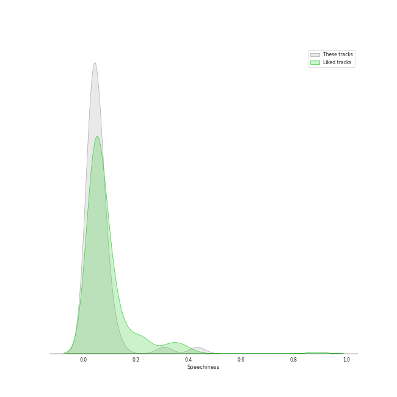
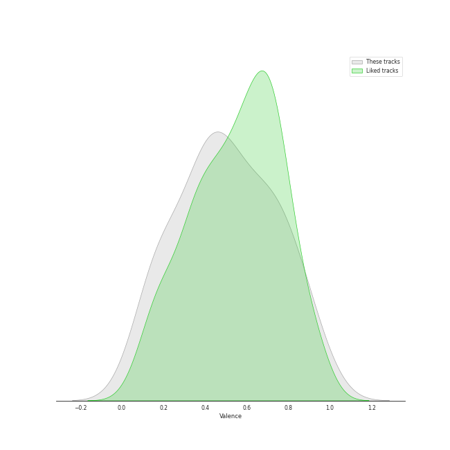

# Track Features for viral pop

## Danceability

| ​ | 10 most Danceable tracks | ​​ | 10 least Danceable tracks |
|:---|:---|:---|:---|
|  | There's Nothing Holdin' Me Back (0.866) |  | Run to You (0.24) |
|  | Rather Be (Clean Bandit Cover) (0.803) |  | Imagine (0.243) |
|  | Attention (0.775) |  | Say Something (0.249) |
|  | Finesse (0.763) |  | Over The Rainbow (0.266) |
|  | Señorita (0.759) |  | Can't Help Falling In Love (0.272) |
|  | Blueberry Eyes (feat. SUGA of BTS) (0.746) |  | If I Ever Fall In Love (feat. Jason Derulo) (0.314) |
|  | Sleigh Ride (0.746) |  | The Christmas Song (Chestnuts Roasting on an Open Fire) (0.317) |
|  | Can't Sleep Love (feat. Tink) (0.734) |  | Hallelujah (0.364) |
|  | Can't Sleep Love (0.73) |  | O Come, O Come Emmanuel (0.387) |
|  | We Don't Talk Anymore (feat. Selena Gomez) (0.728) |  | The Baddest Girl (0.394) |

## Energy

| ​ | 10 most Energetic tracks | ​​ | 10 least Energetic tracks |
|:---|:---|:---|:---|
|  | Finesse (0.836) |  | Run to You (0.0622) |
|  | There's Nothing Holdin' Me Back (0.811) |  | Say Something (0.147) |
|  | Me And My Broken Heart (0.783) |  | Over The Rainbow (0.155) |
|  | Hey Momma / Hit the Road Jack (0.767) |  | Can't Help Falling In Love (0.16) |
|  | Aha! (0.761) |  | Standing By (0.246) |
|  | YOUTH (0.737) |  | Say Something (0.248) |
|  | In My Blood (0.711) |  | Imagine (0.287) |
|  | Natural Disaster (0.71) |  | Mary, Did You Know? (0.312) |
|  | Starships (0.681) |  | IT'S YOU (feat. keshi) (0.328) |
|  | Papaoutai (Stromae Cover) (feat. Lindsey Stirling) (0.673) |  | O Come, O Come Emmanuel (0.329) |

## Speechiness

| ​ | 10 most Speechy tracks | ​​ | 10 least Speechy tracks |
|:---|:---|:---|:---|
|  | Hey Momma / Hit the Road Jack (0.433) |  | It's the Most Wonderful Time of the Year (0.0256) |
|  | Light Switch (0.308) |  | Mary, Did You Know? (0.0271) |
|  | We Don't Talk Anymore (feat. Selena Gomez) (0.134) |  | The Sound of Silence (0.0273) |
|  | Attention (0.107) |  | Havana (0.0287) |
|  | Blueberry Eyes (feat. SUGA of BTS) (0.101) |  | Señorita (0.0287) |
|  | Starships (0.0944) |  | Sleigh Ride (0.029) |
|  | Na Na Na (0.0833) |  | Over The Rainbow (0.0292) |
|  | Problem (Ariana Grande Cover) (0.0785) |  | The Christmas Song (Chestnuts Roasting on an Open Fire) (0.0294) |
|  | We Are Young (0.0735) |  | See Through (0.0296) |
|  | Natural Disaster (0.0718) |  | Standing By (0.0297) |

## Acousticness

| ​ | 10 most Acoustic tracks | ​​ | 10 least Acoustic tracks |
|:---|:---|:---|:---|
|  | Run to You (0.858) |  | I Need Your Love (0.00319) |
|  | Say Something (0.857) |  | Daft Punk (0.00403) |
|  | IT'S YOU (feat. keshi) (0.85) |  | Me And My Broken Heart (0.00489) |
|  | Valentine (0.806) |  | The Baddest Girl (0.00637) |
|  | The Christmas Song (Chestnuts Roasting on an Open Fire) (0.755) |  | Starships (0.0176) |
|  | Can't Help Falling In Love (0.729) |  | We Are Young (0.02) |
|  | O Come, O Come Emmanuel (0.725) |  | Hey Momma / Hit the Road Jack (0.0214) |
|  | Say Something (0.71) |  | Show You How to Love (0.0304) |
|  | Imagine (0.697) |  | La La Latch (Sam Smith/Disclosure/Naughty Boy Mashup) (0.033) |
|  | Over The Rainbow (0.651) |  | See Through (0.0355) |

## Instrumentalness

| ​ | 10 most Instrumental tracks | ​​ | 10 least Instrumental tracks |
|:---|:---|:---|:---|
|  | Dance of the Sugar Plum Fairy (0.079) |  | Natural Disaster (0.0) |
|  | Blueberry Eyes (feat. SUGA of BTS) (0.000922) |  | Sleigh Ride (0.0) |
|  | O Come, O Come Emmanuel (0.000413) |  | Hallelujah (0.0) |
|  | Light Switch (0.000321) |  | The Sound of Silence (0.0) |
|  | IT'S YOU (feat. keshi) (0.00019) |  | Show You How to Love (0.0) |
|  | Standing By (6.11e-05) |  | Love Again (0.0) |
|  | Havana (3.23e-05) |  | Can't Sleep Love (feat. Tink) (0.0) |
|  | Valentine (3e-05) |  | Imagine (0.0) |
|  | Attention (2.33e-05) |  | Run to You (0.0) |
|  | Hey Momma / Hit the Road Jack (1.74e-05) |  | YOUTH (0.0) |

## Liveness

| ​ | 10 most Live tracks | ​​ | 10 least Live tracks |
|:---|:---|:---|:---|
|  | Starships (0.447) |  | Finesse (0.0503) |
|  | Havana (0.385) |  | Papaoutai (Stromae Cover) (feat. Lindsey Stirling) (0.0551) |
|  | Let It Go (0.384) |  | I Need Your Love (0.0741) |
|  | See Through (0.37) |  | Hey Momma / Hit the Road Jack (0.0747) |
|  | The Sound of Silence (0.368) |  | Rather Be (Clean Bandit Cover) (0.0748) |
|  | Hallelujah (0.339) |  | YOUTH (0.0777) |
|  | Dance of the Sugar Plum Fairy (0.335) |  | There's Nothing Holdin' Me Back (0.078) |
|  | Aha! (0.32) |  | Monster (Shawn Mendes & Justin Bieber) (0.0828) |
|  | If I Ever Fall In Love (feat. Jason Derulo) (0.314) |  | Sweater Weather (0.0879) |
|  | Radioactive (0.298) |  | Light Switch (0.0905) |

## Valence

| ​ | 10 most Happy tracks | ​​ | 10 least Happy tracks |
|:---|:---|:---|:---|
|  | There's Nothing Holdin' Me Back (0.969) |  | Say Something (0.0765) |
|  | Light Switch (0.905) |  | Say Something (0.0812) |
|  | Finesse (0.903) |  | Can't Help Falling In Love (0.142) |
|  | Sleigh Ride (0.87) |  | Imagine (0.161) |
|  | Na Na Na (0.862) |  | Standing By (0.171) |
|  | Natural Disaster (0.819) |  | Run to You (0.176) |
|  | Rockin' Around the Christmas Tree (0.809) |  | Mary, Did You Know? (0.178) |
|  | Attention (0.797) |  | Somebody That I Used to Know (0.202) |
|  | Havana (0.749) |  | Over The Rainbow (0.24) |
|  | Señorita (0.74) |  | The Sound of Silence (0.26) |

## Tempo

| ​ | 10 most Fast tracks | ​​ | 10 least Fast tracks |
|:---|:---|:---|:---|
|  | Attention (204.19) |  | Rockin' Around the Christmas Tree (75.523) |
|  | Hey Momma / Hit the Road Jack (203.068) |  | The Baddest Girl (77.861) |
|  | Light Switch (184.008) |  | The Christmas Song (Chestnuts Roasting on an Open Fire) (78.918) |
|  | Me And My Broken Heart (174.084) |  | Over The Rainbow (83.736) |
|  | Aha! (172.015) |  | Run to You (85.495) |
|  | Carol of the Bells (171.857) |  | Natural Disaster (88.033) |
|  | Valentine (151.876) |  | IT'S YOU (feat. keshi) (89.892) |
|  | Dance of the Sugar Plum Fairy (150.888) |  | Hallelujah (89.918) |
|  | Say Something (150.318) |  | The Sound of Silence (90.99) |
|  | O Come, O Come Emmanuel (149.984) |  | YOUTH (91.505) |
