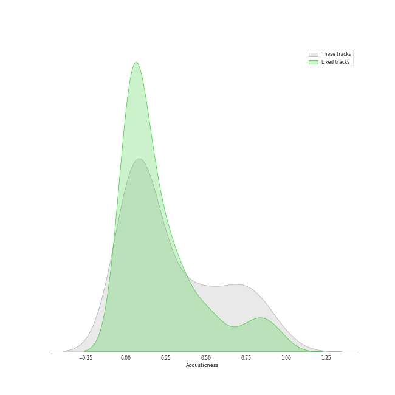
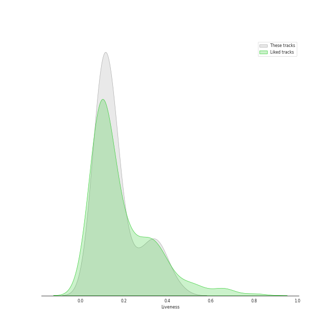

# Audio Features for viral pop

## Danceability

| 10 most Danceable tracks | 10 least Danceable tracks |
|:---|:---|
| There's Nothing Holdin' Me Back (0.866) | Run to You (0.24) |
| Rather Be (Clean Bandit Cover) (0.803) | Imagine (0.243) |
| Attention (0.775) | Say Something (0.249) |
| Finesse (0.763) | Over The Rainbow (0.266) |
| Señorita (0.759) | Can't Help Falling In Love (0.272) |
| Blueberry Eyes (feat. SUGA of BTS) (0.746) | The Christmas Song (Chestnuts Roasting on an Open Fire) (0.317) |
| Sleigh Ride (0.745) | Hallelujah (0.364) |
| Can't Sleep Love (feat. Tink) (0.734) | O Come, O Come Emmanuel (0.387) |
| Can't Sleep Love (0.73) | The Baddest Girl (0.394) |
| We Don't Talk Anymore (feat. Selena Gomez) (0.728) | If I Ever Fall In Love (feat. Jason Derulo) (0.403) |

## Energy

| 10 most Energetic tracks | 10 least Energetic tracks |
|:---|:---|
| Finesse (0.836) | Run to You (0.0622) |
| There's Nothing Holdin' Me Back (0.813) | Say Something (0.147) |
| Hey Momma / Hit the Road Jack (0.767) | Over The Rainbow (0.155) |
| Aha! (0.761) | Can't Help Falling In Love (0.16) |
| YOUTH (0.737) | Standing By (0.246) |
| In My Blood (0.712) | Say Something (0.248) |
| Natural Disaster (0.71) | Imagine (0.287) |
| Starships (0.681) | Mary, Did You Know? (0.312) |
| Papaoutai (Stromae Cover) (feat. Lindsey Stirling) (0.673) | O Come, O Come Emmanuel (0.329) |
| We Are Young (0.639) | The Christmas Song (Chestnuts Roasting on an Open Fire) (0.355) |

## Speechiness

| 10 most Speechy tracks | 10 least Speechy tracks |
|:---|:---|
| Hey Momma / Hit the Road Jack (0.433) | It's the Most Wonderful Time of the Year (0.0256) |
| Light Switch (0.308) | Mary, Did You Know? (0.0269) |
| We Don't Talk Anymore (feat. Selena Gomez) (0.134) | The Sound of Silence (0.0273) |
| Attention (0.107) | Havana (0.0287) |
| Blueberry Eyes (feat. SUGA of BTS) (0.101) | Señorita (0.0287) |
| Starships (0.0944) | Sleigh Ride (0.029) |
| Na Na Na (0.0833) | Over The Rainbow (0.0292) |
| Problem (Ariana Grande Cover) (0.0785) | The Christmas Song (Chestnuts Roasting on an Open Fire) (0.0294) |
| We Are Young (0.0735) | Standing By (0.0297) |
| Natural Disaster (0.0718) | See Through (0.0298) |

## Acousticness

| 10 most Acoustic tracks | 10 least Acoustic tracks |
|:---|:---|
| Run to You (0.858) | I Need Your Love (0.00319) |
| Say Something (0.857) | Daft Punk (0.00403) |
| Valentine (0.806) | The Baddest Girl (0.00637) |
| The Christmas Song (Chestnuts Roasting on an Open Fire) (0.755) | Starships (0.0176) |
| Can't Help Falling In Love (0.729) | We Are Young (0.02) |
| O Come, O Come Emmanuel (0.725) | Hey Momma / Hit the Road Jack (0.0214) |
| Say Something (0.71) | Show You How to Love (0.0304) |
| Imagine (0.697) | La La Latch (Sam Smith/Disclosure/Naughty Boy Mashup) (0.033) |
| Over The Rainbow (0.651) | See Through (0.0362) |
| We Don't Talk Anymore (feat. Selena Gomez) (0.621) | Papaoutai (Stromae Cover) (feat. Lindsey Stirling) (0.0373) |

## Instrumentalness

| 10 most Instrumental tracks | 10 least Instrumental tracks |
|:---|:---|
| Dance of the Sugar Plum Fairy (0.079) | Natural Disaster (0.0) |
| Blueberry Eyes (feat. SUGA of BTS) (0.000922) | Sleigh Ride (0.0) |
| O Come, O Come Emmanuel (0.000413) | Hallelujah (0.0) |
| Light Switch (0.000321) | The Sound of Silence (0.0) |
| Standing By (5.54e-05) | Show You How to Love (0.0) |
| Havana (3.23e-05) | Love Again (0.0) |
| Valentine (3e-05) | Can't Sleep Love (feat. Tink) (0.0) |
| Attention (2.33e-05) | Imagine (0.0) |
| Hey Momma / Hit the Road Jack (1.74e-05) | Run to You (0.0) |
| Problem (Ariana Grande Cover) (5.92e-06) | YOUTH (0.0) |

## Liveness

| 10 most Live tracks | 10 least Live tracks |
|:---|:---|
| Starships (0.447) | Finesse (0.0503) |
| Havana (0.385) | Papaoutai (Stromae Cover) (feat. Lindsey Stirling) (0.0551) |
| Let It Go (0.384) | I Need Your Love (0.0741) |
| See Through (0.37) | Hey Momma / Hit the Road Jack (0.0747) |
| The Sound of Silence (0.368) | Rather Be (Clean Bandit Cover) (0.0748) |
| Hallelujah (0.339) | YOUTH (0.0777) |
| Dance of the Sugar Plum Fairy (0.334) | There's Nothing Holdin' Me Back (0.0779) |
| Aha! (0.32) | Monster (Shawn Mendes & Justin Bieber) (0.0828) |
| If I Ever Fall In Love (feat. Jason Derulo) (0.314) | Sweater Weather (0.0879) |
| Radioactive (0.298) | Light Switch (0.0905) |

## Valence

| 10 most Happy tracks | 10 least Happy tracks |
|:---|:---|
| There's Nothing Holdin' Me Back (0.969) | Say Something (0.0765) |
| Light Switch (0.905) | Say Something (0.0812) |
| Finesse (0.903) | Can't Help Falling In Love (0.142) |
| Sleigh Ride (0.87) | Standing By (0.159) |
| Na Na Na (0.862) | Imagine (0.161) |
| Natural Disaster (0.819) | Run to You (0.176) |
| Rockin' Around the Christmas Tree (0.809) | Mary, Did You Know? (0.177) |
| Attention (0.797) | Somebody That I Used to Know (0.202) |
| Havana (0.749) | Over The Rainbow (0.24) |
| Señorita (0.74) | The Sound of Silence (0.26) |

## Tempo

| 10 most Fast tracks | 10 least Fast tracks |
|:---|:---|
| Attention (204.19) | Rockin' Around the Christmas Tree (75.523) |
| Hey Momma / Hit the Road Jack (203.068) | The Baddest Girl (77.861) |
| Light Switch (184.008) | The Christmas Song (Chestnuts Roasting on an Open Fire) (78.918) |
| Aha! (172.015) | Over The Rainbow (83.736) |
| Carol of the Bells (171.857) | Run to You (85.495) |
| Valentine (151.876) | Natural Disaster (88.033) |
| Say Something (150.318) | Hallelujah (89.918) |
| O Come, O Come Emmanuel (149.984) | The Sound of Silence (90.99) |
| Blueberry Eyes (feat. SUGA of BTS) (149.967) | YOUTH (91.507) |
| Dance of the Sugar Plum Fairy (149.876) | Can't Sleep Love (feat. Tink) (94.524) |
