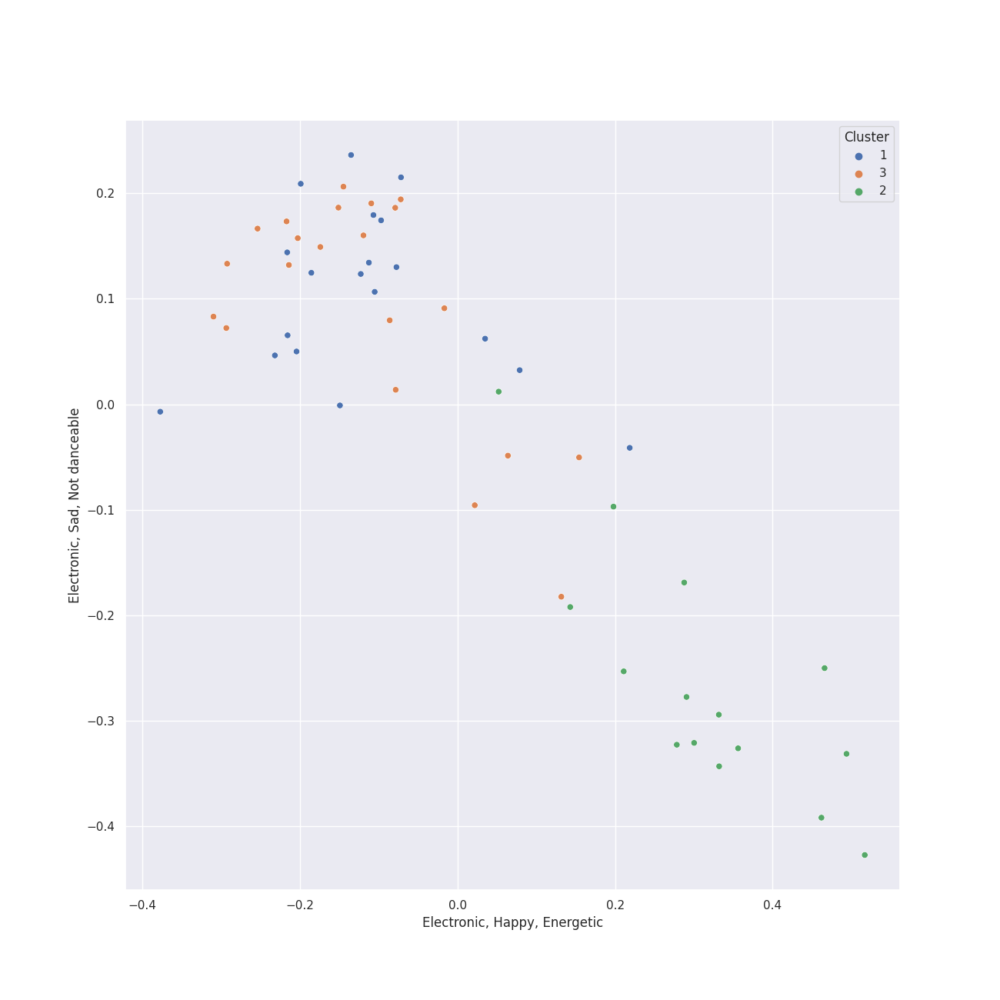

# Clusters in viral pop

## Cluster #1

18 tracks

| Art | Track | Album | Artists | Label | Rank | 💚 | 🔗 |
|:---|:---|:---|:---|:---|---:|:---|:---|
|  | Hey Momma / Hit the Road Jack | PTX, Vol. 2 | [Pentatonix](../../../../artists/pentatonix/overview.md) | [RCA Records Label](../../../../labels/rca_records_label) | nan | | [🔗](https://open.spotify.com/track/2wUZek0zWyw5mGKoT8mRcG) |
|  | Daft Punk | PTX, Vol. 2 | [Pentatonix](../../../../artists/pentatonix/overview.md) | [RCA Records Label](../../../../labels/rca_records_label) | nan | 💚 | [🔗](https://open.spotify.com/track/6ukvsBzq4d1vBsAUmz7ZVt) |
|  | It's the Most Wonderful Time of the Year | That's Christmas To Me (Deluxe Edition) | [Pentatonix](../../../../artists/pentatonix/overview.md) | [RCA Records Label](../../../../labels/rca_records_label) | nan | | [🔗](https://open.spotify.com/track/4DXJt41B9ZPh3UmxiPkBT0) |
|  | Na Na Na | Pentatonix (Deluxe Version) | [Pentatonix](../../../../artists/pentatonix/overview.md) | [RCA Records Label](../../../../labels/rca_records_label) | nan | | [🔗](https://open.spotify.com/track/6v08G3CGcoyiODIWZoOxR4) |
|  | Problem (Ariana Grande Cover) | PTX, Vol. III | [Pentatonix](../../../../artists/pentatonix/overview.md) | [RCA Records Label](../../../../labels/rca_records_label) | 397 | 💚 | [🔗](https://open.spotify.com/track/45h4cCw7ccsRXb0Orle2an) |
|  | Rather Be (Clean Bandit Cover) | PTX, Vol. III | [Pentatonix](../../../../artists/pentatonix/overview.md) | [RCA Records Label](../../../../labels/rca_records_label) | nan | 💚 | [🔗](https://open.spotify.com/track/4hxemf0pE0mSzubgsfRLWu) |
|  | Rockin' Around the Christmas Tree | Christmas Is Here! | [Pentatonix](../../../../artists/pentatonix/overview.md) | [RCA Records Label](../../../../labels/rca_records_label) | nan | | [🔗](https://open.spotify.com/track/3Fu6XvAT5yjzO8GMcvuM1s) |
|  | Light Switch | CHARLIE | Charlie Puth | [Atlantic Records](../../../../labels/atlantic_records) | nan | 💚 | [🔗](https://open.spotify.com/track/1jEBSDN5vYViJQr78W7jr2) |
|  | Attention | Voicenotes | Charlie Puth | Artist Partner | nan | 💚 | [🔗](https://open.spotify.com/track/5cF0dROlMOK5uNZtivgu50) |
|  | Señorita | Romance | Shawn Mendes, [Camila Cabello](../../../../artists/camila_cabello/overview.md) | [Epic](../../../../labels/epic), [Syco Music](../../../../labels/syco_music) | 650 | 💚 | [🔗](https://open.spotify.com/track/3BVgrFWuH01GmCUy9Y2EE8) |
## Cluster #2

16 tracks

| Art | Track | Album | Artists | Label | Rank | 💚 | 🔗 |
|:---|:---|:---|:---|:---|---:|:---|:---|
|  | If I Ever Fall In Love (feat. Jason Derulo) | Pentatonix (Deluxe Version) | [Pentatonix](../../../../artists/pentatonix/overview.md), [Jason Derulo](../../../../artists/jason_derulo/overview.md) | [RCA Records Label](../../../../labels/rca_records_label) | nan | 💚 | [🔗](https://open.spotify.com/track/3vaWsG3oKZt0bSra2p5c5R) |
|  | Imagine | PTX Vol. IV - Classics | [Pentatonix](../../../../artists/pentatonix/overview.md) | [RCA Records Label](../../../../labels/rca_records_label) | 696 | 💚 | [🔗](https://open.spotify.com/track/1UaTmLT3nB1sNBfv1hkqU1) |
|  | Can't Help Falling In Love | PTX Vol. IV - Classics | [Pentatonix](../../../../artists/pentatonix/overview.md) | [RCA Records Label](../../../../labels/rca_records_label) | nan | 💚 | [🔗](https://open.spotify.com/track/1xKScU3i8ho0OIhNoC5YW9) |
|  | Over The Rainbow | PTX Vol. IV - Classics | [Pentatonix](../../../../artists/pentatonix/overview.md) | [RCA Records Label](../../../../labels/rca_records_label) | nan | | [🔗](https://open.spotify.com/track/7MefjVBQqdV6XRXBlWejTQ) |
|  | Say Something | PTX | [Pentatonix](../../../../artists/pentatonix/overview.md) | [RCA Records Label](../../../../labels/rca_records_label) | nan | | [🔗](https://open.spotify.com/track/2SrJ0Iw6GobiRGyh2XKZhV) |
|  | Standing By | PTX, Vol. III | [Pentatonix](../../../../artists/pentatonix/overview.md) | [RCA Records Label](../../../../labels/rca_records_label) | nan | | [🔗](https://open.spotify.com/track/2ZtMNYog671T0UFfp0hhWq) |
|  | The Christmas Song (Chestnuts Roasting on an Open Fire) | PTXmas (Deluxe Edition) | [Pentatonix](../../../../artists/pentatonix/overview.md) | [RCA Records Label](../../../../labels/rca_records_label) | nan | | [🔗](https://open.spotify.com/track/3M2xVmqG5GgthkaRJBntBk) |
|  | O Come, O Come Emmanuel | PTXmas (Deluxe Edition) | [Pentatonix](../../../../artists/pentatonix/overview.md) | [RCA Records Label](../../../../labels/rca_records_label) | nan | | [🔗](https://open.spotify.com/track/4eKD9QhFqvwA4ilUAkQAbI) |
|  | Skinny Love | Birdy | Birdy | Atlantic Records UK | nan | 💚 | [🔗](https://open.spotify.com/track/4RL77hMWUq35NYnPLXBpih) |
|  | Say Something | Is There Anybody Out There? | A Great Big World, Christina Aguilera | [Epic](../../../../labels/epic) | nan | 💚 | [🔗](https://open.spotify.com/track/6Vc5wAMmXdKIAM7WUoEb7N) |
## Cluster #3

22 tracks

| Art | Track | Album | Artists | Label | Rank | 💚 | 🔗 |
|:---|:---|:---|:---|:---|---:|:---|:---|
|  | Love Again | PTX, Vol. 2 | [Pentatonix](../../../../artists/pentatonix/overview.md) | [RCA Records Label](../../../../labels/rca_records_label) | nan | | [🔗](https://open.spotify.com/track/0vcyzDe6aoYTg6jM0U0T9r) |
|  | Show You How to Love | PTX, Vol. 1 | [Pentatonix](../../../../artists/pentatonix/overview.md) | [RCA Records Label](../../../../labels/rca_records_label) | nan | | [🔗](https://open.spotify.com/track/0jExzGwfnZ1vTuCVB7w3vM) |
|  | We Are Young | PTX, Vol. 1 | [Pentatonix](../../../../artists/pentatonix/overview.md) | [RCA Records Label](../../../../labels/rca_records_label) | nan | 💚 | [🔗](https://open.spotify.com/track/5mMoySkxdUWlTw6X2l4egi) |
|  | Can't Sleep Love (feat. Tink) | Pentatonix (Deluxe Version) | [Pentatonix](../../../../artists/pentatonix/overview.md), Tink | [RCA Records Label](../../../../labels/rca_records_label) | nan | 💚 | [🔗](https://open.spotify.com/track/1GXFYdKM6MNrogE2PacpKe) |
|  | Can't Sleep Love | Pentatonix (Deluxe Version) | [Pentatonix](../../../../artists/pentatonix/overview.md) | [RCA Records Label](../../../../labels/rca_records_label) | nan | | [🔗](https://open.spotify.com/track/1klGbW5a9qTBFUjFfddbmU) |
|  | Papaoutai (Stromae Cover) (feat. Lindsey Stirling) | PTX, Vol. III | [Pentatonix](../../../../artists/pentatonix/overview.md), [Lindsey Stirling](../../../../artists/lindsey_stirling/overview.md) | [RCA Records Label](../../../../labels/rca_records_label) | nan | 💚 | [🔗](https://open.spotify.com/track/4LeTorR5FyWgxM3zZI7Qii) |
|  | La La Latch (Sam Smith/Disclosure/Naughty Boy Mashup) | PTX, Vol. III | [Pentatonix](../../../../artists/pentatonix/overview.md) | [RCA Records Label](../../../../labels/rca_records_label) | nan | 💚 | [🔗](https://open.spotify.com/track/6fOqEAXCwboCO4BdzbZG1K) |
|  | Sweater Weather | Christmas Is Here! | [Pentatonix](../../../../artists/pentatonix/overview.md) | [RCA Records Label](../../../../labels/rca_records_label) | nan | | [🔗](https://open.spotify.com/track/50YYe94G19kWVyhzdEXxki) |
|  | In My Blood | Shawn Mendes | Shawn Mendes | [Island Records](../../../../labels/island_records) | nan | | [🔗](https://open.spotify.com/track/2QZ7WLBE8h2y1Y5Fb8RYbH) |
|  | Monster (Shawn Mendes & Justin Bieber) | Monster | Shawn Mendes, [Justin Bieber](../../../../artists/justin_bieber/overview.md) | [Shawn Mendes LP4-5 PS/ Island](../../../../labels/island_records) | nan | | [🔗](https://open.spotify.com/track/2Z8yfpFX0ZMavHkcIeHiO1) |