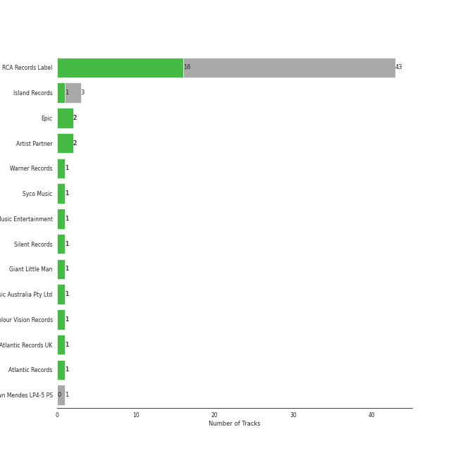

# viral pop

[53 songs](tracks.md)

[See Audio Features](audio_features.md)

## Top Artists

| Art | Tracks | 💚 | Artist | 🔗 |
|:---|---:|---:|:---|:---|
|  | 43 | 16 | [Pentatonix](../../artists/pentatonix/overview.md) | [🔗](https://open.spotify.com/artist/26AHtbjWKiwYzsoGoUZq53) |
|  | 3 | 3 | Charlie Puth | [🔗](https://open.spotify.com/artist/6VuMaDnrHyPL1p4EHjYLi7) |
|  | 4 | 2 | Shawn Mendes | [🔗](https://open.spotify.com/artist/7n2wHs1TKAczGzO7Dd2rGr) |
|  | 2 | 2 | Lindsey Stirling | [🔗](https://open.spotify.com/artist/378dH6EszOLFShpRzAQkVM) |
|  | 1 | 1 | A Great Big World | [🔗](https://open.spotify.com/artist/5xKp3UyavIBUsGy3DQdXeF) |
|  | 1 | 1 | Tink | [🔗](https://open.spotify.com/artist/4v6XOdonnfpdTKTRJArG7v) |
|  | 1 | 1 | Camila Cabello | [🔗](https://open.spotify.com/artist/4nDoRrQiYLoBzwC5BhVJzF) |
|  | 1 | 1 | Troye Sivan | [🔗](https://open.spotify.com/artist/3WGpXCj9YhhfX11TToZcXP) |
|  | 1 | 1 | Christina Aguilera | [🔗](https://open.spotify.com/artist/1l7ZsJRRS8wlW3WfJfPfNS) |
|  | 1 | 1 | MAX | [🔗](https://open.spotify.com/artist/1bqxdqvUtPWZri43cKHac8) |

See all 14 artists

| Art | Tracks | 💚 | Artist | 🔗 |
|:---|---:|---:|:---|:---|
|  | 1 | 1 | SUGA | [🔗](https://open.spotify.com/artist/0ebNdVaOfp6N0oZ1guIxM8) |
|  | 1 | 1 | Selena Gomez | [🔗](https://open.spotify.com/artist/0C8ZW7ezQVs4URX5aX7Kqx) |
|  | 1 | 1 | Jason Derulo | [🔗](https://open.spotify.com/artist/07YZf4WDAMNwqr4jfgOZ8y) |
|  | 1 | 0 | Justin Bieber | [🔗](https://open.spotify.com/artist/1uNFoZAHBGtllmzznpCI3s) |

## Top Albums

| Art | Tracks | 💚 | Album | Release Date | 🔗 |
|:---|---:|---:|:---|:---|:---|
|  | 7 | 3 | PTX, Vol. 2 | 2013-11-05 | [🔗](https://open.spotify.com/album/12dPqNFIdjiVFSHvtsDmzJ) |
|  | 6 | 4 | PTX, Vol. III | 2014-09-23 | [🔗](https://open.spotify.com/album/32y54TelUHSUDWVOx4h1B4) |
|  | 6 | 3 | PTX, Vol. 1 | 2012-06-26 | [🔗](https://open.spotify.com/album/5wGlP6EqF7akh6N3UGfKVZ) |
|  | 5 | 0 | That's Christmas To Me (Deluxe Edition) | 2015-10-30 | [🔗](https://open.spotify.com/album/082VlX7cBth0o8xqDGclNn) |
|  | 4 | 2 | Pentatonix (Deluxe Version) | 2015-10-16 | [🔗](https://open.spotify.com/album/6qf9tE8pNRW0kX1Cucrixr) |
|  | 3 | 2 | PTX Vol. IV - Classics | 2017-04-07 | [🔗](https://open.spotify.com/album/00JpoY0ZaQRXTNJUruibfX) |
|  | 3 | 1 | PTX Presents: Top Pop, Vol. I | 2018-04-13 | [🔗](https://open.spotify.com/album/2viOlnLfhPLDgx7hvBqLwW) |
|  | 3 | 0 | PTXmas (Deluxe Edition) | 2012-11-12 | [🔗](https://open.spotify.com/album/5ZwH7KH8Zw0m76hYwANMos) |
|  | 2 | 1 | PTX | 2014-09-19 | [🔗](https://open.spotify.com/album/77RBn8pRsfXlZdfTQh221D) |
|  | 2 | 0 | Christmas Is Here! | 2018-10-19 | [🔗](https://open.spotify.com/album/6thZNGX8hUVSjUrqJgPB9b) |

See all 22 albums

| Art | Tracks | 💚 | Album | Release Date | 🔗 |
|:---|---:|---:|:---|:---|:---|
|  | 1 | 1 | Voicenotes | 2018-05-11 | [🔗](https://open.spotify.com/album/0mZIUXje90JtHxPNzWsJNR) |
|  | 1 | 1 | Romance | 2019-12-06 | [🔗](https://open.spotify.com/album/3Vsbl0diFGw8HNSjG8ue9m) |
|  | 1 | 1 | Nine Track Mind | 2016-01-29 | [🔗](https://open.spotify.com/album/3kndSWeE2IYOrZEToZrHEV) |
|  | 1 | 1 | Is There Anybody Out There? | 2014-01-20 | [🔗](https://open.spotify.com/album/1yOcLa4euMk9sV7rRJ89Dl) |
|  | 1 | 1 | Illuminate (Deluxe) | 2017-04-20 | [🔗](https://open.spotify.com/album/3wBabo4pmzsYjALMSKY7Iq) |
|  | 1 | 1 | CHARLIE | 2022-10-06 | [🔗](https://open.spotify.com/album/5Jk4Eg7pxYhDrWJCVVzmMt) |
|  | 1 | 1 | Blueberry Eyes (feat. SUGA of BTS) | 2020-09-15 | [🔗](https://open.spotify.com/album/2dEJHnsuxIij7YeBbt0sVm) |
|  | 1 | 1 | Blue Neighbourhood (Deluxe) | 2015-12-04 | [🔗](https://open.spotify.com/album/5ouTDazE4LF9bVJPx1nlgW) |
|  | 1 | 0 | The Sound of Silence | 2019-02-15 | [🔗](https://open.spotify.com/album/2d5CHsmyOYGqfjDaPrdEzc) |
|  | 1 | 0 | Shawn Mendes | 2018-05-25 | [🔗](https://open.spotify.com/album/2VP96XdMOKTXefI8Nui23s) |
|  | 1 | 0 | Monster | 2020-11-20 | [🔗](https://open.spotify.com/album/3yVVL2EYLp8g7gT08VvYKy) |
|  | 1 | 0 | A Pentatonix Christmas Deluxe | 2017-12-06 | [🔗](https://open.spotify.com/album/3sId8sOH47yqOWopzbEtJn) |

## Top Record Labels

| Tracks | 💚 | Label |
|---:|---:|:---|
| 43 | 16 | [RCA Records Label](../../labels/rca_records_label/overview.md) |
| 2 | 2 | [Epic](../../labels/epic/overview.md) |
| 2 | 2 | Artist Partner |
| 3 | 1 | Island Records |
| 1 | 1 | [Syco Music](../../labels/syco_music/overview.md) |
| 1 | 1 | Sony Music Entertainment |
| 1 | 1 | EMI Recorded Music Australia Pty Ltd |
| 1 | 1 | Colour Vision Records |
| 1 | 1 | [Atlantic Records](../../labels/atlantic_records/overview.md) |
| 1 | 0 | Shawn Mendes LP4-5 PS |

## Years

| 10 newest albums | 10 oldest albums |
|:---|:---|
| 
 CHARLIE (2022-10-06)
 | 
 PTX, Vol. 1 (2012-06-26)
 |
| 
 Monster (2020-11-20)
 | 
 PTXmas (Deluxe Edition) (2012-11-12)
 |
| 
 Blueberry Eyes (feat. SUGA of BTS) (2020-09-15)
 | 
 PTX, Vol. 2 (2013-11-05)
 |
| 
 Romance (2019-12-06)
 | 
 Is There Anybody Out There? (2014-01-20)
 |
| 
 The Sound of Silence (2019-02-15)
 | 
 PTX (2014-09-19)
 |
| 
 Christmas Is Here! (2018-10-19)
 | 
 PTX, Vol. III (2014-09-23)
 |
| 
 Shawn Mendes (2018-05-25)
 | 
 Pentatonix (Deluxe Version) (2015-10-16)
 |
| 
 Voicenotes (2018-05-11)
 | 
 That's Christmas To Me (Deluxe Edition) (2015-10-30)
 |
| 
 PTX Presents: Top Pop, Vol. I (2018-04-13)
 | 
 Blue Neighbourhood (Deluxe) (2015-12-04)
 |
| 
 A Pentatonix Christmas Deluxe (2017-12-06)
 | 
 Nine Track Mind (2016-01-29)
 |