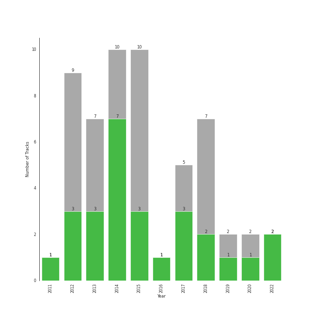

# viral pop

[116 songs](tracks.md)

[See Track Features](audio_features.md)

[See Clusters](clusters/overview.md)

## Top Artists

| Art | Tracks | 💚 | Artist | 🔗 |
|:---|---:|---:|:---|:---|
|  | 61 | 39 | [Sara Bareilles](../../artists/sara_bareilles/overview.md) | [🔗](https://open.spotify.com/artist/2Sqr0DXoaYABbjBo9HaMkM) |
|  | 43 | 16 | [Pentatonix](../../artists/pentatonix/overview.md) | [🔗](https://open.spotify.com/artist/26AHtbjWKiwYzsoGoUZq53) |
|  | 3 | 3 | Charlie Puth | [🔗](https://open.spotify.com/artist/6VuMaDnrHyPL1p4EHjYLi7) |
|  | 4 | 2 | Shawn Mendes | [🔗](https://open.spotify.com/artist/7n2wHs1TKAczGzO7Dd2rGr) |
|  | 2 | 2 | [Lindsey Stirling](../../artists/lindsey_stirling/overview.md) | [🔗](https://open.spotify.com/artist/378dH6EszOLFShpRzAQkVM) |
|  | 1 | 1 | A Great Big World | [🔗](https://open.spotify.com/artist/5xKp3UyavIBUsGy3DQdXeF) |
|  | 1 | 1 | Tink | [🔗](https://open.spotify.com/artist/4v6XOdonnfpdTKTRJArG7v) |
|  | 1 | 1 | [Camila Cabello](../../artists/camila_cabello/overview.md) | [🔗](https://open.spotify.com/artist/4nDoRrQiYLoBzwC5BhVJzF) |
|  | 1 | 1 | Troye Sivan | [🔗](https://open.spotify.com/artist/3WGpXCj9YhhfX11TToZcXP) |
|  | 1 | 1 | Birdy | [🔗](https://open.spotify.com/artist/2WX2uTcsvV5OnS0inACecP) |

See all 19 artists

| Art | Tracks | 💚 | Artist | 🔗 |
|:---|---:|---:|:---|:---|
|  | 1 | 1 | Christina Aguilera | [🔗](https://open.spotify.com/artist/1l7ZsJRRS8wlW3WfJfPfNS) |
|  | 1 | 1 | MAX | [🔗](https://open.spotify.com/artist/1bqxdqvUtPWZri43cKHac8) |
|  | 1 | 1 | Rixton | [🔗](https://open.spotify.com/artist/0kkxsdcaWmWU2yWAqclDh4) |
|  | 1 | 1 | SUGA | [🔗](https://open.spotify.com/artist/0ebNdVaOfp6N0oZ1guIxM8) |
|  | 1 | 1 | Selena Gomez | [🔗](https://open.spotify.com/artist/0C8ZW7ezQVs4URX5aX7Kqx) |
|  | 1 | 1 | [Jason Derulo](../../artists/jason_derulo/overview.md) | [🔗](https://open.spotify.com/artist/07YZf4WDAMNwqr4jfgOZ8y) |
|  | 1 | 0 | Jason Mraz | [🔗](https://open.spotify.com/artist/4phGZZrJZRo4ElhRtViYdl) |
|  | 1 | 0 | Brian D'Arcy James | [🔗](https://open.spotify.com/artist/3oYQrBzEQNpxnjWXP54B4n) |
|  | 1 | 0 | [Justin Bieber](../../artists/justin_bieber/overview.md) | [🔗](https://open.spotify.com/artist/1uNFoZAHBGtllmzznpCI3s) |

## Top Albums

| Art | Tracks | 💚 | Album | Release Date | 🔗 |
|:---|---:|---:|:---|:---|:---|
|  | 13 | 10 | Kaleidoscope Heart | 2010-09-07 | [🔗](https://open.spotify.com/album/627ukPRwYxyBREHxBq0vGJ) |
|  | 12 | 11 | The Blessed Unrest | 2013-07-16 | [🔗](https://open.spotify.com/album/7lpbyGc4fHsQkBTsfWVBhp) |
|  | 12 | 8 | Little Voice | 2007-07-03 | [🔗](https://open.spotify.com/album/2Z9WUERfMjOgQ6ze9TcGbF) |
|  | 10 | 5 | Amidst the Chaos (Bonus Version) | 2019-05-10 | [🔗](https://open.spotify.com/album/5x2sDapUIdq0qk1ezff3gm) |
|  | 7 | 3 | PTX, Vol. 2 | 2013-11-05 | [🔗](https://open.spotify.com/album/12dPqNFIdjiVFSHvtsDmzJ) |
|  | 6 | 4 | PTX, Vol. III | 2014-09-23 | [🔗](https://open.spotify.com/album/32y54TelUHSUDWVOx4h1B4) |
|  | 6 | 3 | PTX, Vol. 1 | 2012-06-26 | [🔗](https://open.spotify.com/album/5wGlP6EqF7akh6N3UGfKVZ) |
|  | 6 | 1 | What's Inside: Songs from Waitress | 2015-11-06 | [🔗](https://open.spotify.com/album/1s6codM2ZAB008t9GTyaEk) |
|  | 5 | 4 | Once Upon Another Time | 2012-05-22 | [🔗](https://open.spotify.com/album/1PrqYZJRzGNf8AsSOraxnZ) |
|  | 5 | 0 | That's Christmas To Me (Deluxe Edition) | 2015-10-30 | [🔗](https://open.spotify.com/album/082VlX7cBth0o8xqDGclNn) |

See all 33 albums

| Art | Tracks | 💚 | Album | Release Date | 🔗 |
|:---|---:|---:|:---|:---|:---|
|  | 4 | 2 | Pentatonix (Deluxe Version) | 2015-10-16 | [🔗](https://open.spotify.com/album/6qf9tE8pNRW0kX1Cucrixr) |
|  | 3 | 2 | PTX Vol. IV - Classics | 2017-04-07 | [🔗](https://open.spotify.com/album/00JpoY0ZaQRXTNJUruibfX) |
|  | 3 | 1 | PTX Presents: Top Pop, Vol. I | 2018-04-13 | [🔗](https://open.spotify.com/album/2viOlnLfhPLDgx7hvBqLwW) |
|  | 3 | 0 | PTXmas (Deluxe Edition) | 2012-11-12 | [🔗](https://open.spotify.com/album/5ZwH7KH8Zw0m76hYwANMos) |
|  | 2 | 1 | PTX | 2014-09-19 | [🔗](https://open.spotify.com/album/77RBn8pRsfXlZdfTQh221D) |
|  | 2 | 0 | Christmas Is Here! | 2018-10-19 | [🔗](https://open.spotify.com/album/6thZNGX8hUVSjUrqJgPB9b) |
|  | 1 | 1 | Voicenotes | 2018-05-11 | [🔗](https://open.spotify.com/album/0mZIUXje90JtHxPNzWsJNR) |
|  | 1 | 1 | Romance | 2019-12-06 | [🔗](https://open.spotify.com/album/3Vsbl0diFGw8HNSjG8ue9m) |
|  | 1 | 1 | Nine Track Mind | 2016-01-29 | [🔗](https://open.spotify.com/album/3kndSWeE2IYOrZEToZrHEV) |
|  | 1 | 1 | Let The Road | 2014-01-01 | [🔗](https://open.spotify.com/album/02ae5i5UAoFrt2peVox9Xd) |
|  | 1 | 1 | Is There Anybody Out There? | 2014-01-20 | [🔗](https://open.spotify.com/album/1yOcLa4euMk9sV7rRJ89Dl) |
|  | 1 | 1 | Illuminate (Deluxe) | 2017-04-20 | [🔗](https://open.spotify.com/album/3wBabo4pmzsYjALMSKY7Iq) |
|  | 1 | 1 | CHARLIE | 2022-10-06 | [🔗](https://open.spotify.com/album/5Jk4Eg7pxYhDrWJCVVzmMt) |
|  | 1 | 1 | Blueberry Eyes (feat. SUGA of BTS) | 2020-09-15 | [🔗](https://open.spotify.com/album/2dEJHnsuxIij7YeBbt0sVm) |
|  | 1 | 1 | Blue Neighbourhood (Deluxe) | 2015-12-04 | [🔗](https://open.spotify.com/album/5ouTDazE4LF9bVJPx1nlgW) |
|  | 1 | 1 | Birdy | 2011-11-04 | [🔗](https://open.spotify.com/album/1WGjSVIw0TVfbp5KrOFiP0) |
|  | 1 | 0 | The Sound of Silence | 2019-02-15 | [🔗](https://open.spotify.com/album/2d5CHsmyOYGqfjDaPrdEzc) |
|  | 1 | 0 | Shawn Mendes | 2018-05-25 | [🔗](https://open.spotify.com/album/2VP96XdMOKTXefI8Nui23s) |
|  | 1 | 0 | More Love - Songs from Little Voice Season One | 2020-09-04 | [🔗](https://open.spotify.com/album/52fzvqGSm991mT6pBgAS6g) |
|  | 1 | 0 | Monster | 2020-11-20 | [🔗](https://open.spotify.com/album/3yVVL2EYLp8g7gT08VvYKy) |
|  | 1 | 0 | Into The Woods (2022 Broadway Cast Recording) | 2022-09-30 | [🔗](https://open.spotify.com/album/5z6BFXI711HbSAXDjgOAHE) |
|  | 1 | 0 | Brave Enough: Live at the Variety Playhouse | 2013-10-22 | [🔗](https://open.spotify.com/album/7L4ZgnQqEhCEsV9GnMeXtE) |
|  | 1 | 0 | A Pentatonix Christmas Deluxe | 2017-12-06 | [🔗](https://open.spotify.com/album/3sId8sOH47yqOWopzbEtJn) |

## Top Record Labels

| Tracks | 💚 | Label |
|---:|---:|:---|
| 62 | 41 | [Epic](../../labels/epic/overview.md) |
| 43 | 16 | [RCA Records Label](../../labels/rca_records_label/overview.md) |
| 2 | 2 | Artist Partner |
| 3 | 1 | Island Records |
| 1 | 1 | [Syco Music](../../labels/syco_music/overview.md) |
| 1 | 1 | Sony Music Entertainment |
| 1 | 1 | Silent Records |
| 1 | 1 | Giant Little Man |
| 1 | 1 | EMI Recorded Music Australia Pty Ltd |
| 1 | 1 | Colour Vision Records |

See all 14 labels

| Tracks | 💚 | Label |
|---:|---:|:---|
| 1 | 1 | Atlantic Records UK |
| 1 | 1 | [Atlantic Records](../../labels/atlantic_records/overview.md) |
| 1 | 0 | Shawn Mendes LP4-5 PS |
| 1 | 0 | Craft Recordings |

## Top Producers

| Art | Producer | Tracks | Credit Types |
|:---|:---|---:|:---|
|  | [Sara Bareilles](../../artists/sara_bareilles/overview.md) | 30 | Lyricist, Songwriter, Producer |
| | John O'Mahony | 8 | Producer |
| | Kurt Uenala | 6 | Producer |
| | Neal Avron | 6 | Arranger, Producer |
| | Jason Wormer | 5 | Producer |
| | T-Bone Burnett | 5 | Producer |
| | Ben Bram | 4 | Songwriter, Arranger |
| | Jacob Kasher | 3 | Songwriter |
| | Manny Marroquin | 3 | Producer |
| | Mark Endert | 3 | Producer |

View all

| Art | Producer | Tracks | Credit Types |
|:---|:---|---:|:---|
| | Mitch Grassi | 3 | Songwriter |
| | Avi Kaplan | 3 | Songwriter |
|  | Charlie Puth | 3 | Producer, Songwriter |
| | Scott Hoying | 3 | Songwriter |
| | Jack Antonoff | 3 | Songwriter |
| | Kirstin | 3 | Songwriter |
| | Kevin Olusola | 3 | Songwriter |
|  | [Pentatonix](../../artists/pentatonix/overview.md) | 2 | Arranger |
| | Jimmy Napes | 2 | Songwriter |
|  | Shawn Mendes | 2 | Songwriter |
| | Matt Hales | 2 | Songwriter |
|  | [Camila Cabello](../../artists/camila_cabello/overview.md) | 2 | Songwriter |
| | Todor Kobakov | 2 | Arranger |
| | Jeremy Darby | 2 | Producer |
| | Jack Patterson | 2 | Songwriter |
| | Andrew Watt | 2 | Producer, Songwriter |
| | Mike Piersante | 2 | Producer |
| | Ali Tamposi | 2 | Songwriter |
| | Dan Reynolds | 1 | Songwriter |
|  | Nate Ruess | 1 | Songwriter |
| | Yoko Ono | 1 | Lyricist |
| | Suzie Katayama | 1 | Arranger |
|  | Stromae | 1 | Songwriter |
| | Zachary Dawes | 1 | Producer |
| | Jeff Bhasker | 1 | Songwriter |
| | Jason Blynn | 1 | Songwriter |
| | Kaan Gunesberk | 1 | Songwriter |
| | Starrah | 1 | Songwriter |
| | Jia Lih | 1 | Producer |
|  | [Ariana Grande](../../artists/ariana_grande/overview.md) | 1 | Songwriter |
| | Frank Dukes | 1 | Songwriter |
| | Imad Royal | 1 | Producer, Songwriter |
| | Luigi Creatore | 1 | Songwriter |
| | George David Weiss | 1 | Songwriter |
| | ILYA | 1 | Songwriter |
| | Elof Loelv | 1 | Songwriter |
| | Rogét Chahayed (Chahayed, Rogét) | 1 | Producer, Songwriter |
| | SLUMS | 1 | Producer |
|  | Troye Sivan | 1 | Songwriter |
| | Tommy Walter | 1 | Producer |
| | Serban Ghenea | 1 | Producer |
| | Javier Dunn | 1 | Songwriter |
| | Pete Harper | 1 | Songwriter |
| | Wayne Sermon | 1 | Songwriter |
| | Bram Inscore | 1 | Producer, Songwriter |
| | Aaron Sterling | 1 | Songwriter |
| | Savan Kotecha | 1 | Songwriter |
| | Chad Vaccarino | 1 | Songwriter |
| | Mike Campbell | 1 | Songwriter |
| | Ben McKee | 1 | Songwriter |
|  | Selena Gomez | 1 | Songwriter |
| | Patrick Benson | 1 | Producer |
| | Louis Bell | 1 | Songwriter |
| | Teddy Geiger | 1 | Songwriter |
| | Cashmere Cat | 1 | Producer, Songwriter |
| | Carl Lieberman, RPT | 1 | Producer |
|  | MAX | 1 | Songwriter |
|  | Charli XCX | 1 | Songwriter |
| | Joseph Lorge | 1 | Producer |
|  | Iggy Azalea | 1 | Songwriter |
| | Justin Tranter | 1 | Songwriter |
| | Paul LaMalfa | 1 | Producer |
| | Andrew Dost | 1 | Songwriter |
|  | [Imogen Heap](../../artists/imogen_heap/overview.md) | 1 | Lyricist, Songwriter |
| | 민윤기 (Min Yoon-gi) | 1 | Songwriter |
| | Zubin Thakkar | 1 | Producer |
| | Mike Anderson | 1 | Songwriter |
| | Guy Lawrence | 1 | Songwriter |
| | Eric Rosse | 1 | Producer |
| | John Hanes | 1 | Producer |
| | Hugo Peretti | 1 | Songwriter |
|  | Emily King | 1 | Songwriter |
| | Paul 'P Dub' Walton | 1 | Producer |
| | Teddy Peña (Peña, Teddy) | 1 | Songwriter |
|  | Pharrell Williams | 1 | Songwriter |
| | Mark "Spike" Stent | 1 | Producer |
| | Sampha | 1 | Songwriter |
| | Justin Vernon | 1 | Lyricist, Songwriter |
| | Alex da Kid | 1 | Songwriter |
| | Leland | 1 | Songwriter |
| | John Lennon | 1 | Lyricist, Songwriter |
| | Josh Mosser | 1 | Songwriter |
| | Scott Harris | 1 | Songwriter |
| | Jake Torrey | 1 | Songwriter |
| | Nikki Cislyn | 1 | Songwriter |
| | Lori McKenna | 1 | Songwriter |
|  | Young Thug | 1 | Songwriter |
| | Geoff Warburton | 1 | Songwriter |
| | Allie X | 1 | Songwriter |
| | Brian Lee | 1 | Songwriter |

## Years

| ​ | 10 newest albums | ​​ | 10 oldest albums |
|:---|:---|:---|:---|
|  | CHARLIE (2022-10-06) |  | Little Voice (2007-07-03) |
|  | Into The Woods (2022 Broadway Cast Recording) (2022-09-30) |  | Kaleidoscope Heart (2010-09-07) |
|  | Monster (2020-11-20) |  | Birdy (2011-11-04) |
|  | Blueberry Eyes (feat. SUGA of BTS) (2020-09-15) |  | Once Upon Another Time (2012-05-22) |
|  | More Love - Songs from Little Voice Season One (2020-09-04) |  | PTX, Vol. 1 (2012-06-26) |
|  | Romance (2019-12-06) |  | PTXmas (Deluxe Edition) (2012-11-12) |
|  | Amidst the Chaos (Bonus Version) (2019-05-10) |  | The Blessed Unrest (2013-07-16) |
|  | The Sound of Silence (2019-02-15) |  | Brave Enough: Live at the Variety Playhouse (2013-10-22) |
|  | Christmas Is Here! (2018-10-19) |  | PTX, Vol. 2 (2013-11-05) |
|  | Shawn Mendes (2018-05-25) |  | Let The Road (2014-01-01) |

