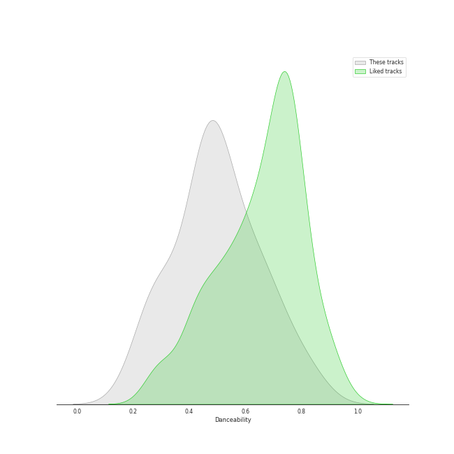
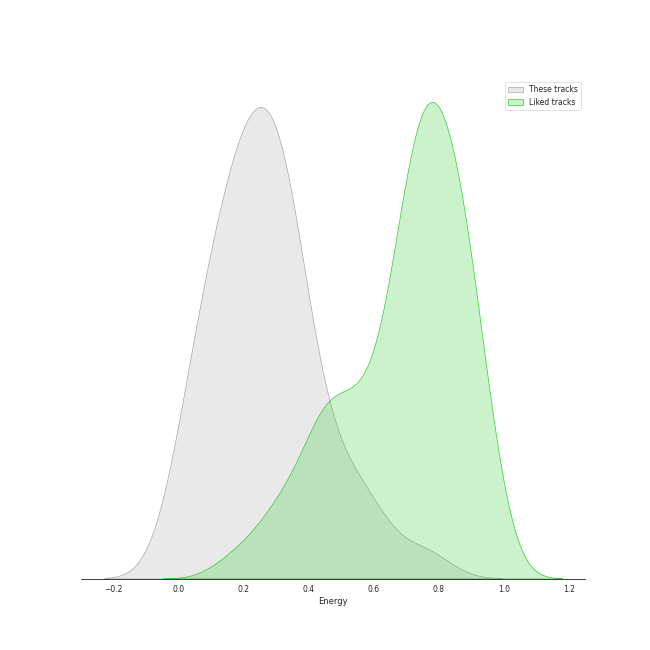
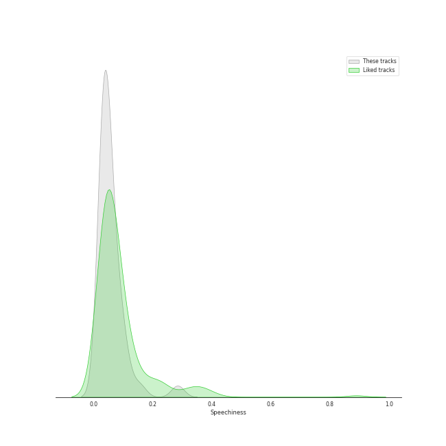
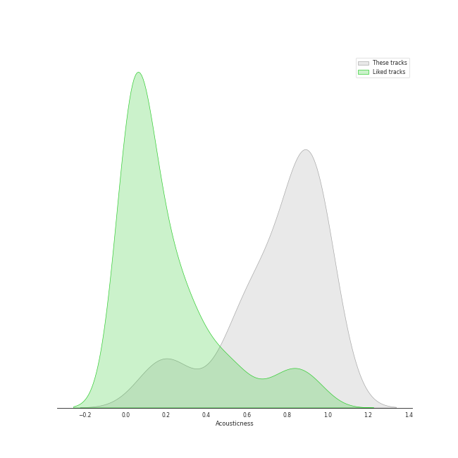
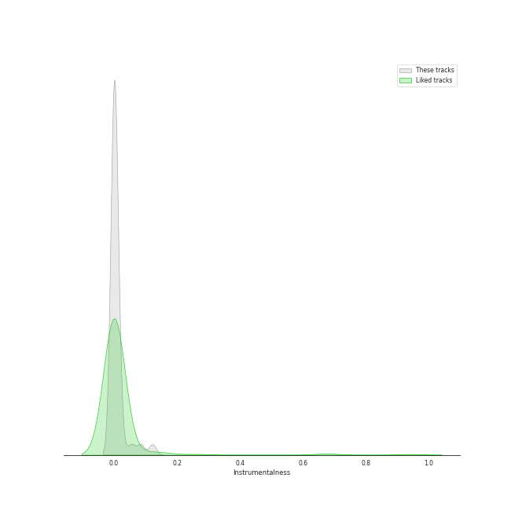
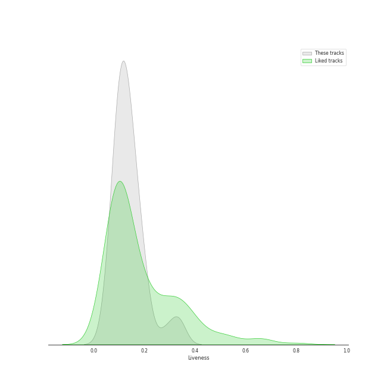
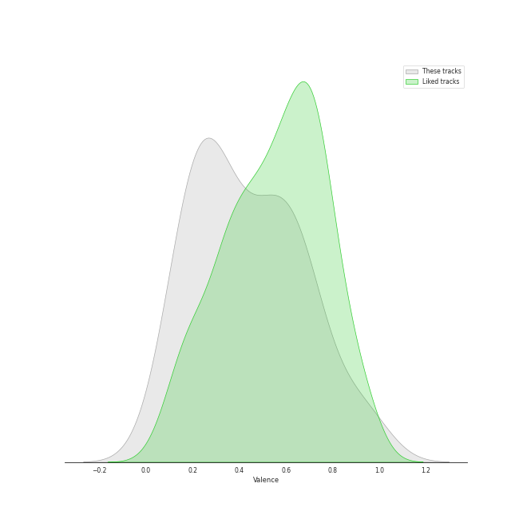
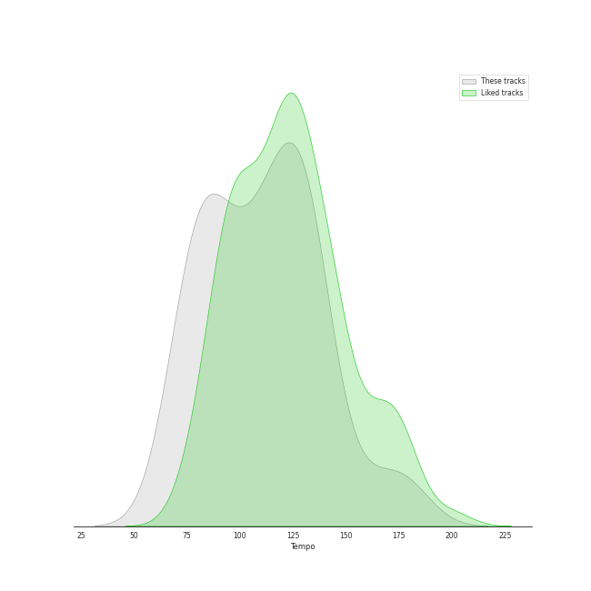

# Track Features for vocal jazz

## Danceability

| ​ | 10 most Danceable tracks | ​​ | 10 least Danceable tracks |
|:---|:---|:---|:---|
|  | Respect (0.805) |  | Nature Boy (0.203) |
|  | Baby It's Cold Outside (0.724) |  | Just Friends (0.203) |
|  | Santa Baby (0.704) |  | Stormy Weather (0.262) |
|  | Mack the Knife (0.673) |  | What A Wonderful World (0.271) |
|  | Cheek To Cheek (0.663) |  | At Last (0.274) |
|  | Agua De Beber (0.66) |  | Unforgettable (0.286) |
|  | The Girl From Ipanema (0.653) |  | The Christmas Song (Merry Christmas To You) (0.319) |
|  | Blue Moon (0.639) |  | Unforgettable (0.349) |
|  | Alexander Hamilton (0.609) |  | I'll Be Seeing You (0.355) |
|  | Something In The Air Between Us (0.591) |  | Beautiful Love (0.435) |

## Energy

| ​ | 10 most Energetic tracks | ​​ | 10 least Energetic tracks |
|:---|:---|:---|:---|
|  | Agua De Beber (0.759) |  | My Funny Valentine (0.00756) |
|  | Respect (0.558) |  | I'll Be Seeing You (0.0304) |
|  | Milestones (feat. John Coltrane, Cannonball Adderley, Red Garland, Paul Chambers & Philly Joe Jones) (0.546) |  | La vie en rose - Single Version (0.0406) |
|  | Wait for It (0.473) |  | I Fall In Love Too Easily (0.0657) |
|  | Alexander Hamilton (0.435) |  | Baby It's Cold Outside (0.0813) |
|  | I'd Rather Go Blind (0.433) |  | Nature Boy (0.0895) |
|  | Mack the Knife (0.377) |  | Santa Baby (0.103) |
|  | Beautiful Love (0.36) |  | Dream A Little Dream Of Me - Single Version (0.104) |
|  | Stormy Weather (0.356) |  | The Girl From Ipanema (0.149) |
|  | At Last (0.348) |  | Dream A Little Dream Of Me (0.154) |

## Speechiness

| ​ | 10 most Speechy tracks | ​​ | 10 least Speechy tracks |
|:---|:---|:---|:---|
|  | Alexander Hamilton (0.285) |  | I'd Rather Go Blind (0.0247) |
|  | Wait for It (0.157) |  | I Can't Make You Love Me (0.0273) |
|  | Dream A Little Dream Of Me - Single Version (0.101) |  | Unforgettable (0.028) |
|  | L-O-V-E - 2000 Remaster (0.0928) |  | At Last (0.0293) |
|  | Cheek To Cheek (0.0914) |  | Something In The Air Between Us (0.0295) |
|  | Dream A Little Dream Of Me (0.0839) |  | Stormy Weather (0.0303) |
|  | Blue Moon (0.0698) |  | Unforgettable (0.031) |
|  | Mack the Knife (0.0697) |  | In A Sentimental Mood (0.0316) |
|  | La vie en rose - Single Version (0.0635) |  | La Vie En Rose (0.0337) |
|  | Santa Baby (0.0607) |  | Milestones (feat. John Coltrane, Cannonball Adderley, Red Garland, Paul Chambers & Philly Joe Jones) (0.0341) |

## Acousticness

| ​ | 10 most Acoustic tracks | ​​ | 10 least Acoustic tracks |
|:---|:---|:---|:---|
|  | I'll Be Seeing You (0.989) |  | Wait for It (0.124) |
|  | Blue Moon (0.982) |  | Respect (0.164) |
|  | Nature Boy (0.971) |  | Agua De Beber (0.243) |
|  | Just Friends (0.952) |  | Milestones (feat. John Coltrane, Cannonball Adderley, Red Garland, Paul Chambers & Philly Joe Jones) (0.439) |
|  | My Funny Valentine (0.941) |  | Alexander Hamilton (0.522) |
|  | I Can't Make You Love Me (0.941) |  | L-O-V-E (0.543) |
|  | I Fall In Love Too Easily (0.94) |  | At Last (0.547) |
|  | In A Sentimental Mood (0.936) |  | Mack the Knife (0.586) |
|  | Baby It's Cold Outside (0.931) |  | Dream A Little Dream Of Me (0.604) |
|  | Something In The Air Between Us (0.925) |  | Stormy Weather (0.613) |

## Instrumentalness

| ​ | 10 most Instrumental tracks | ​​ | 10 least Instrumental tracks |
|:---|:---|:---|:---|
|  | Blue Moon (0.12) |  | Dream A Little Dream Of Me (0.0) |
|  | In A Sentimental Mood (0.0846) |  | Mack the Knife (0.0) |
|  | I'll Be Seeing You (0.0555) |  | La Vie En Rose (0.0) |
|  | Nature Boy (0.0213) |  | Santa Baby (0.0) |
|  | Unforgettable (0.0152) |  | Stormy Weather (0.0) |
|  | At Last (0.0133) |  | Cheek To Cheek (0.0) |
|  | My Funny Valentine (0.00643) |  | Dream A Little Dream Of Me (0.0) |
|  | I Fall In Love Too Easily (0.00488) |  | Baby, It's Cold Outside (0.0) |
|  | I Can't Make You Love Me (0.00309) |  | Alexander Hamilton (0.0) |
|  | Agua De Beber (0.00227) |  | Sleigh Ride (0.0) |

## Liveness

| ​ | 10 most Live tracks | ​​ | 10 least Live tracks |
|:---|:---|:---|:---|
|  | At Last (0.334) |  | Baby, It's Cold Outside (0.0513) |
|  | Mack the Knife (0.332) |  | Respect (0.0546) |
|  | Just Friends (0.281) |  | Agua De Beber (0.0756) |
|  | In A Sentimental Mood (0.208) |  | L-O-V-E - 2000 Remaster (0.0792) |
|  | Santa Baby (0.192) |  | Unforgettable (0.0798) |
|  | Dream A Little Dream Of Me - Single Version (0.191) |  | La vie en rose - Single Version (0.0845) |
|  | Let It Snow! Let It Snow! Let It Snow! (0.175) |  | Wait for It (0.0922) |
|  | Stormy Weather (0.175) |  | I Fall In Love Too Easily (0.0946) |
|  | Milestones (feat. John Coltrane, Cannonball Adderley, Red Garland, Paul Chambers & Philly Joe Jones) (0.167) |  | Something In The Air Between Us (0.0953) |
|  | Dream A Little Dream Of Me (0.163) |  | Breakfast on the Morning Tram (0.0973) |

## Valence

| ​ | 10 most Happy tracks | ​​ | 10 least Happy tracks |
|:---|:---|:---|:---|
|  | Respect (0.965) |  | Just Friends (0.0625) |
|  | L-O-V-E - 2000 Remaster (0.728) |  | Nature Boy (0.115) |
|  | Mack the Knife (0.713) |  | Unforgettable (0.142) |
|  | Let It Snow! Let It Snow! Let It Snow! (0.701) |  | Everything Happens to Me (0.164) |
|  | Agua De Beber (0.7) |  | Unforgettable (0.178) |
|  | Milestones (feat. John Coltrane, Cannonball Adderley, Red Garland, Paul Chambers & Philly Joe Jones) (0.7) |  | I'll Be Seeing You (0.188) |
|  | Cheek To Cheek (0.657) |  | La Vie En Rose (0.194) |
|  | Sleigh Ride (0.644) |  | Something In The Air Between Us (0.199) |
|  | Baby It's Cold Outside (0.626) |  | What A Wonderful World (0.203) |
|  | I'd Rather Go Blind (0.611) |  | The Christmas Song (Merry Christmas To You) (0.209) |

## Tempo

| ​ | 10 most Fast tracks | ​​ | 10 least Fast tracks |
|:---|:---|:---|:---|
|  | Stormy Weather (174.176) |  | La vie en rose - Single Version (70.138) |
|  | Nature Boy (173.451) |  | Dream A Little Dream Of Me - Single Version (76.497) |
|  | L-O-V-E - 2000 Remaster (157.47) |  | Just Friends (76.905) |
|  | Sleigh Ride (154.759) |  | What A Wonderful World (77.082) |
|  | Blue Train (136.098) |  | The Christmas Song (Merry Christmas To You) (78.696) |
|  | Unforgettable (136.094) |  | L-O-V-E (78.884) |
|  | Let It Snow! Let It Snow! Let It Snow! (134.009) |  | I'd Rather Go Blind (82.52) |
|  | La Vie En Rose (133.985) |  | Santa Baby (84.475) |
|  | My Funny Valentine (133.32) |  | Unforgettable (85.691) |
|  | Alexander Hamilton (131.995) |  | Wait for It (86.534) |
