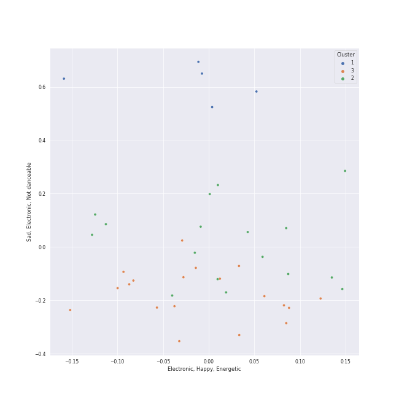

# Clusters in vocal jazz

## Cluster #1

6 tracks

| Art | Track | Album | Artists | Label | 💚 | 🔗 |
|:---|:---|:---|:---|:---|:---|:---|
|  | Respect | I Never Loved a Man the Way I Love You | Aretha Franklin | Rhino Atlantic | | [🔗](https://open.spotify.com/track/7s25THrKz86DM225dOYwnr) |
|  | Get Up (I Feel Like Being A) Sex Machine | Star Time | James Brown | [Universal/Island Def Jam](../../../../labels/universal_music_llc) | | [🔗](https://open.spotify.com/track/2ivdsb1RcEJjIs5tuHkUC9) |
|  | Papa's Got A Brand New Bag | Star Time | James Brown | [Universal/Island Def Jam](../../../../labels/universal_music_llc) | | [🔗](https://open.spotify.com/track/00pGV4EInVd77cnOIwPTCv) |
|  | Wait for It | Hamilton (Original Broadway Cast Recording) | Leslie Odom Jr., Original Broadway Cast of Hamilton | [Atlantic Records](../../../../labels/atlantic_records) | 💚 | [🔗](https://open.spotify.com/track/7EqpEBPOohgk7NnKvBGFWo) |
|  | Milestones (feat. John Coltrane, Cannonball Adderley, Red Garland, Paul Chambers & Philly Joe Jones) | Milestones | Miles Davis, John Coltrane, Cannonball Adderley, Red Garland, Paul Chambers, Philly Joe Jones | [Columbia](../../../../labels/columbia), [Legacy](../../../../labels/legacy) | | [🔗](https://open.spotify.com/track/1xicvSO4CJ2ymqYgpk7DFh) |
|  | Agua De Beber | Sophie Milman | Sophie Milman | Linus Entertainment Inc. | | [🔗](https://open.spotify.com/track/4ic2XfSYoMch7DrdNf2T3N) |
## Cluster #2

20 tracks

| Art | Track | Album | Artists | Label | 💚 | 🔗 |
|:---|:---|:---|:---|:---|:---|:---|
|  | I Fall In Love Too Easily | Chet Baker Sings | Chet Baker | Blue Note Records | | [🔗](https://open.spotify.com/track/0F845nujLVqCb0XMZCh5Pc) |
|  | Everything Happens to Me | Chet Baker Sings: It Could Happen To You [Original Jazz Classics Remasters] (OJC Remaster) | Chet Baker | Original Jazz Classics | | [🔗](https://open.spotify.com/track/4Y5fyQ5fBysC32Na5sZT3J) |
|  | In A Sentimental Mood | Duke Ellington & John Coltrane | Duke Ellington, John Coltrane | Impulse! | | [🔗](https://open.spotify.com/track/0E8q2Fx2XuzXCO2NSAppkR) |
|  | Dream A Little Dream Of Me | Ella: The Legendary Decca Recordings | Ella Fitzgerald, Louis Armstrong | Verve Reissues | 💚 | [🔗](https://open.spotify.com/track/0KBvapFwuz8gPKu6Gw23WN) |
|  | La vie en rose - Single Version | Satchmo Serenades | Louis Armstrong | Verve | | [🔗](https://open.spotify.com/track/0zDVclPMSsjeyvbnqhWOmt) |
|  | Unforgettable | Unforgettable | Nat King Cole | CAPITOL CATALOG MKT (C92) | | [🔗](https://open.spotify.com/track/648TTtYB0bH0P8Hfy0FmkL) |
|  | The Christmas Song (Merry Christmas To You) | The Christmas Song (Expanded Edition) | Nat King Cole | CAPITOL CATALOG MKT (C92) | | [🔗](https://open.spotify.com/track/4PS1e8f2LvuTFgUs1Cn3ON) |
|  | Unforgettable | Unforgettable: With Love | Natalie Cole, Nat King Cole | Craft Recordings | | [🔗](https://open.spotify.com/track/2MVQbDuhVs2muWFURtIdNb) |
|  | La Vie En Rose | Sophie Milman | Sophie Milman | Linus Entertainment Inc. | | [🔗](https://open.spotify.com/track/12kmgivtb8dyhxnko2doFt) |
|  | I Can't Make You Love Me | Take Love Easy | Sophie Milman | Linus Entertainment | | [🔗](https://open.spotify.com/track/4G5kuEKnYw2PFdLdYcZFWz) |
## Cluster #3

16 tracks

| Art | Track | Album | Artists | Label | 💚 | 🔗 |
|:---|:---|:---|:---|:---|:---|:---|
|  | Baby, It's Cold Outside | A Winter Romance | Dean Martin | [Capitol Records](../../../../labels/capitol_records) | | [🔗](https://open.spotify.com/track/4MrfQL4TYQXJBlZYpAHTuE) |
|  | Santa Baby | The Essential Eartha Kitt | Eartha Kitt | Legacy Recordings | | [🔗](https://open.spotify.com/track/1vZKP9XURuqMp1SpXGnoyb) |
|  | Sleigh Ride | Ella Wishes You A Swinging Christmas (Expanded Edition) | Ella Fitzgerald | Verve Reissues | | [🔗](https://open.spotify.com/track/4ukUoXLuFzMixyZyabSGc4) |
|  | Baby It's Cold Outside | Ella: The Legendary Decca Recordings | Ella Fitzgerald, Louis Jordan & His Tympany Five | Verve Reissues | | [🔗](https://open.spotify.com/track/5INjLnLJcfG22QkaLUMcZm) |
|  | Cheek To Cheek | The Complete Ella And Louis On Verve | Ella Fitzgerald, Louis Armstrong | Verve Reissues | | [🔗](https://open.spotify.com/track/33jt3kYWjQzqn3xyYQ5ZEh) |
|  | I'd Rather Go Blind | Tell Mama | Etta James | [Geffen](../../../../labels/geffen) | 💚 | [🔗](https://open.spotify.com/track/1kPBT8S2wJFNAyBMnGVZgL) |
|  | Blue Train | Blue Train | John Coltrane | Blue Note Records | | [🔗](https://open.spotify.com/track/3zIuHdD8dkh1vPxQu334T7) |
|  | L-O-V-E - 2000 Remaster | Romance | Nat King Cole | [UME - Global Clearing House](../../../../labels/ume_-_global_clearing_house) | | [🔗](https://open.spotify.com/track/6OHPdG4tYiHRPUHwf68nRU) |
|  | L-O-V-E | Unforgettable: With Love | Natalie Cole | Craft Recordings | | [🔗](https://open.spotify.com/track/637xWjdmJY7CAQJsnsT7Fs) |
|  | The Girl From Ipanema | Getz/Gilberto (Expanded Edition) | Stan Getz | Verve Reissues | | [🔗](https://open.spotify.com/track/7znjbX9XdoQayIrVNdd50Z) |