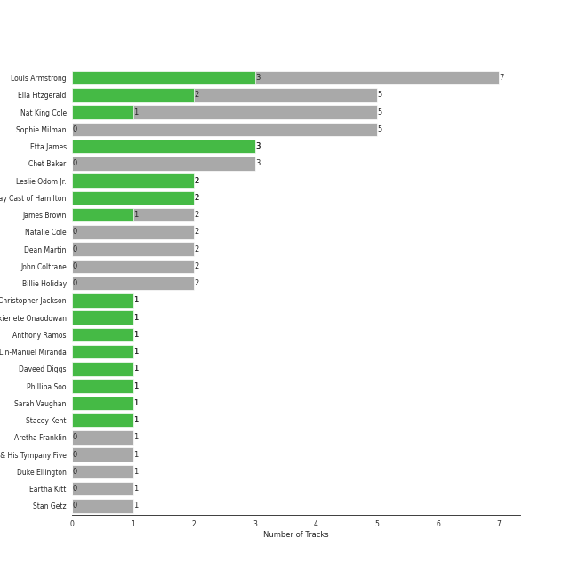
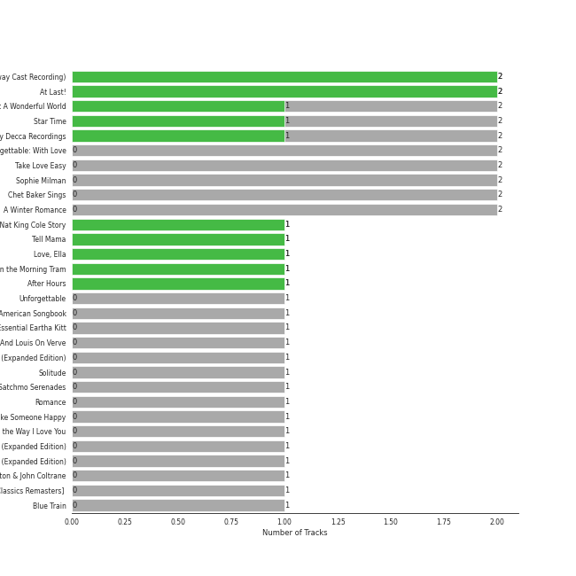
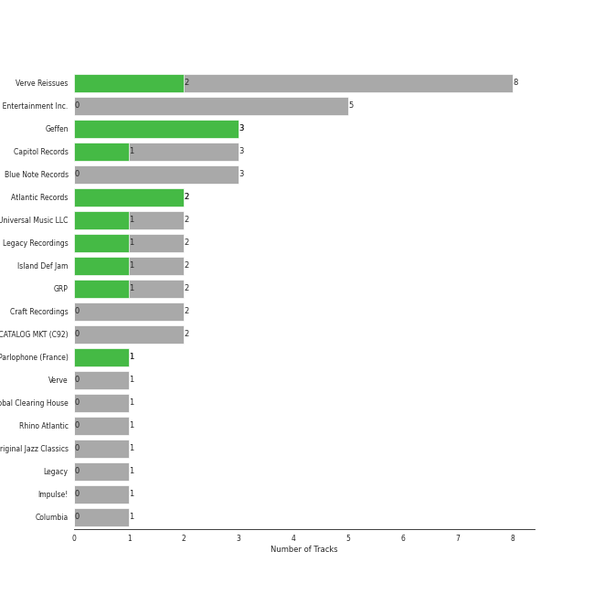

# vocal jazz

44 songs

[See Track Features](audio_features.md)

[See Clusters](clusters/overview.md)

## Top Artists

| Art | Rank | Tracks | 💚 | Artist | 🔗 |
|:---|---:|---:|---:|:---|:---|
|  | 278 | 7 | 3 | Louis Armstrong | [🔗](https://open.spotify.com/artist/19eLuQmk9aCobbVDHc6eek) |
|  | 368 | 3 | 3 | Etta James | [🔗](https://open.spotify.com/artist/0iOVhN3tnSvgDbcg25JoJb) |
|  | 236 | 5 | 2 | Ella Fitzgerald | [🔗](https://open.spotify.com/artist/5V0MlUE1Bft0mbLlND7FJz) |
|  | 430 | 2 | 2 | Leslie Odom Jr. | [🔗](https://open.spotify.com/artist/3cR4rhS2hBWqI7rJEBacvN) |
|  | 430 | 2 | 2 | Original Broadway Cast of Hamilton | [🔗](https://open.spotify.com/artist/3UUJfRbrA2nTbcg4i0MOwu) |
|  | 248 | 5 | 1 | Nat King Cole | [🔗](https://open.spotify.com/artist/7v4imS0moSyGdXyLgVTIV7) |
|  | 430 | 2 | 1 | James Brown | [🔗](https://open.spotify.com/artist/7GaxyUddsPok8BuhxN6OUW) |
|  | 430 | 1 | 1 | Christopher Jackson | [🔗](https://open.spotify.com/artist/6sLwRSXSUF5JTUnQaFenyj) |
| | 430 | 1 | 1 | Okieriete Onaodowan | [🔗](https://open.spotify.com/artist/6G3sPhnj4JBCsBVBGvZnkk) |
|  | 430 | 1 | 1 | Anthony Ramos | [🔗](https://open.spotify.com/artist/660YptcR0hNHJ8iEr1qcse) |

See all 28 artists

| Art | Rank | Tracks | 💚 | Artist | 🔗 |
|:---|---:|---:|---:|:---|:---|
|  | 430 | 1 | 1 | Lin-Manuel Miranda | [🔗](https://open.spotify.com/artist/4aXXDj9aZnlshx7mzj3W1N) |
|  | 430 | 1 | 1 | Daveed Diggs | [🔗](https://open.spotify.com/artist/3twuAojvYNrlWZpMkxLm3P) |
|  | 430 | 1 | 1 | Phillipa Soo | [🔗](https://open.spotify.com/artist/2OEGI2wrCVmvavKEOMlccy) |
|  | 430 | 1 | 1 | Sarah Vaughan | [🔗](https://open.spotify.com/artist/1bgyxtWjZwA5PQlDsvs9b8) |
|  | 430 | 1 | 1 | Stacey Kent | [🔗](https://open.spotify.com/artist/03EYBMnqSchCMp5D9qmFXi) |
|  | 430 | 5 | 0 | Sophie Milman | [🔗](https://open.spotify.com/artist/19GI8I4UhSpBl8Y9XpKyT4) |
|  | 235 | 3 | 0 | Chet Baker | [🔗](https://open.spotify.com/artist/3rxeQlsv0Sc2nyYaZ5W71T) |
|  | 313 | 3 | 0 | Marvin Gaye | [🔗](https://open.spotify.com/artist/3koiLjNrgRTNbOwViDipeA) |
|  | 430 | 2 | 0 | Natalie Cole | [🔗](https://open.spotify.com/artist/5tTsrGPwQRWUsHR2Xf7Ke9) |
|  | 413 | 2 | 0 | Dean Martin | [🔗](https://open.spotify.com/artist/49e4v89VmlDcFCMyDv9wQ9) |
|  | 382 | 2 | 0 | John Coltrane | [🔗](https://open.spotify.com/artist/2hGh5VOeeqimQFxqXvfCUf) |
|  | 178 | 2 | 0 | Billie Holiday | [🔗](https://open.spotify.com/artist/1YzCsTRb22dQkh9lghPIrp) |
|  | 430 | 1 | 0 | Aretha Franklin | [🔗](https://open.spotify.com/artist/7nwUJBm0HE4ZxD3f5cy5ok) |
|  | 430 | 1 | 0 | Tammi Terrell | [🔗](https://open.spotify.com/artist/75jNCko3SnEMI5gwGqrbb8) |
|  | 412 | 1 | 0 | Louis Jordan & His Tympany Five | [🔗](https://open.spotify.com/artist/62FPyLpIhmk27hBw6RHlhh) |
|  | 430 | 1 | 0 | Duke Ellington | [🔗](https://open.spotify.com/artist/4F7Q5NV6h5TSwCainz8S5A) |
|  | 349 | 1 | 0 | Eartha Kitt | [🔗](https://open.spotify.com/artist/1AwO9pWEBSBoWdEZu28XDC) |
|  | 430 | 1 | 0 | Stan Getz | [🔗](https://open.spotify.com/artist/0FMucZsEnCxs5pqBjHjIc8) |

## Most and least listened tracks
| Rank | ​ | Most listened tracks | Rank | ​​ | Least listened tracks |
|---:|:---|:---|---:|:---|:---|
| 430 |  | The Christmas Song (Merry Christmas To You) | 974 |  | The Girl From Ipanema |
| 455 |  | I'll Be Seeing You | 974 |  | Ain't No Mountain High Enough |
| 534 |  | Mack the Knife | 974 |  | Respect |
| 568 |  | Blue Moon | 974 |  | Wait for It |
| 691 |  | Santa Baby | 974 |  | Dream A Little Dream Of Me - Single Version |
| 776 |  | Stormy Weather | 974 |  | Just Friends |
| 783 |  | Cheek To Cheek | 974 |  | L-O-V-E - 2000 Remaster |
| 842 |  | Blue Train | 974 |  | Something In The Air Between Us |
| 923 |  | Baby It's Cold Outside | 974 |  | Unforgettable |
| 927 |  | Let It Snow! Let It Snow! Let It Snow! | 974 |  | L-O-V-E |

## Top Albums

| Art | Rank | Tracks | 💚 | Album | Release Date | 🔗 |
|:---|---:|---:|---:|:---|:---|:---|
|  | 643 | 2 | 2 | Hamilton (Original Broadway Cast Recording) | 2015-09-25 | [🔗](https://open.spotify.com/album/1kCHru7uhxBUdzkm4gzRQc) |
|  | 517 | 2 | 2 | At Last! | 1960 | [🔗](https://open.spotify.com/album/7rd4PorIOPjPTy7qdUeeCt) |
|  | 643 | 2 | 1 | What A Wonderful World | 1968-01-01 | [🔗](https://open.spotify.com/album/6mmv0gwumlFGWDGJXF4yEv) |
|  | 643 | 2 | 1 | Star Time | 1991-01-01 | [🔗](https://open.spotify.com/album/2yuTyv0L51qvYuI5RIktlA) |
|  | 615 | 2 | 1 | Ella: The Legendary Decca Recordings | 1995-08-29 | [🔗](https://open.spotify.com/album/0G5ZHFj5VmvIWEAuF8NEIT) |
|  | 643 | 2 | 0 | Unforgettable: With Love | 1991-06-11 | [🔗](https://open.spotify.com/album/4ilUfGGQXin7hr1srDDXF0) |
|  | 643 | 2 | 0 | Take Love Easy | 2009-05-05 | [🔗](https://open.spotify.com/album/0a7Ut6OPSs8SvPDhFXL4ar) |
|  | 643 | 2 | 0 | Sophie Milman | 2004-01-01 | [🔗](https://open.spotify.com/album/2g5alWoreAp8i1Jjz2XHr4) |
|  | 643 | 2 | 0 | Chet Baker Sings | 1956 | [🔗](https://open.spotify.com/album/5JJ779nrbHx0KB2lBrMMa4) |
|  | 614 | 2 | 0 | A Winter Romance | 1959-01-01 | [🔗](https://open.spotify.com/album/5I48ENiZiaZZSOpec6PdS5) |

See all 34 albums

| Art | Rank | Tracks | 💚 | Album | Release Date | 🔗 |
|:---|---:|---:|---:|:---|:---|:---|
|  | 643 | 1 | 1 | The Nat King Cole Story | 1961-09-25 | [🔗](https://open.spotify.com/album/3NoP1ifIejWkGSDsO9T2xH) |
|  | 643 | 1 | 1 | Tell Mama | 1968-04-18 | [🔗](https://open.spotify.com/album/4ReJ59T4YxC62WkfyVTWpr) |
|  | 643 | 1 | 1 | Love, Ella | 2007-05-03 | [🔗](https://open.spotify.com/album/1y5KGkUKO0NG32MhIIagCA) |
|  | 643 | 1 | 1 | Breakfast on the Morning Tram | 2007-09-03 | [🔗](https://open.spotify.com/album/5RwBI4pEinXbIiUhWzAMbX) |
|  | 643 | 1 | 1 | After Hours | 1955-04-12 | [🔗](https://open.spotify.com/album/3F0Q6zKxvJJbxWR4hZWcef) |
|  | 643 | 1 | 0 | United | 1967-08-29 | [🔗](https://open.spotify.com/album/5LqviduT0g0J0ypFrFSwCE) |
|  | 643 | 1 | 0 | Unforgettable | 1954-01-01 | [🔗](https://open.spotify.com/album/7GBvXtxnvBluo2f4xBVNkm) |
|  | 369 | 1 | 0 | The Great American Songbook | 1929 | [🔗](https://open.spotify.com/album/3AiEMTv9oFDRaDjqv93mOU) |
|  | 466 | 1 | 0 | The Essential Eartha Kitt | 2011-03-15 | [🔗](https://open.spotify.com/album/3YYxlTrYciDHu3j7E5wGrZ) |
|  | 525 | 1 | 0 | The Complete Ella And Louis On Verve | 1997-05-20 | [🔗](https://open.spotify.com/album/2uqlkJu6vckJahCsp6Hfcn) |
|  | 301 | 1 | 0 | The Christmas Song - Expanded Edition | 1962 | [🔗](https://open.spotify.com/album/6vBGI5522jvPi0ZZuGQNp4) |
|  | 387 | 1 | 0 | Solitude | 1956-01-01 | [🔗](https://open.spotify.com/album/4izD3SCRElbkO06i8yf4Zp) |
|  | 643 | 1 | 0 | Satchmo Serenades | 1952-04-01 | [🔗](https://open.spotify.com/album/17fcllu2aPjrx4ZCm05jMc) |
|  | 643 | 1 | 0 | Romance | 2021-02-12 | [🔗](https://open.spotify.com/album/5MuNxtOyex8o77Qdjaqeng) |
|  | 643 | 1 | 0 | Make Someone Happy | 2007-01-01 | [🔗](https://open.spotify.com/album/2oGYlZ7vte6lJ1MuwKKCeW) |
|  | 643 | 1 | 0 | Let's Get It On | 1973-08-28 | [🔗](https://open.spotify.com/album/1oIICL75sMuInkEhX8jj3b) |
|  | 643 | 1 | 0 | In The Groove | 1968-08-26 | [🔗](https://open.spotify.com/album/36VMWZPLjg9rucvMxdA2Pz) |
|  | 643 | 1 | 0 | I Never Loved a Man the Way I Love You | 1967-03-10 | [🔗](https://open.spotify.com/album/5WndWfzGwCkHzAbQXVkg2V) |
|  | 643 | 1 | 0 | Getz/Gilberto - Expanded Edition | 1964-03-01 | [🔗](https://open.spotify.com/album/2W6Hvrtg2Zpc9dW4aBDbdP) |
|  | 643 | 1 | 0 | Ella Wishes You A Swinging Christmas - Expanded Edition | 1960-01-01 | [🔗](https://open.spotify.com/album/2UhPCUgK2IGUrg7lIvMYfb) |
|  | 643 | 1 | 0 | Duke Ellington & John Coltrane | 1963-02 | [🔗](https://open.spotify.com/album/1OvmilWKtrabJGEpPRlgK5) |
|  | 643 | 1 | 0 | Chet Baker Sings: It Could Happen To You [Original Jazz Classics Remasters] (OJC Remaster) | 2010-01-01 | [🔗](https://open.spotify.com/album/05GsIfSvuy3bSY5EodA0Cc) |
|  | 558 | 1 | 0 | Blue Train | 1957-11-01 | [🔗](https://open.spotify.com/album/2Z11cXWEa2qqYQBGkJrCga) |
|  | 320 | 1 | 0 | Billie Holiday | 1957-01-01 | [🔗](https://open.spotify.com/album/4MkdTflpaaGGcXb5vtOYRs) |

## Top Record Labels

| Tracks | 💚 | Label |
|---:|---:|:---|
| 3 | 3 | [Geffen](../../labels/geffen/overview.md) |
| 8 | 2 | Verve Reissues |
| 2 | 2 | [Atlantic Records](../../labels/atlantic_records/overview.md) |
| 3 | 1 | [Capitol Records](../../labels/capitol_records/overview.md) |
| 2 | 1 | [Universal Music LLC](../../labels/universal_music_llc/overview.md) |
| 2 | 1 | Legacy Recordings |
| 2 | 1 | Island Def Jam |
| 2 | 1 | [GRP](../../labels/grp/overview.md) |
| 1 | 1 | Parlophone (France) |
| 5 | 0 | Linus Entertainment Inc. |

See all 22 labels

| Tracks | 💚 | Label |
|---:|---:|:---|
| 3 | 0 | [MOTOWN](../../labels/motown/overview.md) |
| 3 | 0 | Blue Note Records |
| 2 | 0 | [Craft Recordings](../../labels/craft_recordings/overview.md) |
| 2 | 0 | CAPITOL CATALOG MKT (C92) |
| 1 | 0 | Verve |
| 1 | 0 | [UNI](../../labels/uni/overview.md) |
| 1 | 0 | [UME - Global Clearing House](../../labels/ume_-_global_clearing_house/overview.md) |
| 1 | 0 | Rhino Atlantic |
| 1 | 0 | Original Jazz Classics |
| 1 | 0 | [Legacy](../../labels/legacy/overview.md) |
| 1 | 0 | Impulse! |
| 1 | 0 | [Columbia](../../labels/columbia/overview.md) |

## Top Producers

| Art | Producer | Tracks | Credit Types |
|:---|:---|---:|:---|
|  | Lin-Manuel Miranda | 2 | Lyricist, Songwriter |
| | Bob Simpson | 1 | Producer |
| | Ted Koehler | 1 | Lyricist |
| | Fabian André (André, Fabian) | 1 | Songwriter |
| | Eddie Brackett | 1 | Producer |
| | Leonard Chess | 1 | Producer |
| | Rick Hall | 1 | Arranger, Producer |
| | Billy Foster | 1 | Lyricist |
|  | Marvin Gaye | 1 | Producer, Songwriter |
| | Wilbur Schwandt | 1 | Songwriter |

View all

| Art | Producer | Tracks | Credit Types |
|:---|:---|---:|:---|
| | George David Weiss | 1 | Songwriter |
| | Lee Gillette | 1 | Producer |
| | Phil Chess | 1 | Producer |
| | Ed Townsend | 1 | Producer, Songwriter |
| | Jim Tomlinson | 1 | Songwriter |
| | Kazuo Ishiguro | 1 | Songwriter |
| | Gus Kahn | 1 | Lyricist |
| | Ron Lenhoff | 1 | Songwriter |
|  | Alex Lacamoire | 1 | Arranger |
| | Harold Arlen | 1 | Songwriter |
| | Ellington Jordan | 1 | Songwriter |
| | Leonard & Phil Chess | 1 | Producer |
| | Riley Hampton | 1 | Arranger |
| | eden ahbez | 1 | Lyricist, Songwriter |
|  | James Brown | 1 | Producer, Songwriter |
| | Bob Thiele | 1 | Producer, Songwriter |
| | Bobby Byrd | 1 | Songwriter |

## Years

| ​ | 10 newest albums | ​​ | 10 oldest albums |
|:---|:---|:---|:---|
|  | Romance (2021-02-12) |  | The Great American Songbook (1929) |
|  | Hamilton (Original Broadway Cast Recording) (2015-09-25) |  | Satchmo Serenades (1952-04-01) |
|  | The Essential Eartha Kitt (2011-03-15) |  | Unforgettable (1954-01-01) |
|  | Chet Baker Sings: It Could Happen To You [Original Jazz Classics Remasters] (OJC Remaster) (2010-01-01) |  | After Hours (1955-04-12) |
|  | Take Love Easy (2009-05-05) |  | Chet Baker Sings (1956) |
|  | Breakfast on the Morning Tram (2007-09-03) |  | Solitude (1956-01-01) |
|  | Love, Ella (2007-05-03) |  | Billie Holiday (1957-01-01) |
|  | Make Someone Happy (2007-01-01) |  | Blue Train (1957-11-01) |
|  | Sophie Milman (2004-01-01) |  | A Winter Romance (1959-01-01) |
|  | The Complete Ella And Louis On Verve (1997-05-20) |  | At Last! (1960) |

