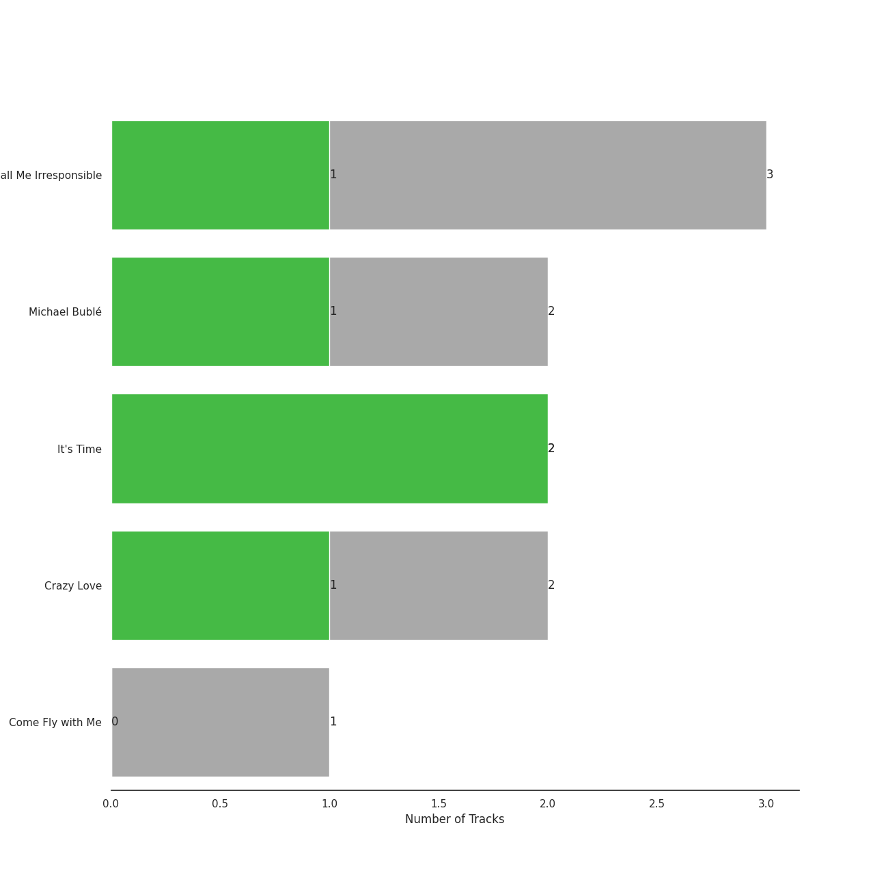
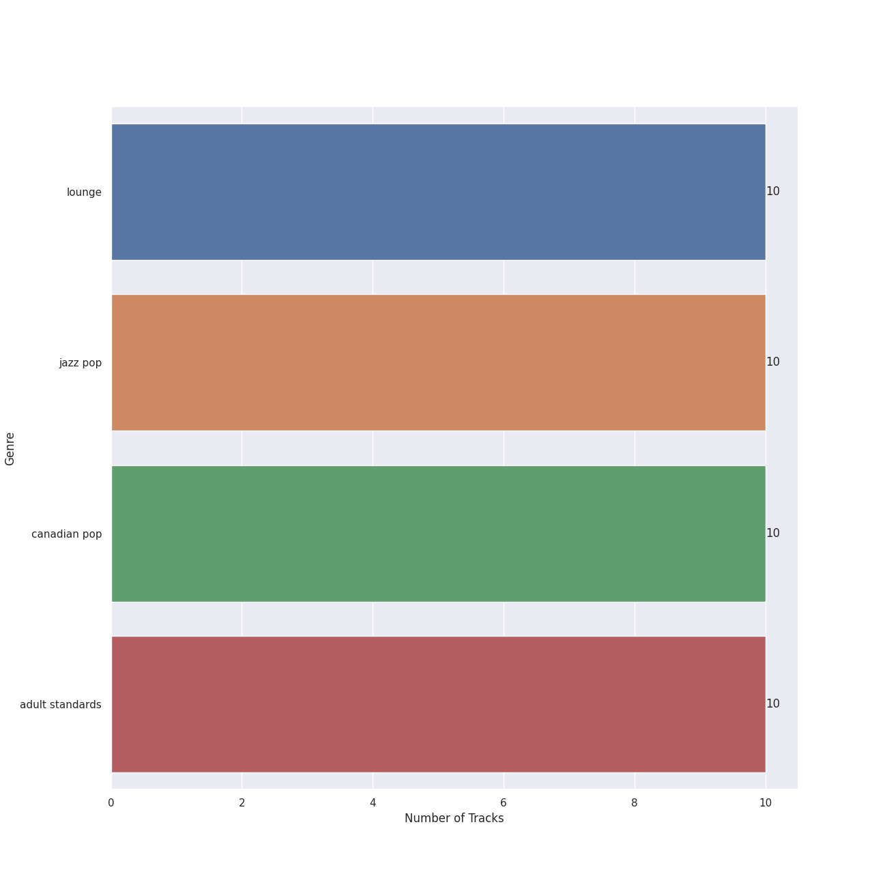
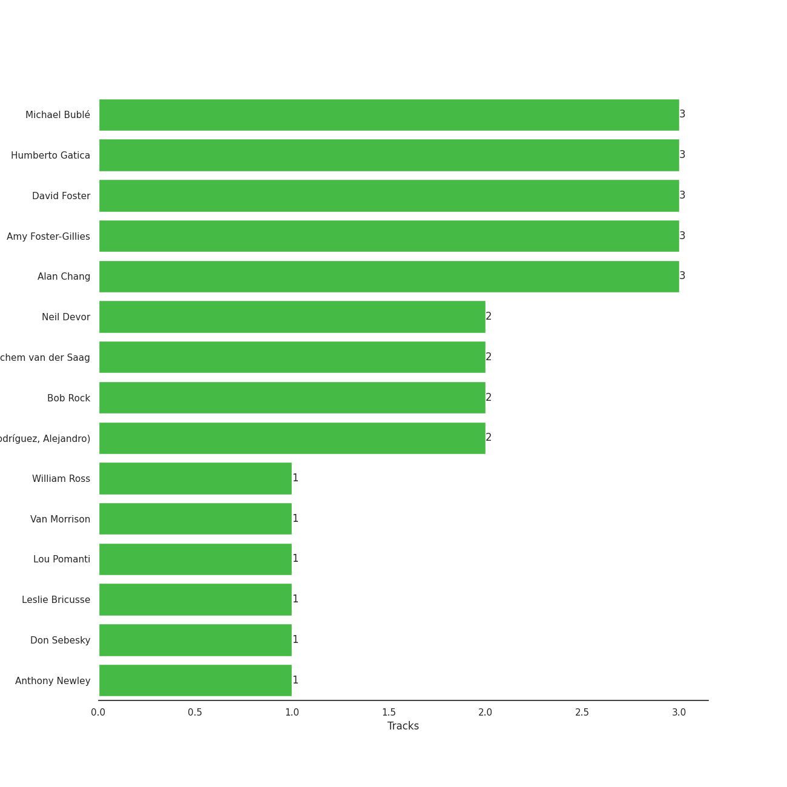

# 143

14 songs

[See Track Features](audio_features.md)

[See Clusters](clusters/overview.md)

Appears as:
- 143/Reprise (14 tracks)

## Top Artists

| Art | Rank | Tracks | 💚 | Artist | 🔗 |
|:---|---:|---:|---:|:---|:---|
|  | 94 | 14 | 5 | [Michael Bublé](../../artists/michael_bublé/overview.md) | [🔗](https://open.spotify.com/artist/1GxkXlMwML1oSg5eLPiAz3) |
|  | 368 | 1 | 0 | The Puppini Sisters | [🔗](https://open.spotify.com/artist/1svaANJTE5KrG16fTGDqOs) |

## Top Albums

| Art | Rank | Tracks | 💚 | Album | Release Date | 🔗 |
|:---|---:|---:|---:|:---|:---|:---|
|  | 522 | 4 | 0 | Christmas (Deluxe Special Edition) | 2012-11-09 | [🔗](https://open.spotify.com/album/7uVimUILdzSZG4KKKWToq0) |
|  | 664 | 3 | 1 | Call Me Irresponsible | 2007-04-27 | [🔗](https://open.spotify.com/album/3h4pyWRJIB9ZyRKXChbX22) |
|  | 574 | 2 | 2 | It's Time | 2005-02-08 | [🔗](https://open.spotify.com/album/457fktVFXVwjQTl9wOLlfg) |
|  | 655 | 2 | 1 | Michael Bublé | 2003 | [🔗](https://open.spotify.com/album/3rpSksJSFdNFqk5vne8at2) |
|  | 664 | 2 | 1 | Crazy Love | 2009-10-06 | [🔗](https://open.spotify.com/album/3MXDonOIzrIrCh0HvlACyj) |
|  | 664 | 1 | 0 | Come Fly with Me | 2004-03-30 | [🔗](https://open.spotify.com/album/0UhvDeKmtgegXeELEVgGRh) |

## Genres

| Tracks | 💚 | Genre |
|---:|---:|:---|
| 14 | 5 | [lounge](../../genres/lounge/overview.md) |
| 14 | 5 | jazz pop |
| 14 | 5 | [canadian pop](../../genres/canadian_pop/overview.md) |
| 14 | 5 | [adult standards](../../genres/adult_standards/overview.md) |

## Top Producers

| Art | Producer | Tracks | Credit Types |
|:---|:---|---:|:---|
| | David Foster | 3 | Producer, Arranger |
| | Amy Foster-Gillies | 3 | Songwriter |
|  | [Michael Bublé](../../artists/michael_bublé/overview.md) | 3 | Songwriter, Arranger |
| | Humberto Gatica | 3 | Producer |
| | Alan Chang | 3 | Songwriter, Arranger |
| | Bob Rock | 2 | Producer, Arranger |
| | Alejandro Rodríguez (Rodríguez, Alejandro) | 2 | Producer |
| | Jochem van der Saag | 2 | Producer |
| | Neil Devor | 2 | Producer |
| | Leslie Bricusse | 1 | Songwriter |

View all

| Art | Producer | Tracks | Credit Types |
|:---|:---|---:|:---|
| | Don Sebesky | 1 | Arranger |
| | William Ross | 1 | Arranger |
| | Lou Pomanti | 1 | Arranger |
| | Anthony Newley | 1 | Songwriter |
|  | Van Morrison | 1 | Lyricist, Songwriter |

## Tracks released under 143

| Art | Track | Album | Artists | Label | Rank | 💚 | 🔗 |
|:---|:---|:---|:---|:---|---:|:---|:---|
|  | Frosty the Snowman (feat. The Puppini Sisters) | Christmas (Deluxe Special Edition) | [Michael Bublé](../../artists/michael_bublé/overview.md), The Puppini Sisters | [143](.), [Reprise](../reprise) | 801 | | [🔗](https://open.spotify.com/track/27TJMHguLnuW3y2UPqXeC2) |
|  | Feeling Good | It's Time | [Michael Bublé](../../artists/michael_bublé/overview.md) | [143](.), [Reprise](../reprise) | 864 | 💚 | [🔗](https://open.spotify.com/track/72PwtNhRrZXNnYeRg5xQ46) |
|  | It's Beginning to Look a Lot like Christmas | Christmas (Deluxe Special Edition) | [Michael Bublé](../../artists/michael_bublé/overview.md) | [143](.), [Reprise](../reprise) | 974 | | [🔗](https://open.spotify.com/track/5a1iz510sv2W9Dt1MvFd5R) |
|  | Moondance | Michael Bublé | [Michael Bublé](../../artists/michael_bublé/overview.md) | [143](.), [Reprise](../reprise) | 1013 | 💚 | [🔗](https://open.spotify.com/track/25Yzff59UGjz7wNWmjM39h) |
|  | The Way You Look Tonight | Michael Bublé | [Michael Bublé](../../artists/michael_bublé/overview.md) | [143](.), [Reprise](../reprise) | 1014 | | [🔗](https://open.spotify.com/track/4YGlRLe6TeBRiXFByBqldf) |
|  | Can't Help Falling in Love | Come Fly with Me | [Michael Bublé](../../artists/michael_bublé/overview.md) | [143](.), [Reprise](../reprise) | 1014 | | [🔗](https://open.spotify.com/track/7igk58Vs9uM2B0aaTUwv6F) |
|  | Home | It's Time | [Michael Bublé](../../artists/michael_bublé/overview.md) | [143](.), [Reprise](../reprise) | 1014 | 💚 | [🔗](https://open.spotify.com/track/3ISaSNZCxIzTGwQuBq6Xrr) |
|  | Call Me Irresponsible | Call Me Irresponsible | [Michael Bublé](../../artists/michael_bublé/overview.md) | [143](.), [Reprise](../reprise) | 1014 | | [🔗](https://open.spotify.com/track/25RxZw46RfYpVWMIrIeZDS) |
|  | Everything | Call Me Irresponsible | [Michael Bublé](../../artists/michael_bublé/overview.md) | [143](.), [Reprise](../reprise) | 1014 | 💚 | [🔗](https://open.spotify.com/track/4T6HLdP6OcAtqC6tGnQelG) |
|  | The Best Is yet to Come | Call Me Irresponsible | [Michael Bublé](../../artists/michael_bublé/overview.md) | [143](.), [Reprise](../reprise) | 1014 | | [🔗](https://open.spotify.com/track/56t3m0lqE6zU1EfgFOPqst) |

See all tracks

| Art | Track | Album | Artists | Label | Rank | 💚 | 🔗 |
|:---|:---|:---|:---|:---|---:|:---|:---|
|  | Cry Me a River | Crazy Love | [Michael Bublé](../../artists/michael_bublé/overview.md) | [143](.), [Reprise](../reprise) | 1014 | | [🔗](https://open.spotify.com/track/5i04Jy87RLxoZszJqY3QAN) |
|  | Haven't Met You Yet | Crazy Love | [Michael Bublé](../../artists/michael_bublé/overview.md) | [143](.), [Reprise](../reprise) | 1014 | 💚 | [🔗](https://open.spotify.com/track/4fIWvT19w9PR0VVBuPYpWA) |
|  | Santa Baby | Christmas (Deluxe Special Edition) | [Michael Bublé](../../artists/michael_bublé/overview.md) | [143](.), [Reprise](../reprise) | 1014 | | [🔗](https://open.spotify.com/track/3m2gfwcxl77ojJTWH3wZkb) |
|  | The Christmas Song | Christmas (Deluxe Special Edition) | [Michael Bublé](../../artists/michael_bublé/overview.md) | [143](.), [Reprise](../reprise) | 1014 | | [🔗](https://open.spotify.com/track/4SWAozNLRfZXF25ghKqm2q) |

