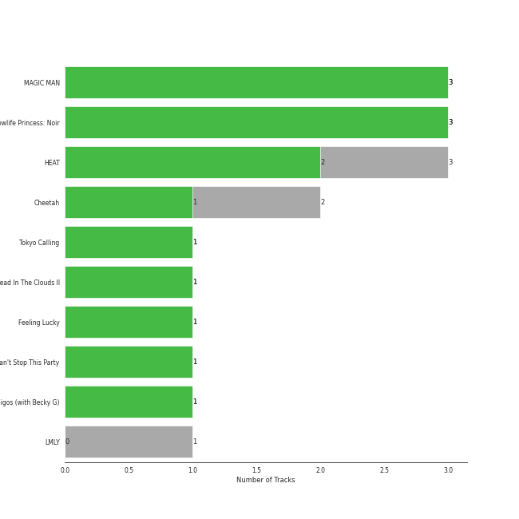
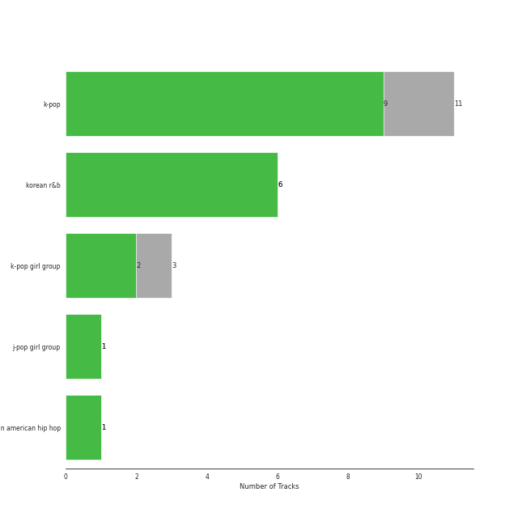

# 88rising Music

10 songs

Appears as:
- TEAM WANG records/88rising Music/Warner Records (4 tracks)
- 88rising Music/Warner Records (2 tracks)
- 88rising Music (1 tracks)
- ATISPAUS/88rising Music (1 tracks)
- ATISPAUS/88rising Music/12Tone Music, LLC (1 tracks)
- Feel Ghood Music/88risingMusic (1 tracks)

## Top Artists

See all 5 artists

|   Number of Tracks | Art                                                                                              | Artist           | 🔗                                                           |
|-------------------:|:-------------------------------------------------------------------------------------------------|:-----------------|:------------------------------------------------------------|
|                  6 |  | Jackson Wang     | [🔗](https://open.spotify.com/artist/1kfWoWgCugPkyxQP8lkRlY) |
|                  2 |  | BIBI             | [🔗](https://open.spotify.com/artist/6UbmqUEgjLA6jAcXwbM1Z9) |
|                  2 |  | Seori            | [🔗](https://open.spotify.com/artist/2bWTIIQP9zaVc55RaMGu7e) |
|                  1 |  | 88rising         | [🔗](https://open.spotify.com/artist/1AhjOkOLkbHUfcHDSErXQs) |
|                  1 |  | Stephanie Poetri | [🔗](https://open.spotify.com/artist/0HS00NN7MAfF59aJnfcxSO) |

## Top Albums

See all 9 albums

|   Number of Tracks | Art                                                                                              | Album                  | 🔗                                                          |
|-------------------:|:-------------------------------------------------------------------------------------------------|:-----------------------|:-----------------------------------------------------------|
|                  2 |  | MAGIC MAN              | [🔗](https://open.spotify.com/album/2VZ4og2ZbwyTQ3X1rbgCe1) |
|                  1 |  | Lowlife Princess: Noir | [🔗](https://open.spotify.com/album/0AwCgoJKJUOgLp1imhnxuH) |
|                  1 |  | Lovers In The Night    | [🔗](https://open.spotify.com/album/5qewqwnafgBx455s6LNcWv) |
|                  1 |  | LMLY                   | [🔗](https://open.spotify.com/album/09UJf8ZqCuv5NHRZIqTZgh) |
|                  1 |  | Head In The Clouds II  | [🔗](https://open.spotify.com/album/7bOpX6Ilc9UCFmH9uGyUDy) |
|                  1 |  | Cruel                  | [🔗](https://open.spotify.com/album/2XVAjpwJNlbMQF5N7cGfIf) |
|                  1 |  | Can't Stop This Party  | [🔗](https://open.spotify.com/album/6nG0PLR5YgP7tHYKfwhiOI) |
|                  1 |  | Blow                   | [🔗](https://open.spotify.com/album/2y6aTfBouCa2nRJadWq0WX) |
|                  1 |  | Animal Farm            | [🔗](https://open.spotify.com/album/3Wn89ahl9ccGAxrjIB8Tvt) |

## Genres

See all 4 genres

|   Number of Tracks | Genre                       |
|-------------------:|:----------------------------|
|                  4 | korean r&b                  |
|                  4 | [k-pop](../genres/k_pop.md) |
|                  1 | [pop](../genres/pop.md)     |
|                  1 | asian american hip hop      |

## Tracks released under 88rising Music

| Art                                                                                              | Track                 | Album                  | Artists                                  | Label                                                                                       | 💚   | 🔗                                                          |
|:-------------------------------------------------------------------------------------------------|:----------------------|:-----------------------|:-----------------------------------------|:--------------------------------------------------------------------------------------------|:----|:-----------------------------------------------------------|
|  | I Love You 3000 II    | Head In The Clouds II  | 88rising, Stephanie Poetri, Jackson Wang | [88rising Music](88rising_music.md), [Warner Records](warner_records.md)                    | 💚   | [🔗](https://open.spotify.com/track/3witRpHWHqArlnt6GTlH2Y) |
|  | Animal Farm           | Animal Farm            | BIBI                                     | [88rising Music](88rising_music.md)                                                         | 💚   | [🔗](https://open.spotify.com/track/3gAXVQOR0h7Ks71lsr5MFZ) |
|  | BIBI Vengeance        | Lowlife Princess: Noir | BIBI                                     | [Feel Ghood Music/88risingMusic](feel_ghood_music.md)                                       | 💚   | [🔗](https://open.spotify.com/track/6vq6B6ENjap5Ea1T4GkrFA) |
|  | LMLY                  | LMLY                   | Jackson Wang                             | [88rising Music](88rising_music.md), [Warner Records](warner_records.md)                    | 💚   | [🔗](https://open.spotify.com/track/3Jbpo2slhW2bbVneiJnC9G) |
|  | Blow                  | Blow                   | Jackson Wang                             | [88rising Music](88rising_music.md), [Warner Records](warner_records.md), TEAM WANG records | 💚   | [🔗](https://open.spotify.com/track/0QPPJN3d42PINVAyBPZTC3) |
|  | Cruel                 | Cruel                  | Jackson Wang                             | [88rising Music](88rising_music.md), [Warner Records](warner_records.md), TEAM WANG records | 💚   | [🔗](https://open.spotify.com/track/0SxQz5uPZ5cAGWzj6MvzrX) |
|  | Blow                  | MAGIC MAN              | Jackson Wang                             | [88rising Music](88rising_music.md), [Warner Records](warner_records.md), TEAM WANG records |     | [🔗](https://open.spotify.com/track/53WD6QvMGh7wXQVP0U8Rnr) |
|  | Come Alive            | MAGIC MAN              | Jackson Wang                             | [88rising Music](88rising_music.md), [Warner Records](warner_records.md), TEAM WANG records | 💚   | [🔗](https://open.spotify.com/track/2mrG7QoaHDD1kYhr5jeK9q) |
|  | Lovers In The Night   | Lovers In The Night    | Seori                                    | [ATISPAUS/88rising Music/12Tone Music, LLC](12tone_music.md)                                | 💚   | [🔗](https://open.spotify.com/track/2dX2W20qzwqM6G910woDKo) |
|  | Can't Stop This Party | Can't Stop This Party  | Seori                                    | [ATISPAUS/88rising Music](88rising_music.md)                                                | 💚   | [🔗](https://open.spotify.com/track/1FP2jE6moLiHoNUaWTUyJc) |
