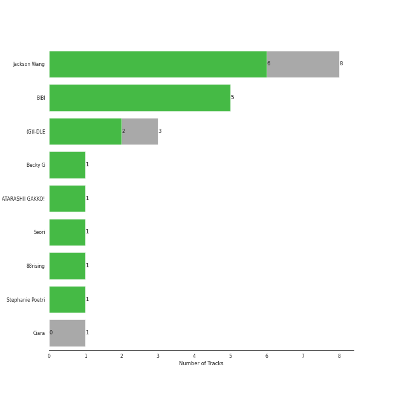

# 88rising Music

17 songs

[See Track Features](audio_features.md)

[See Clusters](clusters/overview.md)

Appears as:
- TEAM WANG records/88rising Music/Warner Records (5 tracks)
- CUBE ENTERTAINMENT INC./88rising Music (3 tracks)
- Feel Ghood Music/88risingMusic (3 tracks)
- 88rising Music (2 tracks)
- 88rising Music/Warner Records (2 tracks)
- ATISPAUS/88rising Music (1 tracks)
- Feel Ghood Music/88rising Music (1 tracks)

## Top Artists

| Art | Rank | Tracks | 💚 | Artist | 🔗 |
|:---|---:|---:|---:|:---|:---|
|  | 77 | 8 | 6 | [Jackson Wang](../../artists/jackson_wang/overview.md) | [🔗](https://open.spotify.com/artist/1kfWoWgCugPkyxQP8lkRlY) |
|  | 72 | 5 | 5 | [BIBI](../../artists/bibi/overview.md) | [🔗](https://open.spotify.com/artist/6UbmqUEgjLA6jAcXwbM1Z9) |
|  | 6 | 3 | 2 | [(G)I-DLE](../../artists/(g)i-dle/overview.md) | [🔗](https://open.spotify.com/artist/2AfmfGFbe0A0WsTYm0SDTx) |
|  | 428 | 1 | 1 | Becky G | [🔗](https://open.spotify.com/artist/4obzFoKoKRHIphyHzJ35G3) |
|  | 143 | 1 | 1 | ATARASHII GAKKO! | [🔗](https://open.spotify.com/artist/4OfU76YhPU04wlmbVFFgTJ) |
|  | 413 | 1 | 1 | Seori | [🔗](https://open.spotify.com/artist/2bWTIIQP9zaVc55RaMGu7e) |
|  | 428 | 1 | 1 | 88rising | [🔗](https://open.spotify.com/artist/1AhjOkOLkbHUfcHDSErXQs) |
|  | 428 | 1 | 1 | Stephanie Poetri | [🔗](https://open.spotify.com/artist/0HS00NN7MAfF59aJnfcxSO) |
|  | 74 | 1 | 0 | Ciara | [🔗](https://open.spotify.com/artist/2NdeV5rLm47xAvogXrYhJX) |

## Top Albums

| Art | Rank | Tracks | 💚 | Album | Release Date | 🔗 |
|:---|---:|---:|---:|:---|:---|:---|
|  | 239 | 3 | 3 | MAGIC MAN | 2022-09-09 | [🔗](https://open.spotify.com/album/2VZ4og2ZbwyTQ3X1rbgCe1) |
|  | 101 | 3 | 3 | Lowlife Princess: Noir | 2022-11-18 | [🔗](https://open.spotify.com/album/0AwCgoJKJUOgLp1imhnxuH) |
|  | 80 | 3 | 2 | HEAT | 2023-10-04 | [🔗](https://open.spotify.com/album/5CZQfva4He8sG3DcU8eP5m) |
|  | 639 | 2 | 1 | Cheetah | 2023-04-24 | [🔗](https://open.spotify.com/album/4nK0XlFVAQNesqpijBX1Ri) |
|  | 554 | 1 | 1 | Tokyo Calling | 2023-10-20 | [🔗](https://open.spotify.com/album/3utC1QAo17IiIIkQZe7XO6) |
|  | 639 | 1 | 1 | Head In The Clouds II | 2019-10-11 | [🔗](https://open.spotify.com/album/7bOpX6Ilc9UCFmH9uGyUDy) |
|  | 538 | 1 | 1 | Feeling Lucky | 2024-04-26 | [🔗](https://open.spotify.com/album/4bc9PfPyv60qCh5S5g5eMb) |
|  | 639 | 1 | 1 | Can't Stop This Party | 2022-03-22 | [🔗](https://open.spotify.com/album/6nG0PLR5YgP7tHYKfwhiOI) |
|  | 639 | 1 | 1 | Amigos (with Becky G) | 2023-11-17 | [🔗](https://open.spotify.com/album/3HtYZEKcsbFqEzKX8xntam) |
|  | 639 | 1 | 0 | LMLY | 2021-03-26 | [🔗](https://open.spotify.com/album/09UJf8ZqCuv5NHRZIqTZgh) |

## Genres

| Tracks | 💚 | Genre |
|---:|---:|:---|
| 11 | 9 | [k-pop](../../genres/k-pop/overview.md) |
| 6 | 6 | [korean r&b](../../genres/korean_r_b/overview.md) |
| 3 | 2 | [k-pop girl group](../../genres/k-pop_girl_group/overview.md) |
| 1 | 1 | j-pop girl group |
| 1 | 1 | asian american hip hop |

## Top Producers

| Art | Producer | Tracks | Credit Types |
|:---|:---|---:|:---|
|  | [BIBI](../../artists/bibi/overview.md) | 3 | Lyricist, Songwriter |
| | THE NEED | 2 | Arranger, Songwriter |
| | Kyle Scherrer | 1 | Arranger, Songwriter |
|  | ATARASHII GAKKO! | 1 | Lyricist, Songwriter |
| | Erik Madrid | 1 | Producer |
| | Patrick "j.Que" Smith | 1 | Songwriter |
| | Max Levin | 1 | Arranger, Songwriter |
| | Cambo | 1 | Producer, Songwriter |
| | Yoshio Tamamura | 1 | Lyricist, Songwriter |
| | Louis Bartolini | 1 | Producer, Songwriter |

View all

| Art | Producer | Tracks | Credit Types |
|:---|:---|---:|:---|
| | Liam Kevany | 1 | Producer, Songwriter |
|  | [Jackson Wang](../../artists/jackson_wang/overview.md) | 1 | Songwriter |
| | twlv | 1 | Songwriter |
| | Jack Samson | 1 | Songwriter |
| | yonkey | 1 | Arranger, Lyricist, Songwriter |

## Tracks released under 88rising Music

| Art | Track | Album | Artists | Label | Rank | 💚 | 🔗 |
|:---|:---|:---|:---|:---|---:|:---|:---|
|  | I Want That | HEAT | [(G)I-DLE](../../artists/(g)i-dle/overview.md) | [88rising Music](.), [CUBE ENTERTAINMENT](../cube_entertainment) | 91 | 💚 | [🔗](https://open.spotify.com/track/3F2BLyGt6zYLrHYpbdTw5L) |
|  | Animal Farm | Lowlife Princess: Noir | [BIBI](../../artists/bibi/overview.md) | [Feel Ghood Music/88risingMusic](.) | 124 | 💚 | [🔗](https://open.spotify.com/track/4g6ZT8vgKNq4iyEbezr3yI) |
|  | Blow | MAGIC MAN | [Jackson Wang](../../artists/jackson_wang/overview.md) | TEAM WANG records, [88rising Music](.), [Warner Records](../warner_records) | 359 | 💚 | [🔗](https://open.spotify.com/track/53WD6QvMGh7wXQVP0U8Rnr) |
|  | Cruel | MAGIC MAN | [Jackson Wang](../../artists/jackson_wang/overview.md) | TEAM WANG records, [88rising Music](.), [Warner Records](../warner_records) | 713 | 💚 | [🔗](https://open.spotify.com/track/32nxxRcrH6gqlVG2RYYMEN) |
|  | Feeling Lucky | Feeling Lucky | [BIBI](../../artists/bibi/overview.md), [Jackson Wang](../../artists/jackson_wang/overview.md) | [88rising Music](.) | 808 | 💚 | [🔗](https://open.spotify.com/track/53x0Yk1qOyurd2MefyF3Ny) |
|  | Tokyo Calling | Tokyo Calling | ATARASHII GAKKO! | [88rising Music](.) | 833 | 💚 | [🔗](https://open.spotify.com/track/2WNjQidYVQO0oFFlTuF8fo) |
|  | I Love You 3000 II | Head In The Clouds II | 88rising, Stephanie Poetri, [Jackson Wang](../../artists/jackson_wang/overview.md) | [88rising Music](.), [Warner Records](../warner_records) | 966 | 💚 | [🔗](https://open.spotify.com/track/3witRpHWHqArlnt6GTlH2Y) |
|  | LMLY | LMLY | [Jackson Wang](../../artists/jackson_wang/overview.md) | [88rising Music](.), [Warner Records](../warner_records) | 966 | | [🔗](https://open.spotify.com/track/3Jbpo2slhW2bbVneiJnC9G) |
|  | Can't Stop This Party | Can't Stop This Party | Seori | [ATISPAUS/88rising Music](.) | 966 | 💚 | [🔗](https://open.spotify.com/track/1FP2jE6moLiHoNUaWTUyJc) |
|  | Come Alive | MAGIC MAN | [Jackson Wang](../../artists/jackson_wang/overview.md) | TEAM WANG records, [88rising Music](.), [Warner Records](../warner_records) | 966 | 💚 | [🔗](https://open.spotify.com/track/2mrG7QoaHDD1kYhr5jeK9q) |

See all tracks

| Art | Track | Album | Artists | Label | Rank | 💚 | 🔗 |
|:---|:---|:---|:---|:---|---:|:---|:---|
|  | BIBI Vengeance | Lowlife Princess: Noir | [BIBI](../../artists/bibi/overview.md) | [Feel Ghood Music/88risingMusic](.) | 966 | 💚 | [🔗](https://open.spotify.com/track/6vq6B6ENjap5Ea1T4GkrFA) |
|  | Wet Nightmare | Lowlife Princess: Noir | [BIBI](../../artists/bibi/overview.md) | [Feel Ghood Music/88risingMusic](.) | 966 | 💚 | [🔗](https://open.spotify.com/track/1MCRRGM8G6papoKnE7xtLN) |
|  | Cheetah | Cheetah | [Jackson Wang](../../artists/jackson_wang/overview.md) | TEAM WANG records, [88rising Music](.), [Warner Records](../warner_records) | 966 | 💚 | [🔗](https://open.spotify.com/track/76WMXf8zWfpNLgOZbU2ej8) |
|  | Slow (with Ciara) | Cheetah | [Jackson Wang](../../artists/jackson_wang/overview.md), Ciara | TEAM WANG records, [88rising Music](.), [Warner Records](../warner_records) | 966 | | [🔗](https://open.spotify.com/track/4GJanLClwCh0D0EROpsHyd) |
|  | Eyes Roll | HEAT | [(G)I-DLE](../../artists/(g)i-dle/overview.md) | [88rising Music](.), [CUBE ENTERTAINMENT](../cube_entertainment) | 966 | | [🔗](https://open.spotify.com/track/6vVO2TX7x8yUICULlFZwGH) |
|  | I DO | HEAT | [(G)I-DLE](../../artists/(g)i-dle/overview.md) | [88rising Music](.), [CUBE ENTERTAINMENT](../cube_entertainment) | 966 | 💚 | [🔗](https://open.spotify.com/track/4SKwDW8Gg8CJxw2ElMhSTp) |
|  | Amigos (with Becky G) | Amigos (with Becky G) | [BIBI](../../artists/bibi/overview.md), Becky G | [Feel Ghood Music/88rising Music](.) | 966 | 💚 | [🔗](https://open.spotify.com/track/60DPrTJRHzpGPSJXLiSdDX) |

