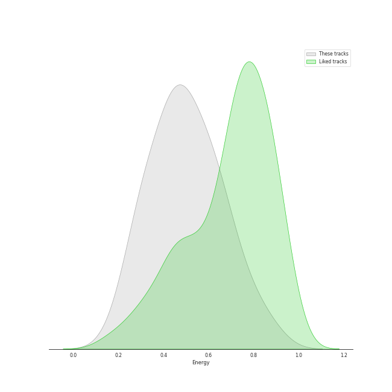
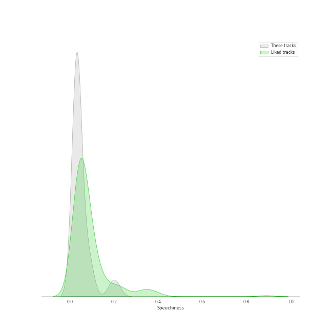
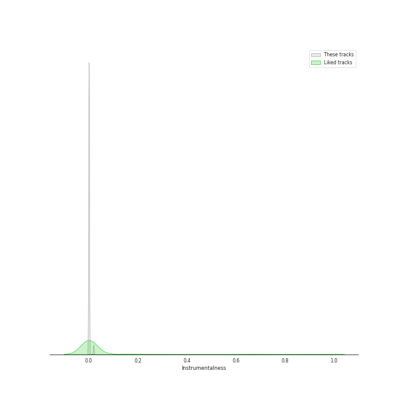

# Audio Features for A Cappella Records

## Danceability

| 10 most Danceable tracks | 10 least Danceable tracks |
|:---|:---|
| Toxic (0.764) | Falling Slowly (0.218) |
| Machine Gun (0.718) | Wait It Out (0.227) |
| Disturbia (0.698) | Morning Comes (0.327) |
| Set Fire To The Rain (0.683) | Let it Be (0.343) |
| I'd Like To (0.663) | Wanted (0.36) |
| Cry Me a River (0.655) | Shake It Out (0.36) |
| Without Your Love (0.65) | Easy (0.364) |
| Got To Get You Into My Life (0.646) | Russian Roulette (0.419) |
| You And I (0.644) | Landslide (0.425) |
| Breakeven (0.617) | Samson (0.507) |

## Energy

| 10 most Energetic tracks | 10 least Energetic tracks |
|:---|:---|
| Russian Roulette (0.866) | Demons (0.21) |
| Shake It Out (0.778) | Samson (0.27) |
| I'd Like To (0.741) | Let it Be (0.292) |
| Only the Good Die Young (0.688) | Falling Slowly (0.299) |
| Disturbia (0.677) | Landslide (0.313) |
| Halo (0.654) | You And I (0.33) |
| Carry On Wayward Son (0.627) | Morning Comes (0.339) |
| Breakeven (0.621) | Toxic (0.38) |
| Got To Get You Into My Life (0.602) | Home (0.394) |
| Machine Gun (0.589) | Wait It Out (0.428) |

## Speechiness

| 10 most Speechy tracks | 10 least Speechy tracks |
|:---|:---|
| I'd Like To (0.213) | Samson (0.0256) |
| Cry Me a River (0.19) | Machine Gun (0.0264) |
| Russian Roulette (0.0926) | Demons (0.0276) |
| Only the Good Die Young (0.0874) | Cough Syrup (0.0278) |
| Toxic (0.087) | Falling Slowly (0.0284) |
| Shake It Out (0.0709) | Landslide (0.0289) |
| Carry On Wayward Son (0.0562) | Home (0.0294) |
| Africa (0.045) | Wally (0.0298) |
| Disturbia (0.0402) | Speechless (0.0299) |
| Because of You (0.0361) | Breakeven (0.0303) |

## Acousticness

| 10 most Acoustic tracks | 10 least Acoustic tracks |
|:---|:---|
| Demons (0.972) | Blown Away (0.0614) |
| Landslide (0.919) | Set Fire To The Rain (0.0883) |
| Samson (0.865) | Wanted (0.116) |
| Let it Be (0.86) | Russian Roulette (0.254) |
| Toxic (0.86) | Wally (0.257) |
| Cry Me a River (0.849) | Got To Get You Into My Life (0.325) |
| Because of You (0.833) | Africa (0.333) |
| Home (0.815) | Shake It Out (0.342) |
| Cough Syrup (0.812) | You And I (0.368) |
| Falling Slowly (0.796) | Breakeven (0.371) |

## Instrumentalness

| 10 most Instrumental tracks | 10 least Instrumental tracks |
|:---|:---|
| Falling Slowly (0.019) | Without Your Love (0.0) |
| Demons (0.000816) | Wanted (0.0) |
| Easy (0.000198) | Disturbia (0.0) |
| Samson (0.000183) | Landslide (0.0) |
| Toxic (8.08e-05) | Morning Comes (0.0) |
| Machine Gun (2.84e-05) | Carry On Wayward Son (0.0) |
| Wait It Out (1.56e-05) | Halo (0.0) |
| Wally (1.1e-05) | Shake It Out (0.0) |
| Blown Away (1.04e-05) | Let it Be (0.0) |
| Happy Ending (5.09e-06) | Only the Good Die Young (0.0) |

## Liveness

| 10 most Live tracks | 10 least Live tracks |
|:---|:---|
| I'd Like To (0.738) | Africa (0.0464) |
| Disturbia (0.429) | Russian Roulette (0.0472) |
| Carry On Wayward Son (0.284) | Demons (0.0651) |
| Blown Away (0.263) | Without Your Love (0.0766) |
| Let it Be (0.26) | Halo (0.0837) |
| Got To Get You Into My Life (0.239) | Only the Good Die Young (0.0841) |
| Cry Me a River (0.195) | Because of You (0.0954) |
| Happy Ending (0.179) | Wally (0.0963) |
| Wait It Out (0.154) | Morning Comes (0.0964) |
| You And I (0.141) | Easy (0.0999) |

## Valence

| 10 most Happy tracks | 10 least Happy tracks |
|:---|:---|
| Toxic (0.842) | Wait It Out (0.104) |
| I'd Like To (0.831) | Falling Slowly (0.107) |
| Got To Get You Into My Life (0.783) | Wanted (0.129) |
| Cry Me a River (0.75) | Shake It Out (0.136) |
| Carry On Wayward Son (0.729) | Easy (0.139) |
| Only the Good Die Young (0.674) | Samson (0.156) |
| Breakeven (0.591) | You And I (0.169) |
| Africa (0.573) | Morning Comes (0.175) |
| Machine Gun (0.494) | Happy Ending (0.18) |
| Disturbia (0.424) | Home (0.181) |

## Tempo

| 10 most Fast tracks | 10 least Fast tracks |
|:---|:---|
| Morning Comes (174.708) | Speechless (72.971) |
| Wanted (169.683) | Cry Me a River (72.975) |
| Only the Good Die Young (162.862) | Russian Roulette (73.947) |
| Wait It Out (147.729) | Halo (74.98) |
| Wally (147.123) | Demons (84.005) |
| Because of You (143.998) | Let it Be (85.839) |
| Toxic (142.902) | I'd Like To (88.013) |
| Falling Slowly (139.601) | Samson (89.415) |
| Landslide (139.1) | Without Your Love (89.982) |
| Easy (138.784) | Africa (90.972) |
