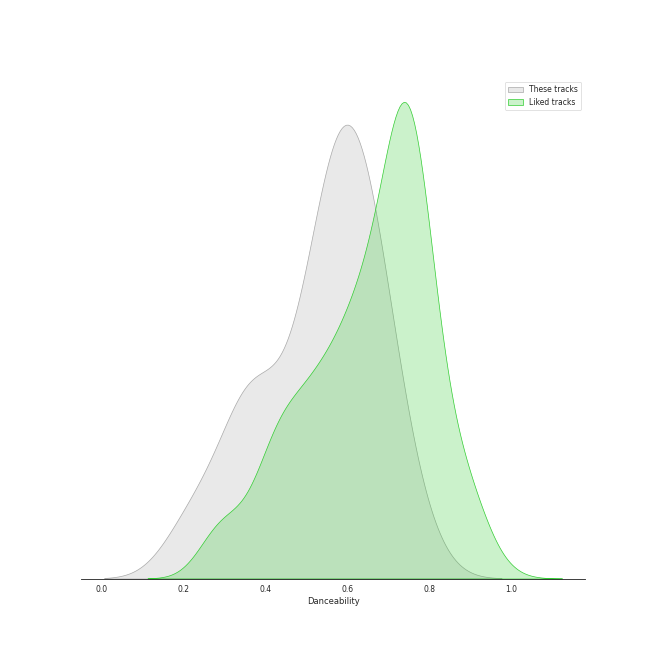
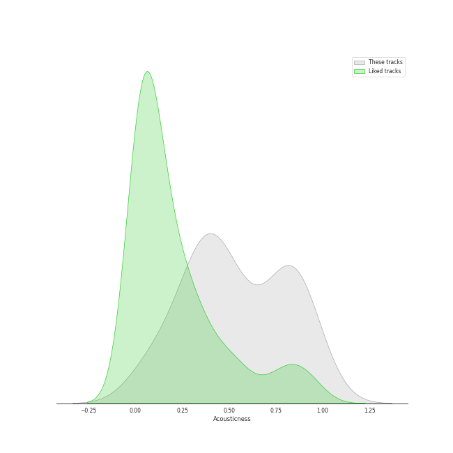
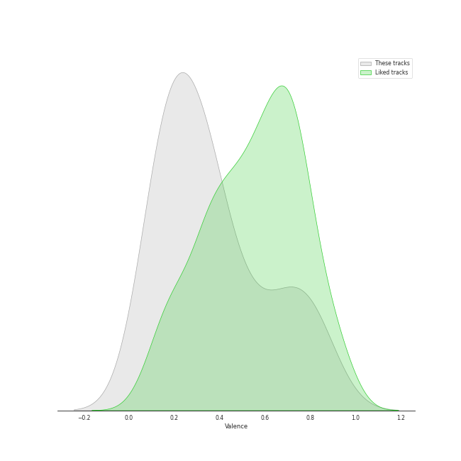
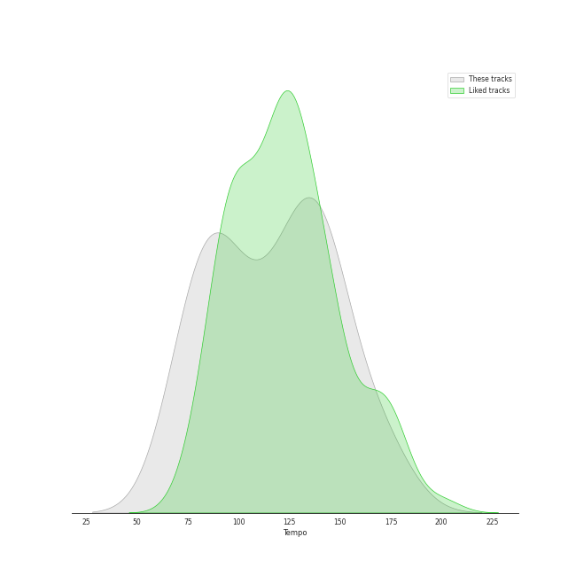

# Audio Features for A Cappella Records

## Danceability

| ​ | 10 most Danceable tracks | ​​ | 10 least Danceable tracks |
|:---|:---|:---|:---|
|  | Toxic (0.764) |  | Falling Slowly (0.218) |
|  | Machine Gun (0.718) |  | Wait It Out (0.227) |
|  | Disturbia (0.698) |  | Morning Comes (0.327) |
|  | Set Fire To The Rain (0.683) |  | Let it Be (0.343) |
|  | I'd Like To (0.663) |  | Wanted (0.36) |
|  | Cry Me a River (0.655) |  | Shake It Out (0.36) |
|  | Without Your Love (0.65) |  | Easy (0.364) |
|  | Got To Get You Into My Life (0.646) |  | Russian Roulette (0.419) |
|  | You And I (0.644) |  | Landslide (0.425) |
|  | Breakeven (0.617) |  | Samson (0.507) |

## Energy

| ​ | 10 most Energetic tracks | ​​ | 10 least Energetic tracks |
|:---|:---|:---|:---|
|  | Russian Roulette (0.866) |  | Demons (0.21) |
|  | Shake It Out (0.778) |  | Samson (0.27) |
|  | I'd Like To (0.741) |  | Let it Be (0.292) |
|  | Only the Good Die Young (0.688) |  | Falling Slowly (0.299) |
|  | Disturbia (0.677) |  | Landslide (0.313) |
|  | Halo (0.654) |  | You And I (0.33) |
|  | Carry On Wayward Son (0.627) |  | Morning Comes (0.339) |
|  | Breakeven (0.621) |  | Toxic (0.38) |
|  | Got To Get You Into My Life (0.602) |  | Home (0.394) |
|  | Machine Gun (0.589) |  | Wait It Out (0.428) |

## Speechiness

| ​ | 10 most Speechy tracks | ​​ | 10 least Speechy tracks |
|:---|:---|:---|:---|
|  | I'd Like To (0.213) |  | Samson (0.0256) |
|  | Cry Me a River (0.19) |  | Machine Gun (0.0264) |
|  | Russian Roulette (0.0926) |  | Demons (0.0276) |
|  | Only the Good Die Young (0.0874) |  | Cough Syrup (0.0278) |
|  | Toxic (0.087) |  | Falling Slowly (0.0284) |
|  | Shake It Out (0.0709) |  | Landslide (0.0289) |
|  | Carry On Wayward Son (0.0562) |  | Home (0.0294) |
|  | Africa (0.045) |  | Wally (0.0298) |
|  | Disturbia (0.0402) |  | Speechless (0.0299) |
|  | Because of You (0.0361) |  | Breakeven (0.0303) |

## Acousticness

| ​ | 10 most Acoustic tracks | ​​ | 10 least Acoustic tracks |
|:---|:---|:---|:---|
|  | Demons (0.972) |  | Blown Away (0.0614) |
|  | Landslide (0.919) |  | Set Fire To The Rain (0.0883) |
|  | Samson (0.865) |  | Wanted (0.116) |
|  | Let it Be (0.86) |  | Russian Roulette (0.254) |
|  | Toxic (0.86) |  | Wally (0.257) |
|  | Cry Me a River (0.849) |  | Got To Get You Into My Life (0.325) |
|  | Because of You (0.833) |  | Africa (0.333) |
|  | Home (0.815) |  | Shake It Out (0.342) |
|  | Cough Syrup (0.812) |  | You And I (0.368) |
|  | Falling Slowly (0.796) |  | Breakeven (0.371) |

## Instrumentalness

| ​ | 10 most Instrumental tracks | ​​ | 10 least Instrumental tracks |
|:---|:---|:---|:---|
|  | Falling Slowly (0.019) |  | Without Your Love (0.0) |
|  | Demons (0.000816) |  | Wanted (0.0) |
|  | Easy (0.000198) |  | Disturbia (0.0) |
|  | Samson (0.000183) |  | Landslide (0.0) |
|  | Toxic (8.08e-05) |  | Morning Comes (0.0) |
|  | Machine Gun (2.84e-05) |  | Carry On Wayward Son (0.0) |
|  | Wait It Out (1.56e-05) |  | Halo (0.0) |
|  | Wally (1.1e-05) |  | Shake It Out (0.0) |
|  | Blown Away (1.04e-05) |  | Let it Be (0.0) |
|  | Happy Ending (5.09e-06) |  | Only the Good Die Young (0.0) |

## Liveness

| ​ | 10 most Live tracks | ​​ | 10 least Live tracks |
|:---|:---|:---|:---|
|  | I'd Like To (0.738) |  | Africa (0.0464) |
|  | Disturbia (0.429) |  | Russian Roulette (0.0472) |
|  | Carry On Wayward Son (0.284) |  | Demons (0.0651) |
|  | Blown Away (0.263) |  | Without Your Love (0.0766) |
|  | Let it Be (0.26) |  | Halo (0.0837) |
|  | Got To Get You Into My Life (0.239) |  | Only the Good Die Young (0.0841) |
|  | Cry Me a River (0.195) |  | Because of You (0.0954) |
|  | Happy Ending (0.179) |  | Wally (0.0963) |
|  | Wait It Out (0.154) |  | Morning Comes (0.0964) |
|  | You And I (0.141) |  | Easy (0.0999) |

## Valence

| ​ | 10 most Happy tracks | ​​ | 10 least Happy tracks |
|:---|:---|:---|:---|
|  | Toxic (0.842) |  | Wait It Out (0.104) |
|  | I'd Like To (0.831) |  | Falling Slowly (0.107) |
|  | Got To Get You Into My Life (0.783) |  | Wanted (0.129) |
|  | Cry Me a River (0.75) |  | Shake It Out (0.136) |
|  | Carry On Wayward Son (0.729) |  | Easy (0.139) |
|  | Only the Good Die Young (0.674) |  | Samson (0.156) |
|  | Breakeven (0.591) |  | You And I (0.169) |
|  | Africa (0.573) |  | Morning Comes (0.175) |
|  | Machine Gun (0.494) |  | Happy Ending (0.18) |
|  | Disturbia (0.424) |  | Home (0.181) |

## Tempo

| ​ | 10 most Fast tracks | ​​ | 10 least Fast tracks |
|:---|:---|:---|:---|
|  | Morning Comes (174.708) |  | Speechless (72.971) |
|  | Wanted (169.683) |  | Cry Me a River (72.975) |
|  | Only the Good Die Young (162.862) |  | Russian Roulette (73.947) |
|  | Wait It Out (147.729) |  | Halo (74.98) |
|  | Wally (147.123) |  | Demons (84.005) |
|  | Because of You (143.998) |  | Let it Be (85.839) |
|  | Toxic (142.902) |  | I'd Like To (88.013) |
|  | Falling Slowly (139.601) |  | Samson (89.415) |
|  | Landslide (139.1) |  | Without Your Love (89.982) |
|  | Easy (138.784) |  | Africa (90.972) |
