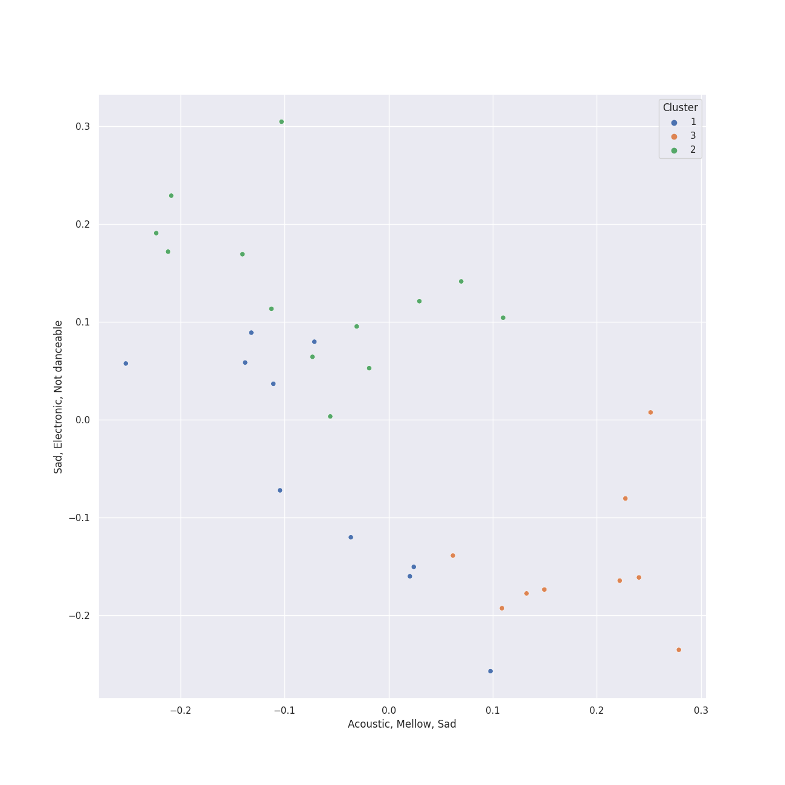

# Clusters in A Cappella Records

## Cluster #1

10 tracks

| Art | Track | Album | Artists | Label | Score | 💚 | 🔗 |
|:---|:---|:---|:---|:---|---:|:---|:---|
|  | Toxic | Songs for Padded Rooms | Voices in Your Head | [A Cappella Records](../..) | 0 | | [🔗](https://open.spotify.com/track/2crmVN1l4kgyGwlABJSFoS) |
|  | Cry Me a River | Songs for Padded Rooms | Voices in Your Head | [A Cappella Records](../..) | 0 | | [🔗](https://open.spotify.com/track/7j2UXGaBVzCGe1zJ795Mv8) |
|  | I'd Like To | I Used to Live Alone | Voices in Your Head | [A Cappella Records](../..) | 0 | | [🔗](https://open.spotify.com/track/3VPjsDRsPu26BK1cUYQYz6) |
|  | Got To Get You Into My Life | Pitch Slapped - EP | Pitch Slapped | [A Cappella Records](../..) | 0 | | [🔗](https://open.spotify.com/track/3qBprB0ZTGZ9smH0YGgppn) |
|  | Breakeven | Pitch Slapped - EP | Pitch Slapped | [A Cappella Records](../..) | 0 | | [🔗](https://open.spotify.com/track/6VXLQHs49KvnSQXaPrCBQh) |
|  | Disturbia | Disturbia | Pitch Slapped | [A Cappella Records](../..) | 0 | | [🔗](https://open.spotify.com/track/1KSw4qWE0rVho501q2bBgA) |
|  | Only the Good Die Young | Keepin' it Low Key | Tar Heel Voices | [A Cappella Records](../..) | 0 | | [🔗](https://open.spotify.com/track/3OERzUoUYTsAOarTBVQcMw) |
|  | Machine Gun | Keepin' it Low Key | Tar Heel Voices | [A Cappella Records](../..) | 0 | | [🔗](https://open.spotify.com/track/3p0txIEAiyVi0MBOd0AkmR) |
|  | Carry On Wayward Son | High Stakes Old Maid | UNC Achordants | [A Cappella Records](../..) | 0 | | [🔗](https://open.spotify.com/track/20F6HiYBShG2uKe6eyX6JB) |
|  | Africa | House Rules | The Clef Hangers | [A Cappella Records](../..) | 0 | | [🔗](https://open.spotify.com/track/2dmQFWn149bJXFMkaeArNo) |
## Cluster #2

13 tracks

| Art | Track | Album | Artists | Label | Score | 💚 | 🔗 |
|:---|:---|:---|:---|:---|---:|:---|:---|
|  | Halo | Pitch Slapped - EP | Pitch Slapped | [A Cappella Records](../..) | 0 | | [🔗](https://open.spotify.com/track/2iN8Dmoe6z5spepFbiJ3ld) |
|  | Wanted | Quarter Past | Tar Heel Voices | [A Cappella Records](../..) | 0 | | [🔗](https://open.spotify.com/track/0wfPw0MHPaMOt4Np1oCa0q) |
|  | Morning Comes | Quarter Past | Tar Heel Voices | [A Cappella Records](../..) | 0 | | [🔗](https://open.spotify.com/track/1z0NSC0GZhulpwAGv6QcYN) |
|  | Speechless | Quarter Past | Tar Heel Voices | [A Cappella Records](../..) | 0 | | [🔗](https://open.spotify.com/track/3ibXraWcKcHr3ga4PKRY05) |
|  | You And I | Quarter Past | Tar Heel Voices | [A Cappella Records](../..) | 0 | | [🔗](https://open.spotify.com/track/5L6yEBGz4rtApJ8PgY6kjl) |
|  | Set Fire To The Rain | Quarter Past | Tar Heel Voices | [A Cappella Records](../..) | 0 | | [🔗](https://open.spotify.com/track/6SMKwFe2OB1HOh1ZT8sOVq) |
|  | Easy | Keepin' it Low Key | Tar Heel Voices | [A Cappella Records](../..) | 0 | | [🔗](https://open.spotify.com/track/37vwAtZv5XEbpg0uetfdcB) |
|  | Wally | Keepin' it Low Key | Tar Heel Voices | [A Cappella Records](../..) | 0 | | [🔗](https://open.spotify.com/track/4dY5fF23LOemKIA9Q2uzxZ) |
|  | Happy Ending | Keepin' it Low Key | Tar Heel Voices | [A Cappella Records](../..) | 0 | | [🔗](https://open.spotify.com/track/72bpNdFjmdbiLFGV1w92RY) |
|  | Shake It Out | A Kick & A Wallop | The Loreleis | [A Cappella Records](../..) | 0 | | [🔗](https://open.spotify.com/track/2sDFmfPjYFy5MvFj1Gds02) |
## Cluster #3

9 tracks

| Art | Track | Album | Artists | Label | Score | 💚 | 🔗 |
|:---|:---|:---|:---|:---|---:|:---|:---|
|  | Demons | Songs for Padded Rooms | Voices in Your Head | [A Cappella Records](../..) | 0 | | [🔗](https://open.spotify.com/track/3LSZijFefbFNrSC4bVitOO) |
|  | Home | I Used to Live Alone | Voices in Your Head | [A Cappella Records](../..) | 0 | | [🔗](https://open.spotify.com/track/4NUlXRw52KIz9bQ58S4oYu) |
|  | Let it Be | III | The Nor'easters | [A Cappella Records](../..) | 0 | | [🔗](https://open.spotify.com/track/30Rw3kVSjTsxnjPsUl2ghS) |
|  | Without Your Love | Pitch Slapped - EP | Pitch Slapped | [A Cappella Records](../..) | 0 | | [🔗](https://open.spotify.com/track/0L0hyvhKUB8zytGw8plT3l) |
|  | Because of You | Pitch Slapped - EP | Pitch Slapped | [A Cappella Records](../..) | 0 | | [🔗](https://open.spotify.com/track/4L94VtyGgK5iBnOEkS4vgP) |
|  | Falling Slowly | Quarter Past | Tar Heel Voices | [A Cappella Records](../..) | 0 | | [🔗](https://open.spotify.com/track/4tzF2kdCUtlbVpry6z9WPZ) |
|  | Samson | Keepin' it Low Key | Tar Heel Voices | [A Cappella Records](../..) | 0 | | [🔗](https://open.spotify.com/track/4GkzthA7aLCGzoP7vuZj7t) |
|  | Cough Syrup | Encore | Vanderbilt Melodores | [A Cappella Records](../..) | 0 | | [🔗](https://open.spotify.com/track/4Wzi8j1QMFE10SDbe2r1VB) |
|  | Landslide | A Kick & A Wallop | The Loreleis | [A Cappella Records](../..) | 0 | | [🔗](https://open.spotify.com/track/1gViYygDgkWPAH8q6WfsN0) |