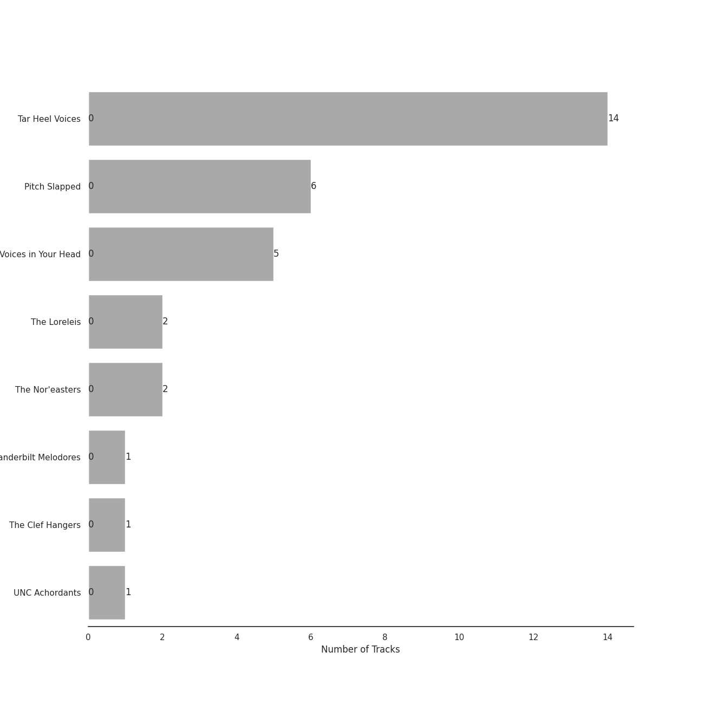
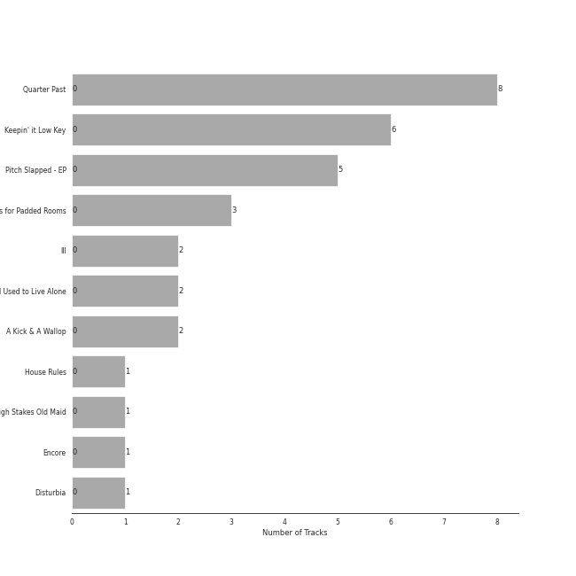

# A Cappella Records

32 songs

[See Track Features](audio_features.md)

[See Clusters](clusters/overview.md)

Appears as:
- A Cappella Records (32 tracks)

## Top Artists

| Art | Rank | Tracks | 💚 | Artist | 🔗 |
|:---|---:|---:|---:|:---|:---|
|  | 419 | 14 | 0 | Tar Heel Voices | [🔗](https://open.spotify.com/artist/1apO6pJsV1nwuF2K8sEsDo) |
|  | 419 | 6 | 0 | Pitch Slapped | [🔗](https://open.spotify.com/artist/7EH7jldX62OIsU1yU1SWE7) |
|  | 419 | 5 | 0 | Voices in Your Head | [🔗](https://open.spotify.com/artist/44v8JgDySt9tkgfV3AWxBJ) |
|  | 419 | 2 | 0 | The Loreleis | [🔗](https://open.spotify.com/artist/1fqMjreaczGwFmdmG6AvJs) |
|  | 419 | 2 | 0 | The Nor'easters | [🔗](https://open.spotify.com/artist/1aLfVgwt8eBrpvHcutWmqe) |
|  | 419 | 1 | 0 | Vanderbilt Melodores | [🔗](https://open.spotify.com/artist/7HkF8fT7TZlrQsjSgWUEXN) |
|  | 419 | 1 | 0 | The Clef Hangers | [🔗](https://open.spotify.com/artist/5wUTXZIMX0mn6MzFA13qfO) |
|  | 419 | 1 | 0 | UNC Achordants | [🔗](https://open.spotify.com/artist/1TzZMeOCs4TMYtzgohPMAr) |

## Top Albums

| Art | Rank | Tracks | 💚 | Album | Release Date | 🔗 |
|:---|---:|---:|---:|:---|:---|:---|
|  | 619 | 8 | 0 | Quarter Past | 2014-11-18 | [🔗](https://open.spotify.com/album/1pScBPjmT5w3s0BTgkdgJy) |
|  | 619 | 6 | 0 | Keepin' it Low Key | 2013-01-18 | [🔗](https://open.spotify.com/album/4EmdqB8w7gEONRX5QLypQZ) |
|  | 619 | 5 | 0 | Pitch Slapped - EP | 2011-04-08 | [🔗](https://open.spotify.com/album/5I08qbUSg8f48kenQs7Tg6) |
|  | 619 | 3 | 0 | Songs for Padded Rooms | 2011-05-21 | [🔗](https://open.spotify.com/album/0h3bmbpSuD01ha1k52E1uz) |
|  | 619 | 2 | 0 | III | 2012-04-12 | [🔗](https://open.spotify.com/album/3iFvXj07Frbs54rK9CzCIo) |
|  | 619 | 2 | 0 | I Used to Live Alone | 2011-05-21 | [🔗](https://open.spotify.com/album/0AmRRsaQVm5noeAB6LF8yA) |
|  | 619 | 2 | 0 | A Kick & A Wallop | 2012-03-24 | [🔗](https://open.spotify.com/album/5wnXtRvlemaPLxZFTpWtix) |
|  | 619 | 1 | 0 | House Rules | 2011-04-26 | [🔗](https://open.spotify.com/album/1fHxE6WZL6ouusBW4h9nE4) |
|  | 619 | 1 | 0 | High Stakes Old Maid | 2016 | [🔗](https://open.spotify.com/album/6sg9WsK06H588Y5VOmwj37) |
|  | 619 | 1 | 0 | Encore | 2013-05-03 | [🔗](https://open.spotify.com/album/1AN2Vv5PecNjJEmzys8Gru) |

See all 11 albums

| Art | Rank | Tracks | 💚 | Album | Release Date | 🔗 |
|:---|---:|---:|---:|:---|:---|:---|
|  | 619 | 1 | 0 | Disturbia | 2010-11-22 | [🔗](https://open.spotify.com/album/3ypmasyBX16BmWt52owYaN) |

## Genres

| Tracks | 💚 | Genre |
|---:|---:|:---|
| 29 | 0 | [college a cappella](../../genres/college_a_cappella/overview.md) |
| 3 | 0 | [a cappella](../../genres/a_cappella/overview.md) |

## Tracks released under A Cappella Records

| Art | Track | Album | Artists | Label | Rank | 💚 | 🔗 |
|:---|:---|:---|:---|:---|---:|:---|:---|
|  | Disturbia | Disturbia | Pitch Slapped | [A Cappella Records](.) | 934 | | [🔗](https://open.spotify.com/track/1KSw4qWE0rVho501q2bBgA) |
|  | Because of You | Pitch Slapped - EP | Pitch Slapped | [A Cappella Records](.) | 934 | | [🔗](https://open.spotify.com/track/4L94VtyGgK5iBnOEkS4vgP) |
|  | Breakeven | Pitch Slapped - EP | Pitch Slapped | [A Cappella Records](.) | 934 | | [🔗](https://open.spotify.com/track/6VXLQHs49KvnSQXaPrCBQh) |
|  | Got To Get You Into My Life | Pitch Slapped - EP | Pitch Slapped | [A Cappella Records](.) | 934 | | [🔗](https://open.spotify.com/track/3qBprB0ZTGZ9smH0YGgppn) |
|  | Halo | Pitch Slapped - EP | Pitch Slapped | [A Cappella Records](.) | 934 | | [🔗](https://open.spotify.com/track/2iN8Dmoe6z5spepFbiJ3ld) |
|  | Without Your Love | Pitch Slapped - EP | Pitch Slapped | [A Cappella Records](.) | 934 | | [🔗](https://open.spotify.com/track/0L0hyvhKUB8zytGw8plT3l) |
|  | Africa | House Rules | The Clef Hangers | [A Cappella Records](.) | 934 | | [🔗](https://open.spotify.com/track/2dmQFWn149bJXFMkaeArNo) |
|  | Home | I Used to Live Alone | Voices in Your Head | [A Cappella Records](.) | 934 | | [🔗](https://open.spotify.com/track/4NUlXRw52KIz9bQ58S4oYu) |
|  | I'd Like To | I Used to Live Alone | Voices in Your Head | [A Cappella Records](.) | 934 | | [🔗](https://open.spotify.com/track/3VPjsDRsPu26BK1cUYQYz6) |
|  | Cry Me a River | Songs for Padded Rooms | Voices in Your Head | [A Cappella Records](.) | 934 | | [🔗](https://open.spotify.com/track/7j2UXGaBVzCGe1zJ795Mv8) |

See all tracks

| Art | Track | Album | Artists | Label | Rank | 💚 | 🔗 |
|:---|:---|:---|:---|:---|---:|:---|:---|
|  | Demons | Songs for Padded Rooms | Voices in Your Head | [A Cappella Records](.) | 934 | | [🔗](https://open.spotify.com/track/3LSZijFefbFNrSC4bVitOO) |
|  | Toxic | Songs for Padded Rooms | Voices in Your Head | [A Cappella Records](.) | 934 | | [🔗](https://open.spotify.com/track/2crmVN1l4kgyGwlABJSFoS) |
|  | Landslide | A Kick & A Wallop | The Loreleis | [A Cappella Records](.) | 934 | | [🔗](https://open.spotify.com/track/1gViYygDgkWPAH8q6WfsN0) |
|  | Shake It Out | A Kick & A Wallop | The Loreleis | [A Cappella Records](.) | 934 | | [🔗](https://open.spotify.com/track/2sDFmfPjYFy5MvFj1Gds02) |
|  | Let it Be | III | The Nor'easters | [A Cappella Records](.) | 934 | | [🔗](https://open.spotify.com/track/30Rw3kVSjTsxnjPsUl2ghS) |
|  | Russian Roulette | III | The Nor'easters | [A Cappella Records](.) | 934 | | [🔗](https://open.spotify.com/track/3i9BAKZjmW9Fun0YnnnjR0) |
|  | Easy | Keepin' it Low Key | Tar Heel Voices | [A Cappella Records](.) | 934 | | [🔗](https://open.spotify.com/track/37vwAtZv5XEbpg0uetfdcB) |
|  | Happy Ending | Keepin' it Low Key | Tar Heel Voices | [A Cappella Records](.) | 934 | | [🔗](https://open.spotify.com/track/72bpNdFjmdbiLFGV1w92RY) |
|  | Machine Gun | Keepin' it Low Key | Tar Heel Voices | [A Cappella Records](.) | 934 | | [🔗](https://open.spotify.com/track/3p0txIEAiyVi0MBOd0AkmR) |
|  | Only the Good Die Young | Keepin' it Low Key | Tar Heel Voices | [A Cappella Records](.) | 934 | | [🔗](https://open.spotify.com/track/3OERzUoUYTsAOarTBVQcMw) |
|  | Samson | Keepin' it Low Key | Tar Heel Voices | [A Cappella Records](.) | 934 | | [🔗](https://open.spotify.com/track/4GkzthA7aLCGzoP7vuZj7t) |
|  | Wally | Keepin' it Low Key | Tar Heel Voices | [A Cappella Records](.) | 934 | | [🔗](https://open.spotify.com/track/4dY5fF23LOemKIA9Q2uzxZ) |
|  | Cough Syrup | Encore | Vanderbilt Melodores | [A Cappella Records](.) | 934 | | [🔗](https://open.spotify.com/track/4Wzi8j1QMFE10SDbe2r1VB) |
|  | Blown Away | Quarter Past | Tar Heel Voices | [A Cappella Records](.) | 934 | | [🔗](https://open.spotify.com/track/0XWtfrs1Sh8Qm47OeMlCYN) |
|  | Falling Slowly | Quarter Past | Tar Heel Voices | [A Cappella Records](.) | 934 | | [🔗](https://open.spotify.com/track/4tzF2kdCUtlbVpry6z9WPZ) |
|  | Morning Comes | Quarter Past | Tar Heel Voices | [A Cappella Records](.) | 934 | | [🔗](https://open.spotify.com/track/1z0NSC0GZhulpwAGv6QcYN) |
|  | Set Fire To The Rain | Quarter Past | Tar Heel Voices | [A Cappella Records](.) | 934 | | [🔗](https://open.spotify.com/track/6SMKwFe2OB1HOh1ZT8sOVq) |
|  | Speechless | Quarter Past | Tar Heel Voices | [A Cappella Records](.) | 934 | | [🔗](https://open.spotify.com/track/3ibXraWcKcHr3ga4PKRY05) |
|  | Wait It Out | Quarter Past | Tar Heel Voices | [A Cappella Records](.) | 934 | | [🔗](https://open.spotify.com/track/5jxyJeMudecYVsPXctn4dv) |
|  | Wanted | Quarter Past | Tar Heel Voices | [A Cappella Records](.) | 934 | | [🔗](https://open.spotify.com/track/0wfPw0MHPaMOt4Np1oCa0q) |
|  | You And I | Quarter Past | Tar Heel Voices | [A Cappella Records](.) | 934 | | [🔗](https://open.spotify.com/track/5L6yEBGz4rtApJ8PgY6kjl) |
|  | Carry On Wayward Son | High Stakes Old Maid | UNC Achordants | [A Cappella Records](.) | 934 | | [🔗](https://open.spotify.com/track/20F6HiYBShG2uKe6eyX6JB) |

