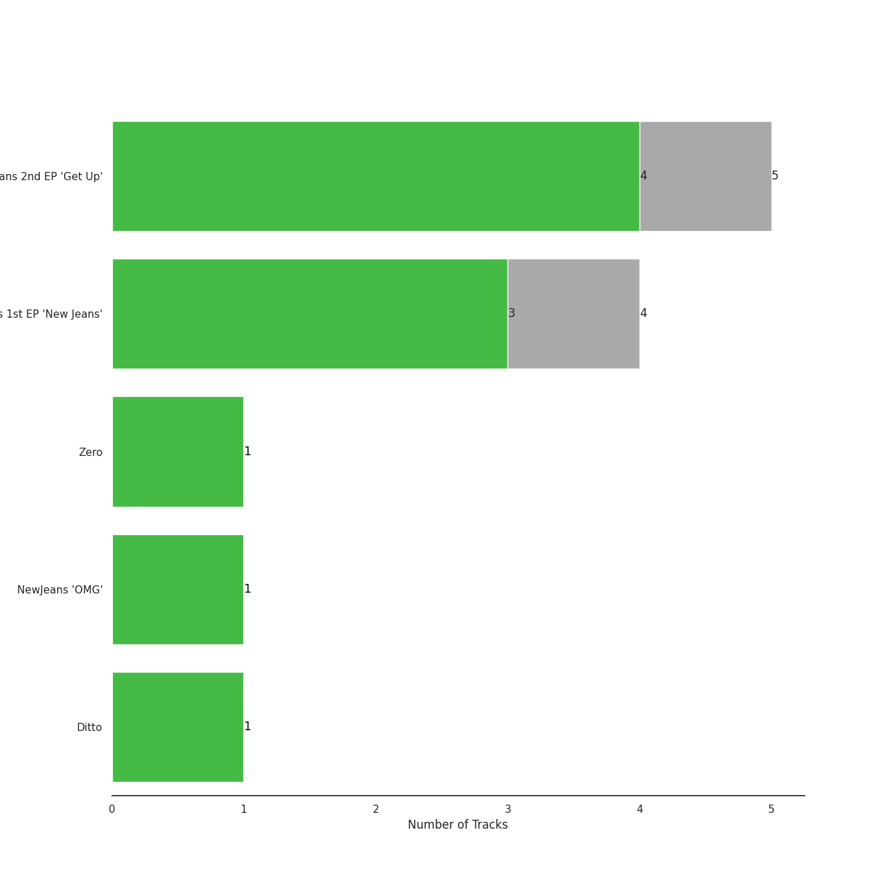
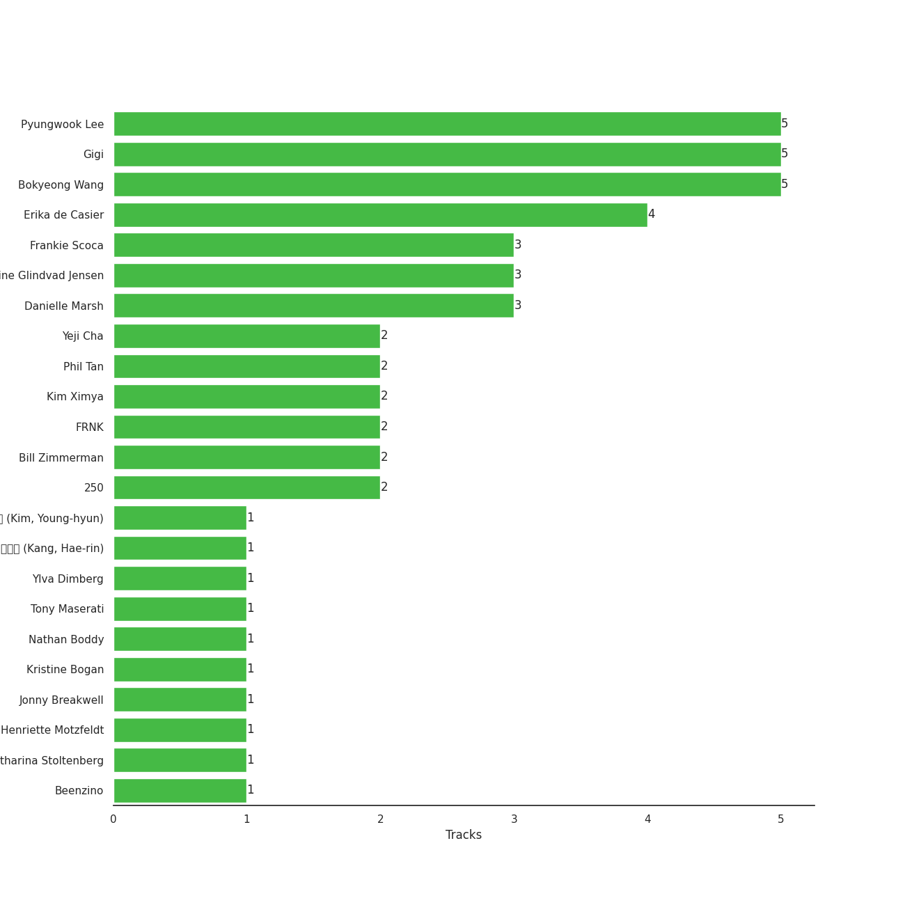

# ADOR

12 songs

[See Track Features](audio_features.md)

[See Clusters](clusters/overview.md)

Appears as:
- ADOR (12 tracks)

## Top Artists

| Art | Tracks | 💚 | Artist | 🔗 |
|:---|---:|---:|:---|:---|
|  | 12 | 8 | [NewJeans](../../artists/newjeans/overview.md) | [🔗](https://open.spotify.com/artist/6HvZYsbFfjnjFrWF950C9d) |

## Top Albums

| Art | Tracks | 💚 | Album | Release Date | 🔗 |
|:---|---:|---:|:---|:---|:---|
|  | 5 | 3 | NewJeans 2nd EP 'Get Up' | 2023-07-21 | [🔗](https://open.spotify.com/album/4N1fROq2oeyLGAlQ1C1j18) |
|  | 4 | 3 | NewJeans 1st EP 'New Jeans' | 2022-08-01 | [🔗](https://open.spotify.com/album/1HMLpmZAnNyl9pxvOnTovV) |
|  | 1 | 1 | NewJeans 'OMG' | 2023-01-02 | [🔗](https://open.spotify.com/album/45ozep8uHHnj5CCittuyXj) |
|  | 1 | 1 | Ditto | 2022-12-19 | [🔗](https://open.spotify.com/album/7bnqo1fdJU9nSfXQd3bSMe) |
|  | 1 | 0 | Zero | 2023-04-03 | [🔗](https://open.spotify.com/album/2zYcjcNUzcgMntymoukwZR) |

## Genres

| Tracks | 💚 | Genre |
|---:|---:|:---|
| 12 | 8 | [k-pop girl group](../../genres/k-pop_girl_group/overview.md) |
| 12 | 8 | [k-pop](../../genres/k-pop/overview.md) |

## Top Producers

| Art | Producer | Tracks | Credit Types |
|:---|:---|---:|:---|
| | Bokyeong Wang | 5 | Producer |
| | Gigi | 5 | Lyricist |
| | Pyungwook Lee | 5 | Producer |
| | Erika de Casier | 4 | Lyricist, Songwriter |
| | Frankie Scoca | 3 | Producer, Songwriter |
| | Fine Glindvad Jensen | 3 | Lyricist, Songwriter |
| | Danielle Marsh | 3 | Lyricist |
| | Yeji Cha | 2 | Producer |
| | 250 | 2 | Producer, Songwriter |
| | Kim Ximya | 2 | Songwriter, Lyricist |

View all

| Art | Producer | Tracks | Credit Types |
|:---|:---|---:|:---|
| | [Phil Tan](../../producers/phil_tan/overview.md) | 2 | Producer |
| | FRNK | 2 | Producer, Songwriter |
| | Bill Zimmerman | 2 | Producer |
| | 강해린 (Kang, Hae-rin) | 1 | Lyricist |
| | Kristine Bogan | 1 | Lyricist, Songwriter |
| | 김영현 (Kim, Young-hyun) | 1 | Producer |
| | [Tony Maserati](../../producers/tony_maserati/overview.md) | 1 | Producer |
| | Ylva Dimberg | 1 | Lyricist, Songwriter |
| | Henriette Motzfeldt | 1 | Lyricist, Producer, Songwriter |
| | Nathan Boddy | 1 | Producer |
| | Jonny Breakwell | 1 | Producer |
| | Catharina Stoltenberg | 1 | Lyricist, Producer, Songwriter |
| | Beenzino | 1 | Lyricist |

## Tracks released under ADOR

| Art | Track | Album | Artists | Label | Rank | 💚 | 🔗 |
|:---|:---|:---|:---|:---|---:|:---|:---|
|  | Ditto | Ditto | [NewJeans](../../artists/newjeans/overview.md) | [ADOR](.) | 51 | 💚 | [🔗](https://open.spotify.com/track/3r8RuvgbX9s7ammBn07D3W) |
|  | OMG | NewJeans 'OMG' | [NewJeans](../../artists/newjeans/overview.md) | [ADOR](.) | 84 | 💚 | [🔗](https://open.spotify.com/track/65FftemJ1DbbZ45DUfHJXE) |
|  | Hype Boy | NewJeans 1st EP 'New Jeans' | [NewJeans](../../artists/newjeans/overview.md) | [ADOR](.) | 98 | 💚 | [🔗](https://open.spotify.com/track/0a4MMyCrzT0En247IhqZbD) |
|  | ASAP | NewJeans 2nd EP 'Get Up' | [NewJeans](../../artists/newjeans/overview.md) | [ADOR](.) | 186 | 💚 | [🔗](https://open.spotify.com/track/5fpyAakgFOm4YTXkgfPzvV) |
|  | ETA | NewJeans 2nd EP 'Get Up' | [NewJeans](../../artists/newjeans/overview.md) | [ADOR](.) | 476 | 💚 | [🔗](https://open.spotify.com/track/56v8WEnGzLByGsDAXDiv4d) |
|  | Cool With You | NewJeans 2nd EP 'Get Up' | [NewJeans](../../artists/newjeans/overview.md) | [ADOR](.) | 581 | | [🔗](https://open.spotify.com/track/02wk5BttM0QL38ERjLPQJB) |
|  | Attention | NewJeans 1st EP 'New Jeans' | [NewJeans](../../artists/newjeans/overview.md) | [ADOR](.) | nan | 💚 | [🔗](https://open.spotify.com/track/2pIUpMhHL6L9Z5lnKxJJr9) |
|  | Cookie | NewJeans 1st EP 'New Jeans' | [NewJeans](../../artists/newjeans/overview.md) | [ADOR](.) | nan | | [🔗](https://open.spotify.com/track/2DwUdMJ5uxv20EhAildreg) |
|  | Hurt | NewJeans 1st EP 'New Jeans' | [NewJeans](../../artists/newjeans/overview.md) | [ADOR](.) | nan | 💚 | [🔗](https://open.spotify.com/track/5expoVGQPvXuwBBFuNGqBd) |
|  | Zero | Zero | [NewJeans](../../artists/newjeans/overview.md) | [ADOR](.) | nan | | [🔗](https://open.spotify.com/track/5LMoKDVzW2kDneNu2UbspP) |

See all tracks

| Art | Track | Album | Artists | Label | Rank | 💚 | 🔗 |
|:---|:---|:---|:---|:---|---:|:---|:---|
|  | New Jeans | NewJeans 2nd EP 'Get Up' | [NewJeans](../../artists/newjeans/overview.md) | [ADOR](.) | nan | 💚 | [🔗](https://open.spotify.com/track/7woEDtme8YkFiWeyiinIjy) |
|  | Super Shy | NewJeans 2nd EP 'Get Up' | [NewJeans](../../artists/newjeans/overview.md) | [ADOR](.) | nan | | [🔗](https://open.spotify.com/track/0kwrPQkiGVE8KTHalH1uMo) |

