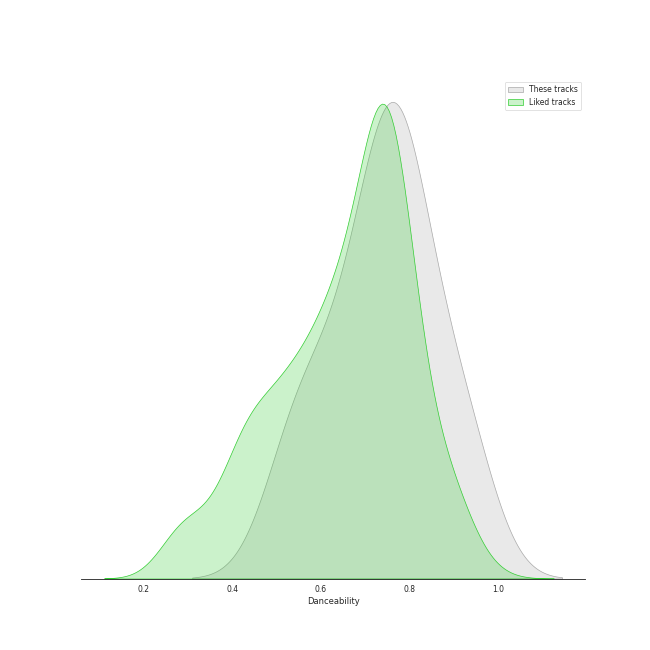
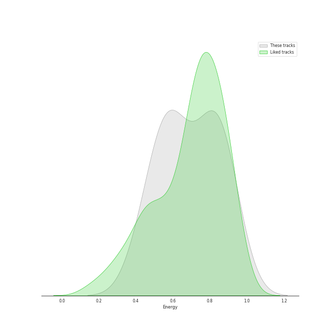
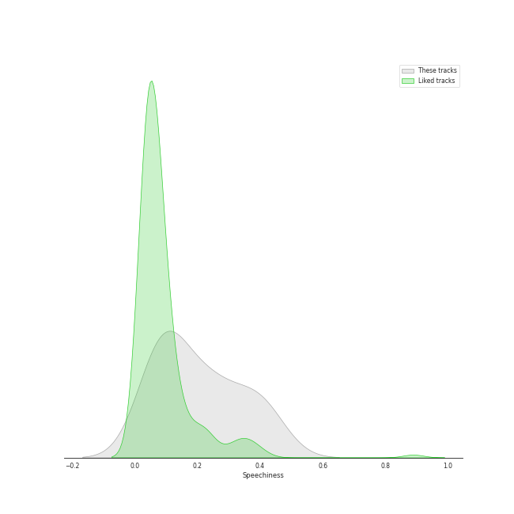
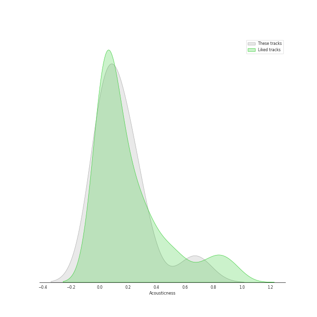
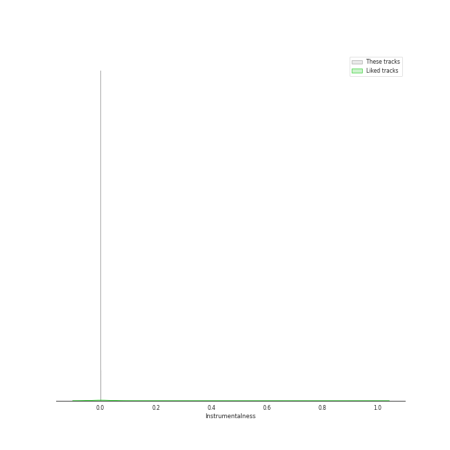
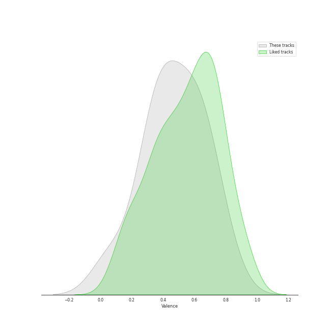
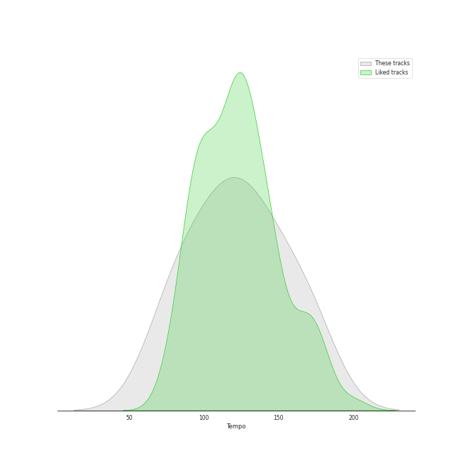

# Track Features for Aftermath

## Danceability

| ​ | 10 most Danceable tracks | ​​ | 10 least Danceable tracks |
|:---|:---|:---|:---|
|  | We Made You (0.924) |  | United In Grief (0.529) |
|  | HUMBLE. (0.908) |  | DNA. (0.638) |
|  | LOVE. FEAT. ZACARI. (0.8) |  | Lose Yourself (0.692) |
|  | Alright (0.796) |  | Money Trees (0.716) |
|  | The Monster (0.781) |  | Love The Way You Lie (0.749) |
|  | Count Me Out (0.776) |  | Count Me Out (0.776) |
|  | Love The Way You Lie (0.749) |  | The Monster (0.781) |
|  | Money Trees (0.716) |  | Alright (0.796) |
|  | Lose Yourself (0.692) |  | LOVE. FEAT. ZACARI. (0.8) |
|  | DNA. (0.638) |  | HUMBLE. (0.908) |

## Energy

| ​ | 10 most Energetic tracks | ​​ | 10 least Energetic tracks |
|:---|:---|:---|:---|
|  | Love The Way You Lie (0.925) |  | Count Me Out (0.431) |
|  | We Made You (0.853) |  | DNA. (0.523) |
|  | The Monster (0.853) |  | Money Trees (0.531) |
|  | United In Grief (0.845) |  | LOVE. FEAT. ZACARI. (0.585) |
|  | Alright (0.766) |  | HUMBLE. (0.621) |
|  | Lose Yourself (0.744) |  | Lose Yourself (0.744) |
|  | HUMBLE. (0.621) |  | Alright (0.766) |
|  | LOVE. FEAT. ZACARI. (0.585) |  | United In Grief (0.845) |
|  | Money Trees (0.531) |  | The Monster (0.853) |
|  | DNA. (0.523) |  | We Made You (0.853) |

## Speechiness

| ​ | 10 most Speechy tracks | ​​ | 10 least Speechy tracks |
|:---|:---|:---|:---|
|  | United In Grief (0.404) |  | The Monster (0.0715) |
|  | DNA. (0.357) |  | We Made You (0.0792) |
|  | Lose Yourself (0.257) |  | Count Me Out (0.091) |
|  | Alright (0.238) |  | LOVE. FEAT. ZACARI. (0.0924) |
|  | Love The Way You Lie (0.227) |  | HUMBLE. (0.102) |
|  | Money Trees (0.122) |  | Money Trees (0.122) |
|  | HUMBLE. (0.102) |  | Love The Way You Lie (0.227) |
|  | LOVE. FEAT. ZACARI. (0.0924) |  | Alright (0.238) |
|  | Count Me Out (0.091) |  | Lose Yourself (0.257) |
|  | We Made You (0.0792) |  | DNA. (0.357) |

## Acousticness

| ​ | 10 most Acoustic tracks | ​​ | 10 least Acoustic tracks |
|:---|:---|:---|:---|
|  | Count Me Out (0.671) |  | HUMBLE. (0.000282) |
|  | LOVE. FEAT. ZACARI. (0.264) |  | DNA. (0.00454) |
|  | United In Grief (0.244) |  | Lose Yourself (0.00868) |
|  | Love The Way You Lie (0.241) |  | The Monster (0.0525) |
|  | We Made You (0.107) |  | Money Trees (0.0703) |
|  | Alright (0.0742) |  | Alright (0.0742) |
|  | Money Trees (0.0703) |  | We Made You (0.107) |
|  | The Monster (0.0525) |  | Love The Way You Lie (0.241) |
|  | Lose Yourself (0.00868) |  | United In Grief (0.244) |
|  | DNA. (0.00454) |  | LOVE. FEAT. ZACARI. (0.264) |

## Instrumentalness

| ​ | 10 most Instrumental tracks | ​​ | 10 least Instrumental tracks |
|:---|:---|:---|:---|
|  | Lose Yourself (0.000423) |  | Love The Way You Lie (0.0) |
|  | HUMBLE. (5.39e-05) |  | Money Trees (0.0) |
|  | We Made You (1.45e-06) |  | Alright (0.0) |
|  | LOVE. FEAT. ZACARI. (0.0) |  | The Monster (0.0) |
|  | DNA. (0.0) |  | United In Grief (0.0) |
|  | Count Me Out (0.0) |  | Count Me Out (0.0) |
|  | United In Grief (0.0) |  | DNA. (0.0) |
|  | The Monster (0.0) |  | LOVE. FEAT. ZACARI. (0.0) |
|  | Alright (0.0) |  | We Made You (1.45e-06) |
|  | Money Trees (0.0) |  | HUMBLE. (5.39e-05) |

## Liveness

| ​ | 10 most Live tracks | ​​ | 10 least Live tracks |
|:---|:---|:---|:---|
|  | Love The Way You Lie (0.52) |  | Alright (0.0827) |
|  | Lose Yourself (0.359) |  | DNA. (0.0842) |
|  | Money Trees (0.224) |  | HUMBLE. (0.0958) |
|  | LOVE. FEAT. ZACARI. (0.153) |  | The Monster (0.12) |
|  | Count Me Out (0.153) |  | We Made You (0.129) |
|  | United In Grief (0.143) |  | United In Grief (0.143) |
|  | We Made You (0.129) |  | Count Me Out (0.153) |
|  | The Monster (0.12) |  | LOVE. FEAT. ZACARI. (0.153) |
|  | HUMBLE. (0.0958) |  | Money Trees (0.224) |
|  | DNA. (0.0842) |  | Lose Yourself (0.359) |

## Valence

| ​ | 10 most Happy tracks | ​​ | 10 least Happy tracks |
|:---|:---|:---|:---|
|  | LOVE. FEAT. ZACARI. (0.779) |  | Lose Yourself (0.0612) |
|  | We Made You (0.67) |  | United In Grief (0.331) |
|  | Love The Way You Lie (0.641) |  | Money Trees (0.344) |
|  | The Monster (0.624) |  | HUMBLE. (0.421) |
|  | Alright (0.558) |  | DNA. (0.422) |
|  | Count Me Out (0.495) |  | Count Me Out (0.495) |
|  | DNA. (0.422) |  | Alright (0.558) |
|  | HUMBLE. (0.421) |  | The Monster (0.624) |
|  | Money Trees (0.344) |  | Love The Way You Lie (0.641) |
|  | United In Grief (0.331) |  | We Made You (0.67) |

## Tempo

| ​ | 10 most Fast tracks | ​​ | 10 least Fast tracks |
|:---|:---|:---|:---|
|  | Lose Yourself (171.374) |  | Money Trees (71.994) |
|  | HUMBLE. (150.011) |  | United In Grief (85.63) |
|  | DNA. (139.913) |  | Love The Way You Lie (86.989) |
|  | Count Me Out (133.999) |  | Alright (110.034) |
|  | LOVE. FEAT. ZACARI. (126.058) |  | The Monster (110.049) |
|  | We Made You (114.003) |  | We Made You (114.003) |
|  | The Monster (110.049) |  | LOVE. FEAT. ZACARI. (126.058) |
|  | Alright (110.034) |  | Count Me Out (133.999) |
|  | Love The Way You Lie (86.989) |  | DNA. (139.913) |
|  | United In Grief (85.63) |  | HUMBLE. (150.011) |
