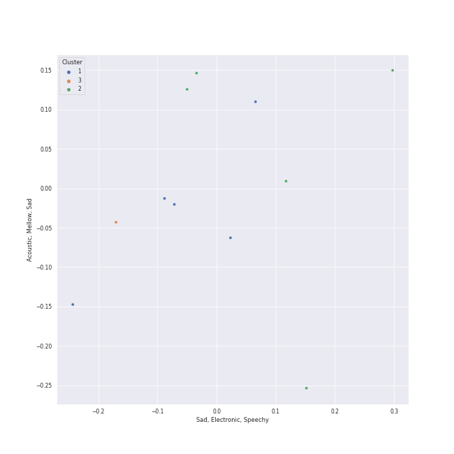

# Clusters in Aftermath

## Cluster #1

5 tracks

| Art | Track | Album | Artists | Label | Score | 💚 | 🔗 |
|:---|:---|:---|:---|:---|---:|:---|:---|
|  | Love The Way You Lie | Recovery | [Eminem](../../../../artists/eminem/overview.md), [Rihanna](../../../../artists/rihanna/overview.md) | [Aftermath](../..) | 0 | 💚 | [🔗](https://open.spotify.com/track/15JINEqzVMv3SvJTAXAKED) |
|  | The Monster | The Marshall Mathers LP2 | [Eminem](../../../../artists/eminem/overview.md), [Rihanna](../../../../artists/rihanna/overview.md) | [Aftermath](../..) | 80 | 💚 | [🔗](https://open.spotify.com/track/48RrDBpOSSl1aLVCalGl5C) |
|  | We Made You | Relapse: Refill | [Eminem](../../../../artists/eminem/overview.md) | [Aftermath](../..) | 28 | 💚 | [🔗](https://open.spotify.com/track/4UMTp91LHhvW33ol9ZQH0Q) |
|  | Alright | To Pimp A Butterfly | [Kendrick Lamar](../../../../artists/kendrick_lamar/overview.md) | [Aftermath](../..) | 0 | | [🔗](https://open.spotify.com/track/3iVcZ5G6tvkXZkZKlMpIUs) |
|  | LOVE. FEAT. ZACARI. | DAMN. | [Kendrick Lamar](../../../../artists/kendrick_lamar/overview.md), Zacari | [Aftermath](../..) | 0 | | [🔗](https://open.spotify.com/track/6PGoSes0D9eUDeeAafB2As) |
## Cluster #2

5 tracks

| Art | Track | Album | Artists | Label | Score | 💚 | 🔗 |
|:---|:---|:---|:---|:---|---:|:---|:---|
|  | Money Trees | good kid, m.A.A.d city | [Kendrick Lamar](../../../../artists/kendrick_lamar/overview.md), Jay Rock | [Aftermath](../..) | 0 | | [🔗](https://open.spotify.com/track/2HbKqm4o0w5wEeEFXm2sD4) |
|  | United In Grief | Mr. Morale & The Big Steppers | [Kendrick Lamar](../../../../artists/kendrick_lamar/overview.md) | Top Dawg Entertainment, [Aftermath](../..), [Interscope Records](../../../interscope_records), pgLang | 0 | 💚 | [🔗](https://open.spotify.com/track/5Gt9bxniM1SxN61yRzRhXL) |
|  | Count Me Out | Mr. Morale & The Big Steppers | [Kendrick Lamar](../../../../artists/kendrick_lamar/overview.md) | Top Dawg Entertainment, [Aftermath](../..), [Interscope Records](../../../interscope_records), pgLang | 0 | 💚 | [🔗](https://open.spotify.com/track/6BU1RZexmvJcBjgagVVt3M) |
|  | DNA. | DAMN. | [Kendrick Lamar](../../../../artists/kendrick_lamar/overview.md) | [Aftermath](../..) | 0 | 💚 | [🔗](https://open.spotify.com/track/6HZILIRieu8S0iqY8kIKhj) |
|  | HUMBLE. | DAMN. | [Kendrick Lamar](../../../../artists/kendrick_lamar/overview.md) | [Aftermath](../..) | 0 | | [🔗](https://open.spotify.com/track/7KXjTSCq5nL1LoYtL7XAwS) |
## Cluster #3

1 tracks

| Art | Track | Album | Artists | Label | Score | 💚 | 🔗 |
|:---|:---|:---|:---|:---|---:|:---|:---|
|  | Lose Yourself | Curtain Call: The Hits (Deluxe Edition) | [Eminem](../../../../artists/eminem/overview.md) | [Aftermath](../..) | 0 | 💚 | [🔗](https://open.spotify.com/track/5Z01UMMf7V1o0MzF86s6WJ) |