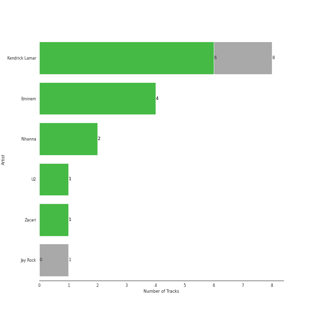
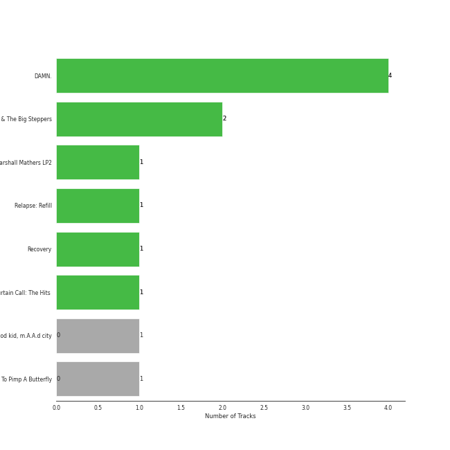
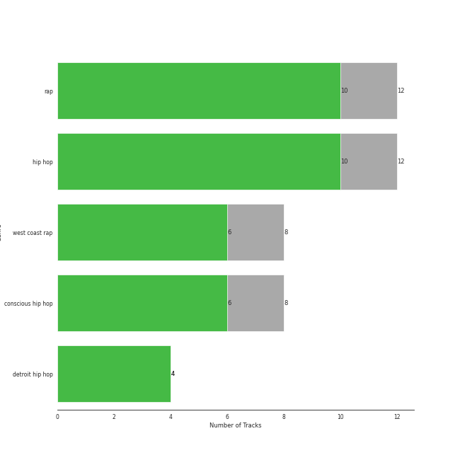
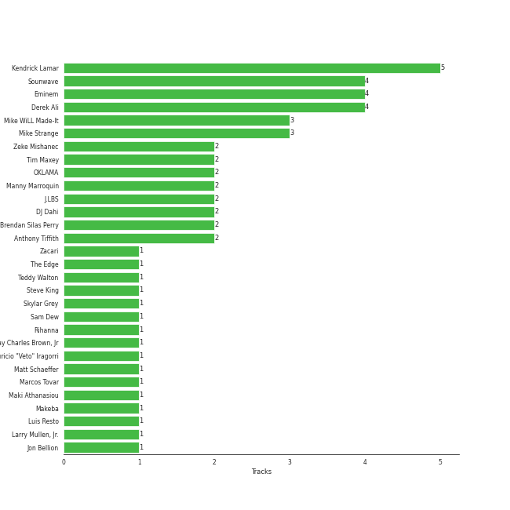

# Aftermath

11 songs

[See Track Features](audio_features.md)

[See Clusters](clusters/overview.md)

Appears as:
- Aftermath (9 tracks)
- pgLang/Top Dawg Entertainment/Aftermath/Interscope Records (2 tracks)

## Top Artists

| Art | Tracks | 💚 | Artist | 🔗 |
|:---|---:|---:|:---|:---|
|  | 7 | 5 | [Kendrick Lamar](../../artists/kendrick_lamar/overview.md) | [🔗](https://open.spotify.com/artist/2YZyLoL8N0Wb9xBt1NhZWg) |
|  | 4 | 4 | [Eminem](../../artists/eminem/overview.md) | [🔗](https://open.spotify.com/artist/7dGJo4pcD2V6oG8kP0tJRR) |
|  | 2 | 2 | [Rihanna](../../artists/rihanna/overview.md) | [🔗](https://open.spotify.com/artist/5pKCCKE2ajJHZ9KAiaK11H) |
|  | 1 | 1 | Zacari | [🔗](https://open.spotify.com/artist/3qBKjEOanahMxlRojwCzhI) |
|  | 1 | 0 | Jay Rock | [🔗](https://open.spotify.com/artist/28ExwzUQsvgJooOI0X1mr3) |

## Top Albums

| Art | Tracks | 💚 | Album | Release Date | 🔗 |
|:---|---:|---:|:---|:---|:---|
|  | 3 | 3 | DAMN. | 2017-04-14 | [🔗](https://open.spotify.com/album/4eLPsYPBmXABThSJ821sqY) |
|  | 2 | 2 | Mr. Morale & The Big Steppers | 2022-05-13 | [🔗](https://open.spotify.com/album/79ONNoS4M9tfIA1mYLBYVX) |
|  | 1 | 1 | The Marshall Mathers LP2 | 2013-11-05 | [🔗](https://open.spotify.com/album/3vOgbDjgsZBAPwV2M3bNOj) |
|  | 1 | 1 | Relapse: Refill | 2009-05-15 | [🔗](https://open.spotify.com/album/7MZzYkbHL9Tk3O6WeD4Z0Z) |
|  | 1 | 1 | Recovery | 2010-06-18 | [🔗](https://open.spotify.com/album/47BiFcV59TQi2s9SkBo2pb) |
|  | 1 | 1 | Curtain Call: The Hits (Deluxe Edition) | 2005-12-06 | [🔗](https://open.spotify.com/album/5qENHeCSlwWpEzb25peRmQ) |
|  | 1 | 0 | good kid, m.A.A.d city | 2012 | [🔗](https://open.spotify.com/album/6PBZN8cbwkqm1ERj2BGXJ1) |
|  | 1 | 0 | To Pimp A Butterfly | 2015-03-16 | [🔗](https://open.spotify.com/album/7ycBtnsMtyVbbwTfJwRjSP) |

## Genres

| Tracks | 💚 | Genre |
|---:|---:|:---|
| 11 | 9 | [rap](../../genres/rap/overview.md) |
| 11 | 9 | [hip hop](../../genres/hip_hop/overview.md) |
| 7 | 5 | west coast rap |
| 7 | 5 | conscious hip hop |
| 4 | 4 | detroit hip hop |

## Top Producers

| Art | Producer | Tracks | Credit Types |
|:---|:---|---:|:---|
|  | [Kendrick Lamar](../../artists/kendrick_lamar/overview.md) | 4 | Songwriter |
|  | [Eminem](../../artists/eminem/overview.md) | 4 | Producer, Songwriter |
| | [Sounwave](../../producers/sounwave/overview.md) | 3 | Producer, Songwriter |
| | Derek Ali | 3 | Producer |
| | Mike Strange | 3 | Producer |
| | J.LBS | 2 | Producer, Songwriter |
| | OKLAMA | 2 | Producer |
| | Mike WiLL Made-It | 2 | Producer, Songwriter |
| | [Manny Marroquin](../../producers/manny_marroquin/overview.md) | 2 | Producer |
| | Tim Maxey | 2 | Producer, Songwriter |

View all

| Art | Producer | Tracks | Credit Types |
|:---|:---|---:|:---|
| | Luis Resto | 1 | Producer, Songwriter |
| | [Marcos Tovar](../../producers/marcos_tovar/overview.md) | 1 | Producer |
| | Johnathan Turner | 1 | Producer |
| | Doc Ish | 1 | Producer |
| | Skylar Grey | 1 | Songwriter |
| | Duval Timothy | 1 | Producer, Songwriter |
| | Frequency | 1 | Producer, Songwriter |
| | Cyrus "Nois" Taghipour | 1 | Producer |
|  | Bebe Rexha | 1 | Songwriter |
| | Beach Noise | 1 | Producer |
| | [Greg Kurstin](../../producers/greg_kurstin/overview.md) | 1 | Producer, Songwriter |
| | Mauricio "Veto" Iragorri | 1 | Producer |
| | Zeke Mishanec | 1 | Producer |
|  | Zacari | 1 | Songwriter |
| | Ray Charles Brown, Jr | 1 | Producer |
|  | [Rihanna](../../artists/rihanna/overview.md) | 1 | Songwriter |
| | Makeba | 1 | Producer |
| | Anthony Tiffith | 1 | Producer, Songwriter |
| | Alex da Kid | 1 | Producer, Songwriter |
| | James Hunt | 1 | Producer |
| | Jeff Bass | 1 | Producer, Songwriter |
| | Jon Bellion | 1 | Songwriter |
| | Steve King | 1 | Producer |
| | Teddy Walton | 1 | Producer, Songwriter |
| | Jake Kosich | 1 | Songwriter |
| | Matt Schaeffer | 1 | Producer, Songwriter |
| | Johnny Kosich | 1 | Producer, Songwriter |
| | DJ Dahi | 1 | Producer |
| | Dr. Dre | 1 | Producer |
| | Sam Dew | 1 | Songwriter |
| | Aalias | 1 | Songwriter |
| | Brendan Silas Perry | 1 | Producer |
| | Maki Athanasiou | 1 | Songwriter |

## Tracks released under Aftermath

| Art | Track | Album | Artists | Label | Rank | 💚 | 🔗 |
|:---|:---|:---|:---|:---|---:|:---|:---|
|  | The Monster | The Marshall Mathers LP2 | [Eminem](../../artists/eminem/overview.md), [Rihanna](../../artists/rihanna/overview.md) | [Aftermath](.) | 531 | 💚 | [🔗](https://open.spotify.com/track/48RrDBpOSSl1aLVCalGl5C) |
|  | We Made You | Relapse: Refill | [Eminem](../../artists/eminem/overview.md) | [Aftermath](.) | 657 | 💚 | [🔗](https://open.spotify.com/track/4UMTp91LHhvW33ol9ZQH0Q) |
|  | Lose Yourself | Curtain Call: The Hits (Deluxe Edition) | [Eminem](../../artists/eminem/overview.md) | [Aftermath](.) | nan | 💚 | [🔗](https://open.spotify.com/track/5Z01UMMf7V1o0MzF86s6WJ) |
|  | Love The Way You Lie | Recovery | [Eminem](../../artists/eminem/overview.md), [Rihanna](../../artists/rihanna/overview.md) | [Aftermath](.) | nan | 💚 | [🔗](https://open.spotify.com/track/15JINEqzVMv3SvJTAXAKED) |
|  | Money Trees | good kid, m.A.A.d city | [Kendrick Lamar](../../artists/kendrick_lamar/overview.md), Jay Rock | [Aftermath](.) | nan | | [🔗](https://open.spotify.com/track/2HbKqm4o0w5wEeEFXm2sD4) |
|  | Alright | To Pimp A Butterfly | [Kendrick Lamar](../../artists/kendrick_lamar/overview.md) | [Aftermath](.) | nan | | [🔗](https://open.spotify.com/track/3iVcZ5G6tvkXZkZKlMpIUs) |
|  | DNA. | DAMN. | [Kendrick Lamar](../../artists/kendrick_lamar/overview.md) | [Aftermath](.) | nan | 💚 | [🔗](https://open.spotify.com/track/6HZILIRieu8S0iqY8kIKhj) |
|  | HUMBLE. | DAMN. | [Kendrick Lamar](../../artists/kendrick_lamar/overview.md) | [Aftermath](.) | nan | 💚 | [🔗](https://open.spotify.com/track/7KXjTSCq5nL1LoYtL7XAwS) |
|  | LOVE. FEAT. ZACARI. | DAMN. | [Kendrick Lamar](../../artists/kendrick_lamar/overview.md), Zacari | [Aftermath](.) | nan | 💚 | [🔗](https://open.spotify.com/track/6PGoSes0D9eUDeeAafB2As) |
|  | Count Me Out | Mr. Morale & The Big Steppers | [Kendrick Lamar](../../artists/kendrick_lamar/overview.md) | Top Dawg Entertainment, [Aftermath](.), [Interscope Records](../interscope_records), pgLang | nan | 💚 | [🔗](https://open.spotify.com/track/6BU1RZexmvJcBjgagVVt3M) |

See all tracks

| Art | Track | Album | Artists | Label | Rank | 💚 | 🔗 |
|:---|:---|:---|:---|:---|---:|:---|:---|
|  | United In Grief | Mr. Morale & The Big Steppers | [Kendrick Lamar](../../artists/kendrick_lamar/overview.md) | Top Dawg Entertainment, [Aftermath](.), [Interscope Records](../interscope_records), pgLang | nan | 💚 | [🔗](https://open.spotify.com/track/5Gt9bxniM1SxN61yRzRhXL) |

