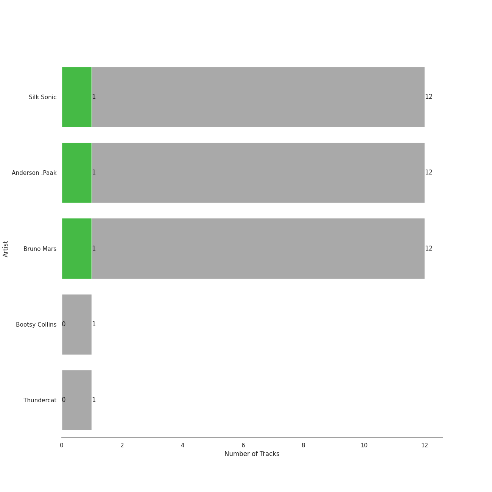
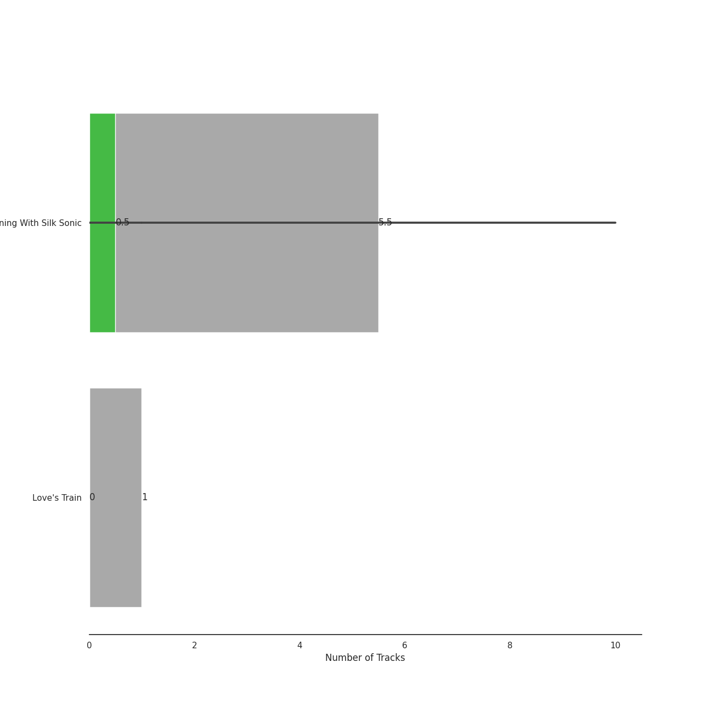

# Aftermath Entertainment

12 songs

[See Audio Features](audio_features.md)

Appears as:
- Aftermath Entertainment/Atlantic (12 tracks)

## Top Artists

| Art | Tracks | 💚 | Artist | 🔗 |
|:---|---:|---:|:---|:---|
|  | 12 | 1 | [Silk Sonic](../../artists/silk_sonic/overview.md) | [🔗](https://open.spotify.com/artist/6PvvGcCY2XtUcSRld1Wilr) |
|  | 12 | 1 | [Anderson .Paak](../../artists/anderson__paak/overview.md) | [🔗](https://open.spotify.com/artist/3jK9MiCrA42lLAdMGUZpwa) |
|  | 12 | 1 | [Bruno Mars](../../artists/bruno_mars/overview.md) | [🔗](https://open.spotify.com/artist/0du5cEVh5yTK9QJze8zA0C) |
|  | 1 | 0 | Bootsy Collins | [🔗](https://open.spotify.com/artist/5K0rbdBrs2tNXe5LeWMATT) |
|  | 1 | 0 | Thundercat | [🔗](https://open.spotify.com/artist/4frXpPxQQZwbCu3eTGnZEw) |

## Top Albums

| Art | Tracks | 💚 | Album | Release Date | 🔗 |
|:---|---:|---:|:---|:---|:---|
|  | 10 | 1 | An Evening With Silk Sonic | 2021-11-12 | [🔗](https://open.spotify.com/album/4VZ7jhV0wHpoNPCB7Vmiml) |
|  | 1 | 0 | Love's Train | 2022-02-14 | [🔗](https://open.spotify.com/album/6QKXGIgwWmWBMmIktMOchR) |
|  | 1 | 0 | An Evening With Silk Sonic | 2021-11-11 | [🔗](https://open.spotify.com/album/1YgekJJTEueWDaMr7BYqPk) |

## Genres

| Tracks | 💚 | Genre |
|---:|---:|:---|
| 12 | 1 | [pop](../../genres/pop/overview.md) |
| 12 | 1 | [dance pop](../../genres/dance_pop/overview.md) |

## Tracks released under Aftermath Entertainment

| Art | Track | Album | Artists | Label | 💚 | 🔗 |
|:---|:---|:---|:---|:---|:---|:---|
|  | Leave The Door Open | An Evening With Silk Sonic | [Bruno Mars](../../artists/bruno_mars/overview.md), [Anderson .Paak](../../artists/anderson__paak/overview.md), [Silk Sonic](../../artists/silk_sonic/overview.md) | [Aftermath Entertainment](.), [Atlantic Records](../atlantic_records) | | [🔗](https://open.spotify.com/track/02VBYrHfVwfEWXk5DXyf0T) |
|  | 777 | An Evening With Silk Sonic | [Bruno Mars](../../artists/bruno_mars/overview.md), [Anderson .Paak](../../artists/anderson__paak/overview.md), [Silk Sonic](../../artists/silk_sonic/overview.md) | [Aftermath Entertainment](.), [Atlantic Records](../atlantic_records) | | [🔗](https://open.spotify.com/track/2K6vUau7bnZUamjbRSOOvJ) |
|  | After Last Night (with Thundercat & Bootsy Collins) | An Evening With Silk Sonic | [Bruno Mars](../../artists/bruno_mars/overview.md), [Anderson .Paak](../../artists/anderson__paak/overview.md), [Silk Sonic](../../artists/silk_sonic/overview.md), Thundercat, Bootsy Collins | [Aftermath Entertainment](.), [Atlantic Records](../atlantic_records) | | [🔗](https://open.spotify.com/track/6jGAh1bFnXt1Muj9zeHveZ) |
|  | Blast Off | An Evening With Silk Sonic | [Bruno Mars](../../artists/bruno_mars/overview.md), [Anderson .Paak](../../artists/anderson__paak/overview.md), [Silk Sonic](../../artists/silk_sonic/overview.md) | [Aftermath Entertainment](.), [Atlantic Records](../atlantic_records) | | [🔗](https://open.spotify.com/track/2NqyjfDXy0XfXCSPXMsKzi) |
|  | Fly As Me | An Evening With Silk Sonic | [Bruno Mars](../../artists/bruno_mars/overview.md), [Anderson .Paak](../../artists/anderson__paak/overview.md), [Silk Sonic](../../artists/silk_sonic/overview.md) | [Aftermath Entertainment](.), [Atlantic Records](../atlantic_records) | | [🔗](https://open.spotify.com/track/7suB6D6uKX5DfPukdGaz0W) |
|  | Leave The Door Open | An Evening With Silk Sonic | [Bruno Mars](../../artists/bruno_mars/overview.md), [Anderson .Paak](../../artists/anderson__paak/overview.md), [Silk Sonic](../../artists/silk_sonic/overview.md) | [Aftermath Entertainment](.), [Atlantic Records](../atlantic_records) | 💚 | [🔗](https://open.spotify.com/track/4pryE6cN2gFL1FVF5fYINl) |
|  | Love's Train | An Evening With Silk Sonic | [Bruno Mars](../../artists/bruno_mars/overview.md), [Anderson .Paak](../../artists/anderson__paak/overview.md), [Silk Sonic](../../artists/silk_sonic/overview.md) | [Aftermath Entertainment](.), [Atlantic Records](../atlantic_records) | | [🔗](https://open.spotify.com/track/2ALh2jqA7KldpHMUHvRomw) |
|  | Put On A Smile | An Evening With Silk Sonic | [Bruno Mars](../../artists/bruno_mars/overview.md), [Anderson .Paak](../../artists/anderson__paak/overview.md), [Silk Sonic](../../artists/silk_sonic/overview.md) | [Aftermath Entertainment](.), [Atlantic Records](../atlantic_records) | | [🔗](https://open.spotify.com/track/5lka5RUbLVQGO94mKAPMRO) |
|  | Silk Sonic Intro | An Evening With Silk Sonic | [Bruno Mars](../../artists/bruno_mars/overview.md), [Anderson .Paak](../../artists/anderson__paak/overview.md), [Silk Sonic](../../artists/silk_sonic/overview.md) | [Aftermath Entertainment](.), [Atlantic Records](../atlantic_records) | | [🔗](https://open.spotify.com/track/4K09vJ27xCOreumtSuU6Ao) |
|  | Skate | An Evening With Silk Sonic | [Bruno Mars](../../artists/bruno_mars/overview.md), [Anderson .Paak](../../artists/anderson__paak/overview.md), [Silk Sonic](../../artists/silk_sonic/overview.md) | [Aftermath Entertainment](.), [Atlantic Records](../atlantic_records) | | [🔗](https://open.spotify.com/track/3WTWh2WDk4j8GUCGj4xfOd) |

See all tracks

| Art | Track | Album | Artists | Label | 💚 | 🔗 |
|:---|:---|:---|:---|:---|:---|:---|
|  | Smokin Out The Window | An Evening With Silk Sonic | [Bruno Mars](../../artists/bruno_mars/overview.md), [Anderson .Paak](../../artists/anderson__paak/overview.md), [Silk Sonic](../../artists/silk_sonic/overview.md) | [Aftermath Entertainment](.), [Atlantic Records](../atlantic_records) | | [🔗](https://open.spotify.com/track/1oERlssLrpssCAY6Yqqs6c) |
|  | Love's Train | Love's Train | [Bruno Mars](../../artists/bruno_mars/overview.md), [Anderson .Paak](../../artists/anderson__paak/overview.md), [Silk Sonic](../../artists/silk_sonic/overview.md) | [Aftermath Entertainment](.), [Atlantic Records](../atlantic_records) | | [🔗](https://open.spotify.com/track/60gTdTwaNtGAzIxKfeGVfJ) |

